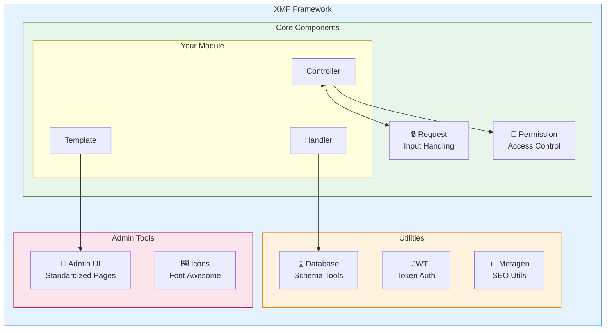
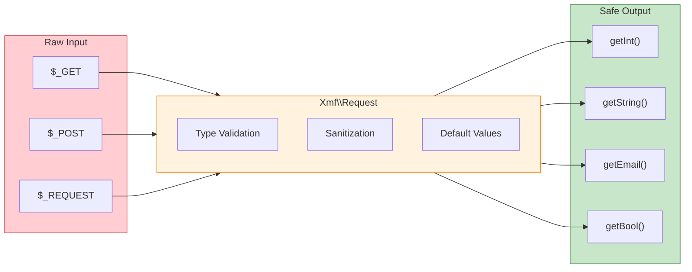

<span class="version-badge version-25x">2.5.x ✅</span> <span class="version-badge version-40x">4.0.x ✅</span>

:::tip[Modern'e Köprü XOOPS]
XMF **hem XOOPS 2.5.x hem de XOOPS 4.0.x** ile çalışır. XOOPS 4.0'a hazırlanırken modüllerinizi bugün modernleştirmenin önerilen yoludur. XMF, PSR-4 otomatik yükleme, ad alanları ve geçişi kolaylaştıran yardımcılar sağlar.
:::

**XOOPS module Çerçevesi (XMF)**, XOOPS module geliştirmeyi basitleştirmek ve standartlaştırmak için tasarlanmış güçlü bir kitaplıktır. XMF, ad alanları, otomatik yükleme ve standart kodu azaltan ve sürdürülebilirliği artıran kapsamlı bir dizi yardımcı sınıf dahil olmak üzere modern PHP uygulamaları sağlar.

## XMF nedir?

XMF aşağıdakileri sağlayan sınıflar ve yardımcı programlardan oluşan bir koleksiyondur:

- **Modern PHP Desteği** - PSR-4 otomatik yüklemeyle tam ad alanı desteği
- **İstek İşleme** - Güvenli giriş doğrulama ve temizleme
- **module Yardımcıları** - module yapılandırmalarına ve nesnelerine basitleştirilmiş erişim
- **İzin Sistemi** - Kullanımı kolay izin yönetimi
- **database Yardımcı Programları** - Şema taşıma ve tablo yönetimi araçları
- **JWT Destek** - JSON Güvenli kimlik doğrulama için Web Token uygulaması
- **Meta Veri Oluşturma** - SEO ve içerik çıkarma yardımcı programları
- **Yönetici Arayüzü** - Standartlaştırılmış module yönetim sayfaları

### XMF Bileşenlere Genel Bakış

## Temel Özellikler

### Ad Alanları ve Otomatik Yükleme

Tüm XMF sınıfları `Xmf` ad alanında bulunur. Sınıflar referans alındığında otomatik olarak yüklenir; herhangi bir kılavuza gerek yoktur.
```php
use Xmf\Request;
use Xmf\Module\Helper;

// Classes load automatically when used
$input = Request::getString('input', '');
$helper = Helper::getHelper('mymodule');
```
### Güvenli İstek İşleme

[Request sınıfı](../05-XMF-Framework/Basics/XMF-Request.md), yerleşik temizleme özelliğiyle HTTP istek verilerine tür açısından güvenli erişim sağlar:


```php
use Xmf\Request;

$id = Request::getInt('id', 0);
$name = Request::getString('name', '');
$email = Request::getEmail('email', '');
```
### module Yardımcı Sistemi

[module Yardımcısı](../05-XMF-Framework/Basics/XMF-Module-Helper.md) modülle ilgili işlevlere kolay erişim sağlar:
```php
$helper = \Xmf\Module\Helper::getHelper('mymodule');

// Access module configuration
$configValue = $helper->getConfig('setting_name', 'default');

// Get module object
$module = $helper->getModule();

// Access handlers
$handler = $helper->getHandler('items');
```
### İzin Yönetimi

[İzin Yardımcısı](../05-XMF-Framework/Recipes/Permission-Helper.md), XOOPS izin işlemeyi basitleştirir:
```php
$permHelper = new \Xmf\Module\Helper\Permission();

// Check user permission
if ($permHelper->checkPermission('view', $itemId)) {
    // User has permission
}
```
## Dokümantasyon Yapısı

### Temel Bilgiler

- [Başlarken-XMF](../05-XMF-Framework/Basics/Getting-Started-with-XMF.md) - Kurulum ve temel kullanım
- [XMF-Request](../05-XMF-Framework/Basics/XMF-Request.md) - İstek işleme ve giriş doğrulama
- [XMF-Module-Helper](../05-XMF-Framework/Basics/XMF-Module-Helper.md) - module yardımcı sınıfı kullanımı

### Tarifler

- [Permission-Helper](../05-XMF-Framework/Recipes/Permission-Helper.md) - İzinlerle çalışma
- [module-Yönetici-Sayfaları](../05-XMF-Framework/Recipes/Module-Admin-Pages.md) - Standartlaştırılmış yönetici arayüzleri oluşturma

### Referans

- [JWT](../05-XMF-Framework/Reference/JWT.md) - JSON Web Token uygulaması
- [database](../05-XMF-Framework/Reference/Database.md) - database yardımcı programları ve şema yönetimi
- [Metagen](Reference/Metagen.md) - Meta veriler ve SEO yardımcı programları

## Gereksinimler

- XOOPS 2.5.8 veya üzeri
- PHP 7.2 veya üstü (PHP 8.x önerilir)

## Kurulum

XMF, XOOPS 2.5.8 ve sonraki sürümlere dahildir. Daha önceki sürümler veya manuel kurulum için:

1. XMF paketini XOOPS deposundan indirin
2. XOOPS `/class/xmf/` dizininize çıkartın
3. Otomatik yükleyici sınıf yüklemesini otomatik olarak gerçekleştirecektir

## Hızlı Başlangıç Örneği

Yaygın XMF kullanım kalıplarını gösteren tam bir örnek:
```php
<?php
use Xmf\Request;
use Xmf\Module\Helper;
use Xmf\Module\Helper\Permission;

// Get module helper
$helper = Helper::getHelper('mymodule');

// Get configuration values
$itemsPerPage = $helper->getConfig('items_per_page', 10);

// Handle request input
$op = Request::getCmd('op', 'list');
$id = Request::getInt('id', 0);

// Check permissions
$permHelper = new Permission();
if (!$permHelper->checkPermission('view', $id)) {
    redirect_header('index.php', 3, 'Access denied');
}

// Process based on operation
switch ($op) {
    case 'view':
        $handler = $helper->getHandler('items');
        $item = $handler->get($id);
        // ... display item
        break;
    case 'list':
    default:
        // ... list items
        break;
}
```
## Kaynaklar

- [XMF GitHub Deposu](https://github.com/XOOPS/XMF)
- [XOOPS Proje Web Sitesi](https://xoops.org)

---

#xmf #xoops #framework #php #module geliştirme