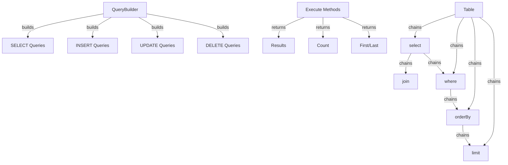

Конструктор запитів XOOPS надає сучасний плавний інтерфейс для створення запитів SQL. Це допомагає запобігти ін’єкції SQL, покращує читабельність і забезпечує абстракцію бази даних для кількох систем баз даних.

## Архітектура конструктора запитів

## Клас QueryBuilder

Основний клас конструктора запитів із плавним інтерфейсом.

### Огляд класу
```php
namespace Xoops\Database;

class QueryBuilder
{
    protected string $table = '';
    protected string $type = 'SELECT';
    protected array $selects = [];
    protected array $joins = [];
    protected array $wheres = [];
    protected array $orders = [];
    protected int $limit = 0;
    protected int $offset = 0;
    protected array $bindings = [];
}
```
### Статичні методи

#### стіл

Створює новий конструктор запитів для таблиці.
```php
public static function table(string $table): QueryBuilder
```
**Параметри:**

| Параметр | Тип | Опис |
|-----------|------|------------|
| `$table` | рядок | Назва таблиці (з префіксом або без) |

**Повертає:** `QueryBuilder` – екземпляр конструктора запитів

**Приклад:**
```php
$query = QueryBuilder::table('users');
$query = QueryBuilder::table('xoops_users'); // With prefix
```
## Запити SELECT

### вибрати

Визначає стовпці для вибору.
```php
public function select(...$columns): self
```
**Параметри:**

| Параметр | Тип | Опис |
|-----------|------|------------|
| `...$columns` | масив | Імена стовпців або вирази |

**Повертає:** `self` - Для ланцюжка методів

**Приклад:**
```php
// Simple select
QueryBuilder::table('users')
    ->select('id', 'username', 'email')
    ->get();

// Select with aliases
QueryBuilder::table('users')
    ->select('id as user_id', 'username as name')
    ->get();

// Select all columns
QueryBuilder::table('users')
    ->select('*')
    ->get();

// Select with expressions
QueryBuilder::table('orders')
    ->select('id', 'COUNT(*) as total_items')
    ->groupBy('id')
    ->get();
```
### де

Додає умову WHERE.
```php
public function where(string $column, string $operator = '=', mixed $value = null): self
```
**Параметри:**

| Параметр | Тип | Опис |
|-----------|------|------------|
| `$column` | рядок | Назва стовпця |
| `$operator` | рядок | Оператор порівняння |
| `$value` | змішаний | Значення для порівняння |

**Повертає:** `self` - Для ланцюжка методів

**Оператори:**

| Оператор | Опис | Приклад |
|----------|-------------|---------|
| `=` | Рівне | `->where('status', '=', 'active')` |
| `!=` або `<>` | Не дорівнює | `->where('status', '!=', 'deleted')` |
| `>` | Більше | `->where('price', '>', 100)` |
| `<` | Менше | `->where('price', '<', 100)` |
| `>=` | Більше або дорівнює | `->where('age', '>=', 18)` |
| `<=` | Менше або дорівнює | `->where('age', '<=', 65)` |
| `LIKE` | Збіг шаблону | `->where('name', 'LIKE', '%john%')` |
| `IN` | У списку | `->where('status', 'IN', ['active', 'pending'])` |
| `NOT IN` | Немає в списку | `->where('id', 'NOT IN', [1, 2, 3])` |
| `BETWEEN` | Діапазон | `->where('age', 'BETWEEN', [18, 65])` |
| `IS NULL` | Є нульовим | `->where('deleted_at', 'IS NULL')` |
| `IS NOT NULL` | Не нуль | `->where('deleted_at', 'IS NOT NULL')` |

**Приклад:**
```php
// Single condition
QueryBuilder::table('users')
    ->select('*')
    ->where('status', '=', 'active')
    ->get();

// Multiple conditions (AND)
QueryBuilder::table('users')
    ->select('*')
    ->where('status', '=', 'active')
    ->where('age', '>=', 18)
    ->get();

// IN operator
QueryBuilder::table('products')
    ->select('*')
    ->where('category_id', 'IN', [1, 2, 3])
    ->get();

// LIKE operator
QueryBuilder::table('users')
    ->select('*')
    ->where('email', 'LIKE', '%@example.com')
    ->get();

// NULL check
QueryBuilder::table('users')
    ->select('*')
    ->where('deleted_at', 'IS NULL')
    ->get();
```
### або Де

Додає умову АБО.
```php
public function orWhere(string $column, string $operator = '=', mixed $value = null): self
```
**Приклад:**
```php
QueryBuilder::table('users')
    ->select('*')
    ->where('status', '=', 'active')
    ->orWhere('premium', '=', 1)
    ->get();
    // SELECT * FROM users WHERE status = 'active' OR premium = 1
```
### whereIn / whereNotIn

Зручні методи для IN/NOT IN.
```php
public function whereIn(string $column, array $values): self
public function whereNotIn(string $column, array $values): self
```
**Приклад:**
```php
QueryBuilder::table('posts')
    ->select('*')
    ->whereIn('status', ['published', 'scheduled'])
    ->get();

QueryBuilder::table('comments')
    ->select('*')
    ->whereNotIn('spam_score', [8, 9, 10])
    ->get();
```
### whereNull / whereNotNull

Зручні методи перевірки NULL.
```php
public function whereNull(string $column): self
public function whereNotNull(string $column): self
```
**Приклад:**
```php
QueryBuilder::table('users')
    ->select('*')
    ->whereNotNull('verified_at')
    ->get();
```
### де між

Перевіряє, чи значення знаходиться між двома значеннями.
```php
public function whereBetween(string $column, array $values): self
```
**Приклад:**
```php
QueryBuilder::table('products')
    ->select('*')
    ->whereBetween('price', [10, 100])
    ->get();

QueryBuilder::table('orders')
    ->select('*')
    ->whereBetween('created_at', ['2024-01-01', '2024-12-31'])
    ->get();
```
### приєднуйтесь

Додає INNER JOIN.
```php
public function join(
    string $table,
    string $first,
    string $operator = '=',
    string $second = null
): self
```
**Приклад:**
```php
QueryBuilder::table('posts')
    ->select('posts.*', 'users.username', 'categories.name')
    ->join('users', 'posts.user_id', '=', 'users.id')
    ->join('categories', 'posts.category_id', '=', 'categories.id')
    ->where('posts.published', '=', 1)
    ->get();
```
### leftJoin / rightJoin

Альтернативні типи об'єднань.
```php
public function leftJoin(
    string $table,
    string $first,
    string $operator = '=',
    string $second = null
): self

public function rightJoin(
    string $table,
    string $first,
    string $operator = '=',
    string $second = null
): self
```
**Приклад:**
```php
QueryBuilder::table('users')
    ->select('users.*', 'COUNT(posts.id) as post_count')
    ->leftJoin('posts', 'users.id', '=', 'posts.user_id')
    ->groupBy('users.id')
    ->get();
```
### groupBy

Групує результати за стовпцями.
```php
public function groupBy(...$columns): self
```
**Приклад:**
```php
QueryBuilder::table('orders')
    ->select('user_id', 'COUNT(*) as order_count', 'SUM(total) as total_spent')
    ->groupBy('user_id')
    ->get();

QueryBuilder::table('sales')
    ->select('department', 'region', 'SUM(amount) as total')
    ->groupBy('department', 'region')
    ->get();
```
### мати

Додає умову HAVING.
```php
public function having(string $column, string $operator = '=', mixed $value = null): self
```
**Приклад:**
```php
QueryBuilder::table('orders')
    ->select('user_id', 'COUNT(*) as order_count')
    ->groupBy('user_id')
    ->having('order_count', '>', 5)
    ->get();
```
### orderBy

Результати замовлень.
```php
public function orderBy(string $column, string $direction = 'ASC'): self
```
**Параметри:**

| Параметр | Тип | Опис |
|-----------|------|------------|
| `$column` | рядок | Колонка на замовлення по |
| `$direction` | рядок | `ASC` або `DESC` |

**Приклад:**
```php
// Single order
QueryBuilder::table('users')
    ->select('*')
    ->orderBy('created_at', 'DESC')
    ->get();

// Multiple orders
QueryBuilder::table('posts')
    ->select('*')
    ->orderBy('category_id', 'ASC')
    ->orderBy('created_at', 'DESC')
    ->get();

// Random order
QueryBuilder::table('quotes')
    ->select('*')
    ->orderBy('RAND()')
    ->get();
```
### обмеження / зсув

Обмежує та компенсує результати.
```php
public function limit(int $limit): self
public function offset(int $offset): self
```
**Приклад:**
```php
// Simple limit
QueryBuilder::table('posts')
    ->select('*')
    ->limit(10)
    ->get();

// Pagination
$page = 2;
$perPage = 20;
$offset = ($page - 1) * $perPage;

QueryBuilder::table('posts')
    ->select('*')
    ->limit($perPage)
    ->offset($offset)
    ->get();
```
## Методи виконання

### отримати

Виконує запит і повертає всі результати.
```php
public function get(): array
```
**Повертає:** `array` - масив рядків результатів

**Приклад:**
```php
$users = QueryBuilder::table('users')
    ->select('id', 'username', 'email')
    ->where('status', '=', 'active')
    ->orderBy('username')
    ->get();

foreach ($users as $user) {
    echo $user['username'] . ' (' . $user['email'] . ')' . "\n";
}
```
### спочатку

Отримує перший результат.
```php
public function first(): ?array
```
**Повертає:** `?array` - перший рядок або нуль

**Приклад:**
```php
$user = QueryBuilder::table('users')
    ->select('*')
    ->where('id', '=', 123)
    ->first();

if ($user) {
    echo 'Found: ' . $user['username'];
}
```
### останній

Отримує останній результат.
```php
public function last(): ?array
```
**Приклад:**
```php
$latestPost = QueryBuilder::table('posts')
    ->select('*')
    ->orderBy('created_at', 'DESC')
    ->last();
```
### кол

Отримує підрахунок результатів.
```php
public function count(): int
```
**Повертає:** `int` - кількість рядків

**Приклад:**
```php
$activeUsers = QueryBuilder::table('users')
    ->where('status', '=', 'active')
    ->count();

echo "Active users: $activeUsers";
```
### існує

Перевіряє, чи запит повертає результати.
```php
public function exists(): bool
```
**Повертає:** `bool` - Правда, якщо є результати

**Приклад:**
```php
if (QueryBuilder::table('users')->where('email', '=', 'test@example.com')->exists()) {
    echo 'User already exists';
}
```
### агрегат

Отримує сукупні значення.
```php
public function aggregate(string $function, string $column): mixed
```
**Приклад:**
```php
$maxPrice = QueryBuilder::table('products')
    ->aggregate('MAX', 'price');

$avgAge = QueryBuilder::table('users')
    ->aggregate('AVG', 'age');

$totalSales = QueryBuilder::table('orders')
    ->aggregate('SUM', 'total');
```
## INSERT Запити

### вставка

Вставляє рядок.
```php
public function insert(array $values): bool
```
**Приклад:**
```php
QueryBuilder::table('users')->insert([
    'username' => 'john',
    'email' => 'john@example.com',
    'password' => password_hash('secret', PASSWORD_BCRYPT),
    'created_at' => date('Y-m-d H:i:s')
]);
```
### вставити багато

Вставляє кілька рядків.
```php
public function insertMany(array $rows): bool
```
**Приклад:**
```php
QueryBuilder::table('log_entries')->insertMany([
    ['action' => 'login', 'user_id' => 1, 'timestamp' => time()],
    ['action' => 'logout', 'user_id' => 2, 'timestamp' => time()],
    ['action' => 'update', 'user_id' => 3, 'timestamp' => time()]
]);
```
## ОНОВЛЕННЯ запитів

### оновлення

Оновлює рядки.
```php
public function update(array $values): int
```
**Повертає:** `int` - кількість постраждалих рядків

**Приклад:**
```php
// Update single user
QueryBuilder::table('users')
    ->where('id', '=', 123)
    ->update([
        'email' => 'newemail@example.com',
        'updated_at' => date('Y-m-d H:i:s')
    ]);

// Update multiple rows
QueryBuilder::table('posts')
    ->where('status', '=', 'draft')
    ->where('created_at', '<', date('Y-m-d', strtotime('-30 days')))
    ->update([
        'status' => 'archived'
    ]);
```
### збільшення / зменшення

Збільшує або зменшує стовпець.
```php
public function increment(string $column, int $amount = 1): int
public function decrement(string $column, int $amount = 1): int
```
**Приклад:**
```php
// Increment view count
QueryBuilder::table('posts')
    ->where('id', '=', 123)
    ->increment('views');

// Decrement stock
QueryBuilder::table('products')
    ->where('id', '=', 456)
    ->decrement('stock', 5);
```
## ВИДАЛИТИ запити

### видалити

Видаляє рядки.
```php
public function delete(): int
```
**Повертає:** `int` - кількість видалених рядків

**Приклад:**
```php
// Delete single record
QueryBuilder::table('comments')
    ->where('id', '=', 789)
    ->delete();

// Delete multiple records
QueryBuilder::table('log_entries')
    ->where('created_at', '<', date('Y-m-d', strtotime('-30 days')))
    ->delete();
```
### обрізати

Видаляє всі рядки з таблиці.
```php
public function truncate(): bool
```
**Приклад:**
```php
// Clear all sessions
QueryBuilder::table('sessions')->truncate();
```
## Розширені функції

### Необроблені вирази
```php
QueryBuilder::table('products')
    ->select('id', 'name', QueryBuilder::raw('price * quantity as total'))
    ->get();
```
### Підзапити
```php
$recentPostIds = QueryBuilder::table('posts')
    ->select('id')
    ->where('created_at', '>', date('Y-m-d', strtotime('-7 days')))
    ->toSql();

$comments = QueryBuilder::table('comments')
    ->select('*')
    ->whereIn('post_id', $recentPostIds)
    ->get();
```
### Отримання SQL
```php
public function toSql(): string
```
**Приклад:**
```php
$sql = QueryBuilder::table('users')
    ->select('id', 'username')
    ->where('status', '=', 'active')
    ->toSql();

echo $sql;
// SELECT id, username FROM xoops_users WHERE status = ?
```
## Повні приклади

### Складне виділення з об'єднаннями
```php
<?php
/**
 * Get posts with author and category info
 */

$posts = QueryBuilder::table('posts')
    ->select(
        'posts.id',
        'posts.title',
        'posts.content',
        'posts.created_at',
        'users.username as author',
        'categories.name as category'
    )
    ->join('users', 'posts.user_id', '=', 'users.id')
    ->join('categories', 'posts.category_id', '=', 'categories.id')
    ->where('posts.published', '=', 1)
    ->orderBy('posts.created_at', 'DESC')
    ->limit(10)
    ->get();

foreach ($posts as $post) {
    echo '<article>';
    echo '<h2>' . htmlspecialchars($post['title']) . '</h2>';
    echo '<p class="meta">By ' . htmlspecialchars($post['author']) . ' in ' . htmlspecialchars($post['category']) . '</p>';
    echo '<p>' . htmlspecialchars($post['content']) . '</p>';
    echo '</article>';
}
```
### Пагінація за допомогою QueryBuilder
```php
<?php
/**
 * Paginated results
 */

$page = isset($_GET['page']) ? (int)$_GET['page'] : 1;
$perPage = 20;
$offset = ($page - 1) * $perPage;

// Get total count
$total = QueryBuilder::table('articles')
    ->where('status', '=', 'published')
    ->count();

// Get page results
$articles = QueryBuilder::table('articles')
    ->select('*')
    ->where('status', '=', 'published')
    ->orderBy('created_at', 'DESC')
    ->limit($perPage)
    ->offset($offset)
    ->get();

// Calculate pagination
$pages = ceil($total / $perPage);

// Display results
foreach ($articles as $article) {
    echo '<div class="article">' . htmlspecialchars($article['title']) . '</div>';
}

// Display pagination links
if ($pages > 1) {
    echo '<nav class="pagination">';
    for ($i = 1; $i <= $pages; $i++) {
        if ($i == $page) {
            echo '<span class="current">' . $i . '</span>';
        } else {
            echo '<a href="?page=' . $i . '">' . $i . '</a>';
        }
    }
    echo '</nav>';
}
```
### Аналіз даних за допомогою агрегатів
```php
<?php
/**
 * Sales analysis
 */

// Total sales by region
$regionSales = QueryBuilder::table('orders')
    ->select('region', QueryBuilder::raw('SUM(total) as total_sales'), QueryBuilder::raw('COUNT(*) as order_count'))
    ->groupBy('region')
    ->orderBy('total_sales', 'DESC')
    ->get();

foreach ($regionSales as $region) {
    echo $region['region'] . ': $' . number_format($region['total_sales'], 2) . ' (' . $region['order_count'] . ' orders)' . "\n";
}

// Average order value
$avgOrderValue = QueryBuilder::table('orders')
    ->aggregate('AVG', 'total');

echo 'Average order value: $' . number_format($avgOrderValue, 2);
```
## Найкращі практики

1. **Використовуйте параметризовані запити** - QueryBuilder обробляє зв’язування параметрів автоматично
2. **Ланцюгові методи** - використовуйте плавний інтерфейс для читабельного коду
3. **Test SQL Output** - використовуйте `toSql()` для перевірки згенерованих запитів
4. **Використовуйте індекси** - переконайтеся, що стовпці, які часто запитуються, індексовані
5. **Обмеження результатів** - завжди використовуйте `limit()` для великих наборів даних
6. **Використовуйте агрегати** – дозвольте базі даних використовувати counting/summing замість PHP
7. **Escape Output** - Завжди екранувати відображені дані за допомогою `htmlspecialchars()`
8. **Ефективність індексування** - відстежуйте повільні запити та оптимізуйте їх відповідно

## Пов'язана документація

- XoopsDatabase - рівень бази даних і підключення
- Критерії - Застаріла система запитів на основі критеріїв
- ../Core/XoopsObject - збереження об'єкта даних
- ../Module/Module-System - Операції з базою даних модуля

---

*Див. також: [XOOPS База даних API](https://github.com/XOOPS/XoopsCore27/tree/master/htdocs/class)*