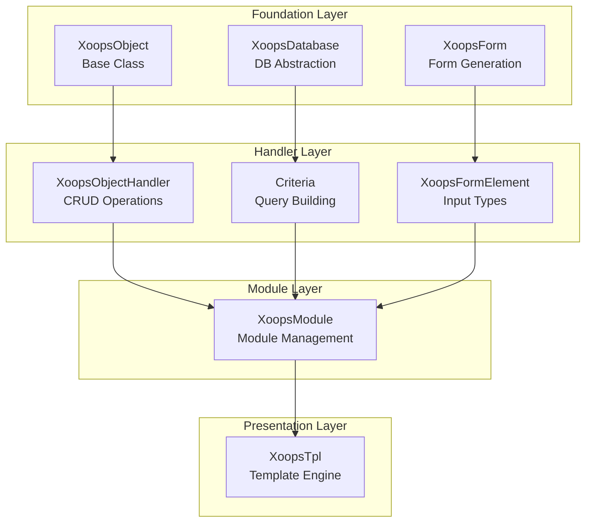
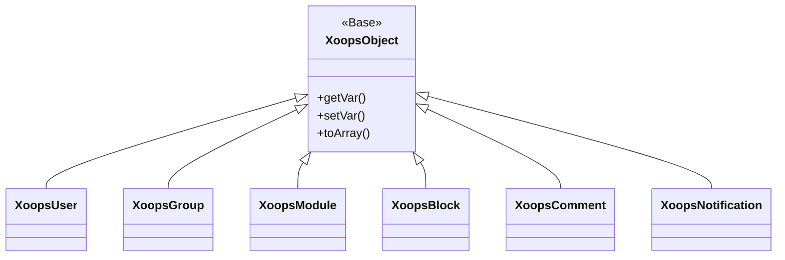
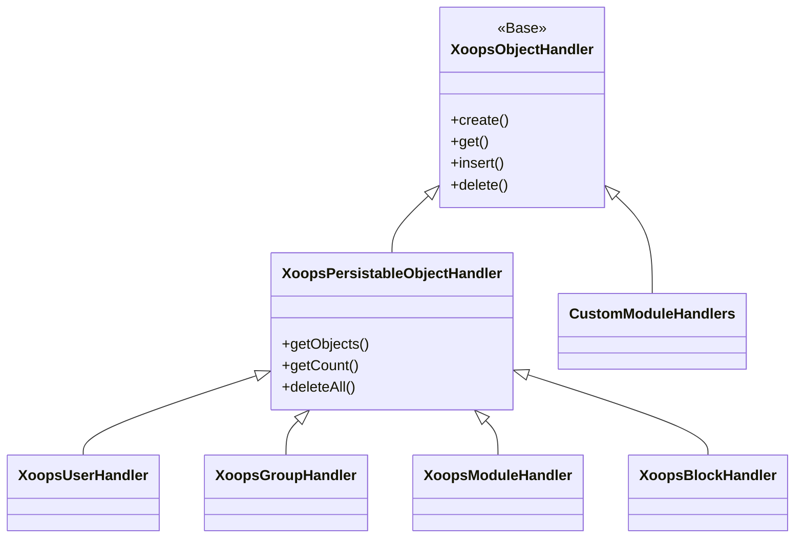
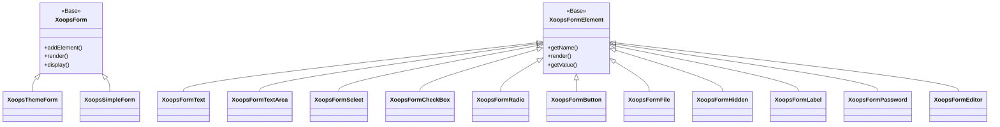

Ласкаво просимо до повної довідкової документації XOOPS API. У цьому розділі міститься детальна документація для всіх основних класів, методів і систем, які складають систему керування вмістом XOOPS.

## Огляд

XOOPS API організовано в кілька основних підсистем, кожна з яких відповідає за певний аспект функціональності CMS. Розуміння цих API є важливим для розробки модулів, тем і розширень для XOOPS.

## API Розділи

### Основні класи

Базові класи, на яких будуються всі інші компоненти XOOPS.

| Документація | Опис |
|--------------|-------------|
| XoopsObject | Базовий клас для всіх об’єктів даних у XOOPS |
| XoopsObjectHandler | Шаблон обробника для операцій CRUD |

### Рівень бази даних

Утиліти абстрагування бази даних і створення запитів.

| Документація | Опис |
|--------------|-------------|
| База даних Xoops | Рівень абстракції бази даних |
| Система критеріїв | Критерії та умови запиту |
| QueryBuilder | Сучасне плавне створення запитів |

### Система форм

Створення та перевірка форми HTML.

| Документація | Опис |
|--------------|-------------|
| XoopsForm | Контейнер форми та візуалізація |
| Елементи форми | Усі доступні типи елементів форми |

### Класи ядра

Основні системні компоненти та служби.

| Документація | Опис |
|--------------|-------------|
| Класи ядра | Ядро системи та основні компоненти |

### Модульна система

Управління модулями та життєвий цикл.

| Документація | Опис |
|--------------|-------------|
| Модуль системи | Завантаження, встановлення та керування модулем |

### Система шаблонів

Інтеграція шаблону Smarty.

| Документація | Опис |
|--------------|-------------|
| Система шаблонів | Smarty інтеграція та керування шаблонами |

### Система користувача

Керування користувачами та аутентифікація.

| Документація | Опис |
|--------------|-------------|
| Система користувача | Облікові записи користувачів, групи та дозволи |

## Огляд архітектури

## Ієрархія класів

### Об'єктна модель

### Модель обробника

### Модель форми

## Патерни проектування

XOOPS API реалізує кілька відомих шаблонів проектування:

### Шаблон Singleton
Використовується для глобальних служб, таких як підключення до бази даних і екземпляри контейнерів.
```php
$db = XoopsDatabase::getInstance();
$container = XoopsContainer::getInstance();
```
### Фабричний шаблон
Обробники об’єктів створюють об’єкти домену послідовно.
```php
$handler = xoops_getHandler('user');
$user = $handler->create();
```
### Складений візерунок
Форми містять кілька елементів форми; критерії можуть містити вкладені критерії.
```php
$criteria = new CriteriaCompo();
$criteria->add(new Criteria('status', 1));
$criteria->add(new CriteriaCompo(...)); // Nested
```
### Шаблон спостерігача
Система подій допускає слабкий зв’язок між модулями.
```php
$dispatcher->addListener('module.news.article_published', $callback);
```
## Приклади швидкого запуску

### Створення та збереження об'єкта
```php
// Get the handler
$handler = xoops_getHandler('user');

// Create a new object
$user = $handler->create();
$user->setVar('uname', 'newuser');
$user->setVar('email', 'user@example.com');

// Save to database
$handler->insert($user);
```
### Запити з критеріями
```php
// Build criteria
$criteria = new CriteriaCompo();
$criteria->add(new Criteria('level', 0, '>'));
$criteria->setSort('uname');
$criteria->setOrder('ASC');
$criteria->setLimit(10);

// Get objects
$handler = xoops_getHandler('user');
$users = $handler->getObjects($criteria);
```
### Створення форми
```php
$form = new XoopsThemeForm('User Profile', 'userform', 'save.php', 'post', true);
$form->addElement(new XoopsFormText('Username', 'uname', 50, 255, $user->getVar('uname')));
$form->addElement(new XoopsFormTextArea('Bio', 'bio', $user->getVar('bio')));
$form->addElement(new XoopsFormButton('', 'submit', _SUBMIT, 'submit'));
echo $form->render();
```
## API Умовні позначення

### Правила іменування

| Тип | Конвенція | Приклад |
|------|-----------|---------|
| Класи | PascalCase | `XoopsUser`, `CriteriaCompo` |
| Методи | CamelCase | `getVar()`, `setVar()` |
| Властивості | camelCase (захищений) | `$_vars`, `$_handler` |
| Константи | UPPER_SNAKE_CASE | `XOBJ_DTYPE_INT` |
| Таблиці бази даних | snake_case | `users`, `groups_users_link` |

### Типи даних

XOOPS визначає стандартні типи даних для змінних об’єктів:

| Постійний | Тип | Опис |
|----------|------|-------------|
| `XOBJ_DTYPE_TXTBOX` | Рядок | Введення тексту (дезінфіковано) |
| `XOBJ_DTYPE_TXTAREA` | Рядок | Вміст Textarea |
| `XOBJ_DTYPE_INT` | Ціле | Числові значення |
| `XOBJ_DTYPE_URL` | Рядок | Перевірка URL |
| `XOBJ_DTYPE_EMAIL` | Рядок | Перевірка електронної пошти |
| `XOBJ_DTYPE_ARRAY` | Масив | Серіалізовані масиви |
| `XOBJ_DTYPE_OTHER` | Змішаний | Індивідуальна обробка |
| `XOBJ_DTYPE_SOURCE` | Рядок | Вихідний код (мінімальна обробка) |
| `XOBJ_DTYPE_STIME` | Ціле | Коротка позначка часу |
| `XOBJ_DTYPE_MTIME` | Ціле | Середня позначка часу |
| `XOBJ_DTYPE_LTIME` | Ціле | Довга позначка часу |

## Методи автентифікації

API підтримує кілька методів автентифікації:

### API Ключ автентифікації
```
X-API-Key: your-api-key
```
### Маркер носія OAuth
```
Authorization: Bearer your-oauth-token
```
### Автентифікація на основі сеансу
Використовує наявний сеанс XOOPS під час входу.

## Кінцеві точки REST API

Коли REST API увімкнено:

| Кінцева точка | Метод | Опис |
|----------|--------|-------------|
| `/api.php/rest/users` | ОТРИМАТИ | Список користувачів |
| `/api.php/rest/users/{id}` | ОТРИМАТИ | Отримати користувача за ID |
| `/api.php/rest/users` | Опублікувати | Створити користувача |
| `/api.php/rest/users/{id}` | ПОСТАВИТИ | Оновити користувача |
| `/api.php/rest/users/{id}` | ВИДАЛИТИ | Видалити користувача |
| `/api.php/rest/modules` | ОТРИМАТИ | Список модулів |

## Пов'язана документація

- Посібник із розробки модуля
- Керівництво з розробки теми
- Конфігурація системи
- Найкращі методи безпеки

## Історія версій

| Версія | Зміни |
|---------|---------|
| 2.5.11 | Поточний стабільний випуск |
| 2.5.10 | Додано підтримку GraphQL API |
| 2.5.9 | Розширена система критеріїв |
| 2.5.8 | PSR-4 підтримка автозавантаження |

---

*Ця документація є частиною бази знань XOOPS. Щоб отримати останні оновлення, відвідайте [репозиторій XOOPS GitHub](https://github.com/XOOPS).*