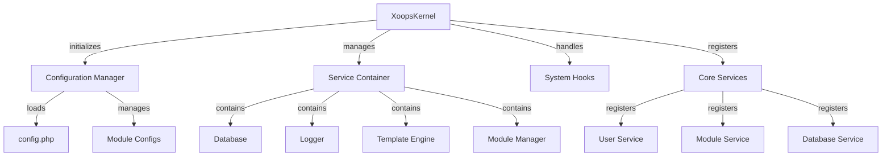

Ядро XOOPS забезпечує базову структуру для початкового завантаження системи, керування конфігураціями, обробки системних подій і надання основних утиліт. Ці класи утворюють основу програми XOOPS.

## Архітектура системи

## Клас ядра Xoops

Основний клас ядра, який ініціалізує та керує системою XOOPS.

### Огляд класу
```php
namespace Xoops;

class XoopsKernel
{
    private static ?XoopsKernel $instance = null;
    protected ServiceContainer $services;
    protected ConfigurationManager $config;
    protected array $modules = [];
    protected bool $isLoaded = false;
}
```
### Конструктор
```php
private function __construct()
```
Приватний конструктор застосовує шаблон одного елемента.

### getInstance

Отримує одиночний екземпляр ядра.
```php
public static function getInstance(): XoopsKernel
```
**Повертає:** `XoopsKernel` - екземпляр єдиного ядра

**Приклад:**
```php
$kernel = XoopsKernel::getInstance();
```
### Процес завантаження

Процес завантаження ядра складається з таких кроків:

1. **Ініціалізація** – установіть обробники помилок, визначте константи
2. **Конфігурація** - Завантажте файли конфігурації
3. **Реєстрація служби** - реєстрація основних послуг
4. **Виявлення модулів** - Скануйте та ідентифікуйте активні модулі
5. **Ініціалізація бази даних** - підключення до бази даних
6. **Очищення** - Підготовка до обробки запитів
```php
public function boot(): void
```
**Приклад:**
```php
$kernel = XoopsKernel::getInstance();
$kernel->boot();
```
### Методи контейнера служби

#### registerService

Реєструє послугу в контейнері послуг.
```php
public function registerService(
    string $name,
    callable|object $definition
): void
```
**Параметри:**

| Параметр | Тип | Опис |
|-----------|------|------------|
| `$name` | рядок | Ідентифікатор послуги |
| `$definition` | викликається\|об'єкт | Обслуговування заводу або екземпляра |

**Приклад:**
```php
$kernel->registerService('custom.handler', function($c) {
    return new CustomHandler();
});
```
#### getService

Отримує зареєстровану службу.
```php
public function getService(string $name): mixed
```
**Параметри:**

| Параметр | Тип | Опис |
|-----------|------|------------|
| `$name` | рядок | Ідентифікатор послуги |

**Повернення:** `mixed` - запитана послуга

**Приклад:**
```php
$database = $kernel->getService('database');
$logger = $kernel->getService('logger');
```
#### hasService

Перевіряє, чи зареєстрована служба.
```php
public function hasService(string $name): bool
```
**Приклад:**
```php
if ($kernel->hasService('cache')) {
    $cache = $kernel->getService('cache');
}
```
## Менеджер конфігурацій

Керує конфігурацією програми та налаштуваннями модулів.

### Огляд класу
```php
namespace Xoops\Core;

class ConfigurationManager
{
    protected array $config = [];
    protected array $defaults = [];
    protected string $configPath;
}
```
### Методи

#### навантаження

Завантажує конфігурацію з файлу або масиву.
```php
public function load(string|array $source): void
```
**Параметри:**

| Параметр | Тип | Опис |
|-----------|------|------------|
| `$source` | рядок\|масив | Шлях до файлу конфігурації або масив |

**Приклад:**
```php
$config = $kernel->getService('config');
$config->load(XOOPS_ROOT_PATH . '/include/config.php');
$config->load(['sitename' => 'My Site', 'admin_email' => 'admin@example.com']);
```
#### отримати

Отримує значення конфігурації.
```php
public function get(string $key, mixed $default = null): mixed
```
**Параметри:**

| Параметр | Тип | Опис |
|-----------|------|------------|
| `$key` | рядок | Ключ конфігурації (крапкова нотація) |
| `$default` | змішаний | Значення за замовчуванням, якщо не знайдено |

**Повертає:** `mixed` - значення конфігурації

**Приклад:**
```php
$siteName = $config->get('sitename');
$adminEmail = $config->get('admin.email', 'admin@example.com');
```
#### комплект

Встановлює значення конфігурації.
```php
public function set(string $key, mixed $value): void
```
**Параметри:**

| Параметр | Тип | Опис |
|-----------|------|------------|
| `$key` | рядок | Ключ конфігурації |
| `$value` | змішаний | Значення конфігурації |

**Приклад:**
```php
$config->set('sitename', 'New Site Name');
$config->set('features.cache_enabled', true);
```
#### getModuleConfig

Отримує конфігурацію для певного модуля.
```php
public function getModuleConfig(
    string $moduleName
): array
```
**Параметри:**

| Параметр | Тип | Опис |
|-----------|------|------------|
| `$moduleName` | рядок | Назва каталогу модуля |

**Повертає:** `array` – масив конфігурації модуля

**Приклад:**
```php
$publisherConfig = $config->getModuleConfig('publisher');
```
## Системні хуки

Системні хуки дозволяють модулям і плагінам виконувати код у певних точках життєвого циклу програми.

### Клас HookManager
```php
namespace Xoops\Core;

class HookManager
{
    protected array $hooks = [];
    protected array $listeners = [];
}
```
### Методи

#### addHook

Реєструє точку підключення.
```php
public function addHook(string $name): void
```
**Параметри:**

| Параметр | Тип | Опис |
|-----------|------|------------|
| `$name` | рядок | Ідентифікатор гака |

**Приклад:**
```php
$hooks = $kernel->getService('hooks');
$hooks->addHook('system.startup');
$hooks->addHook('user.login');
$hooks->addHook('module.install');
```
#### слухай

Прикріплює слухавку до гачка.
```php
public function listen(
    string $hookName,
    callable $callback,
    int $priority = 10
): void
```
**Параметри:**

| Параметр | Тип | Опис |
|-----------|------|------------|
| `$hookName` | рядок | Ідентифікатор гака |
| `$callback` | викликний | Функція для виконання |
| `$priority` | int | Пріоритет виконання (старші запускаються спочатку) |

**Приклад:**
```php
$hooks->listen('user.login', function($user) {
    error_log('User ' . $user->uname . ' logged in');
}, 10);

$hooks->listen('module.install', function($module) {
    // Custom module installation logic
    echo "Installing " . $module->getName();
}, 5);
```
#### тригер

Виконує всі слухачі для хука.
```php
public function trigger(
    string $hookName,
    mixed $arguments = null
): array
```
**Параметри:**

| Параметр | Тип | Опис |
|-----------|------|------------|
| `$hookName` | рядок | Ідентифікатор гака |
| `$arguments` | змішаний | Дані для передачі слухачам |

**Повернення:** `array` - Результати від усіх слухачів

**Приклад:**
```php
$results = $hooks->trigger('system.startup');
$results = $hooks->trigger('user.created', $newUser);
```
## Огляд основних служб

Під час завантаження ядро реєструє кілька основних служб:

| Сервіс | Клас | Призначення |
|---------|-------|---------|
| `database` | База даних Xoops | Рівень абстракції бази даних |
| `config` | ConfigurationManager | Керування конфігурацією |
| `logger` | Лісоруб | Ведення журналу програми |
| `template` | XoopsTpl | Механізм шаблонів |
| `user` | Менеджер користувачів | Сервіс керування користувачами |
| `module` | ModuleManager | Модуль керування |
| `cache` | CacheManager | Рівень кешування |
| `hooks` | HookManager | Перехоплення системних подій |

## Повний приклад використання
```php
<?php
/**
 * Custom module boot process utilizing kernel
 */

// Get kernel instance
$kernel = XoopsKernel::getInstance();

// Boot the system
$kernel->boot();

// Get services
$config = $kernel->getService('config');
$database = $kernel->getService('database');
$logger = $kernel->getService('logger');
$hooks = $kernel->getService('hooks');

// Access configuration
$siteName = $config->get('sitename');
$adminEmail = $config->get('admin.email');

// Register module-specific hooks
$hooks->listen('user.login', function($user) {
    // Log user login
    $logger->info('User login: ' . $user->uname);

    // Track in database
    $database->query(
        'INSERT INTO ' . $database->prefix('event_log') .
        ' (type, user_id, message, timestamp) VALUES (?, ?, ?, ?)',
        ['login', $user->uid(), 'User login', time()]
    );
});

$hooks->listen('module.install', function($module) {
    $logger->info('Module installed: ' . $module->getName());
});

// Trigger hooks
$hooks->trigger('system.startup');

// Use database service
$result = $database->query(
    'SELECT * FROM ' . $database->prefix('users') .
    ' LIMIT 10'
);

while ($row = $database->fetchArray($result)) {
    echo "User: " . htmlspecialchars($row['uname']) . "\n";
}

// Register custom service
$kernel->registerService('custom.repository', function($c) {
    return new CustomRepository($c->getService('database'));
});

// Later access custom service
$repo = $kernel->getService('custom.repository');
```
## Основні константи

Ядро визначає кілька важливих констант під час завантаження:
```php
// System paths
define('XOOPS_ROOT_PATH', '/var/www/xoops');
define('XOOPS_HTDOCS_PATH', XOOPS_ROOT_PATH . '/htdocs');
define('XOOPS_MODULES_PATH', XOOPS_ROOT_PATH . '/htdocs/modules');
define('XOOPS_THEMES_PATH', XOOPS_ROOT_PATH . '/htdocs/themes');

// Web paths
define('XOOPS_URL', 'http://example.com');
define('XOOPS_HTDOCS_URL', XOOPS_URL . '/htdocs');

// Database
define('XOOPS_DB_PREFIX', 'xoops_');
```
## Обробка помилок

Ядро встановлює обробники помилок під час завантаження:
```php
// Set custom error handler
set_error_handler(function($errno, $errstr, $errfile, $errline) {
    $kernel->getService('logger')->error(
        "Error: $errstr in $errfile:$errline"
    );
});

// Set exception handler
set_exception_handler(function($exception) {
    $kernel->getService('logger')->critical(
        "Exception: " . $exception->getMessage()
    );
});
```
## Найкращі практики

1. **Single Boot** - виклик `boot()` лише один раз під час запуску програми
2. **Використовувати контейнер служб** - Реєстрація та отримання служб через ядро
3. **Обробляти хуки Early** - реєструйте слухачів хуків перед тим, як запускати їх
4. **Реєстрація важливих подій** - Використовуйте службу журналу для налагодження
5. **Конфігурація кешу** - завантажте конфігурацію один раз і використовуйте повторно
6. **Обробка помилок** - Завжди встановлюйте обробники помилок перед обробкою запитів

## Пов'язана документація

- ../Module/Module-System - Модульна система та життєвий цикл
- ../Template/Template-System - Інтеграція системи шаблонів
- ../User/User-System - Автентифікація та керування користувачами
- ../Database/XoopsDatabase - Рівень бази даних

---

*Див. також: [XOOPS Джерело ядра](https://github.com/XOOPS/XoopsCore27/tree/master/htdocs/class)*