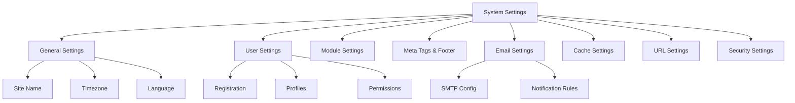

# XOOPS Налаштування системи

Цей посібник охоплює повні параметри системи, доступні на панелі адміністратора XOOPS, упорядковані за категоріями.

## Архітектура параметрів системи

## Доступ до налаштувань системи

### Розташування

**Панель адміністратора > Система > Налаштування**

Або перейдіть безпосередньо:
```
http://your-domain.com/xoops/admin/index.php?fct=preferences
```
### Вимоги до дозволу

- Тільки адміністратори (веб-майстри) мають доступ до налаштувань системи
- Зміни стосуються всього сайту
- Більшість змін набувають чинності негайно

## Загальні налаштування

Основна конфігурація для встановлення XOOPS.

### Основна інформація
```
Site Name: [Your Site Name]
Default Description: [Brief description of your site]
Site Slogan: [Catchy slogan]
Admin Email: admin@your-domain.com
Webmaster Name: Administrator Name
Webmaster Email: admin@your-domain.com
```
### Налаштування зовнішнього вигляду
```
Default Theme: [Select theme]
Default Language: English (or preferred language)
Items Per Page: 15 (typically 10-25)
Words in Snippet: 25 (for search results)
Theme Upload Permission: Disabled (security)
```
### Регіональні налаштування
```
Default Timezone: [Your timezone]
Date Format: %Y-%m-%d (YYYY-MM-DD format)
Time Format: %H:%M:%S (HH:MM:SS format)
Daylight Saving Time: [Auto/Manual/None]
```
**Таблиця форматів часових поясів:**

| Регіон | Часовий пояс | UTC Offset |
|---|---|---|
| Східні США | America/New_York | -5 / -4 |
| Центральний США | America/Chicago | -6 / -5 |
| Гора США | America/Denver | -7 / -6 |
| Тихоокеанський регіон США | America/Los_Angeles | -8 / -7 |
| UK/London | Europe/London | 0 / +1 |
| France/Germany | Europe/Paris | +1 / +2 |
| Японія | Asia/Tokyo | +9 |
| Китай | Asia/Shanghai | +8 |
| Australia/Sydney | Australia/Sydney | +10 / +11 |

### Конфігурація пошуку
```
Enable Search: Yes
Search Admin Pages: Yes/No
Search Archives: Yes
Default Search Type: All / Pages only
Words Excluded from Search: [Comma-separated list]
```
**Поширені виключені слова:** the, a, an, and, or, but, in, on, at, by, to, from

## Налаштування користувача

Контролюйте поведінку облікових записів користувачів і процес реєстрації.

### Реєстрація користувача
```
Allow User Registration: Yes/No
Registration Type:
  ☐ Auto-activate (Instant access)
  ☐ Admin approval (Admin must approve)
  ☐ Email verification (User must verify email)

Notification to Users: Yes/No
User Email Verification: Required/Optional
```
### Нова конфігурація користувача
```
Auto-login New Users: Yes/No
Assign Default User Group: Yes
Default User Group: [Select group]
Create User Avatar: Yes/No
Initial User Avatar: [Select default]
```
### Налаштування профілю користувача
```
Allow User Profiles: Yes
Show Member List: Yes
Show User Statistics: Yes
Show Last Online Time: Yes
Allow User Avatar: Yes
Avatar Max File Size: 100KB
Avatar Dimensions: 100x100 pixels
```
### Налаштування електронної пошти користувача
```
Allow Users to Hide Email: Yes
Show Email on Profile: Yes
Notification Email Interval: Immediately/Daily/Weekly/Never
```
### Відстеження активності користувача
```
Track User Activity: Yes
Log User Logins: Yes
Log Failed Logins: Yes
Track IP Address: Yes
Clear Activity Logs Older Than: 90 days
```
### Обмеження облікового запису
```
Allow Duplicate Email: No
Minimum Username Length: 3 characters
Maximum Username Length: 15 characters
Minimum Password Length: 6 characters
Require Special Characters: Yes
Require Numbers: Yes
Password Expiration: 90 days (or Never)
Accounts Inactive Days to Delete: 365 days
```
## Налаштування модуля

Налаштувати поведінку окремого модуля.

### Загальні параметри модуля

Для кожного встановленого модуля можна встановити:
```
Module Status: Active/Inactive
Display in Menu: Yes/No
Module Weight: [1-999] (higher = lower in display)
Homepage Default: This module shows when visiting /
Admin Access: [Allowed user groups]
User Access: [Allowed user groups]
```
### Налаштування системного модуля
```
Show Homepage as: Portal / Module / Static Page
Default Homepage Module: [Select module]
Show Footer Menu: Yes
Footer Color: [Color selector]
Show System Stats: Yes
Show Memory Usage: Yes
```
### Конфігурація для кожного модуля

Кожен модуль може мати індивідуальні налаштування:

**Приклад - модуль сторінки:**
```
Enable Comments: Yes/No
Moderate Comments: Yes/No
Comments Per Page: 10
Enable Ratings: Yes
Allow Anonymous Ratings: Yes
```
**Приклад - Модуль користувача:**
```
Avatar Upload Folder: ./uploads/
Maximum Upload Size: 100KB
Allow File Upload: Yes
Allowed File Types: jpg, gif, png
```
Доступ до налаштувань окремих модулів:
- **Адміністратор > Модулі > [Назва модуля] > Параметри**

## Метатеги та налаштування SEO

Налаштуйте мета-теги для пошукової оптимізації.

### Глобальні метатеги
```
Meta Keywords: xoops, cms, content management system
Meta Description: A powerful content management system for building dynamic websites
Meta Author: Your Name
Meta Copyright: Copyright 2025, Your Company
Meta Robots: index, follow
Meta Revisit: 30 days
```
### Рекомендації щодо метатегів

| Тег | Призначення | Рекомендація |
|---|---|---|
| Ключові слова | Пошукові умови | 5-10 релевантних ключових слів, розділених комами |
| Опис | Пошук у списку | 150-160 символів |
| Автор | Творець сторінки | Ваше ім'я або компанія |
| Авторське право | Юридичний | Ваше повідомлення про авторські права |
| Роботи | Інструкції для сканера | index, follow (дозволити індексацію) |

### Параметри нижнього колонтитула
```
Show Footer: Yes
Footer Color: Dark/Light
Footer Background: [Color code]
Footer Text: [HTML allowed]
Additional Footer Links: [URL and text pairs]
```
**Зразок нижнього колонтитула HTML:**
```html
<p>Copyright &copy; 2025 Your Company. All rights reserved.</p>
<p><a href="/privacy">Privacy Policy</a> | <a href="/terms">Terms of Use</a></p>
```
### Соціальні метатеги (відкритий графік)
```
Enable Open Graph: Yes
Facebook App ID: [App ID]
Twitter Card Type: summary / summary_large_image / player
Default Share Image: [Image URL]
```
## Налаштування електронної пошти

Налаштувати систему доставки електронної пошти та сповіщень.

### Спосіб доставки електронної пошти
```
Use SMTP: Yes/No

If SMTP:
  SMTP Host: smtp.gmail.com
  SMTP Port: 587 (TLS) or 465 (SSL)
  SMTP Security: TLS / SSL / None
  SMTP Username: [email@example.com]
  SMTP Password: [password]
  SMTP Authentication: Yes/No
  SMTP Timeout: 10 seconds

If PHP mail():
  Sendmail Path: /usr/sbin/sendmail -t -i
```
### Конфігурація електронної пошти
```
From Address: noreply@your-domain.com
From Name: Your Site Name
Reply-To Address: support@your-domain.com
BCC Admin Emails: Yes/No
```
### Налаштування сповіщень
```
Send Welcome Email: Yes/No
Welcome Email Subject: Welcome to [Site Name]
Welcome Email Body: [Custom message]

Send Password Reset Email: Yes/No
Include Random Password: Yes/No
Token Expiration: 24 hours
```
### Сповіщення адміністратора
```
Notify Admin on Registration: Yes
Notify Admin on Comments: Yes
Notify Admin on Submissions: Yes
Notify Admin on Errors: Yes
```
### Сповіщення користувача
```
Notify User on Registration: Yes
Notify User on Comments: Yes
Notify User on Private Messages: Yes
Allow Users to Disable Notifications: Yes
Default Notification Frequency: Immediately
```
### Шаблони електронної пошти

Налаштуйте електронні листи сповіщень в панелі адміністратора:

**Шлях:** Система > Шаблони електронної пошти

Доступні шаблони:
- Реєстрація користувача
- Скидання пароля
- Сповіщення про коментарі
- Приватне повідомлення
- Системні сповіщення
- Електронні листи для окремих модулів

## Налаштування кешу

Оптимізуйте продуктивність за допомогою кешування.

### Конфігурація кешу
```
Enable Caching: Yes/No
Cache Type:
  ☐ File Cache
  ☐ APCu (Alternative PHP Cache)
  ☐ Memcache (Distributed caching)
  ☐ Redis (Advanced caching)

Cache Lifetime: 3600 seconds (1 hour)
```
### Параметри кешу за типом

**Кеш файлів:**
```
Cache Directory: /var/www/html/xoops/cache/
Clear Interval: Daily
Maximum Cache Files: 1000
```
**APCu Cache:**
```
Memory Allocation: 128MB
Fragmentation Level: Low
```
**Memcache/Redis:**
```
Server Host: localhost
Server Port: 11211 (Memcache) / 6379 (Redis)
Persistent Connection: Yes
```
### Що зберігається в кеші
```
Cache Module Lists: Yes
Cache Configuration Data: Yes
Cache Template Data: Yes
Cache User Session Data: Yes
Cache Search Results: Yes
Cache Database Queries: Yes
Cache RSS Feeds: Yes
Cache Images: Yes
```
## URL Налаштування

Налаштуйте перезапис і форматування URL.

### Зручні налаштування URL
```
Enable Friendly URLs: Yes/No
Friendly URL Type:
  ☐ Path Info: /page/about
  ☐ Query String: /index.php?p=about

Trailing Slash: Include / Omit
URL Case: Lower case / Case sensitive
```
### URL Правила перезапису
```
.htaccess Rules: [Display current]
Nginx Rules: [Display current if Nginx]
IIS Rules: [Display current if IIS]
```
## Параметри безпеки

Керуйте конфігурацією безпеки.

### Безпека пароля
```
Password Policy:
  ☐ Require uppercase letters
  ☐ Require lowercase letters
  ☐ Require numbers
  ☐ Require special characters

Minimum Password Length: 8 characters
Password Expiration: 90 days
Password History: Remember last 5 passwords
Force Password Change: On next login
```
### Безпека входу
```
Lock Account After Failed Attempts: 5 attempts
Lock Duration: 15 minutes
Log All Login Attempts: Yes
Log Failed Logins: Yes
Admin Login Alert: Send email on admin login
Two-Factor Authentication: Disabled/Enabled
```
### Безпека завантаження файлів
```
Allow File Uploads: Yes/No
Maximum File Size: 128MB
Allowed File Types: jpg, gif, png, pdf, zip, doc, docx
Scan Uploads for Malware: Yes (if available)
Quarantine Suspicious Files: Yes
```
### Безпека сеансу
```
Session Management: Database/Files
Session Timeout: 1800 seconds (30 min)
Session Cookie Lifetime: 0 (until browser closes)
Secure Cookie: Yes (HTTPS only)
HTTP Only Cookie: Yes (prevent JavaScript access)
```
### Налаштування CORS
```
Allow Cross-Origin Requests: No
Allowed Origins: [List domains]
Allow Credentials: No
Allowed Methods: GET, POST
```
## Розширені налаштування

Додаткові параметри конфігурації для досвідчених користувачів.

### Режим налагодження
```
Debug Mode: Disabled/Enabled
Log Level: Error / Warning / Info / Debug
Debug Log File: /var/log/xoops_debug.log
Display Errors: Disabled (production)
```
### Налаштування продуктивності
```
Optimize Database Queries: Yes
Use Query Cache: Yes
Compress Output: Yes
Minify CSS/JavaScript: Yes
Lazy Load Images: Yes
```
### Налаштування вмісту
```
Allow HTML in Posts: Yes/No
Allowed HTML Tags: [Configure]
Strip Harmful Code: Yes
Allow Embed: Yes/No
Content Moderation: Automatic/Manual
Spam Detection: Yes
```
## Налаштування Export/Import

### Налаштування резервного копіювання

Експорт поточних налаштувань:

**Панель адміністратора > Система > Інструменти > Параметри експорту**
```bash
# Settings exported as JSON file
# Download and store securely
```
### Відновити налаштування

Імпорт попередньо експортованих налаштувань:

**Панель адміністратора > Система > Інструменти > Налаштування імпорту**
```bash
# Upload JSON file
# Verify changes before confirming
```
## Ієрархія конфігурації

Ієрархія налаштувань XOOPS (зверху вниз – перемога в першому матчі):
```
1. mainfile.php (Constants)
2. Module-specific config
3. Admin System Settings
4. Theme configuration
5. User preferences (for user-specific settings)
```
## Сценарій резервного копіювання налаштувань

Створіть резервну копію поточних налаштувань:
```php
<?php
// Backup script: /var/www/html/xoops/backup-settings.php
require_once __DIR__ . '/mainfile.php';

$config_handler = xoops_getHandler('config');
$configs = $config_handler->getConfigs();

$backup = [
    'exported_date' => date('Y-m-d H:i:s'),
    'xoops_version' => XOOPS_VERSION,
    'php_version' => PHP_VERSION,
    'settings' => []
];

foreach ($configs as $config) {
    $backup['settings'][$config->getVar('conf_name')] = [
        'value' => $config->getVar('conf_value'),
        'description' => $config->getVar('conf_desc'),
        'type' => $config->getVar('conf_type'),
    ];
}

// Save to JSON file
file_put_contents(
    '/backups/xoops_settings_' . date('YmdHis') . '.json',
    json_encode($backup, JSON_PRETTY_PRINT)
);

echo "Settings backed up successfully!";
?>
```
## Загальні зміни налаштувань

### Змінити назву сайту

1. Адміністратор > Система > Параметри > Загальні параметри
2. Змініть «Назва сайту»
3. Натисніть «Зберегти»

### Enable/Disable Реєстрація

1. Адміністратор > Система > Параметри > Параметри користувача
2. Перемкніть «Дозволити реєстрацію користувача»
3. Виберіть тип реєстрації
4. Натисніть «Зберегти»

### Змінити тему за замовчуванням

1. Адміністратор > Система > Параметри > Загальні параметри
2. Виберіть «Тема за замовчуванням»
3. Натисніть «Зберегти»
4. Очистіть кеш, щоб зміни набули чинності

### Оновити контактну електронну адресу

1. Адміністратор > Система > Параметри > Загальні параметри
2. Змініть "Електронну адресу адміністратора"
3. Змініть "Електронну адресу веб-майстра"
4. Натисніть «Зберегти»

## Контрольний список перевірки

Після налаштування параметрів системи перевірте:

- [ ] Назва сайту відображається правильно
- [ ] Часовий пояс показує правильний час
- [ ] Сповіщення електронною поштою надсилаються належним чином
- [ ] Реєстрація користувача працює, як налаштовано
- [ ] Домашня сторінка відображає вибрані за замовчуванням
- [ ] Функція пошуку працює
- [ ] Кеш покращує час завантаження сторінки
- [ ] Дружні URL-адреси працюють (якщо ввімкнено)
- [ ] Мета-теги відображаються в джерелі сторінки
- [ ] Отримано сповіщення адміністратора
- [ ] Примусово введено налаштування безпеки

## Налаштування усунення несправностей

### Налаштування не зберігаються

**Рішення:**
```bash
# Check file permissions on config directory
chmod 755 /var/www/html/xoops/var/

# Verify database writable
# Try saving again in admin panel
```
### Зміни не набувають чинності

**Рішення:**
```bash
# Clear cache
rm -rf /var/www/html/xoops/cache/*
rm -rf /var/www/html/xoops/templates_c/*

# If still not working, restart web server
systemctl restart apache2
```
### Електронна пошта не надсилається

**Рішення:**
1. Перевірте облікові дані SMTP у налаштуваннях електронної пошти
2. Перевірте за допомогою кнопки «Надіслати тестовий електронний лист».
3. Перевірте журнали помилок
4. Спробуйте використовувати PHP mail() замість SMTP

## Наступні кроки

Після налаштування параметрів системи:

1. Налаштуйте параметри безпеки
2. Оптимізуйте продуктивність
3. Ознайомтеся з функціями панелі адміністратора
4. Налаштуйте керування користувачами

---

**Теги:** #системні налаштування #конфігурація #налаштування #адмінпанель

**Пов’язані статті:**
- ../../06-Publisher-Module/User-Guide/Basic-Configuration
- Конфігурація безпеки
- Оптимізація продуктивності
- ../First-Steps/Admin-Panel-Overview