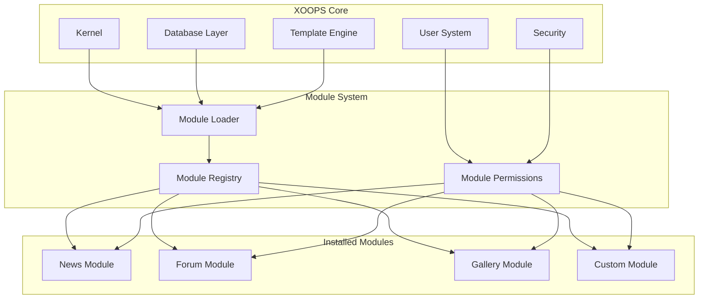
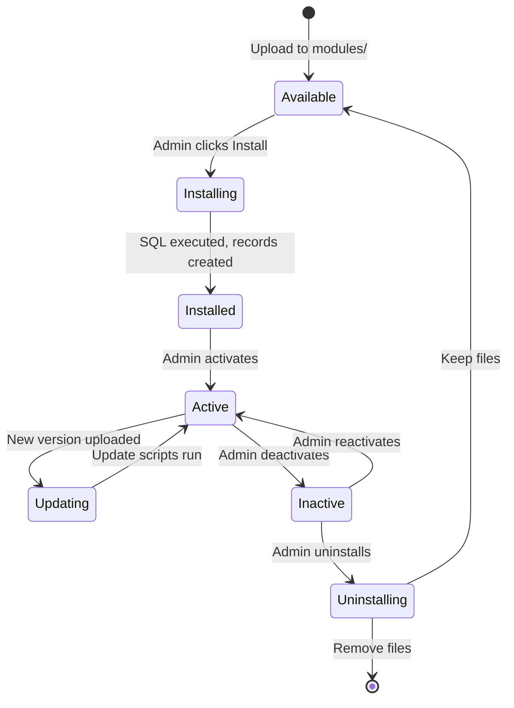

# ADR-001: Модульна архітектура

> Запис архітектурних рішень для основної філософії модульного дизайну XOOPS.

---

## Статус

**Прийнято** - Основоположне рішення з моменту заснування XOOPS

---

## Контекст

XOOPS (розширювана об’єктно-орієнтована система порталу) потребувала архітектури, яка б:

1. Дозвольте стороннім розробникам розширювати функціональність
2. Дозвольте адміністраторам сайту налаштовувати без кодування
3. Підтримка незалежної розробки та оновлень
4. Забезпечте ізоляцію між різними функціями
5. Масштабуйте від простих блогів до складних порталів

Ландшафт CMS початку 2000-х пропонував монолітні системи, які було важко налаштувати та розширити.

---

## Діаграма прийняття рішень

---

## Рішення

Ми запровадимо **модульну архітектуру**, де:

### 1. Ядро забезпечує інфраструктуру
- Абстракція бази даних
- Аутентифікація користувача та дозволи
- Візуалізація шаблону (Smarty)
- Утиліти безпеки
- Генерація форми
- Загальні комунальні послуги

### 2. Модулі самодостатні
Кожен модуль:
- Має власну структуру каталогів
- Містить власні класи, шаблони, SQL
- Визначає власну конфігурацію
- Може бути installed/uninstalled незалежно
- Є відстеження версій

### 3. Стандартна структура модуля
```
modules/modulename/
├── admin/                  # Admin interface
│   ├── index.php
│   └── menu.php
├── class/                  # PHP classes
├── include/                # Include files
├── language/               # Translations
├── sql/                    # Database schema
├── templates/              # Smarty templates
├── blocks/                 # Block definitions
├── xoops_version.php       # Module manifest
├── index.php               # Entry point
└── header.php              # Module bootstrap
```
### 4. Маніфест модуля (xoops_version.php)
```php
<?php
$modversion['name']        = 'Module Name';
$modversion['version']     = '1.0.0';
$modversion['description'] = 'Module description';
$modversion['dirname']     = basename(__DIR__);
$modversion['hasMain']     = 1;
$modversion['hasAdmin']    = 1;
$modversion['sqlfile']['mysql'] = 'sql/mysql.sql';
$modversion['tables']      = ['modulename_table1'];
$modversion['templates']   = [...];
$modversion['config']      = [...];
$modversion['blocks']      = [...];
```
### 5. Модуль зв'язку
- Через основні API (обробники, події)
- Зв'язки бази даних
- Гачки попереднього натягу
- Спільні послуги

---

## Життєвий цикл модуля

---

## Наслідки

### Позитивно

1. **Розширюваність**: тисячі модулів, створених спільнотою
2. **Незалежність**: Модулі можна розробляти окремо
3. **Гнучкість**: сайти можуть комбінувати та поєднувати функції
4. **Ремонтопридатність**: оновлення не впливають на інші модулі
5. **Ринок**: з’явилася екосистема модулів
6. **Крива навчання**: розробники вивчають один шаблон

### Негативний

1. **Накладні витрати**: кожен модуль має початкову вартість
2. **Дублювання**: загальний код може повторюватися
3. **Інтеграція**: крос-модульні функції потребують ретельного проектування
4. **Керування версіями**: потрібне керування сумісністю модулів
5. **Відхилення в якості**: якість модулів сторонніх розробників відрізняється

### Нейтрально

1. **База даних**: кожен модуль керує власними таблицями
2. **Шаблони**: тема повинна містити різні модулі
3. **Оновлення**: ядро та модулі оновлюються незалежно

---

## Розглянуті альтернативи

### 1. Монолітна архітектура
**Відхилено** – надто жорсткий, його важко налаштувати

### 2. Архітектура плагінів (у стилі WordPress)
**Частково прийнято** – блоки та попередні завантаження забезпечують перехоплення модулів, подібні до плагінів

### 3. Архітектура компонентів (стиль Joomla)
**Відхилено** – складніше, менш зручно для розробників

### 4. Мікросервіси
**Не застосовується** – надто складний для епохи спільного хостингу

---

## Пов'язані рішення

- ADR-002: Об'єктно-орієнтований доступ до бази даних
- ADR-003: Smarty Template Engine
- ADR-005: Система дозволів

---

## Посилання

- Історія проекту XOOPS
- PHP Шаблони архітектури додатків
- Порівняльні дослідження CMS (2001-2005)

---

#xoops #architecture #adr #modules #design-decision