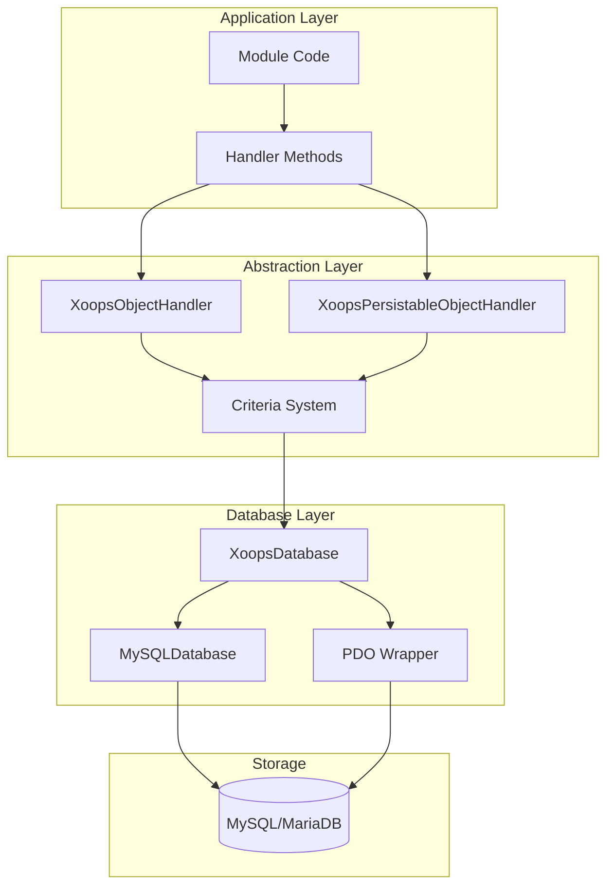
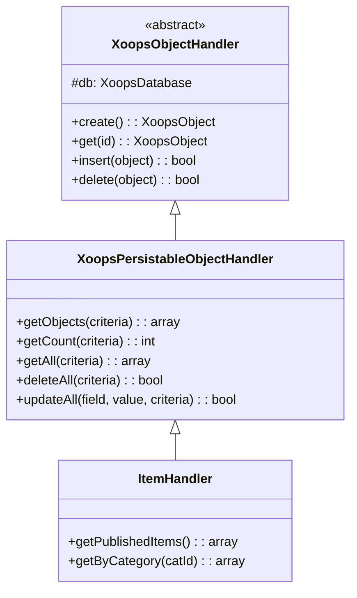
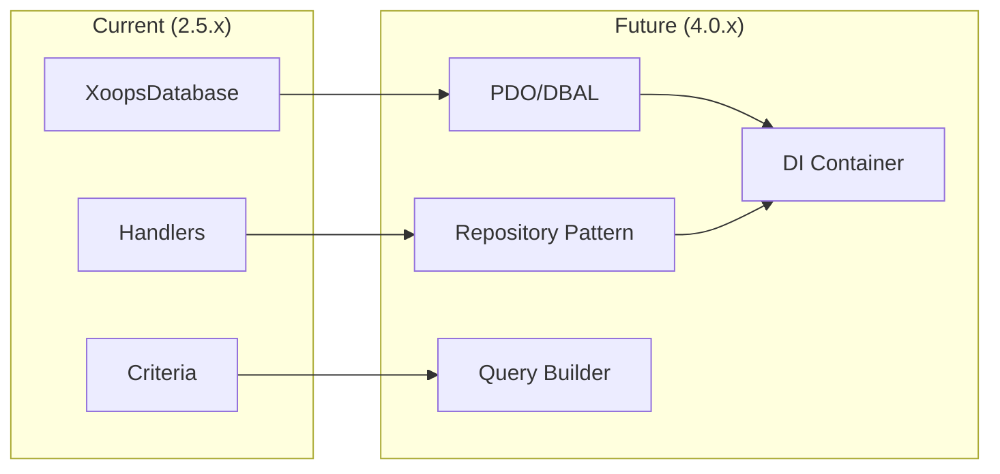

# ADR-002: Абстракція бази даних

> Запис рішення про архітектуру для шаблону доступу до об’єктно-орієнтованої бази даних XOOPS.

---

## Статус

**Прийнято** - Основний шаблон починаючи з XOOPS 2.0

---

## Контекст

XOOPS потребувала стратегії взаємодії з базою даних, яка б:

1. Абстрагувати специфічний для бази даних синтаксис SQL
2. Забезпечте узгоджені операції CRUD у всіх модулях
3. Увімкніть автоматичну очистку та видалення даних
4. Підтримка майбутніх змін механізму бази даних
5. Спростіть звичайні операції для розробників

Альтернативами були:
- Необроблений SQL у всій кодовій базі
- Повний ORM (Doctrine, Eloquent)
- Спеціальна легка абстракція

---

## Діаграма прийняття рішень

---

## Рішення

Ми запровадимо **шаблон обробника** за допомогою:

### 1. XoopsObject - Контейнер даних

Кожна сутність даних розширює XoopsObject:
```php
class Item extends XoopsObject
{
    public function __construct()
    {
        $this->initVar('id', XOBJ_DTYPE_INT, null, false);
        $this->initVar('title', XOBJ_DTYPE_TXTBOX, '', true, 255);
        $this->initVar('content', XOBJ_DTYPE_TXTAREA, '', false);
        $this->initVar('status', XOBJ_DTYPE_INT, 0, false);
    }
}
```
### 2. Обробник - менеджер операцій

Кожен об’єкт має відповідний обробник:
```php
class ItemHandler extends XoopsPersistableObjectHandler
{
    public function __construct($db)
    {
        parent::__construct($db, 'mymodule_items', Item::class, 'id', 'title');
    }

    // CRUD methods inherited:
    // - create(), get(), insert(), delete()
    // - getObjects(), getCount(), getAll()
}
```
### 3. Критерії - конструктор запитів

Умови об'єктно-орієнтованого запиту:
```php
$criteria = new CriteriaCompo();
$criteria->add(new Criteria('status', 1));
$criteria->add(new Criteria('created', time() - 86400, '>='));
$criteria->setSort('created');
$criteria->setOrder('DESC');
$criteria->setLimit(10);

$items = $handler->getObjects($criteria);
```
---

## Константи типу даних
```php
// Variable types with automatic sanitization
XOBJ_DTYPE_INT       // Integer
XOBJ_DTYPE_TXTBOX    // Single-line text (escaped)
XOBJ_DTYPE_TXTAREA   // Multi-line text (escaped)
XOBJ_DTYPE_EMAIL     // Email validation
XOBJ_DTYPE_URL       // URL validation
XOBJ_DTYPE_ARRAY     // Serialized array
XOBJ_DTYPE_OTHER     // No processing
XOBJ_DTYPE_FLOAT     // Floating point
```
---

## Успадкування обробника

---

## Наслідки

### Позитивно

1. **Узгодженість**: усі модулі використовують однакові шаблони
2. **Безпека**: автоматичний вихід запобігає введенню SQL
3. **Простота**: звичайні операції вимагають мінімум коду
4. **Ремонтопридатність**: зміни рівня бази даних не впливають на модулі
5. **Тестованість**: обробники можуть бути використані для тестування

### Негативний

1. **Продуктивність**: додаткові накладні витрати на абстракцію
2. **Складність**: крива навчання для нових розробників
3. **Обмеження**: для складних запитів може знадобитися необроблений SQL
4. **Проблема N+1**: немає вбудованого швидкого завантаження

### Пом'якшення

- **Продуктивність**: кешування часто використовуваних об’єктів
- **Складні запити**: Дозволити необроблений SQL за потреби
- **N+1**: використовуйте getAll() із відповідними критеріями

---

## Еволюція до XOOPS 4.0

XOOPS 4.0 плани:
- Доктрина DBAL для абстракції бази даних
— Обробники заміни шаблону сховища
— Конструктор запитів для складних запитів
- Повна інтеграція контейнера PSR-11

---

## Приклади коду

### Базовий CRUD
```php
$helper = Helper::getInstance();
$handler = $helper->getHandler('Item');

// Create
$item = $handler->create();
$item->setVar('title', 'New Item');
$handler->insert($item);

// Read
$item = $handler->get($id);
$title = $item->getVar('title');

// Update
$item->setVar('title', 'Updated Title');
$handler->insert($item);

// Delete
$handler->delete($item);
```
### Складний запит
```php
$criteria = new CriteriaCompo();
$criteria->add(new Criteria('status', 'published'));
$criteria->add(new Criteria('category_id', '(1,2,3)', 'IN'));
$criteria->add(new Criteria('created', strtotime('-30 days'), '>='));
$criteria->setSort('views');
$criteria->setOrder('DESC');
$criteria->setLimit(10);
$criteria->setStart(0);

$items = $handler->getObjects($criteria);
$total = $handler->getCount($criteria);
```
---

## Пов'язані рішення

- ADR-001: Модульна архітектура
- ADR-003: Smarty Template Engine

---

## Посилання

- Мартін Фаулер - Шаблони архітектури корпоративних додатків
- Концепції доменного дизайну
- Шаблони Active Record проти Data Mapper

---

#xoops #architecture #adr #database #handler #design-decision