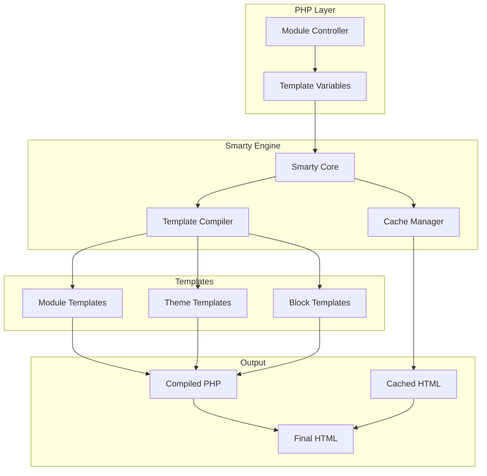
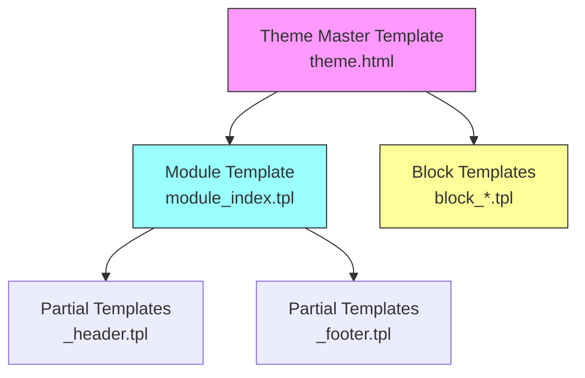
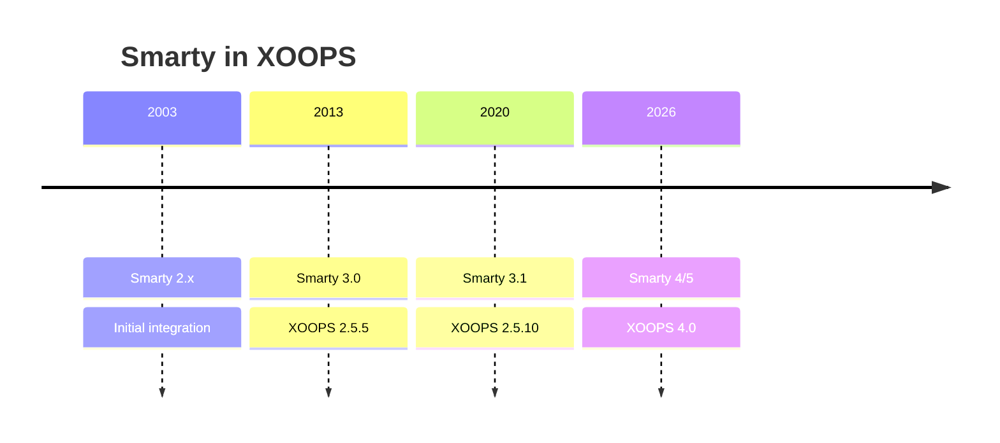

# ADR-003: Механізм шаблонів (Smarty)

> Запис архітектурного рішення щодо прийняття XOOPS механізму шаблонів Smarty.

---

## Статус

**Прийнято** - Основне рішення з XOOPS 2.0

**Розвивається** - планується перехід на Smarty 4/5 для XOOPS 4.0

---

## Контекст

XOOPS потребувало рішення для створення шаблонів, яке б:

1. Відокремте презентацію від бізнес-логіки
2. Дозвольте розробникам тем працювати без знання PHP
3. Підтримка успадкування та включення шаблонів
4. Забезпечте кешування для продуктивності
5. Увімкніть настроювані користувачем шаблони
6. Підтримка інтернаціоналізації

---

## Діаграма прийняття рішень

---

## Рішення

Ми будемо використовувати **Smarty** як систему шаблонів, оскільки:

### 1. Відокремлення інтересів
```php
// PHP (Controller) - Business logic
$items = $itemHandler->getPublishedItems();
$xoopsTpl->assign('items', $items);

// Smarty (View) - Presentation
// templates/items.tpl
```

```smarty
{* Smarty template - No PHP logic *}
<{foreach item=item from=$items}>
    <article>
        <h2><{$item.title}></h2>
        <p><{$item.summary}></p>
    </article>
<{/foreach}>
```
### 2. XOOPS Роздільники

XOOPS використовує `<{` і `}>` замість стандартного `{` `}`:
```smarty
{* Standard Smarty *}
{$variable}

{* XOOPS Smarty - Avoids JavaScript conflicts *}
<{$variable}>
```
### 3. Ієрархія шаблону

### 4. Зберігання шаблонів

- **База даних**: налаштовані шаблони, збережені для можливості повернення
- **Файлова система**: оригінальні шаблони в каталогах модулів
- **Кеш**: скомпільовані шаблони для продуктивності

---

## Конфігурація Smarty
```php
// XOOPS Smarty initialization
$xoopsTpl = new XoopsTpl();

// Custom delimiters
$xoopsTpl->left_delim = '<{';
$xoopsTpl->right_delim = '}>';

// Caching
$xoopsTpl->caching = XOOPS_TEMPLATE_CACHE;
$xoopsTpl->cache_lifetime = 3600;

// Security
$xoopsTpl->security_policy = new Smarty_Security($xoopsTpl);
$xoopsTpl->security_policy->php_functions = [];
$xoopsTpl->security_policy->php_modifiers = ['escape', 'count'];
```
---

## Використані функції шаблону

### Змінні
```smarty
{* Simple variable *}
<{$title}>

{* Object property *}
<{$item.title}>

{* With modifier *}
<{$content|truncate:200:'...'}>

{* Escaped output *}
<{$userInput|escape:'html'}>
```
### Керуючі структури
```smarty
{* Conditional *}
<{if $isAdmin}>
    <a href="admin.php">Admin</a>
<{elseif $isUser}>
    <a href="profile.php">Profile</a>
<{else}>
    <a href="login.php">Login</a>
<{/if}>

{* Loop *}
<{foreach item=item from=$items name=itemloop}>
    <{$smarty.foreach.itemloop.index}>: <{$item.title}>
<{/foreach}>
```
### Включає
```smarty
{* Include another template *}
<{include file="db:mymodule_header.tpl"}>

{* Include with variables *}
<{include file="db:mymodule_item.tpl" item=$currentItem}>

{* Include from theme *}
<{include file="file:$theme_path/partials/sidebar.tpl"}>
```
---

## Наслідки

### Позитивно

1. **Дружній для дизайнера**: синтаксис, схожий на HTML
2. **Кешування**: вбудоване кешування шаблонів
3. **Безпека**: ізоляція коду PHP
4. **Гнучкість**: Модифікатори, функції, плагіни
5. **Налаштування**: користувачі можуть змінювати шаблони
6. **Спільнота**: Велика екосистема Smarty

### Негативний

1. **Крива навчання**: синтаксис, специфічний для Smarty
2. **Накладні витрати**: потрібен крок компіляції
3. **Налагодження**: помилки шаблону можуть бути загадковими
4. **Проблеми з версіями**: критичні зміни між версіями

### Пом'якшення

- **Навчання**: вичерпна документація
- **Продуктивність**: агресивне кешування
- **Налагодження**: консоль налагодження, очищення повідомлень про помилки
- **Версії**: рівень сумісності в XOOPS

---

## Історія версій

---

## Міграція: Smarty 3 до 4/5

### Ключові зміни
```smarty
{* Smarty 3 - Deprecated *}
<{php}>echo date('Y');<{/php}>

{* Smarty 4+ - Use modifiers or assign from PHP *}
<{$current_year}>

{* Smarty 3 - {section} deprecated *}
<{section name=i loop=$items}>
    <{$items[i].title}>
<{/section}>

{* Smarty 4+ - Use {foreach} *}
<{foreach $items as $item}>
    <{$item.title}>
<{/foreach}>
```
### Рівень сумісності

XOOPS забезпечує рівень сумісності для плавних переходів:
```php
// XoopsTpl extends Smarty with compatibility methods
class XoopsTpl extends Smarty
{
    public function assign($tpl_var, $value = null)
    {
        // Handles both Smarty 3 and 4 syntax
        return parent::assign($tpl_var, $value);
    }
}
```
---

## Розглянуті альтернативи

### 1. Гілочка
**Плюси**: сучасна екосистема Symfony
**Недоліки**: інший синтаксис, спроба міграції
**Рішення**: можливий майбутній варіант для XOOPS 3.x

### 2. Блейд (Laravel)
**Плюси**: чистий синтаксис, популярний
**Недоліки**: специфічно для Laravel
**Рішення**: не підходить для автономного використання

### 3. Власні шаблони PHP
**Переваги**: Швидке навчання
**Недоліки**: ризики для безпеки, відсутність розділення
**Рішення**: відхилено через ремонтопридатність

---

## Пов'язані рішення

- ADR-001: Модульна архітектура
- ADR-002: Абстракція бази даних

---

## Посилання

- Smarty Документація: https://www.smarty.net/docs/en/
- XOOPS Шаблон Системний посібник
- MVC Шаблон у веб-додатках

---

#xoops #architecture #adr #smarty #templates #design-decision