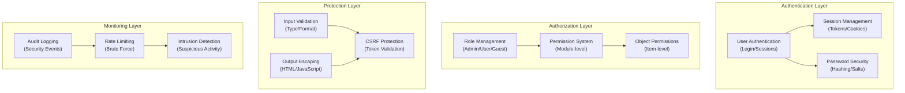

# ADR-004: Архітектура системи безпеки

> Комплексна архітектура безпеки для XOOPS CMS, що захищає від сучасних загроз.

---

## Статус

**Прийнято** - базовий рівень безпеки з XOOPS 2.5

---

## Контекст

### Постановка проблеми

XOOPS потребує надійної системи безпеки, яка:

1. **Захищає від типових веб-вразливостей** (OWASP Top 10)
2. **Забезпечує детальне керування дозволами** для всіх модулів
3. **Забезпечує безпечну автентифікацію користувача** за сучасними стандартами
4. **Запобігає витоку даних** і несанкціонованому доступу
5. **Підтримується багаторівневий контроль доступу** (адміністратор, модератор, користувач, гість)
6. **Бездоганно інтегрується з усіма модулями**

### Поточні загрози

Сучасні веб-атаки включають:

- **SQL Injection** - Зловмисний SQL у введенні користувачем
- **XSS (міжсайтовий сценарій)** - вставлено JavaScript на сторінки
- **CSRF (підробка міжсайтового запиту)** - Неавторизоване надсилання форм
- **Обхід автентифікації** - Слабка обробка session/password
- **Обхід авторизації** - Ескалація привілеїв
- **Викриття даних** - конфіденційні дані в URL-адресах, журналах або кеш-пам’яті

### XOOPS Вимоги безпеки

1. Аутентифікація користувача та керування сеансами
2. Контроль доступу на основі ролей (RBAC)
3. Система дозволів для модулів і об'єктів
4. Перевірка вхідних даних і екранування вихідних даних
5. Захист від типових атак
6. Журнал аудиту подій безпеки
7. Безпечна обробка паролів
8. Захист токенів CSRF

---

## Рішення

### Основна архітектура безпеки

---

## Компоненти безпеки

### 1. Система автентифікації

**Процес входу користувача:**
```php
<?php
// 1. Validate credentials
$user = $userHandler->findByLogin($username);
if (!$user || !password_verify($password, $user->getVar('pass'))) {
    throw new AuthenticationException('Invalid credentials');
}

// 2. Check if account is active
if (!$user->getVar('uactive')) {
    throw new AuthenticationException('Account inactive');
}

// 3. Create secure session
session_regenerate_id(true);
$_SESSION['uid'] = $user->getVar('uid');
$_SESSION['token'] = bin2hex(random_bytes(32));
$_SESSION['created'] = time();

// 4. Log the login
$this->auditLog('USER_LOGIN', $user->getVar('uid'));
```
**Захист паролем:**
```php
<?php
// Use password_hash (not MD5 or SHA1)
$hashed = password_hash($password, PASSWORD_BCRYPT, [
    'cost' => 12, // High cost = slow brute force
]);

// Verify password
if (!password_verify($inputPassword, $hashed)) {
    throw new Exception('Invalid password');
}

// Rehash if algorithm or cost changed
if (password_needs_rehash($hashed, PASSWORD_BCRYPT, ['cost' => 12])) {
    $newHash = password_hash($password, PASSWORD_BCRYPT, ['cost' => 12]);
    $user->setVar('pass', $newHash);
    $userHandler->insert($user);
}
```
### 2. Керування сеансами

**Безпечна обробка сеансу:**
```php
<?php
// Session configuration
ini_set('session.cookie_httponly', true);  // No JS access
ini_set('session.cookie_secure', true);     // HTTPS only
ini_set('session.cookie_samesite', 'Strict'); // CSRF protection
ini_set('session.gc_maxlifetime', 3600);   // 1 hour timeout
ini_set('session.sid_length', 64);         // 64-char session ID

// Validate session
function validateSession() {
    // Check timeout
    if (time() - $_SESSION['created'] > 3600) {
        session_destroy();
        throw new SessionExpiredException();
    }

    // Validate user agent (prevent session hijacking)
    if ($_SESSION['user_agent'] !== $_SERVER['HTTP_USER_AGENT']) {
        throw new SessionInvalidException();
    }

    // Validate IP (optional, can be too strict)
    if (!in_array($_SERVER['REMOTE_ADDR'], $_SESSION['ips'])) {
        $_SESSION['ips'][] = $_SERVER['REMOTE_ADDR'];
    }
}
```
### 3. Авторизація (RBAC)

**Контроль доступу на основі ролей:**
```php
<?php
class XoopsUser {
    public function hasPermission(string $permissionName): bool
    {
        // Get user groups
        $groups = $this->getGroups();

        // Check if any group has permission
        foreach ($groups as $groupId) {
            if ($this->checkGroupPermission($groupId, $permissionName)) {
                return true;
            }
        }

        return false;
    }

    /**
     * User groups and their permissions
     * Admin: Full access
     * Moderator: Content management
     * User: Create own content
     * Guest: Read-only access
     */
    private function checkGroupPermission(int $groupId, string $permission): bool
    {
        $permissions = [
            1 => ['admin_access'],                 // Admin group
            2 => ['moderate_content', 'edit_own'], // Moderator group
            3 => ['create_content', 'edit_own'],   // User group
            4 => [],                               // Guest group (no permissions)
        ];

        return in_array($permission, $permissions[$groupId] ?? []);
    }
}
```
### 4. Перевірка введених даних

**Запобігайте ін’єкції SQL і помилкам типу:**
```php
<?php
// Always use prepared statements
$sql = 'SELECT * FROM users WHERE id = ?';
$result = $db->query($sql, [$userId]); // ✅ Safe

// Input validation
function validateUserInput(array $data): array
{
    return [
        'email' => filter_var($data['email'] ?? '', FILTER_VALIDATE_EMAIL),
        'age' => filter_var($data['age'] ?? 0, FILTER_VALIDATE_INT),
        'website' => filter_var($data['website'] ?? '', FILTER_VALIDATE_URL),
        'title' => substr(trim($data['title'] ?? ''), 0, 255),
    ];
}

// XOOPS Safe Input class
$safe = \Xmf\Request::getHtmlRequest('var_name', '');
$int = \Xmf\Request::getInt('page', 1);
```
### 5. Екранування виводу

**Запобігайте атакам XSS:**
```php
<?php
// In PHP templates
echo htmlspecialchars($userInput, ENT_QUOTES, 'UTF-8');

// In Smarty templates (automatic escaping)
<{$user_input}>  {* Escaped by default *}
<{$html|escape:false}>  {* Only when needed *}

// JavaScript context
<script>
var message = "<{$userMessage|escape:'javascript'}>";
</script>

// URL context
<a href="<{$url|escape:'url'}>">Link</a>
```
### 6. CSRF Захист

**Запобігання підробці міжсайтових запитів:**
```php
<?php
// Generate CSRF token
session_start();
if (empty($_SESSION['csrf_token'])) {
    $_SESSION['csrf_token'] = bin2hex(random_bytes(32));
}

// In forms
<form method="POST">
    <input type="hidden" name="csrf_token" value="<{$csrf_token}>">
    <button type="submit">Submit</button>
</form>

// Validate token
if ($_SERVER['REQUEST_METHOD'] === 'POST') {
    if (hash_equals($_SESSION['csrf_token'], $_POST['csrf_token'] ?? '')) {
        // Process form
    } else {
        throw new InvalidTokenException('CSRF token invalid');
    }
}
```
---

## Наслідки

### Позитивні ефекти

1. **Комплексний захист** - охоплює основні класи вразливості
2. **Рівнева безпека** - кілька рівнів захисту
3. **Гнучкий RBAC** - детальний контроль дозволів
4. **Аудиторський слід** - відстежуйте події безпеки
5. **Промисловий стандарт** - відповідає рекомендаціям OWASP
6. **Інтеграція модулів** - модулі легко використовують API безпеки

### Негативні ефекти

1. **Складність** – потрібно більше коду та конфігурації
2. **Продуктивність** - хешування та перевірка додають додаткових витрат
3. **Взаємодія з користувачем** - Безпека іноді незручна
4. **Технічне обслуговування** – потребує постійних оновлень безпеки
5. **Потрібне навчання** – розробники повинні дотримуватися практики

### Ризики та пом'якшення

| Ризик | Тяжкість | Пом'якшення |
|------|----------|-----------|
| Розробник ігнорує безпеку | Високий | Огляд коду, навчання безпеки |
| Виявлено нові вразливості | Середній | Регулярні аудити безпеки, оновлення |
| Вплив на продуктивність | Низький | Оптимізація гарячих шляхів, кешування |
| Надто складні дозволи | Середній | Чітка документація, приклади |

---

## Найкращі методи безпеки

### Для розробників модулів
```php
<?php
// ✅ DO: Use prepared statements
$result = $db->prepare('SELECT * FROM table WHERE id = ?')->execute([$id]);

// ❌ DON'T: Concatenate queries
$result = $db->query("SELECT * FROM table WHERE id = $id");

// ✅ DO: Escape output
echo htmlspecialchars($user_input, ENT_QUOTES, 'UTF-8');

// ❌ DON'T: Output raw user data
echo $user_input;

// ✅ DO: Check permissions
if (!$user->hasPermission('edit_content')) {
    throw new PermissionException();
}

// ❌ DON'T: Trust user roles directly
if ($_POST['is_admin']) {
    // Make user admin - SECURITY HOLE!
}

// ✅ DO: Validate input types
$page = (int)$_GET['page'];

// ❌ DON'T: Use untrusted values directly
$sql .= " LIMIT " . $_GET['limit'];
```
---

## Розглянуті альтернативи

### OAuth/OpenID Connect

**Чому не вибрано спочатку:** Занадто складний для спільного хостингового середовища, але хороший для майбутньої інтеграції із зовнішніми системами авторизації.

### Двофакторна автентифікація (2FA)

**Статус:** Прийнято як розширення, а не як основну вимогу, див. ADR-006

### Сеансові файли cookie лише HTTP

**Статус:** Реалізовано - забороняє доступ JavaScript до даних сеансу

---

## Пов'язані рішення

- ADR-001: Модульна архітектура - Модулі забезпечують безпеку
- ADR-005: Система дозволів модуля
- ADR-006: двофакторна автентифікація (майбутнє)

---

## Посилання

### Стандарти безпеки

- [10 найкращих OWASP] (https://owasp.org/www-project-top-ten/)
- [NIST Cybersecurity Framework] (https://www.nist.gov/cyberframework)
- [CWE Топ 25](https://cwe.mitre.org/top25/)

### PHP Безпека

- [PHP Керівництво з безпеки](https://www.php.net/manual/en/security.php)
- [Документація password_hash()](https://www.php.net/manual/en/function.password-hash.php)
- [Безпека сеансу] (https://www.php.net/manual/en/session.security.php)

### Інструменти

- [OWASP ZAP](https://www.zaproxy.org/) - Тестування безпеки
- [Snyk](https://snyk.io/) - Сканування вразливостей
- [SonarQube](https://www.sonarqube.org/) - Якість коду

---

## Контрольний список впровадження

- [ ] Система аутентифікації користувачів
- [ ] Керування сеансами
- [ ] Хешування пароля (bcrypt)
- [ ] Контроль доступу на основі ролей
- [ ] Дозволи модуля
- [ ] Структура перевірки вхідних даних
- [ ] Екранування виводу (PHP + Smarty)
- [ ] Захист токенів CSRF
- [ ] Журнал аудиту безпеки
- [ ] Обмеження швидкості
- [ ] Заголовки безпеки

---

## Історія версій

| Версія | Дата | Зміни |
|---------|------|---------|
| 1.0.0 | 2024-01-28 | Вихідний документ |

---

#xoops #adr #security #architecture #authentication #authorization #rbac