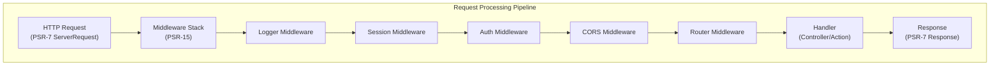

# ADR-005: шаблон проміжного програмного забезпечення PSR-15 для XOOPS 4.0

> Використовуйте обробники запитів HTTP-сервера PSR-15 (проміжне програмне забезпечення) для покращеного конвеєра обробки запитів.

:::обережно[XOOPS Пропозиція 4.0 — Недоступно в 2.5.x]
Цей ADR описує **пропоновану архітектуру для XOOPS 4.0**. Проміжне програмне забезпечення PSR-15 **недоступне в XOOPS 2.5.x**. Поточні модулі 2.5.x використовують шаблон Page Controller із системою завантаження `mainfile.php`. Перегляньте архітектуру XOOPS для поточного життєвого циклу запиту.
:::

---

## Статус

**Пропонується** - Оцінюється для випуску XOOPS 4.0

---

## Контекст

### Поточний підхід

XOOPS 2.5 використовує монолітний підхід обробки запитів:
```php
// Current: Sequential processing
require_once 'mainfile.php';
// → Kernel initialization
// → User authentication
// → Module loading
// → Page rendering

// All in one flow, mixed concerns
```
### Проблеми з поточним підходом

1. **Змішані проблеми** – автентифікація, журналювання, маршрутизація – все взаємопов’язане
2. **Важко перевірити** – Важко піддати модульному тесту окремі етапи обробки запиту
3. **Важко розширити** - модулі можуть підключитися лише через preload/events
4. **Погане розділення** – логіка обробки запитів розкидана по кодовій базі
5. **Не можна складати** – неможливо легко об’єднати або змінити порядок кроків обробки

### Що таке проміжне програмне забезпечення PSR-15?

PSR-15 defines a standard interface for HTTP middleware:
```php
<?php
interface RequestHandlerInterface {
    public function handle(ServerRequestInterface $request): ResponseInterface;
}

interface MiddlewareInterface {
    public function process(
        ServerRequestInterface $request,
        RequestHandlerInterface $handler
    ): ResponseInterface;
}
```
**Мережа проміжного програмного забезпечення:**
```
Request
  ↓
[Logger] → logs request
  ↓
[Auth] → validates user session
  ↓
[CORS] → checks cross-origin
  ↓
[Router] → dispatches to handler
  ↓
[Handler] → generates response
  ↓
Response
```
---

## Рішення

### Прийняти стек проміжного програмного забезпечення PSR-15 для XOOPS 4.0

Впровадити конвеєр обробки запитів на основі проміжного ПЗ відповідно до стандарту PSR-15.

### Огляд архітектури

### Основні компоненти проміжного програмного забезпечення

#### 1. Проміжне ПЗ (основний рівень)
```php
<?php
declare(strict_types=1);

namespace XoopsCore;

use Psr\Http\Message\ResponseInterface;
use Psr\Http\Message\ServerRequestInterface;
use Psr\Http\Server\MiddlewareInterface;
use Psr\Http\Server\RequestHandlerInterface;

class SessionMiddleware implements MiddlewareInterface
{
    public function process(
        ServerRequestInterface $request,
        RequestHandlerInterface $handler
    ): ResponseInterface {
        // 1. Retrieve session (or start new)
        $sessionId = $request->getCookieParams()['PHPSESSID'] ?? null;
        $session = $this->sessionManager->load($sessionId);

        // 2. Attach session to request
        $request = $request->withAttribute('session', $session);

        // 3. Pass to next middleware
        $response = $handler->handle($request);

        // 4. Set session cookie if needed
        if ($session->isModified()) {
            $response = $response->withAddedHeader(
                'Set-Cookie',
                'PHPSESSID=' . $session->getId() . '; HttpOnly; SameSite=Strict'
            );
        }

        return $response;
    }
}
```
#### 2. Проміжне програмне забезпечення автентифікації
```php
<?php
class AuthMiddleware implements MiddlewareInterface
{
    public function process(
        ServerRequestInterface $request,
        RequestHandlerInterface $handler
    ): ResponseInterface {
        // Get session from previous middleware
        $session = $request->getAttribute('session');

        // Authenticate user from session
        $user = $this->authenticate($session);

        // Attach user to request
        $request = $request->withAttribute('user', $user);

        return $handler->handle($request);
    }

    private function authenticate(?Session $session): User
    {
        if ($session && $session->has('uid')) {
            return $this->userRepository->findById($session->get('uid'));
        }

        return new AnonymousUser();
    }
}
```
#### 3. Проміжне програмне забезпечення авторизації
```php
<?php
class AuthorizationMiddleware implements MiddlewareInterface
{
    public function __construct(private AuthorizationChecker $checker)
    {
    }

    public function process(
        ServerRequestInterface $request,
        RequestHandlerInterface $handler
    ): ResponseInterface {
        $user = $request->getAttribute('user');
        $route = $request->getAttribute('route');

        // Check if user has permission for this route
        if (!$this->checker->isGranted($user, $route)) {
            return new JsonResponse(
                ['error' => 'Unauthorized'],
                403
            );
        }

        return $handler->handle($request);
    }
}
```
#### 4. Проміжне програмне забезпечення модуля
```php
<?php
// Modules can provide their own middleware
class PublisherAccessMiddleware implements MiddlewareInterface
{
    public function process(
        ServerRequestInterface $request,
        RequestHandlerInterface $handler
    ): ResponseInterface {
        $user = $request->getAttribute('user');

        // Module-specific access control
        if (!$user->hasPermission('publisher_view')) {
            return new HtmlResponse('Access denied', 403);
        }

        return $handler->handle($request);
    }
}
```
### Приклад реалізації
```php
<?php
// bootstrap.php - Application setup

use Psr\Http\Message\ServerRequestInterface;
use Psr\Http\Server\RequestHandlerInterface;
use Xoops\Core\Middleware\{
    LoggerMiddleware,
    SessionMiddleware,
    AuthMiddleware,
    CorsMiddleware,
    ErrorHandlingMiddleware
};

// Create middleware pipeline
$middlewareStack = [
    // 1. Error handling (outermost)
    new ErrorHandlingMiddleware(),

    // 2. Logging
    new LoggerMiddleware($logger),

    // 3. CORS handling
    new CorsMiddleware($corsConfig),

    // 4. Session management
    new SessionMiddleware($sessionManager),

    // 5. Authentication
    new AuthMiddleware($userRepository),

    // 6. Authorization
    new AuthorizationMiddleware($authChecker),

    // 7. Routing and dispatching
    new RoutingMiddleware($router),

    // 8. Module middleware (dynamic)
    ...$this->loadModuleMiddleware(),
];

// Process request through middleware stack
$request = ServerRequestFactory::fromGlobals();
$dispatcher = new MiddlewareDispatcher($middlewareStack);
$response = $dispatcher->dispatch($request);

// Send response
http_response_code($response->getStatusCode());
foreach ($response->getHeaders() as $name => $values) {
    foreach ($values as $value) {
        header("$name: $value", false);
    }
}
echo $response->getBody();
```
### Інтеграція модуля

Модулі можуть надавати проміжне ПЗ:
```php
<?php
// Publisher module - xoops_version.php

$modversion['middleware'] = [
    'PublisherAccessMiddleware' => true,      // Auto-load
    'PublisherLogMiddleware' => true,
];

// Or custom:
$modversion['middleware_factory'] = function() {
    return [
        new PublisherCacheMiddleware(),
        new PublisherPermissionMiddleware(),
    ];
};
```
---

## Наслідки

### Позитивні ефекти

1. **Поділ завдань** - кожне проміжне програмне забезпечення несе одну відповідальність
2. **Можливість до тестування** – легке модульне тестування окремих компонентів проміжного програмного забезпечення
3. **Компонування** - проміжне програмне забезпечення можна змішувати та змінювати порядок
4. **Сумісність зі стандартами** - використовує стандарти PSR-15 і PSR-7
5. **Розширюваність** - Модулі можуть легко додавати спеціальне проміжне програмне забезпечення
6. **Налагодження** - очищення потоку запитів через конвеєр
7. **Продуктивність** - може оптимізувати певні рівні проміжного програмного забезпечення
8. **Сумісність** - можна використовувати стороннє проміжне програмне забезпечення PSR-15

### Негативні ефекти

1. **Крива навчання** - розробники повинні розуміти PSR-15
2. **Накладні витрати на продуктивність** - більше викликів функцій у конвеєрі
3. **Складність** – більше рухомих частин, ніж монолітний підхід
4. **Зусилля з міграції** - вимагає рефакторингу існуючого коду
5. **Залежності** – потрібна бібліотека HTTP PSR-7

### Ризики та пом'якшення

| Ризик | Тяжкість | Пом'якшення |
|------|----------|-----------|
| Складні ланцюжки проміжного програмного забезпечення | Середній | Чітка документація, приклади |
| Зниження продуктивності | Середній | Тест, оптимізація гарячих шляхів |
| Зловживання розробником | Середній | Огляд коду, посібник із найкращих практик |
| Зміни порушення міграції | Високий | Термін амортизації, помічники |
| Питання замовлення проміжного ПЗ | Середній | Очистити графік залежностей |

---

## План реалізації

### Фаза 1: Основа (Q2 2026)

- [ ] Реалізація оболонки HTTP-повідомлення PSR-7
- [ ] Створити MiddlewareDispatcher
- [ ] Реалізація основного проміжного програмного забезпечення (сеанс, авторизація)
- [ ] Оновити ядро для використання проміжного ПЗ

### Фаза 2: Інтеграція (Q3 2026)

- [ ] Перенесення наявних функцій на проміжне ПЗ
- [ ] Додати підтримку проміжного програмного забезпечення модуля
- [ ] Створення утиліт тестування проміжного ПЗ
- [ ] Напишіть вичерпну документацію

### Етап 3: міграція (Q4 2026)

- [ ] Надати рівень сумісності для старого коду
- [ ] Довідкові модулі оновлюються до нового проміжного ПЗ
- [ ] Оптимізація продуктивності
- [ ] Аудит безпеки

### Фаза 4: Випуск (Q1 2027)

- [] XOOPS 4.0 випуск із проміжним програмним забезпеченням
- [ ] Застаріла система preload/hook
- [ ] Відгуки та оновлення спільноти

---

## Критерії успіху

- [ ] Усі основні функції перенесено на проміжне програмне забезпечення
- [ ] 90%+ тестове покриття для проміжного ПЗ
- [ ] Документація з прикладами
- [ ] Продуктивність на 10% від попередньої версії
- [ ] Модулі успішно використовують нову систему проміжного програмного забезпечення
- [ ] Рівень прийняття спільнотою >80%

---

## Практичні поради проміжного програмного забезпечення

### Роби

- Зберігайте фокус на проміжному програмному забезпеченні (одна відповідальність)
- Використовуйте незмінність (створіть новий request/response)
- Витончено поводьтеся з помилками
- Залежності документів
- Додайте підказки щодо типу
- Написати тести для проміжного ПЗ
- Використовуйте стандартні інтерфейси PSR-15

### Не треба

- Не змінюйте спільні об'єкти request/response
- Не звертайтеся безпосередньо до глобалів
- Не створюйте залежності від порядку проміжного ПЗ
- Не ловіть усі винятки
- Не змішуйте бізнес-логіку з проміжним програмним забезпеченням
- Не змушуйте проміжне ПЗ робити занадто багато

---

## Приклади

### Спеціальне проміжне програмне забезпечення
```php
<?php
// Example: Rate limiting middleware

use Psr\Http\Message\ResponseInterface;
use Psr\Http\Message\ServerRequestInterface;
use Psr\Http\Server\MiddlewareInterface;
use Psr\Http\Server\RequestHandlerInterface;

class RateLimitMiddleware implements MiddlewareInterface
{
    public function __construct(
        private RateLimiter $limiter,
        private int $limit = 100,
        private int $window = 3600
    ) {
    }

    public function process(
        ServerRequestInterface $request,
        RequestHandlerInterface $handler
    ): ResponseInterface {
        $user = $request->getAttribute('user');
        $identifier = $user->getId() ?? $request->getClientIp();

        // Check rate limit
        $remaining = $this->limiter->check($identifier, $this->limit, $this->window);

        if ($remaining < 0) {
            return new JsonResponse(
                ['error' => 'Rate limit exceeded'],
                429
            );
        }

        // Add rate limit headers
        $response = $handler->handle($request);
        return $response
            ->withAddedHeader('X-RateLimit-Limit', (string)$this->limit)
            ->withAddedHeader('X-RateLimit-Remaining', (string)$remaining);
    }
}
```
---

## Пов'язані рішення

- ADR-001: Модульна архітектура - основа
- ADR-004: система безпеки - використовує проміжне програмне забезпечення для авторизації
- ADR-006: двофакторна авторизація - може бути проміжним програмним забезпеченням

---

## Посилання

### Стандарти PSR

- [PSR-7: інтерфейс повідомлень HTTP](https://www.php-fig.org/psr/psr-7/)
- [PSR-15: Обробники запитів HTTP-сервера](https://www.php-fig.org/psr/psr-15/)

### Фреймворки проміжного програмного забезпечення

- [Slim Framework] (https://www.slimframework.com/) - Приклади проміжного ПЗ
- [Zend Expressive] (https://docs.zendframework.com/zend-expressive/) - фреймворк PSR-15
- [Guzzle](https://docs.guzzlephp.org/) - проміжне програмне забезпечення клієнта HTTP

### Інструменти

- [RelayPHP](https://relayphp.com/) - Бібліотека проміжного програмного забезпечення
- [PSR-15 Middleware] (https://github.com/middlewares) - Колекція проміжного програмного забезпечення

---

## Історія версій

| Версія | Дата | Зміни |
|---------|------|---------|
| 1.0.0 | 2024-01-28 | Початкова пропозиція |

---

#xoops #adr #psr-15 #middleware #architecture #psr-7