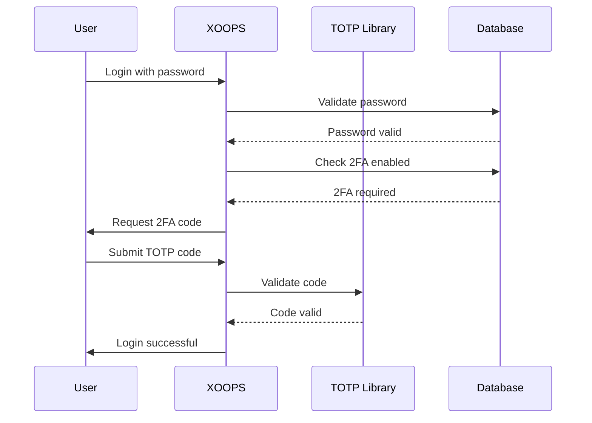

## Статус

Запропоновано

## Контекст

XOOPS потребує посиленого захисту для автентифікації користувача. Двофакторна автентифікація (2FA) забезпечує додатковий рівень безпеки, крім паролів, захищаючи облікові записи, навіть якщо паролі зламано.

Ключові міркування:
— Зворотна сумісність із існуючою автентифікацією
— Підтримка кількох методів 2FA
- Взаємодія з користувачем під час налаштування та входу
- Механізми відновлення втрачених пристроїв
- Інтеграція з існуючою системою дозволів

## Рішення

Ми запровадимо TOTP (Time-based One-Time Password) як основний метод 2FA із підтримкою резервних кодів.

### Підхід до впровадження

### Схема бази даних
```sql
CREATE TABLE `{PREFIX}_users_2fa` (
    `user_id` INT(11) NOT NULL,
    `secret` VARCHAR(32) NOT NULL,
    `enabled` TINYINT(1) DEFAULT 0,
    `backup_codes` TEXT,
    `last_used` INT(11),
    `created` INT(11) NOT NULL,
    PRIMARY KEY (`user_id`),
    FOREIGN KEY (`user_id`) REFERENCES `{PREFIX}_users`(`uid`)
);
```
### Сервісний інтерфейс
```php
interface TwoFactorAuthInterface
{
    public function enable(int $userId): TwoFactorSetup;
    public function disable(int $userId): void;
    public function verify(int $userId, string $code): bool;
    public function generateBackupCodes(int $userId): array;
    public function isEnabled(int $userId): bool;
}
```
### Інтеграція проміжного ПЗ
```php
class TwoFactorMiddleware implements MiddlewareInterface
{
    public function process(
        ServerRequestInterface $request,
        RequestHandlerInterface $handler
    ): ResponseInterface {
        $session = $request->getAttribute('session');

        if ($session->has('pending_2fa_user_id')) {
            // User needs to complete 2FA
            if ($this->isVerificationRequest($request)) {
                return $handler->handle($request);
            }
            return new RedirectResponse('/2fa/verify');
        }

        return $handler->handle($request);
    }
}
```
## Наслідки

### Позитивно

— Значно покращено захист облікового запису
- Сумісність із галузевим стандартом TOTP (Google Authenticator, Authy тощо)
- Резервні коди запобігають блокуванню облікового запису
- Необов'язковий для кожного користувача - не вимагає примусового прийняття
- Проміжне програмне забезпечення PSR-15 забезпечує чисту інтеграцію

### Негативний

- Додатковий крок входу впливає на взаємодію з користувачем
- Користувачі повинні керувати програмами автентифікації
- Втрачені пристрої потребують процесу відновлення
- Додаткове зберігання бази даних і запити
- Потрібна залежність криптографічної бібліотеки

### Шлях міграції

1. Додайте таблицю бази даних для даних 2FA
2. Впровадити службу TOTP із залежністю від бібліотеки
3. Додайте проміжне програмне забезпечення до ланцюжка автентифікації
4. Створіть інтерфейс налаштування та перевірки
5. Параметр адміністратора вимагати 2FA для певних груп

## Розглянуті альтернативи

### OTP на основі SMS

Відхилено через:
— Уразливості під час заміни SIM-карти
- Вартість SMS-шлюзу
- Складність перевірки номера телефону
- Проблеми конфіденційності

### Апаратні ключі безпеки (WebAuthn)

Відкладено для майбутніх ADR:
- Більш складна реалізація
- Історично обмежена підтримка браузера
- Вища вартість користувача
- Можна додати разом із TOTP пізніше

### OTP на основі електронної пошти

Відхилено через:
- Злом облікового запису електронної пошти перешкоджає меті
- Затримки доставки впливають на UX
- Проблеми з фільтром спаму

## Посилання

- [RFC 6238 - TOTP](https://tools.ietf.org/html/rfc6238)
- [Формат ключа Google Authenticator] (https://github.com/google/google-authenticator/wiki/Key-Uri-Format)
- ../../02-Core-Concepts/Security/Security-Best-Practices - Правила безпеки
- ../../02-Core-Concepts/Users-Permissions/Authentication - Документація системи авторизації