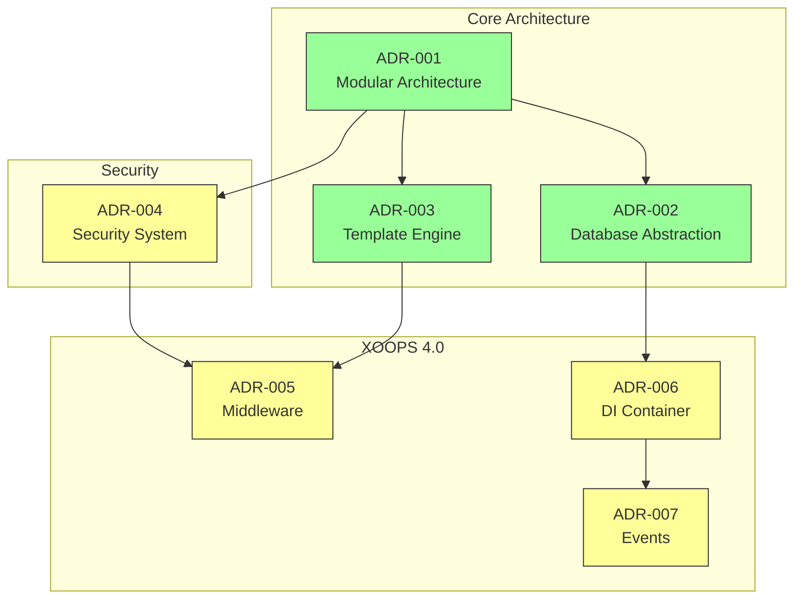
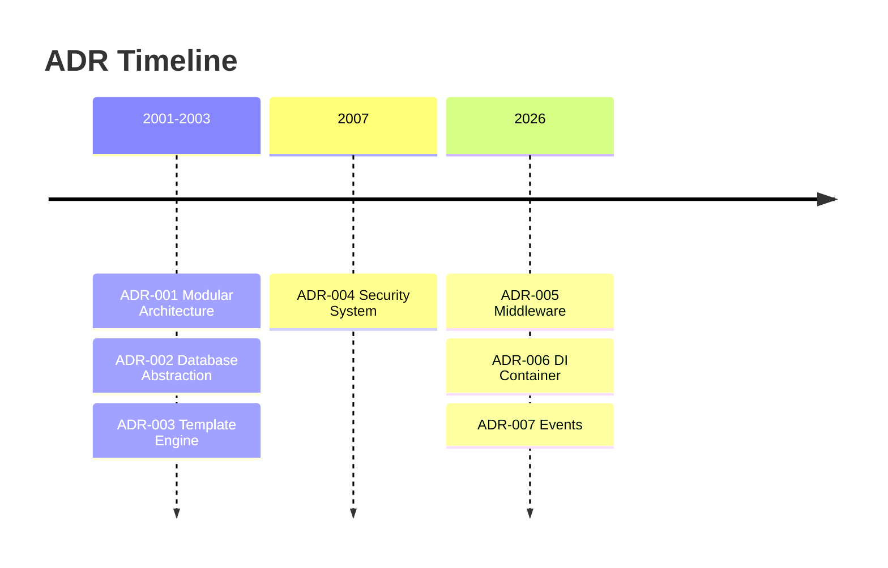

# 📋 Індекс записів архітектурних рішень

> Вичерпний покажчик архітектурних рішень, які сформували XOOPS CMS.

---

## Що таке ADR?

Записи архітектурних рішень (ADR) документують важливі архітектурні рішення, прийняті під час розробки XOOPS. Вони фіксують контекст, рішення та наслідки кожного вибору, надаючи цінний історичний контекст для супроводжувачів і учасників.

---

## Легенда статусу ADR

| Статус | Значення |
|--------|---------|
| **Пропонується** | Обговорюється, ще не прийнято |
| **Прийнято** | Рішення прийнято |
| **Застаріло** | Більше не рекомендується |
| **Замінено** | Замінено іншою ADR |

---

## Поточні ADR

### Основоположні рішення

| ADR | Назва | Статус | Вплив |
|-----|-------|--------|--------|
| ADR-001 | Модульна архітектура | Прийнято | Ядро |
| ADR-002 | Об'єктно-орієнтований доступ до бази даних | Прийнято | Ядро |
| ADR-003 | Smarty Механізм шаблонів | Прийнято | Ядро |

### Заплановані побічні реакції (XOOPS 4.0)

| ADR | Назва | Статус | Вплив |
|-----|-------|--------|--------|
| ADR-004 | Проектування систем безпеки | Запропонований | Безпека |
| ADR-005 | PSR-15 Проміжне програмне забезпечення | Запропонований | Архітектура |
| ADR-006 | Контейнер ін’єкції залежностей | Запропонований | Архітектура |
| ADR-007 | Редизайн системи подій | Запропонований | Архітектура |

---

## ADR відносини

---

## Хронологія

---

## Створення нових ADR

При пропозиції нового архітектурного рішення:

1. Скопіюйте шаблон ADR
2. Заповніть усі розділи
3. Надішліть як Pull Request
4. Обговорення в GitHub Проблеми
5. Оновіть статус після прийняття рішення

### Структура шаблону ADR
```markdown
# ADR-XXX: Title

## Status
Proposed | Accepted | Deprecated | Superseded

## Context
What is the issue motivating this decision?

## Decision
What is the change that we're proposing?

## Consequences
What becomes easier or harder as a result?

## Alternatives Considered
What other options were evaluated?
```
---

## 🔗 Пов’язана документація

- Основні концепції
- Інструкції щодо внесення
- XOOPS 4.0 Дорожня карта

---

#xoops #adr #architecture #index #decisions