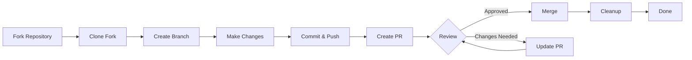

> Цей посібник проведе вас через повний процес внеску в XOOPS, від початкового налаштування до об’єднаного запиту на отримання.

---

## Передумови

Перш ніж почати робити внески, переконайтеся, що у вас є:

- **Git** встановлено та налаштовано
- **GitHub акаунт** (безкоштовно)
- **PHP 7.4+** для розробки XOOPS
- **Composer** для керування залежностями
- Базові знання робочих процесів Git
- Знайомство з Кодексом поведінки

---

## Крок 1: форк репозиторію

### У веб-інтерфейсі GitHub

1. Перейдіть до репозиторію (наприклад, `XOOPS/XoopsCore27`)
2. Натисніть кнопку **Fork** у верхньому правому куті
3. Виберіть місце форку (ваш особистий рахунок)
4. Зачекайте, поки розгалуження завершиться

### Чому Fork?

- Ви отримуєте власну копію для роботи
- Обслуговувачам не потрібно керувати багатьма філіями
- Ви маєте повний контроль над своєю виделкою
- Pull Requests посилаються на ваш форк і вищестояще репо

---

## Крок 2: клонуйте свій форк локально
```bash
# Clone your fork (replace YOUR_USERNAME)
git clone https://github.com/YOUR_USERNAME/XoopsCore27.git
cd XoopsCore27

# Add upstream remote to track original repository
git remote add upstream https://github.com/XOOPS/XoopsCore27.git

# Verify remotes are set correctly
git remote -v
# origin    https://github.com/YOUR_USERNAME/XoopsCore27.git (fetch)
# origin    https://github.com/YOUR_USERNAME/XoopsCore27.git (push)
# upstream  https://github.com/XOOPS/XoopsCore27.git (fetch)
# upstream  https://github.com/XOOPS/XoopsCore27.git (nofetch)
```
---

## Крок 3: Налаштуйте середовище розробки

### Встановити залежності
```bash
# Install Composer dependencies
composer install

# Install development dependencies
composer install --dev

# For module development
cd modules/mymodule
composer install
```
### Налаштувати Git
```bash
# Set your Git identity
git config user.name "Your Name"
git config user.email "your.email@example.com"

# Optional: Set global Git config
git config --global user.name "Your Name"
git config --global user.email "your.email@example.com"
```
### Виконайте тести
```bash
# Make sure tests pass in clean state
./vendor/bin/phpunit

# Run specific test suite
./vendor/bin/phpunit --testsuite unit
```
---

## Крок 4: Створіть гілку функції

### Угода про іменування гілок

Дотримуйтеся цього шаблону: `<type>/<description>`

**Типи:**
- `feature/` - Нова функція
- `fix/` - Виправлено помилку
- `docs/` - Лише документація
- `refactor/` - Рефакторинг коду
- `test/` - Тестові доповнення
- `chore/` - Технічне обслуговування, інструменти

**Приклади:**
```bash
# Feature branch
git checkout -b feature/add-two-factor-auth

# Bug fix branch
git checkout -b fix/prevent-xss-in-forms

# Documentation branch
git checkout -b docs/update-api-guide

# Always branch from upstream/main (or develop)
git checkout -b feature/my-feature upstream/main
```
### Підтримуйте філію в актуальному стані
```bash
# Before you start work, sync with upstream
git fetch upstream
git merge upstream/main

# Later, if upstream has changed
git fetch upstream
git rebase upstream/main
```
---

## Крок 5: Внесіть зміни

### Практики розробки

1. **Напишіть код** відповідно до стандартів PHP
2. **Напишіть тести** для нових функцій
3. **Оновіть документацію**, якщо потрібно
4. **Запустіть лінтери** та засоби форматування коду

### Перевірка якості коду
```bash
# Run all tests
./vendor/bin/phpunit

# Run with coverage
./vendor/bin/phpunit --coverage-html coverage/

# Run PHP CS Fixer
./vendor/bin/php-cs-fixer fix --dry-run

# Run PHPStan static analysis
./vendor/bin/phpstan analyse class/ src/
```
### Внесіть хороші зміни
```bash
# Check what you changed
git status
git diff

# Stage specific files
git add class/MyClass.php
git add tests/MyClassTest.php

# Or stage all changes
git add .

# Commit with descriptive message
git commit -m "feat(auth): add two-factor authentication support"
```
---

## Крок 6: синхронізуйте гілку

Під час роботи над вашою функцією основна гілка може просуватися:
```bash
# Fetch latest changes from upstream
git fetch upstream

# Option A: Rebase (preferred for clean history)
git rebase upstream/main

# Option B: Merge (simpler but adds merge commits)
git merge upstream/main

# If conflicts occur, resolve them then:
git add .
git rebase --continue  # or git merge --continue
```
---

## Крок 7: натисніть на вилку
```bash
# Push your branch to your fork
git push origin feature/my-feature

# On subsequent pushes
git push

# If you rebased, you might need force push (use carefully!)
git push --force-with-lease origin feature/my-feature
```
---

## Крок 8: Створіть запит на отримання

### У веб-інтерфейсі GitHub

1. Перейдіть до розгалуження на GitHub
2. Ви побачите сповіщення про створення PR з вашої філії
3. Натисніть **"Порівняти та отримати запит"**
4. Або вручну натисніть **"Новий запит на отримання"** та виберіть свою гілку

### PR Назва та опис

**Формат назви:**
```
<type>(<scope>): <subject>
```
приклади:
```
feat(auth): add two-factor authentication
fix(forms): prevent XSS in text input
docs: update installation guide
refactor(core): improve performance
```
**Шаблон опису:**
```markdown
## Description
Brief explanation of what this PR does.

## Changes
- Changed X from A to B
- Added feature Y
- Fixed bug Z

## Type of Change
- [ ] New feature (adds new functionality)
- [ ] Bug fix (fixes an issue)
- [ ] Breaking change (API/behavior change)
- [ ] Documentation update

## Testing
- [ ] Added tests for new functionality
- [ ] All existing tests pass
- [ ] Manual testing performed

## Screenshots (if applicable)
Include before/after screenshots for UI changes.

## Related Issues
Closes #123
Related to #456

## Checklist
- [ ] Code follows style guidelines
- [ ] Self-reviewed own code
- [ ] Commented complex code
- [ ] Updated documentation
- [ ] No new warnings generated
- [ ] Tests pass locally
```
### Контрольний список PR огляду

Перед подачею переконайтеся, що:

- [ ] Код відповідає стандартам PHP
- [ ] Тести включені та успішні
- [ ] Оновлення документації (за потреби)
- [ ] Немає конфліктів злиття
- [ ] Повідомлення про фіксацію зрозумілі
- [ ] Посилання на пов’язані питання
- [ ] Детальний опис PR
- [ ] Немає коду налагодження або журналів консолі

---

## Крок 9: Відповідь на відгук

### Під час перевірки коду

1. **Уважно читайте коментарі** - Розумійте відгуки
2. **Ставте запитання** - якщо незрозуміло, попросіть роз’яснення
3. **Обговоріть альтернативи** - Шанобливо обговоріть підходи
4. **Внесіть потрібні зміни** - Оновіть свою гілку
5. **Примусове надсилання оновлених комітів** - якщо переписується історія
```bash
# Make changes
git add .
git commit --amend  # Modify last commit
git push --force-with-lease origin feature/my-feature

# Or add new commits
git commit -m "Address feedback on PR review"
git push origin feature/my-feature
```
### Очікуйте ітерацію

- Більшість PR вимагають кількох раундів перевірки
- Будьте терплячі та конструктивні
- Розглядайте відгук як можливість навчання
- Супроводжувачі можуть запропонувати рефактори

---

## Крок 10: Об’єднання та очищення

### Після затвердження

Після того, як супроводжувачі затвердять і об’єднають:

1. **GitHub автоматично зливає** або супроводжуючий натискає об’єднання
2. **Ваша гілка видалена** (зазвичай автоматично)
3. **Зміни вгорі**

### Локальна очистка
```bash
# Switch to main branch
git checkout main

# Update main with merged changes
git fetch upstream
git merge upstream/main

# Delete local feature branch
git branch -d feature/my-feature

# Delete from your fork (if not auto-deleted)
git push origin --delete feature/my-feature
```
---

## Схема робочого процесу

---

## Поширені сценарії

### Синхронізація перед початком
```bash
# Always start fresh
git fetch upstream
git checkout -b feature/new-thing upstream/main
```
### Додавання додаткових комітів
```bash
# Just push again
git add .
git commit -m "feat: additional changes"
git push origin feature/new-thing
```
### Виправлення помилок
```bash
# Last commit has wrong message
git commit --amend -m "Correct message"
git push --force-with-lease

# Revert to previous state (careful!)
git reset --soft HEAD~1  # Keep changes
git reset --hard HEAD~1  # Discard changes
```
### Обробка конфліктів злиття
```bash
# Rebase and resolve conflicts
git fetch upstream
git rebase upstream/main

# Edit conflicted files to resolve
# Then continue
git add .
git rebase --continue
git push --force-with-lease
```
---

## Найкращі практики

### Роби

- Тримайте філії зосередженими на окремих питаннях
- Робіть невеликі логічні зобов'язання
- Напишіть описові повідомлення комітів
- Часто оновлюйте свою гілку
- Перевірте перед натисканням
- Зміни в документі
- Будьте чуйними до відгуків

### Не треба

- Працюйте безпосередньо на гілці main/master
- Змішайте непов'язані зміни в одному PR
- Зафіксуйте згенеровані файли або node_modules
- Примусовий push після того, як PR стане публічним (використовуйте --force-with-lease)
- Ігноруйте відгуки про перевірку коду
- Створіть величезні PR (розбийте на більш дрібні)
- Передача конфіденційних даних (ключі API, паролі)

---

## Поради для успіху

### Спілкуйся

- Ставте запитання у випусках перед початком роботи
- Попросіть вказівок щодо складних змін
- Обговоріть підхід в описі PR
- Швидко реагуйте на відгуки

### Дотримуйтеся стандартів

- Перегляньте стандарти PHP
- Перевірте вказівки щодо звітування про проблеми
- Прочитайте огляд вкладу
- Дотримуйтеся вказівок щодо запитів на вилучення

### Вивчіть кодову базу

- Читайте існуючі шаблони коду
- Вивчіть подібні реалізації
- Розуміти архітектуру
- Перевірте основні поняття

---

## Пов'язана документація

- Кодекс поведінки
- Інструкції щодо запиту на отримання
- Звіт про проблему
- Стандарти кодування PHP
- Огляд внеску

---

#xoops #git #github #contributing #workflow #pull-request