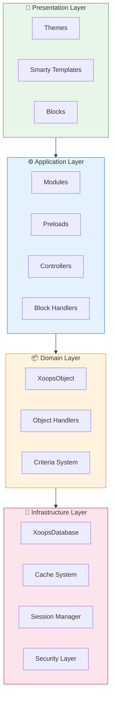
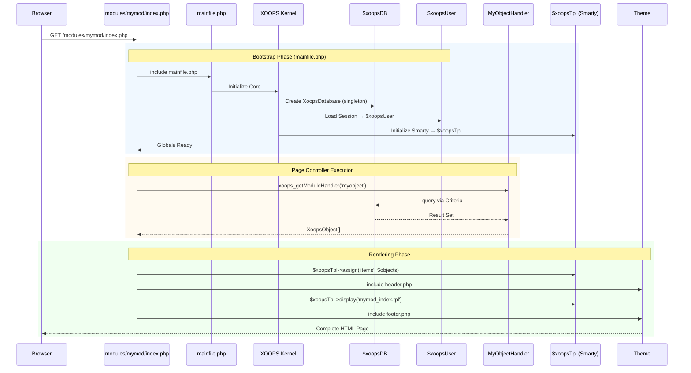

:::note[Про цей документ]
На цій сторінці описано **концептуальну архітектуру** XOOPS, яка застосовується як до поточної (2.5.x), так і до майбутніх (4.0.x) версій. Деякі діаграми демонструють багатошарове бачення дизайну.

**Щоб дізнатися про конкретну версію:**
- **XOOPS 2.5.x сьогодні:** використовує `mainfile.php`, глобальні (`$xoopsDB`, `$xoopsUser`), попередні завантаження та шаблон обробки
- **XOOPS 4.0 Target:** PSR-15 проміжне програмне забезпечення, контейнер DI, маршрутизатор - див. [Дорожню карту](../../07-XOOPS-4.0/XOOPS-4.0-Roadmap.md)
:::

Цей документ містить вичерпний огляд архітектури системи XOOPS, пояснюючи, як різні компоненти працюють разом для створення гнучкої та розширюваної системи керування вмістом.

## Огляд

XOOPS має модульну архітектуру, яка розділяє завдання на окремі рівні. Система побудована на кількох основних принципах:

- **Модульність**: функціональність організована в незалежні модулі, які можна встановити
- **Розширюваність**: систему можна розширити без зміни коду ядра
- **Абстракція**: рівні бази даних і презентації абстрагуються від бізнес-логіки
- **Безпека**: вбудовані механізми безпеки захищають від поширених вразливостей

## Системні рівні

### 1. Рівень презентації

Презентаційний рівень обробляє візуалізацію інтерфейсу користувача за допомогою механізму шаблонів Smarty.

**Ключові компоненти:**
- **Теми**: візуальний стиль і макет
- **Smarty Templates**: динамічне відтворення вмісту
- **Блоки**: багаторазові віджети вмісту

### 2. Прикладний рівень

Прикладний рівень містить бізнес-логіку, контролери та функціональність модулів.

**Ключові компоненти:**
- **Модулі**: автономні функціональні пакети
- **Обробники**: класи обробки даних
- **Попереднє завантаження**: слухачі подій і перехоплювачі

### 3. Доменний рівень

Рівень домену містить основні бізнес-об’єкти та правила.

**Ключові компоненти:**
- **XoopsObject**: базовий клас для всіх об’єктів домену
- **Обробники**: операції CRUD для об’єктів домену

### 4. Рівень інфраструктури

Рівень інфраструктури надає основні послуги, такі як доступ до бази даних і кешування.

## Життєвий цикл запиту

Розуміння життєвого циклу запиту має вирішальне значення для ефективної розробки XOOPS.

### XOOPS 2.5.x Потік контролера сторінки

Поточна версія XOOPS 2.5.x використовує шаблон **контролера сторінки**, де кожен файл PHP обробляє власний запит. Глобальні значення (`$xoopsDB`, `$xoopsUser`, `$xoopsTpl` тощо) ініціалізуються під час завантаження та доступні під час виконання.

### Ключові глобальні параметри в 2.5.x

| Глобальний | Тип | Ініціалізовано | Призначення |
|--------|------|-------------|---------|
| `$xoopsDB` | `XoopsDatabase` | Bootstrap | Підключення до бази даних (singleton) |
| `$xoopsUser` | `XoopsUser\|null` | Сеансове навантаження | Поточний авторизований користувач |
| `$xoopsTpl` | `XoopsTpl` | Ініціалізація шаблону | Механізм шаблонів Smarty |
| `$xoopsModule` | `XoopsModule` | Навантаження модуля | Поточний контекст модуля |
| `$xoopsConfig` | `array` | Завантаження конфігурації | Конфігурація системи |

:::нота[XOOPS 4.0 Порівняння]
У XOOPS 4.0 шаблон Page Controller замінено на **PSR-15 Middleware Pipeline** і диспетчеризацію на основі маршрутизатора. Глобальні значення замінено впровадженням залежностей. Перегляньте [Договір про гібридний режим](../../07-XOOPS-4.0/Specifications/Hybrid-Mode-Contract.md), щоб отримати гарантії сумісності під час міграції.
:::

### 1. Фаза початкового завантаження
```php
// mainfile.php is the entry point
include_once XOOPS_ROOT_PATH . '/mainfile.php';

// Core initialization
$xoops = Xoops::getInstance();
$xoops->boot();
```
**Кроки:**
1. Конфігурація завантаження (`mainfile.php`)
2. Ініціалізація автозавантажувача
3. Налаштуйте обробку помилок
4. Встановіть підключення до бази даних
5. Завантажити сеанс користувача
6. Ініціалізуйте систему шаблонів Smarty

### 2. Фаза маршрутизації
```php
// Request routing to appropriate module
$module = $GLOBALS['xoopsModule'];
$controller = $module->getController();
$controller->dispatch($request);
```
**Кроки:**
1. Проаналізуйте запит URL
2. Визначте цільовий модуль
3. Завантажте конфігурацію модуля
4. Перевірте дозволи
5. Маршрут до відповідного обробника

### 3. Етап виконання
```php
// Controller execution
$data = $handler->getObjects($criteria);
$xoopsTpl->assign('items', $data);
```
**Кроки:**
1. Виконайте логіку контролера
2. Взаємодія з рівнем даних
3. Правила ведення бізнесу
4. Підготуйте дані перегляду

### 4. Фаза візуалізації
```php
// Template rendering
include XOOPS_ROOT_PATH . '/header.php';
$xoopsTpl->display('db:module_template.tpl');
include XOOPS_ROOT_PATH . '/footer.php';
```
**Кроки:**
1. Застосуйте макет теми
2. Шаблон модуля візуалізації
3. Блоки процесу
4. Вихідна відповідь

## Основні компоненти

### XoopsObject

Базовий клас для всіх об’єктів даних у XOOPS.
```php
<?php
class MyModuleItem extends XoopsObject
{
    public function __construct()
    {
        $this->initVar('id', XOBJ_DTYPE_INT, null, false);
        $this->initVar('title', XOBJ_DTYPE_TXTBOX, '', true, 255);
        $this->initVar('content', XOBJ_DTYPE_TXTAREA, '', false);
        $this->initVar('created', XOBJ_DTYPE_INT, time(), false);
    }
}
```
**Ключові методи:**
- `initVar()` - Визначити властивості об'єкта
- `getVar()` - Отримати значення властивостей
- `setVar()` - Встановити значення властивостей
- `assignVars()` - Масове призначення з масиву

### XoopsPersistableObjectHandler

Обробляє операції CRUD для екземплярів XoopsObject.
```php
<?php
class MyModuleItemHandler extends XoopsPersistableObjectHandler
{
    public function __construct(\XoopsDatabase $db)
    {
        parent::__construct($db, 'mymodule_items', 'MyModuleItem', 'id', 'title');
    }

    public function getActiveItems($limit = 10)
    {
        $criteria = new CriteriaCompo();
        $criteria->add(new Criteria('status', 1));
        $criteria->setSort('created');
        $criteria->setOrder('DESC');
        $criteria->setLimit($limit);

        return $this->getObjects($criteria);
    }
}
```
**Ключові методи:**
- `create()` - Створення нового екземпляра об'єкта
- `get()` - Отримати об'єкт за ідентифікатором
- `insert()` - Зберегти об'єкт до бази даних
- `delete()` - Видалити об'єкт з бази даних
- `getObjects()` - Отримання кількох об'єктів
- `getCount()` - Підрахунок відповідних об'єктів

### Структура модуля

Кожен модуль XOOPS має стандартну структуру каталогу:
```
modules/mymodule/
├── class/                  # PHP classes
│   ├── MyModuleItem.php
│   └── MyModuleItemHandler.php
├── include/                # Include files
│   ├── common.php
│   └── functions.php
├── templates/              # Smarty templates
│   ├── mymodule_index.tpl
│   └── mymodule_item.tpl
├── admin/                  # Admin area
│   ├── index.php
│   └── menu.php
├── language/               # Translations
│   └── english/
│       ├── main.php
│       └── modinfo.php
├── sql/                    # Database schema
│   └── mysql.sql
├── xoops_version.php       # Module info
├── index.php               # Module entry
└── header.php              # Module header
```
## Контейнер ін'єкції залежностей

Сучасна розробка XOOPS може використовувати впровадження залежностей для кращої тестованості.

### Реалізація базового контейнера
```php
<?php
class XoopsDependencyContainer
{
    private array $services = [];

    public function register(string $name, callable $factory): void
    {
        $this->services[$name] = $factory;
    }

    public function resolve(string $name): mixed
    {
        if (!isset($this->services[$name])) {
            throw new \InvalidArgumentException("Service not found: $name");
        }

        $factory = $this->services[$name];

        if (is_callable($factory)) {
            return $factory($this);
        }

        return $factory;
    }

    public function has(string $name): bool
    {
        return isset($this->services[$name]);
    }
}
```
### PSR-11 Сумісний контейнер
```php
<?php
namespace Xmf\Di;

use Psr\Container\ContainerInterface;

class BasicContainer implements ContainerInterface
{
    protected array $definitions = [];

    public function set(string $id, mixed $value): void
    {
        $this->definitions[$id] = $value;
    }

    public function get(string $id): mixed
    {
        if (!$this->has($id)) {
            throw new \InvalidArgumentException("Service not found: $id");
        }

        $entry = $this->definitions[$id];

        if (is_callable($entry)) {
            return $entry($this);
        }

        return $entry;
    }

    public function has(string $id): bool
    {
        return isset($this->definitions[$id]);
    }
}
```
### Приклад використання
```php
<?php
// Service registration
$container = new XoopsDependencyContainer();

$container->register('database', function () {
    return XoopsDatabaseFactory::getDatabaseConnection();
});

$container->register('userHandler', function ($c) {
    return new XoopsUserHandler($c->resolve('database'));
});

// Service resolution
$userHandler = $container->resolve('userHandler');
$user = $userHandler->get($userId);
```
## Точки розширення

XOOPS надає кілька механізмів розширення:

### 1. Попереднє завантаження

Попередні завантаження дозволяють модулям підключатися до основних подій.
```php
<?php
// modules/mymodule/preloads/core.php
class MymoduleCorePreload extends XoopsPreloadItem
{
    public static function eventCoreHeaderEnd($args)
    {
        // Execute when header processing ends
    }

    public static function eventCoreFooterStart($args)
    {
        // Execute when footer processing starts
    }
}
```
### 2. Плагіни

Плагіни розширюють певну функціональність модулів.
```php
<?php
// modules/mymodule/plugins/notify.php
class MymoduleNotifyPlugin
{
    public function onItemCreate($item)
    {
        // Send notification when item is created
    }
}
```
### 3. Фільтри

Фільтри змінюють дані, коли вони проходять через систему.
```php
<?php
// Content filter example
$myts = MyTextSanitizer::getInstance();
$content = $myts->displayTarea($rawContent, 1, 1, 1);
```
## Найкращі практики

### Організація коду

1. **Використовуйте простори імен** для нового коду:   
```php
   namespace XoopsModules\MyModule;

   class Item extends \XoopsObject
   {
       // Implementation
   }
   
```
2. **Дотримуйтеся автозавантаження PSR-4**:   
```json
   {
       "autoload": {
           "psr-4": {
               "XoopsModules\\MyModule\\": "class/"
           }
       }
   }
   
```
3. **Окремі проблеми**:
   — Логіка домену в `class/`
   - Презентація в `templates/`
   — Контролери в корені модуля

### Продуктивність

1. **Використовуйте кешування** для дорогих операцій
2. **Відкладене завантаження** ресурсів, коли це можливо
3. **Зведіть до мінімуму запити до бази даних** за допомогою групування критеріїв
4. **Оптимізуйте шаблони**, уникаючи складної логіки

### Безпека

1. **Перевірте всі введені дані** за допомогою `Xmf\Request`
2. **Вивід екранування** в шаблонах
3. **Використовуйте підготовлені оператори** для запитів до бази даних
4. **Перевірте дозволи** перед конфіденційними операціями

## Пов'язана документація

- [Design-Patterns](Design-Patterns.md) - Шаблони дизайну, що використовуються в XOOPS
- [Рівень бази даних](../Database/Database-Layer.md) - Деталі абстракції бази даних
- [Основи Smarty](../Templates/Smarty-Basics.md) - Документація системи шаблонів
- [Рекомендації щодо безпеки](../Security/Security-Best-Practices.md) - Правила безпеки

---

#xoops #architecture #core #design #system-design