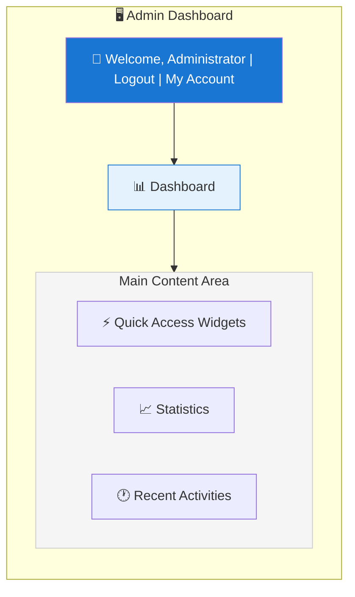
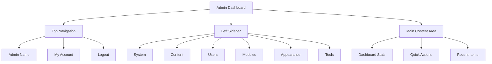

# XOOPS Огляд панелі адміністратора

Повний посібник із навігації та використання інформаційної панелі адміністратора XOOPS.

## Доступ до панелі адміністратора

### Логін адміністратора

Відкрийте браузер і перейдіть до:
```
http://your-domain.com/xoops/admin/
```
Або якщо XOOPS знаходиться в root:
```
http://your-domain.com/admin/
```
Введіть свої облікові дані адміністратора:
```
Username: [Your admin username]
Password: [Your admin password]
```
### Після входу

Ви побачите головну інформаційну панель адміністратора:

## Макет панелі адміністратора

## Компоненти інформаційної панелі

### Верхня панель

Верхня панель містить основні елементи керування:

| Елемент | Призначення |
|---|---|
| **Лого адміністратора** | Натисніть, щоб повернутися до інформаційної панелі |
| **Вітальне повідомлення** | Показує ім'я адміністратора, увійшовши в систему |
| **Мій обліковий запис** | Редагувати профіль адміністратора та пароль |
| **Допомога** | Доступ до документації |
| **Вийти** | Вийти з панелі адміністратора |

### Ліва бічна панель навігації

Головне меню, організоване за функціями:
```
├── System
│   ├── Dashboard
│   ├── Preferences
│   ├── Admin Users
│   ├── Groups
│   ├── Permissions
│   ├── Modules
│   └── Tools
├── Content
│   ├── Pages
│   ├── Categories
│   ├── Comments
│   └── Media Manager
├── Users
│   ├── Users
│   ├── User Requests
│   ├── Online Users
│   └── User Groups
├── Modules
│   ├── Modules
│   ├── Module Settings
│   └── Module Updates
├── Appearance
│   ├── Themes
│   ├── Templates
│   ├── Blocks
│   └── Images
└── Tools
    ├── Maintenance
    ├── Email
    ├── Statistics
    ├── Logs
    └── Backups
```
### Область основного вмісту

Відображає інформацію та елементи керування для вибраного розділу:

- Форми для конфігурації
- Таблиці даних зі списками
- Графіки та статистика
- Кнопки швидкого дії
- Текст довідки та підказки

### Віджети інформаційної панелі

Швидкий доступ до ключової інформації:

- **Інформація про систему:** версія PHP, версія MySQL, версія XOOPS
- **Швидка статистика:** Кількість користувачів, загальна кількість дописів, встановлені модулі
- **Останні дії:** Останні входи, зміни вмісту, помилки
- **Статус сервера:** ЦП, пам'ять, використання диска
- **Сповіщення:** Системні сповіщення, очікувані оновлення

## Основні функції адміністратора

### Управління системою

**Розташування:** Система > [Різні параметри]

#### Налаштування

Налаштуйте основні параметри системи:
```
System > Preferences > [Settings Category]
```
Категорії:
- Загальні налаштування (назва сайту, часовий пояс)
- Налаштування користувача (реєстрація, профілі)
- Налаштування електронної пошти (конфігурація SMTP)
- Cache Settings (параметри кешування)
- Налаштування URL (дружні URL-адреси)
- Мета-теги (налаштування SEO)

Див. розділ Основна конфігурація та налаштування системи.

#### Користувачі-адміністратори

Керувати обліковими записами адміністратора:
```
System > Admin Users
```
функції:
- Додати нових адміністраторів
- Редагувати профілі адміністратора
- Зміна паролів адміністратора
- Видалити облікові записи адміністратора
- Встановити права адміністратора

### Управління контентом

**Розташування:** Вміст > [Різні параметри]

#### Pages/Articles

Керувати вмістом сайту:
```
Content > Pages (or your module)
```
функції:
- Створення нових сторінок
- Редагувати наявний вміст
- Видалити сторінки
- Publish/unpublish
- Встановити категорії
- Керувати ревізіями

#### Категорії

Упорядкувати вміст:
```
Content > Categories
```
функції:
- Створення ієрархії категорій
- Редагувати категорії
- Видалити категорії
- Призначити сторінкам

#### Коментарі

Модерувати коментарі користувачів:
```
Content > Comments
```
функції:
- Переглянути всі коментарі
- Затвердити коментарі
- Редагувати коментарі
- Видалити спам
- Блокувати коментаторів

### Керування користувачами

**Розташування:** Користувачі > [Різні параметри]

#### Користувачі

Керувати обліковими записами користувачів:
```
Users > Users
```
функції:
- Переглянути всіх користувачів
- Створення нових користувачів
- Редагувати профілі користувачів
- Видалити акаунти
- Скидання паролів
- Зміна статусу користувача
- Розподіліть по групах

#### Користувачі онлайн

Моніторинг активних користувачів:
```
Users > Online Users
```
Показує:
- Зараз користувачі онлайн
- Час останньої активності
- IP адреса
- Розташування користувача (якщо налаштовано)

#### Групи користувачів

Керуйте ролями та дозволами користувачів:
```
Users > Groups
```
функції:
- Створення спеціальних груп
- Встановити дозволи групи
- Розподіл користувачів на групи
- Видалити групи

### Керування модулями

**Розташування:** Модулі > [Різні параметри]

#### Модулі

Встановити та налаштувати модулі:
```
Modules > Modules
```
функції:
- Перегляд встановлених модулів
- модулі Enable/disable
- Оновлення модулів
- Налаштувати параметри модуля
- Встановити нові модулі
- Переглянути деталі модуля

#### Перевірте наявність оновлень
```
Modules > Modules > Check for Updates
```
Дисплеї:
— Доступні оновлення модулів
- Журнал змін
- Параметри завантаження та встановлення

### Керування зовнішнім виглядом

**Розташування:** Зовнішній вигляд > [Різні параметри]

#### Теми

Керуйте темами сайту:
```
Appearance > Themes
```
функції:
- Перегляд встановлених тем
- Встановити тему за замовчуванням
- Завантажуйте нові теми
- Видалити теми
- Попередній перегляд теми
- Конфігурація теми

#### Блоки

Керувати блоками вмісту:
```
Appearance > Blocks
```
функції:
- Створення спеціальних блоків
- Редагувати вміст блоку
- Розташуйте блоки на сторінці
- Встановити видимість блоку
- Видалити блоки
— Налаштувати кешування блоків

#### Шаблони

Керування шаблонами (додатково):
```
Appearance > Templates
```
Для досвідчених користувачів і розробників.

### Системні інструменти

**Розташування:** Система > Інструменти

#### Режим обслуговування

Заборонити доступ користувачів під час обслуговування:
```
System > Maintenance Mode
```
Налаштувати:
- Технічне обслуговування Enable/disable
- Спеціальне повідомлення про технічне обслуговування
- Дозволені IP-адреси (для тестування)

#### Керування базами даних
```
System > Database
```
функції:
- Перевірка узгодженості бази даних
- Запуск оновлень бази даних
- Ремонт столів
- Оптимізація бази даних
- Експорт структури бази даних

#### Журнали активності
```
System > Logs
```
Монітор:
- Активність користувача
- Адміністративні дії
- Системні події
- Журнали помилок

## Швидкі дії

Поширені завдання, доступні з інформаційної панелі:
```
Quick Links:
├── Create New Page
├── Add New User
├── Create Content Block
├── Upload Image
├── Send Mass Email
├── Update All Modules
└── Clear Cache
```
## Комбінації клавіш панелі адміністратора

Швидка навігація:

| Ярлик | Дія |
|---|---|
| `Ctrl+H` | Перейти до допомоги |
| `Ctrl+D` | Перейти до інформаційної панелі |
| `Ctrl+Q` | Швидкий пошук |
| `Ctrl+L` | Вийти |

## Керування обліковими записами користувачів

### Мій акаунт

Доступ до профілю адміністратора:

1. Натисніть «Мій обліковий запис» у верхньому правому куті
2. Відредагуйте інформацію профілю:
   - Адреса електронної пошти
   - Справжнє ім'я
   - Інформація про користувача
   - Аватар

### Змінити пароль

Змініть пароль адміністратора:

1. Перейдіть до **Мій обліковий запис**
2. Натисніть «Змінити пароль»
3. Введіть поточний пароль
4. Введіть новий пароль (двічі)
5. Натисніть «Зберегти»

**Поради щодо безпеки:**
- Використовуйте надійні паролі (16+ символів)
- Включати великі, малі літери, цифри, символи
- Змінюйте пароль кожні 90 днів
- Ніколи не повідомляйте облікові дані адміністратора

### Вийти

Вийти з панелі адміністратора:

1. Натисніть «Вийти» у верхньому правому куті
2. Ви будете перенаправлені на сторінку входу

## Статистика панелі адміністратора

### Статистика інформаційної панелі

Короткий огляд показників сайту:

| Метричний | Значення |
|--------|-------|
| Користувачі онлайн | 12 |
| Всього користувачів | 256 |
| Всього дописів | 1,234 |
| Всього коментарів | 5,678 |
| Всього модулів | 8 |

### Статус системи

Інформація про сервер і продуктивність:

| Компонент | Version/Value |
|-----------|--------------|
| XOOPS Версія | 2.5.11 |
| PHP Версія | 8.2.x |
| MySQL Версія | 8.0.x |
| Навантаження на сервер | 0,45, 0,42 |
| Час роботи | 45 днів |

### Останні дії

Хронологія останніх подій:
```
12:45 - Admin login
12:30 - New user registered
12:15 - Page published
12:00 - Comment posted
11:45 - Module updated
```
## Система сповіщень

### Сповіщення адміністратора

Отримувати сповіщення про:

- Реєстрація нових користувачів
- Коментарі очікують модерації
- Невдалі спроби входу
- Системні помилки
— Доступні оновлення модулів
- Проблеми з базою даних
- Попередження про дисковий простір

Налаштувати сповіщення:

**Система > Налаштування > Налаштування електронної пошти**
```
Notify Admin on Registration: Yes
Notify Admin on Comments: Yes
Notify Admin on Errors: Yes
Alert Email: admin@your-domain.com
```
## Загальні завдання адміністратора

### Створіть нову сторінку

1. Перейдіть до **Вміст > Сторінки** (або відповідний модуль)
2. Натисніть «Додати нову сторінку»
3. Заповніть:
   - Назва
   - Зміст
   - Опис
   - Категорія
   - Метадані
4. Натисніть «Опублікувати»

### Керування користувачами

1. Перейдіть до **Користувачі > Користувачі**
2. Перегляньте список користувачів за допомогою:
   - Ім'я користувача
   - Електронна пошта
   - Дата реєстрації
   - Останній вхід
   - Статус

3. Натисніть ім'я користувача, щоб:
   - Редагувати профіль
   - Змінити пароль
   - Редагувати групи
   - Користувач Block/unblock

### Налаштувати модуль

1. Перейдіть до **Модулі > Модулі**
2. Знайти модуль у списку
3. Натисніть назву модуля
4. Натисніть «Налаштування» або «Налаштування»
5. Налаштуйте параметри модуля
6. Збережіть зміни

### Створіть новий блок

1. Перейдіть до **Вигляд > Блоки**
2. Натисніть «Додати новий блок»
3. Введіть:
   - Назва блоку
   - Блокувати вміст (дозволено HTML)
   - Позиція на сторінці
   - Видимість (усі сторінки або окремі)
   - Модуль (за наявності)
4. Натисніть «Надіслати»

## Довідка панелі адміністратора

### Вбудована документація

Доступ до довідки з панелі адміністратора:

1. Натисніть кнопку «Довідка» на верхній панелі
2. Контекстно-залежна довідка для поточної сторінки
3. Посилання на документацію
4. Часті питання

### Зовнішні ресурси

- XOOPS Офіційний сайт: https://xoops.org/
- Форум спільноти: https://xoops.org/modules/newbb/
- Репозиторій модулів: https://xoops.org/modules/repository/
- Bugs/Issues: https://github.com/XOOPS/XoopsCore/issues

## Налаштування панелі адміністратора

### Тема адміністратора

Виберіть тему інтерфейсу адміністратора:

**Система > Налаштування > Загальні налаштування**
```
Admin Theme: [Select theme]
```
Доступні теми:
- За замовчуванням (світлий)
- Темний режим
- Спеціальні теми

### Налаштування інформаційної панелі

Виберіть, які віджети відображатимуться:

**Інформаційна панель > Налаштувати**

Виберіть:
- Інформація про систему
- Статистика
- Остання діяльність
- Швидкі посилання
- Спеціальні віджети

## Дозволи панелі адміністратора

Різні рівні адміністратора мають різні дозволи:

| Роль | Можливості |
|---|---|
| **Веб-майстер** | Повний доступ до всіх функцій адміністратора |
| **Адміністратор** | Обмежені функції адміністратора |
| **Модератор** | Лише модерація вмісту |
| **Редактор** | Створення та редагування контенту |

Керувати дозволами:

**Система > Дозволи**

## Найкращі методи безпеки для панелі адміністратора

1. **Надійний пароль:** Використовуйте пароль із 16+ символів
2. **Регулярні зміни:** Змінюйте пароль кожні 90 днів
3. **Моніторинг доступу:** Регулярно перевіряйте журнали «Користувачі адміністратора».
4. **Обмежити доступ:** Перейменуйте папку адміністратора для додаткової безпеки
5. **Використовуйте HTTPS:** Завжди отримуйте доступ до адміністратора через HTTPS
6. **Білий список IP-адрес:** Обмеження доступу адміністратора до певних IP-адрес
7. **Звичайний вихід із системи:** завершіть вихід із системи
8. **Безпека браузера:** Регулярно очищайте кеш браузера

Див. Конфігурація безпеки.

## Панель адміністратора усунення несправностей

### Не вдається отримати доступ до панелі адміністратора

**Рішення:**
1. Перевірте облікові дані для входу
2. Очистіть кеш браузера та файли cookie
3. Спробуйте інший браузер
4. Перевірте, чи правильний шлях до папки адміністратора
5. Перевірте права доступу до файлів у папці адміністратора
6. Перевірте підключення до бази даних у mainfile.php

### Порожня сторінка адміністратора

**Рішення:**
```bash
# Check PHP errors
tail -f /var/log/apache2/error.log

# Enable debug mode temporarily
sed -i "s/define('XOOPS_DEBUG', 0)/define('XOOPS_DEBUG', 1)/" /var/www/html/xoops/mainfile.php

# Check file permissions
ls -la /var/www/html/xoops/admin/
```
### Повільна панель адміністратора

**Рішення:**
1. Очистіть кеш: **Система > Інструменти > Очистити кеш**
2. Оптимізація бази даних: **Система > База даних > Оптимізувати**
3. Перевірте ресурси сервера: `htop`
4. Перегляньте повільні запити в MySQL

### Модуль не відображається

**Рішення:**
1. Перевірте встановлений модуль: **Модулі > Модулі**
2. Перевірте, чи модуль увімкнено
3. Перевірте призначені дозволи
4. Перевірте наявність файлів модуля
5. Перегляньте журнали помилок

## Наступні кроки

Після ознайомлення з адмінпанеллю:

1. Створіть свою першу сторінку
2. Налаштуйте групи користувачів
3. Встановити додаткові модулі
4. Налаштуйте основні параметри
5. Впровадити безпеку

---

**Теги:** #адмінпанель #інформаційна панель #навігація #початок роботи

**Пов’язані статті:**
- ../Configuration/Basic-Configuration
- ../Configuration/System-Settings
- Створення-вашої-першої-сторінки
- Керування користувачами
- Встановлення модулів