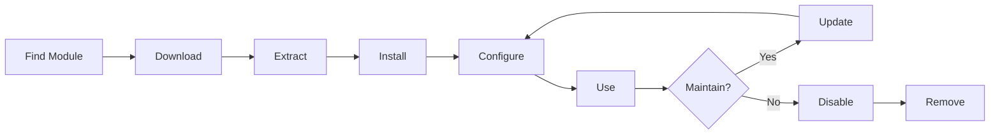

# Встановлення та керування модулями XOOPS

Дізнайтеся, як розширити функціональні можливості XOOPS шляхом встановлення та налаштування модулів.

## Розуміння модулів XOOPS

### Що таке модулі?

Модулі — це розширення, які додають функціональність XOOPS:

| Тип | Призначення | Приклади |
|---|---|---|
| **Вміст** | Керувати певними типами вмісту | Новини, Блог, Квитки |
| **Спільнота** | Взаємодія з користувачем | Форум, коментарі, огляди |
| **Електронна комерція** | Продаж продукції | Магазин, кошик, платежі |
| **Медіа** | Ручка files/images | Галерея, завантаження, відео |
| **Корисність** | Інструменти та помічники | Електронна пошта, резервне копіювання, аналітика |

### Основні та додаткові модулі

| Модуль | Тип | Включено | Знімний |
|---|---|---|---|
| **Система** | Ядро | Так | Ні |
| **Користувач** | Ядро | Так | Ні |
| **Профіль** | Рекомендовано | Так | Так |
| **PM (приватне повідомлення)** | Рекомендовано | Так | Так |
| **WF-канал** | Необов'язковий | Часто | Так |
| **Новини** | Необов'язковий | Ні | Так |
| **Форум** | Необов'язковий | Ні | Так |

## Життєвий цикл модуля

## Пошук модулів

### XOOPS Репозиторій модулів

Офіційне сховище модулів XOOPS:

**Відвідайте:** https://xoops.org/modules/repository/
```
Directory > Modules > [Browse Categories]
```
Перегляд за категоріями:
- Управління контентом
- Громада
- електронна комерція
- Мультимедіа
- Розвиток
- Адміністрація сайту

### Оцінювання модулів

Перед встановленням перевірте:

| Критерії | Що шукати |
|---|---|
| **Сумісність** | Працює з вашою версією XOOPS |
| **Рейтинг** | Хороші відгуки та оцінки користувачів |
| **Оновлення** | Нещодавно підтримувався |
| **Завантаження** | Популярний і широко використовуваний |
| **Вимоги** | Сумісний із вашим сервером |
| **Ліцензія** | GPL або аналогічний відкритий код |
| **Підтримка** | Активний розробник і спільнота |

### Прочитати інформацію про модуль

Список кожного модуля показує:
```
Module Name: [Name]
Version: [X.X.X]
Requires: XOOPS [Version]
Author: [Name]
Last Update: [Date]
Downloads: [Number]
Rating: [Stars]
Description: [Brief description]
Compatibility: PHP [Version], MySQL [Version]
```
## Встановлення модулів

### Спосіб 1: Встановлення панелі адміністратора

**Крок 1: Доступ до розділу модулів**

1. Увійдіть в панель адміністратора
2. Перейдіть до **Модулі > Модулі**
3. Натисніть **"Установити новий модуль"** або **"Огляд модулів"**

**Крок 2: Завантажте модуль**

Варіант A - пряме завантаження:
1. Натисніть **"Вибрати файл"**
2. Виберіть файл .zip модуля з комп’ютера
3. Натисніть **"Завантажити"**

Варіант B - URL Завантаження:
1. Вставте модуль URL
2. Натисніть **"Завантажити та встановити"**

**Крок 3: Перегляньте інформацію про модуль**
```
Module Name: [Name shown]
Version: [Version]
Author: [Author info]
Description: [Full description]
Requirements: [PHP/MySQL versions]
```
Перегляньте та натисніть **"Продовжити встановлення"**

**Крок 4: Виберіть тип встановлення**
```
☐ Fresh Install (New installation)
☐ Update (Upgrade existing)
☐ Delete Then Install (Replace existing)
```
Виберіть відповідний варіант.

**Крок 5: Підтвердьте встановлення**

Переглянути остаточне підтвердження:
```
Module will be installed to: /modules/modulename/
Database: xoops_db
Proceed? [Yes] [No]
```
Натисніть **"Так"** для підтвердження.

**Крок 6: встановлення завершено**
```
Installation successful!

Module: [Module Name]
Version: [Version]
Tables created: [Number]
Files installed: [Number]

[Go to Module Settings]  [Return to Modules]
```
### Спосіб 2: Встановлення вручну (розширений)

Для встановлення вручну або усунення несправностей:

**Крок 1: Завантажте модуль**

1. Завантажте модуль .zip зі сховища
2. Розпакуйте до `/var/www/html/xoops/modules/modulename/`
```bash
# Extract module
unzip module_name.zip
cp -r module_name /var/www/html/xoops/modules/

# Set permissions
chmod -R 755 /var/www/html/xoops/modules/module_name
```
**Крок 2. Запустіть сценарій встановлення**
```
Visit: http://your-domain.com/xoops/modules/module_name/admin/index.php?op=install
```
Або через панель адміністратора (Система > Модулі > Оновити БД).

**Крок 3: Перевірте встановлення**

1. Перейдіть до **Модулі > Модулі** в адмін
2. Знайдіть свій модуль у списку
3. Переконайтеся, що він відображається як "Активний"

## Конфігурація модуля

### Налаштування модуля доступу

1. Перейдіть до **Модулі > Модулі**
2. Знайдіть свій модуль
3. Натисніть назву модуля
4. Натисніть **"Налаштування"** або **"Налаштування"**

### Загальні налаштування модуля

Більшість модулів пропонують:
```
Module Status: [Enabled/Disabled]
Display in Menu: [Yes/No]
Module Weight: [1-999] (display order)
Visible To Groups: [Checkboxes for user groups]
```
### Спеціальні параметри модуля

Кожен модуль має унікальні налаштування. приклади:

**Модуль новин:**
```
Items Per Page: 10
Show Author: Yes
Allow Comments: Yes
Moderation Required: Yes
```
**Модуль форуму:**
```
Topics Per Page: 20
Posts Per Page: 15
Maximum Attachment Size: 5MB
Enable Signatures: Yes
```
**Модуль галереї:**
```
Images Per Page: 12
Thumbnail Size: 150x150
Maximum Upload: 10MB
Watermark: Yes/No
```
Перегляньте документацію свого модуля, щоб дізнатися про конкретні параметри.

### Зберегти конфігурацію

Після налаштування параметрів:

1. Натисніть **"Надіслати"** або **"Зберегти"**
2. Ви побачите підтвердження:   
```
   Settings saved successfully!
   
```
## Керування модульними блоками

Багато модулів створюють «блоки» — області вмісту, схожі на віджети.

### Переглянути блоки модулів

1. Перейдіть до **Вигляд > Блоки**
2. Шукайте блоки з вашого модуля
3. Більшість модулів показують "[Назва модуля] - [Опис блоку]"

### Налаштувати блоки

1. Натисніть назву блоку
2. Налаштуйте:
   - Назва блоку
   - Видимість (усі сторінки або окремі)
   - Розташування на сторінці (зліва, по центру, справа)
   - Групи користувачів, які можуть бачити
3. Натисніть **"Надіслати"**

### Відображати блок на домашній сторінці

1. Перейдіть до **Вигляд > Блоки**
2. Знайдіть потрібний блок
3. Натисніть **"Редагувати"**
4. Набір:
   - **Бачать:** Виберіть групи
   - **Позиція:** Виберіть стовпець (left/center/right)
   - **Сторінки:** Домашня сторінка або всі сторінки
5. Натисніть **"Надіслати"**

## Встановлення конкретних прикладів модулів

### Встановлення модуля новин

**Ідеально підходить для:** публікацій у блогах, оголошень

1. Завантажте модуль Новини зі сховища
2. Завантажте через **Модулі > Модулі > Встановити**
3. Налаштуйте в **Модулі > Новини > Налаштування**:
   - Історій на сторінці: 10
   - Дозволити коментарі: Так
   - Затвердити перед публікацією: Так
4. Створіть блоки для останніх новин
5. Почніть публікувати історії!

### Встановлення модуля форуму

**Ідеально підходить для:** обговорення спільноти

1. Завантажте модуль форуму
2. Встановіть через панель адміністратора
3. Створіть категорії форуму в модулі
4. Налаштуйте параметри:
   - Topics/page: 20
   - Posts/page: 15
   - Увімкнути модерацію: Так
5. Призначте права доступу групам користувачів
6. Створіть блоки для останніх тем

### Встановлення модуля галереї

**Ідеально підходить для:** демонстрації зображень

1. Завантажте модуль Галерея
2. Встановити та налаштувати
3. Створення фотоальбомів
4. Завантажте зображення
5. Установіть дозволи для viewing/uploading
6. Відобразити галерею на сайті

## Оновлення модулів

### Перевірте наявність оновлень
```
Admin Panel > Modules > Modules > Check for Updates
```
Це показує:
— Доступні оновлення модулів
- Поточна проти нової версії
- Примітки Changelog/release

### Оновити модуль

1. Перейдіть до **Модулі > Модулі**
2. Натисніть модуль із доступним оновленням
3. Натисніть кнопку **"Оновити"**
4. Виберіть **"Оновити" з Типу встановлення**
5. Виконайте дії майстра встановлення
6. Модуль оновлено!

### Важливі примітки щодо оновлення

Перед оновленням:

- [ ] Резервна база даних
- [ ] Файли модуля резервного копіювання
- [ ] Переглянути журнал змін
- [ ] Спочатку перевірте на проміжному сервері
- [ ] Зверніть увагу на будь-які спеціальні зміни

Після оновлення:
- [ ] Перевірити функціональність
- [ ] Перевірте налаштування модуля
- [ ] Огляд warnings/errors
- [ ] Очистити кеш

## Дозволи модуля

### Призначити доступ до групи користувачів

Контролюйте, які групи користувачів мають доступ до модулів:

**Розташування:** Система > Дозволи

Для кожного модуля налаштуйте:
```
Module: [Module Name]

Admin Access: [Select groups]
User Access: [Select groups]
Read Permission: [Groups allowed to view]
Write Permission: [Groups allowed to post]
Delete Permission: [Administrators only]
```
### Загальні рівні дозволів
```
Public Content (News, Pages):
├── Admin Access: Webmaster
├── User Access: All logged-in users
└── Read Permission: Everyone

Community Features (Forum, Comments):
├── Admin Access: Webmaster, Moderators
├── User Access: All logged-in users
└── Write Permission: All logged-in users

Admin Tools:
├── Admin Access: Webmaster only
└── User Access: Disabled
```
## Вимкнення та видалення модулів

### Вимкнути модуль (зберігати файли)

Зберегти модуль, але приховати від сайту:

1. Перейдіть до **Модулі > Модулі**
2. Знайти модуль
3. Натисніть назву модуля
4. Натисніть **"Вимкнути"** або встановіть статус Неактивний
5. Модуль приховано, але дані збережені

Повторно ввімкніть будь-коли:
1. Натисніть модуль
2. Натисніть **"Увімкнути"**

### Видаліть модуль повністю

Видалити модуль і його дані:

1. Перейдіть до **Модулі > Модулі**
2. Знайти модуль
3. Натисніть **"Видалити"** або **"Видалити"**
4. Підтвердьте: "Видалити модуль і всі дані?"
5. Натисніть **"Так"** для підтвердження

**Попередження:** Видалення видаляє всі дані модуля!

### Перевстановити після видалення

Якщо ви видаляєте модуль:
— Файли модуля видалено
— Видалено таблиці бази даних
- Усі дані втрачено
- Необхідно перевстановити, щоб використовувати знову
- Можливість відновлення з резервної копії

## Усунення несправностей встановлення модуля

### Модуль не відображається після встановлення

**Симптом:** Модуль зазначено, але не відображається на сайті

**Рішення:**
```
1. Check module is "Active" (Modules > Modules)
2. Enable module blocks (Appearance > Blocks)
3. Verify user permissions (System > Permissions)
4. Clear cache (System > Tools > Clear Cache)
5. Check .htaccess doesn't block module
```
### Помилка встановлення: «Таблиця вже існує»

**Симптом:** Помилка під час встановлення модуля

**Рішення:**
```
1. Module partially installed before
2. Try "Delete then Install" option
3. Or uninstall first, then install fresh
4. Check database for existing tables:
   mysql> SHOW TABLES LIKE 'xoops_module%';
```
### Відсутні залежності модуля

**Проблема:** Модуль не встановлюється – потрібен інший модуль

**Рішення:**
```
1. Note required modules from error message
2. Install required modules first
3. Then install the module
4. Install in correct order
```
### Порожня сторінка під час доступу до модуля

**Проблема:** Модуль завантажується, але нічого не показує

**Рішення:**
```
1. Enable debug mode in mainfile.php:
   define('XOOPS_DEBUG', 1);

2. Check PHP error log:
   tail -f /var/log/php_errors.log

3. Verify file permissions:
   chmod -R 755 /var/www/html/xoops/modules/modulename

4. Check database connection in module config

5. Disable module and reinstall
```
### Сайт розривів модулів

**Проблема:** встановлення модуля порушує роботу веб-сайту

**Рішення:**
```
1. Disable the problematic module immediately:
   Admin > Modules > [Module] > Disable

2. Clear cache:
   rm -rf /var/www/html/xoops/cache/*
   rm -rf /var/www/html/xoops/templates_c/*

3. Restore from backup if needed

4. Check error logs for root cause

5. Contact module developer
```
## Застереження щодо безпеки модуля

### Встановлюйте лише з перевірених джерел
```
✓ Official XOOPS Repository
✓ GitHub official XOOPS modules
✓ Trusted module developers
✗ Unknown websites
✗ Unverified sources
```
### Перевірте дозволи модуля

Після установки:

1. Перегляньте код модуля на наявність підозрілої активності
2. Перевірте таблиці бази даних на наявність аномалій
3. Відстежуйте зміни файлів
4. Оновлюйте модулі
5. Видаліть невикористані модулі

### Рекомендації щодо дозволів
```
Module directory: 755 (readable, not writable by web server)
Module files: 644 (readable only)
Module data: Protected by database
```
## Ресурси розробки модулів

### Вивчення розробки модулів

- Офіційна документація: https://xoops.org/
- GitHub Репозиторій: https://github.com/XOOPS/
- Форум спільноти: https://xoops.org/modules/newbb/
- Посібник розробника: доступний у папці документів

## Найкращі методи роботи з модулями

1. **Встановлюйте один за одним:** Відстежуйте конфлікти
2. **Тестувати після інсталяції:** перевірити функціональність
3. **Документувати користувацьку конфігурацію:** Зверніть увагу на свої налаштування
4. **Підтримуйте оновлення:** негайно встановлюйте оновлення модулів
5. **Remove Unused:** Видалення непотрібних модулів
6. **Створення резервної копії перед:** Завжди робіть резервну копію перед встановленням
7. **Прочитайте документацію:** Перевірте інструкції модуля
8. **Приєднайтеся до спільноти:** за потреби попросіть допомоги

## Контрольний список встановлення модуля

Для встановлення кожного модуля:

- [ ] Дослідіть і прочитайте відгуки
- [ ] Перевірте сумісність версії XOOPS
- [ ] Резервне копіювання бази даних і файлів
- [ ] Завантажити останню версію
- [ ] Встановити через панель адміністратора
- [ ] Налаштувати параметри
- Блоки [ ] Create/position
- [ ] Встановити дозволи користувача
- [ ] Тест функціональності
- [ ] Конфігурація документа
- [ ] Розклад оновлень

## Наступні кроки

Після встановлення модулів:

1. Створення контенту для модулів
2. Налаштуйте групи користувачів
3. Дослідіть функції адміністратора
4. Оптимізуйте продуктивність
5. За потреби встановіть додаткові модулі

---

**Теги:** #модулі #встановлення #розширення #керування

**Пов’язані статті:**
- Огляд панелі адміністратора
- Керування користувачами
- Створення-вашої-першої-сторінки
- ../Configuration/System-Settings