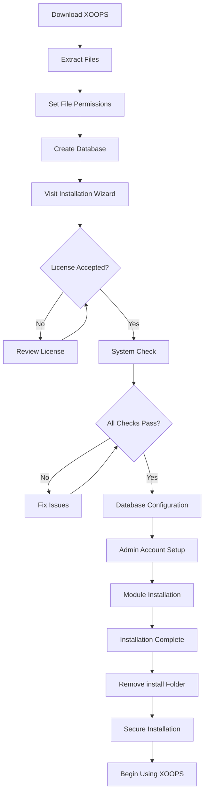

# Повний посібник із встановлення XOOPS

Цей посібник містить вичерпну інструкцію щодо встановлення XOOPS з нуля за допомогою майстра встановлення.

## Передумови

Перед початком встановлення переконайтеся, що у вас є:

- Доступ до веб-сервера через FTP або SSH
- Доступ адміністратора до вашого сервера бази даних
- Зареєстроване доменне ім'я
— Перевірено вимоги до сервера
- Доступні засоби резервного копіювання

## Процес встановлення

## Покрокова інсталяція

### Крок 1: Завантажте XOOPS

Завантажте останню версію з [https://xoops.org/](https://xoops.org/):
```bash
# Using wget
wget https://xoops.org/download/xoops-2.5.8.zip

# Using curl
curl -O https://xoops.org/download/xoops-2.5.8.zip
```
### Крок 2: Розпакуйте файли

Розпакуйте архів XOOPS у корінь веб-сайту:
```bash
# Navigate to web root
cd /var/www/html

# Extract XOOPS
unzip xoops-2.5.8.zip

# Rename folder (optional, but recommended)
mv xoops-2.5.8 xoops
cd xoops
```
### Крок 3: Налаштуйте права доступу до файлу

Встановіть відповідні дозволи для каталогів XOOPS:
```bash
# Make directories writable (755 for dirs, 644 for files)
find . -type d -exec chmod 755 {} \;
find . -type f -exec chmod 644 {} \;

# Make specific directories writable by web server
chmod 777 uploads/
chmod 777 templates_c/
chmod 777 var/
chmod 777 cache/

# Secure mainfile.php after installation
chmod 644 mainfile.php
```
### Крок 4: Створіть базу даних

Створіть нову базу даних для XOOPS за допомогою MySQL:
```sql
-- Create database
CREATE DATABASE xoops_db CHARACTER SET utf8mb4 COLLATE utf8mb4_unicode_ci;

-- Create user
CREATE USER 'xoops_user'@'localhost' IDENTIFIED BY 'secure_password_here';

-- Grant privileges
GRANT ALL PRIVILEGES ON xoops_db.* TO 'xoops_user'@'localhost';
FLUSH PRIVILEGES;
```
Або за допомогою phpMyAdmin:

1. Увійдіть у phpMyAdmin
2. Перейдіть на вкладку «Бази даних».
3. Введіть назву бази даних: `xoops_db`
4. Виберіть сортування "utf8mb4_unicode_ci".
5. Натисніть «Створити»
6. Створіть користувача з іменем бази даних
7. Надайте всі привілеї

### Крок 5: Запустіть майстер встановлення

Відкрийте браузер і перейдіть до:
```
http://your-domain.com/xoops/install/
```
#### Фаза перевірки системи

Майстер перевіряє конфігурацію вашого сервера:

- PHP версія >= 5.6.0
- MySQL/MariaDB в наявності
- Необхідні розширення PHP (GD, PDO тощо)
- Дозволи каталогу
- Підключення до бази даних

**Якщо перевірки не вдаються:**

Перегляньте розділ #Common-Installation-Issues, щоб знайти рішення.

#### Конфігурація бази даних

Введіть облікові дані бази даних:
```
Database Host: localhost
Database Name: xoops_db
Database User: xoops_user
Database Password: [your_secure_password]
Table Prefix: xoops_
```
**Важливі примітки:**
- Якщо хост вашої бази даних відрізняється від локального (наприклад, віддалений сервер), введіть правильну назву хоста
- Префікс таблиці допомагає під час запуску кількох екземплярів XOOPS в одній базі даних
- Використовуйте надійний пароль із змішаним регістром, цифрами та символами

#### Налаштування облікового запису адміністратора

Створіть обліковий запис адміністратора:
```
Admin Username: admin (or choose custom)
Admin Email: admin@your-domain.com
Admin Password: [strong_unique_password]
Confirm Password: [repeat_password]
```
**Найкращі практики:**
- Використовуйте унікальне ім'я користувача, а не "admin"
- Використовуйте пароль із 16+ символів
- Зберігайте облікові дані в безпечному менеджері паролів
- Ніколи не повідомляйте облікові дані адміністратора

#### Встановлення модуля

Виберіть стандартні модулі для встановлення:

- **Системний модуль** (обов'язково) - Основні функції XOOPS
- **Модуль користувача** (обов'язково) - Керування користувачами
- **Профільний модуль** (рекомендовано) - Профілі користувачів
- **Модуль PM (приватне повідомлення)** (рекомендовано) - Внутрішній обмін повідомленнями
- **WF-Channel Module** (опціонально) - Управління вмістом

Виберіть усі рекомендовані модулі для повного встановлення.

### Крок 6: завершіть установку

Після виконання всіх кроків ви побачите екран підтвердження:
```
Installation Complete!

Your XOOPS installation is ready to use.
Admin Panel: http://your-domain.com/xoops/admin/
User Panel: http://your-domain.com/xoops/
```
### Крок 7: Захистіть установку

#### Видалити папку встановлення
```bash
# Remove the install directory (CRITICAL for security)
rm -rf /var/www/html/xoops/install/

# Or rename it
mv /var/www/html/xoops/install/ /var/www/html/xoops/install.bak
```
**УВАГА:** Ніколи не залишайте папку встановлення доступною в робочому стані!

#### Захищений основний файл.php
```bash
# Make mainfile.php read-only
chmod 644 /var/www/html/xoops/mainfile.php

# Set ownership
chown www-data:www-data /var/www/html/xoops/mainfile.php
```
#### Налаштуйте належні дозволи для файлів
```bash
# Recommended production permissions
find . -type f -name "*.php" -exec chmod 644 {} \;
find . -type d -exec chmod 755 {} \;

# Writable directories for web server
chmod 777 uploads/ var/ cache/ templates_c/
```
#### Увімкнути HTTPS/SSL

Налаштуйте SSL на веб-сервері (nginx або Apache).

**Для Apache:**
```apache
<VirtualHost *:443>
    ServerName your-domain.com
    DocumentRoot /var/www/html/xoops

    SSLEngine on
    SSLCertificateFile /etc/ssl/certs/your-cert.crt
    SSLCertificateKeyFile /etc/ssl/private/your-key.key

    # Force HTTPS redirect
    <IfModule mod_rewrite.c>
        RewriteEngine On
        RewriteCond %{HTTPS} off
        RewriteRule ^(.*)$ https://%{HTTP_HOST}%{REQUEST_URI} [L,R=301]
    </IfModule>
</VirtualHost>
```
## Конфігурація після інсталяції

### 1. Доступ до панелі адміністратора

Перейдіть до:
```
http://your-domain.com/xoops/admin/
```
Увійдіть за допомогою облікових даних адміністратора.

### 2. Налаштуйте основні параметри

Налаштуйте наступне:

- Назва та опис сайту
- Адреса електронної пошти адміністратора
- Часовий пояс і формат дати
- Пошукова оптимізація

### 3. Тестова інсталяція

- [ ] Відвідайте домашню сторінку
- [ ] Перевірте завантаження модулів
- [ ] Перевірка реєстрації користувача працює
- [ ] Перевірте функції панелі адміністратора
- [ ] Підтвердження роботи SSL/HTTPS

### 4. Розклад резервного копіювання

Налаштувати автоматичне резервне копіювання:
```bash
# Create backup script (backup.sh)
#!/bin/bash
DATE=$(date +%Y%m%d_%H%M%S)
BACKUP_DIR="/backups/xoops"
XOOPS_DIR="/var/www/html/xoops"

# Backup database
mysqldump -u xoops_user -p[password] xoops_db > $BACKUP_DIR/db_$DATE.sql

# Backup files
tar -czf $BACKUP_DIR/files_$DATE.tar.gz $XOOPS_DIR

echo "Backup completed: $DATE"
```
Розклад із cron:
```bash
# Daily backup at 2 AM
0 2 * * * /usr/local/bin/backup.sh
```
## Поширені проблеми встановлення

### Проблема: Помилки дозволу заборонено

**Проблема:** «Відмовлено в доступі» під час завантаження або створення файлів

**Рішення:**
```bash
# Check web server user
ps aux | grep apache  # For Apache
ps aux | grep nginx   # For Nginx

# Fix permissions (replace www-data with your web server user)
chown -R www-data:www-data /var/www/html/xoops
chmod -R 755 /var/www/html/xoops
chmod 777 uploads/ var/ cache/ templates_c/
```
### Проблема: Помилка підключення до бази даних

**Проблема:** «Не вдається підключитися до сервера бази даних»

**Рішення:**
1. Перевірте облікові дані бази даних у майстрі встановлення
2. Перевірте, чи працює MySQL/MariaDB:   
```bash
   service mysql status  # or mariadb
   
```
3. Перевірте існування бази даних:   
```sql
   SHOW DATABASES;
   
```
4. Перевірте підключення з командного рядка:   
```bash
   mysql -h localhost -u xoops_user -p xoops_db
   
```
### Проблема: порожній білий екран

**Проблема:** Відвідування XOOPS показує порожню сторінку

**Рішення:**
1. Перевірте журнали помилок PHP:   
```bash
   tail -f /var/log/apache2/error.log
   
```
2. Увімкніть режим налагодження в mainfile.php:   
```php
   define('XOOPS_DEBUG', 1);
   
```
3. Перевірте права доступу до файлу mainfile.php і конфігураційних файлів
4. Перевірте, чи встановлено розширення PHP-MySQL

### Проблема: не вдається записати в каталог завантажень

**Проблема:** Функція завантаження не працює, «Неможливо записати в завантажені файли/»

**Рішення:**
```bash
# Check current permissions
ls -la uploads/

# Fix permissions
chmod 777 uploads/
chown www-data:www-data uploads/

# For specific files
chmod 644 uploads/*
```
### Проблема: відсутні розширення PHP

**Проблема:** Перевірка системи не вдається через відсутність розширень (GD, MySQL тощо)

**Рішення (Ubuntu/Debian):**
```bash
# Install PHP GD library
apt-get install php-gd

# Install PHP MySQL support
apt-get install php-mysql

# Restart web server
systemctl restart apache2  # or nginx
```
**Рішення (CentOS/RHEL):**
```bash
# Install PHP GD library
yum install php-gd

# Install PHP MySQL support
yum install php-mysql

# Restart web server
systemctl restart httpd
```
### Проблема: повільний процес встановлення

**Проблема:** Майстер інсталяції закінчився або працює дуже повільно

**Рішення:**
1. Збільште час очікування PHP у php.ini:   
```ini
   max_execution_time = 300  # 5 minutes
   
```
2. Збільште MySQL max_allowed_packet:   
```sql
   SET GLOBAL max_allowed_packet = 256M;
   
```
3. Перевірте ресурси сервера:   
```bash
   free -h  # Check RAM
   df -h    # Check disk space
   
```
### Проблема: панель адміністратора недоступна

**Проблема:** Не вдається отримати доступ до панелі адміністратора після встановлення

**Рішення:**
1. Перевірте наявність користувача адміністратора в базі даних:   
```sql
   SELECT * FROM xoops_users WHERE uid = 1;
   
```
2. Очистіть кеш браузера та файли cookie
3. Перевірте, чи доступна для запису папка sessions:   
```bash
   chmod 777 var/
   
```
4. Переконайтеся, що правила htaccess не блокують доступ адміністратора

## Контрольний список перевірки

Після встановлення перевірте:

- [x] Домашня сторінка XOOPS завантажується правильно
- [x] Панель адміністратора доступна за адресою /xoops/admin/
- [x] SSL/HTTPS працює
- [x] Папка встановлення видалена або недоступна
- [x] Права доступу до файлів безпечні (644 для файлів, 755 для каталогів)
- [x] Резервне копіювання бази даних заплановано
- [x] Модулі завантажуються без помилок
- [x] Система реєстрації користувачів працює
- [x] Функція завантаження файлів працює
- [x] Сповіщення електронною поштою надсилаються належним чином

## Наступні кроки

Після завершення встановлення:

1. Прочитайте посібник із базової конфігурації
2. Захистіть установку
3. Перегляньте панель адміністратора
4. Встановити додаткові модулі
5. Налаштуйте групи користувачів і дозволи

---

**Теги:** #встановлення #налаштування #початок роботи #усунення несправностей

**Пов’язані статті:**
- Вимоги до сервера
- Оновлення-XOOPS
- ../Configuration/Security-Configuration