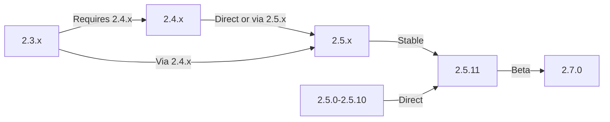

У цьому посібнику описано оновлення XOOPS зі старіших версій до останньої версії зі збереженням ваших даних і налаштувань.

> **Інформація про версію**
> - **Стабільний:** XOOPS 2.5.11
> - **Бета:** XOOPS 2.7.0 (тестування)
> - **Майбутнє:** XOOPS 4.0 (у розробці - див. Дорожню карту)

## Контрольний список перед оновленням

Перед початком оновлення перевірте:

- [ ] Задокументовано поточну версію XOOPS
- [] Ідентифіковано цільову версію XOOPS
- [ ] Повне резервне копіювання системи завершено
- [ ] Резервне копіювання бази даних перевірено
- [ ] Записано список встановлених модулів
- [ ] Спеціальні модифікації задокументовані
- [ ] Доступне тестове середовище
- [ ] Шлях оновлення перевірено (деякі версії пропускають проміжні випуски)
- [ ] Ресурси сервера перевірені (достатньо місця на диску, пам'яті)
- [ ] Режим обслуговування ввімкнено

## Керівництво по шляху оновлення

Різні шляхи оновлення залежно від поточної версії:

**Важливо:** Ніколи не пропускайте основні версії. У разі оновлення з 2.3.x спочатку оновіть до 2.4.x, а потім до 2.5.x.

## Крок 1: Повне резервне копіювання системи

### Резервне копіювання бази даних

Використовуйте mysqldump для резервного копіювання бази даних:
```bash
# Full database backup
mysqldump -u xoops_user -p xoops_db > /backups/xoops_db_backup_$(date +%Y%m%d_%H%M%S).sql

# Compressed backup
mysqldump -u xoops_user -p xoops_db | gzip > /backups/xoops_db_backup_$(date +%Y%m%d_%H%M%S).sql.gz
```
Або за допомогою phpMyAdmin:

1. Виберіть свою базу даних XOOPS
2. Натисніть вкладку «Експорт».
3. Виберіть формат "SQL".
4. Виберіть «Зберегти як файл»
5. Натисніть «Перейти»

Перевірте файл резервної копії:
```bash
# Check backup size
ls -lh /backups/xoops_db_backup*.sql

# Verify backup integrity (uncompressed)
head -20 /backups/xoops_db_backup_*.sql

# Verify compressed backup
zcat /backups/xoops_db_backup_*.sql.gz | head -20
```
### Резервне копіювання файлової системи

Резервне копіювання всіх файлів XOOPS:
```bash
# Compressed file backup
tar -czf /backups/xoops_files_$(date +%Y%m%d_%H%M%S).tar.gz /var/www/html/xoops

# Uncompressed (faster, requires more disk space)
tar -cf /backups/xoops_files_$(date +%Y%m%d_%H%M%S).tar /var/www/html/xoops

# Show backup progress
tar -czf /backups/xoops_files_$(date +%Y%m%d_%H%M%S).tar.gz --verbose /var/www/html/xoops | tail
```
Надійно зберігайте резервні копії:
```bash
# Secure backup storage
chmod 600 /backups/xoops_*
ls -lah /backups/

# Optional: Copy to remote storage
scp /backups/xoops_* user@backup-server:/secure/backups/
```
### Тест відновлення резервної копії

**КРИТИЧНО:** Завжди перевіряйте роботу резервного копіювання:
```bash
# Verify tar archive contents
tar -tzf /backups/xoops_files_*.tar.gz | head -20

# Extract to test location
mkdir /tmp/restore_test
cd /tmp/restore_test
tar -xzf /backups/xoops_files_*.tar.gz

# Verify key files exist
ls -la xoops/mainfile.php
ls -la xoops/install/
```
## Крок 2: Увімкніть режим обслуговування

Заборонити користувачам доступ до сайту під час оновлення:

### Варіант 1: Панель адміністратора XOOPS

1. Увійдіть в панель адміністратора
2. Перейдіть до Система > Обслуговування
3. Увімкніть «Режим обслуговування сайту»
4. Встановіть повідомлення про технічне обслуговування
5. Зберегти

### Варіант 2: ручний режим обслуговування

Створіть файл обслуговування в кореневому веб-сайті:
```html
<!-- /var/www/html/maintenance.html -->
<!DOCTYPE html>
<html>
<head>
    <title>Under Maintenance</title>
    <style>
        body { font-family: Arial; text-align: center; padding: 50px; }
        h1 { color: #333; }
        p { color: #666; margin: 20px 0; }
    </style>
</head>
<body>
    <h1>Site Under Maintenance</h1>
    <p>We're currently upgrading our site.</p>
    <p>Expected time: approximately 30 minutes.</p>
    <p>Thank you for your patience!</p>
</body>
</html>
```
Налаштуйте Apache для відображення сторінки обслуговування:
```apache
# In .htaccess or vhost config
ErrorDocument 503 /maintenance.html

# Redirect all traffic to maintenance page
<IfModule mod_rewrite.c>
    RewriteEngine On
    RewriteCond %{REMOTE_ADDR} !^192\.168\.1\.100$  # Your IP
    RewriteRule ^(.*)$ - [R=503,L]
</IfModule>
```
## Крок 3: Завантажте нову версію

Завантажити XOOPS з офіційного сайту:
```bash
# Download latest version
cd /tmp
wget https://xoops.org/download/xoops-2.5.8.zip

# Verify checksum (if provided)
sha256sum xoops-2.5.8.zip
# Compare with official SHA256 hash

# Extract to temporary location
unzip xoops-2.5.8.zip
cd xoops-2.5.8
```
## Крок 4: Підготовка файлу перед оновленням

### Визначте користувацькі модифікації

Перевірте наявність налаштованих основних файлів:
```bash
# Look for modified files (files with newer mtime)
find /var/www/html/xoops -type f -newer /var/www/html/xoops/install.php

# Check for custom themes
ls /var/www/html/xoops/themes/
# Note any custom themes

# Check for custom modules
ls /var/www/html/xoops/modules/
# Note any custom modules created by you
```
### Поточний стан документа

Створіть звіт про оновлення:
```bash
cat > /tmp/upgrade_report.txt << EOF
=== XOOPS Upgrade Report ===
Date: $(date)
Current Version: 2.5.6
Target Version: 2.5.8

=== Installed Modules ===
$(ls /var/www/html/xoops/modules/)

=== Custom Modifications ===
[Document any custom theme or module modifications]

=== Themes ===
$(ls /var/www/html/xoops/themes/)

=== Plugin Status ===
[List any custom code modifications]

EOF
```
## Крок 5: Об’єднайте нові файли з поточною інсталяцією

### Стратегія: збереження власних файлів

Замініть основні файли XOOPS, але збережіть:
- `mainfile.php` (конфігурація вашої бази даних)
— Спеціальні теми в `themes/`
— Спеціальні модулі в `modules/`
— Завантаження користувачів у `uploads/`
- Дані сайту в `var/`

### Процес злиття вручну
```bash
# Set variables
XOOPS_OLD="/var/www/html/xoops"
XOOPS_NEW="/tmp/xoops-2.5.8"
BACKUP="/backups/pre-upgrade"

# Create pre-upgrade backup in place
mkdir -p $BACKUP
cp -r $XOOPS_OLD/* $BACKUP/

# Copy new files (but preserve sensitive files)
# Copy everything except protected directories
rsync -av --exclude='mainfile.php' \
    --exclude='modules/custom*' \
    --exclude='themes/custom*' \
    --exclude='uploads' \
    --exclude='var' \
    --exclude='cache' \
    --exclude='templates_c' \
    $XOOPS_NEW/ $XOOPS_OLD/

# Verify critical files preserved
ls -la $XOOPS_OLD/mainfile.php
```
### Використання upgrade.php (якщо доступно)

Деякі версії XOOPS містять сценарій автоматичного оновлення:
```bash
# Copy new files with installer
cp -r /tmp/xoops-2.5.8/* /var/www/html/xoops/

# Run upgrade wizard
# Visit: http://your-domain.com/xoops/upgrade/
```
### Права доступу до файлу після злиття

Відновити належні дозволи:
```bash
# Set ownership
chown -R www-data:www-data /var/www/html/xoops

# Set directory permissions
find /var/www/html/xoops -type d -exec chmod 755 {} \;

# Set file permissions
find /var/www/html/xoops -type f -exec chmod 644 {} \;

# Make writable directories
chmod 777 /var/www/html/xoops/cache
chmod 777 /var/www/html/xoops/templates_c
chmod 777 /var/www/html/xoops/uploads
chmod 777 /var/www/html/xoops/var

# Secure mainfile.php
chmod 644 /var/www/html/xoops/mainfile.php
```
## Крок 6: Міграція бази даних

### Переглянути зміни бази даних

Перегляньте примітки до випуску XOOPS щодо змін структури бази даних:
```bash
# Extract and review SQL migration files
find /tmp/xoops-2.5.8 -name "*.sql" -type f
# Document all .sql files found
```
### Запустіть оновлення бази даних

### Варіант 1: автоматичне оновлення (якщо доступне)

Використовуйте панель адміністратора:

1. Увійдіть в адмін
2. Перейдіть до **Система > База даних**
3. Натисніть «Перевірити оновлення»
4. Перегляньте зміни, що очікують на розгляд
5. Натисніть «Застосувати оновлення»

### Варіант 2: Оновлення бази даних вручну

Виконати міграцію файлів SQL:
```bash
# Connect to database
mysql -u xoops_user -p xoops_db

# View pending changes (varies by version)
SELECT * FROM xoops_config WHERE conf_name LIKE '%version%';

# Run migration scripts manually if needed
SOURCE /tmp/xoops-2.5.8/migrate_2.5.6_to_2.5.8.sql;
```
### Перевірка бази даних

Перевірте цілісність бази даних після оновлення:
```sql
-- Check database consistency
REPAIR TABLE xoops_users;
OPTIMIZE TABLE xoops_users;

-- Verify key tables exist
SHOW TABLES LIKE 'xoops_%';

-- Check row counts (should increase or stay same)
SELECT COUNT(*) FROM xoops_users;
SELECT COUNT(*) FROM xoops_posts;
```
## Крок 7: Перевірте оновлення

### Перевірка домашньої сторінки

Відвідайте свою домашню сторінку XOOPS:
```
http://your-domain.com/xoops/
```
Очікується: сторінка завантажується без помилок, відображається правильно

### Перевірка панелі адміністратора

Адміністратор доступу:
```
http://your-domain.com/xoops/admin/
```
Підтвердити:
- [ ] Панель адміністратора завантажується
- [ ] Навігація працює
- [ ] Приладова панель відображається належним чином
- [ ] Немає помилок бази даних у журналах

### Перевірка модуля

Перевірте встановлені модулі:

1. Перейдіть до **Модулі > Модулі** в адмін
2. Перевірте наявність усіх модулів
3. Перевірте наявність повідомлень про помилки
4. Увімкніть усі модулі, які були вимкнені

### Перевірка файлу журналу

Перегляньте системні журнали на наявність помилок:
```bash
# Check web server error log
tail -50 /var/log/apache2/error.log

# Check PHP error log
tail -50 /var/log/php_errors.log

# Check XOOPS system log (if available)
# In admin panel: System > Logs
```
### Тест основних функцій

- [ ] Користувач login/logout працює
- [ ] Реєстрація користувачів працює
- [ ] Функції завантаження файлів
- [ ] Надсилання сповіщень електронною поштою
- [ ] Функція пошуку працює
- [ ] Функції адміністратора діють
- [ ] Функціональність модуля збережена

## Крок 8: Очищення після оновлення

### Видаліть тимчасові файли
```bash
# Remove extraction directory
rm -rf /tmp/xoops-2.5.8

# Clear template cache (safe to delete)
rm -rf /var/www/html/xoops/templates_c/*

# Clear site cache
rm -rf /var/www/html/xoops/cache/*
```
### Видалити режим обслуговування

Знову ввімкніть звичайний доступ до сайту:
```apache
# Remove maintenance mode redirect from .htaccess
# Or delete maintenance.html file
rm /var/www/html/maintenance.html
```
### Оновлення документації

Оновіть примітки щодо оновлення:
```bash
# Document successful upgrade
cat >> /tmp/upgrade_report.txt << EOF

=== Upgrade Results ===
Status: SUCCESS
Upgrade Date: $(date)
New Version: 2.5.8
Duration: [time in minutes]

Post-Upgrade Tests:
- [x] Homepage loads
- [x] Admin panel accessible
- [x] Modules functional
- [x] User registration works
- [x] Database optimized

EOF
```
## Усунення несправностей Оновлення

### Проблема: порожній білий екран після оновлення

**Симптом:** Домашня сторінка нічого не відображає

**Рішення:**
```bash
# Check PHP errors
tail -f /var/log/apache2/error.log

# Enable debug mode temporarily
echo "define('XOOPS_DEBUG', 1);" >> /var/www/html/xoops/mainfile.php

# Check file permissions
ls -la /var/www/html/xoops/mainfile.php

# Restore from backup if needed
cp /backups/xoops_files_*.tar.gz /tmp/
cd /tmp && tar -xzf xoops_files_*.tar.gz
```
### Проблема: Помилка підключення до бази даних

**Симптом:** повідомлення «Не вдається підключитися до бази даних».

**Рішення:**
```bash
# Verify database credentials in mainfile.php
grep -i "database\|host\|user" /var/www/html/xoops/mainfile.php

# Test connection
mysql -h localhost -u xoops_user -p xoops_db -e "SELECT 1"

# Check MySQL status
systemctl status mysql

# Verify database still exists
mysql -u xoops_user -p -e "SHOW DATABASES" | grep xoops
```
### Проблема: панель адміністратора недоступна

**Проблема:** Не вдається отримати доступ до /xoops/admin/

**Рішення:**
```bash
# Check .htaccess rules
cat /var/www/html/xoops/.htaccess

# Verify admin files exist
ls -la /var/www/html/xoops/admin/

# Check mod_rewrite enabled
apache2ctl -M | grep rewrite

# Restart web server
systemctl restart apache2
```
### Проблема: модулі не завантажуються

**Проблема:** модулі показують помилки або дезактивовані

**Рішення:**
```bash
# Verify module files exist
ls /var/www/html/xoops/modules/

# Check module permissions
ls -la /var/www/html/xoops/modules/*/

# Check module configuration in database
mysql -u xoops_user -p xoops_db -e "SELECT * FROM xoops_modules WHERE module_status = 0"

# Reactivate modules in admin panel
# System > Modules > Click module > Update Status
```
### Проблема: Помилки дозволу заборонено

**Проблема:** «Дозвіл відмовлено» під час завантаження або збереження

**Рішення:**
```bash
# Check file ownership
ls -la /var/www/html/xoops/ | head -20

# Fix ownership
chown -R www-data:www-data /var/www/html/xoops

# Fix directory permissions
find /var/www/html/xoops -type d -exec chmod 755 {} \;

# Make cache/uploads writable
chmod 777 /var/www/html/xoops/cache
chmod 777 /var/www/html/xoops/templates_c
chmod 777 /var/www/html/xoops/uploads
chmod 777 /var/www/html/xoops/var
```
### Проблема: повільне завантаження сторінки

**Проблема:** Сторінки завантажуються дуже повільно після оновлення

**Рішення:**
```bash
# Clear all caches
rm -rf /var/www/html/xoops/cache/*
rm -rf /var/www/html/xoops/templates_c/*

# Optimize database
mysql -u xoops_user -p xoops_db << EOF
OPTIMIZE TABLE xoops_users;
OPTIMIZE TABLE xoops_posts;
OPTIMIZE TABLE xoops_config;
ANALYZE TABLE xoops_users;
EOF

# Check PHP error log for warnings
grep -i "deprecated\|warning" /var/log/php_errors.log | tail -20

# Increase PHP memory/execution time temporarily
# Edit php.ini:
memory_limit = 256M
max_execution_time = 300
```
## Процедура відкату

Якщо оновлення завершується критично, відновіть із резервної копії:

### Відновити базу даних
```bash
# Restore from backup
mysql -u xoops_user -p xoops_db < /backups/xoops_db_backup_YYYYMMDD_HHMMSS.sql

# Or from compressed backup
gunzip < /backups/xoops_db_backup_YYYYMMDD_HHMMSS.sql.gz | mysql -u xoops_user -p xoops_db

# Verify restoration
mysql -u xoops_user -p xoops_db -e "SELECT COUNT(*) FROM xoops_users"
```
### Відновити файлову систему
```bash
# Stop web server
systemctl stop apache2

# Remove current installation
rm -rf /var/www/html/xoops/*

# Extract backup
cd /var/www/html
tar -xzf /backups/xoops_files_YYYYMMDD_HHMMSS.tar.gz

# Fix permissions
chown -R www-data:www-data xoops/
find xoops -type d -exec chmod 755 {} \;
find xoops -type f -exec chmod 644 {} \;
chmod 777 xoops/cache xoops/templates_c xoops/uploads xoops/var

# Start web server
systemctl start apache2

# Verify restoration
# Visit http://your-domain.com/xoops/
```
## Контрольний список перевірки оновлення

Після завершення оновлення перевірте:

- [ ] Версія XOOPS оновлена (перевірте адміністратор > Інформація про систему)
- [ ] Домашня сторінка завантажується без помилок
- [ ] Всі модулі функціональні
- [ ] Вхід користувача працює
- [ ] Панель адміністратора доступна
- [ ] Завантаження файлів працює
- [ ] Функція сповіщень електронною поштою
- [ ] Перевірено цілісність бази даних
- [ ] Права доступу до файлу правильні
- [ ] Видалено режим обслуговування
- [ ] Резервні копії захищені та протестовані
- [ ] Продуктивність прийнятна
- [ ] SSL/HTTPS працює
- [ ] Немає повідомлень про помилки в журналах

## Наступні кроки

Після успішного оновлення:

1. Оновіть усі власні модулі до останніх версій
2. Перегляньте примітки до випуску щодо застарілих функцій
3. Подумайте про оптимізацію продуктивності
4. Оновіть налаштування безпеки
5. Ретельно протестуйте всі функції
6. Зберігайте файли резервних копій у безпеці

---

**Теги:** #оновлення #технічне обслуговування #резервне копіювання #міграція бази даних

**Пов’язані статті:**
- ../../06-Publisher-Module/User-Guide/Installation
- Вимоги до сервера
- ../Configuration/Basic-Configuration
- ../Configuration/Security-Configuration