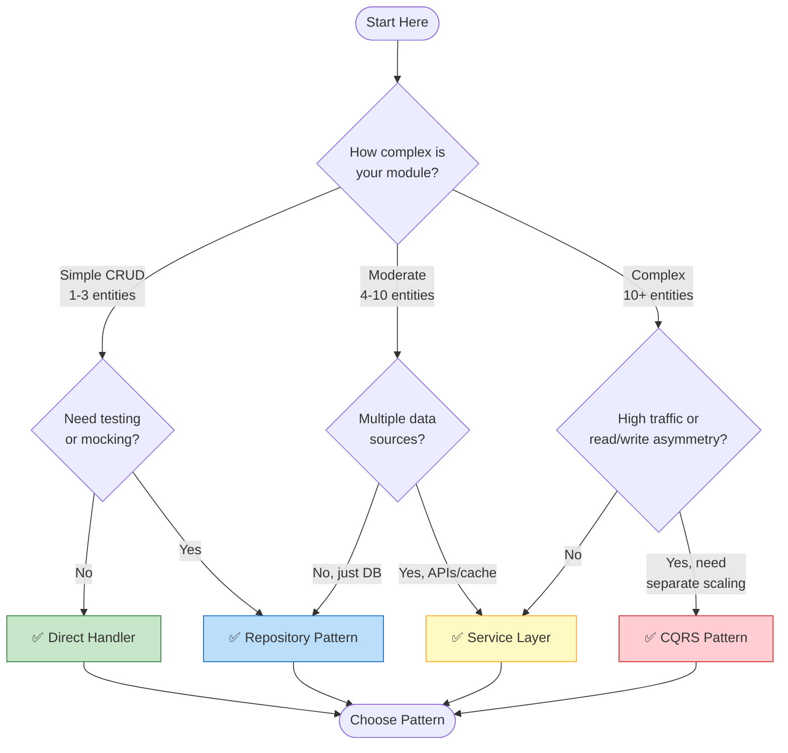
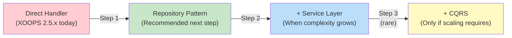

<span class="version-badge version-25x">2.5.x ✅</span> <span class="version-badge version-40x">4.0.x ✅</span>

> **Який шаблон я маю використовувати?** Це дерево рішень допомагає вам вибирати між прямими обробниками, шаблоном сховища, рівнем обслуговування та CQRS.

---

## Дерево швидкого прийняття рішень

---

## Порівняння шаблонів

| Критерії | Прямий обробник | Репозиторій | Сервісний рівень | CQRS |
|----------|--------------|------------|--------------|------|
| **Складність** | ⭐ | ⭐⭐ | ⭐⭐⭐ | ⭐⭐⭐⭐⭐ |
| **Можливість перевірки** | ❌ Жорсткий | ✅ Добре | ✅ Чудово | ✅ Чудово |
| **Гнучкість** | ❌ Низький | ✅ Середній | ✅ Високий | ✅ Дуже високий |
| **XOOPS 2.5.x** | ✅ Рідний | ✅ Працює | ✅ Працює | ⚠️ Комплекс |
| **XOOPS 4.0** | ⚠️ Застаріле | ✅ Рекомендовано | ✅ Рекомендовано | ✅ Для масштабу |
| **Розмір команди** | 1 розробник | 1-3 розробники | 2-5 розробників | 5+ розробників |
| **Технічне обслуговування** | ❌ Вища | ✅ Помірний | ✅ Нижня | ⚠️ Потрібні знання |

---

## Коли використовувати кожен шаблон

### ✅ Прямий обробник (`XoopsPersistableObjectHandler`)

**Найкраще для:** Прості модулі, швидкі прототипи, навчання XOOPS
```php
// Simple and direct - good for small modules
$handler = xoops_getModuleHandler('article', 'news');
$articles = $handler->getObjects(new Criteria('status', 1));
```
**Виберіть це, коли:**
- Створення простого модуля з 1-3 таблицями бази даних
- Створення швидкого прототипу
- Ви єдиний розробник і вам не потрібні тести
- Модуль істотно не збільшиться

**Обмеження:**
- Складно для модульного тестування (глобальна залежність)
— Тісний зв’язок із рівнем бази даних XOOPS
- Бізнес-логіка має тенденцію просочуватися в контролери

---

### ✅ Шаблон сховища

**Найкраще для:** більшості модулів, команд, яким потрібна можливість тестування
```php
// Abstraction allows mocking for tests
interface ArticleRepositoryInterface {
    public function findPublished(): array;
    public function save(Article $article): void;
}

class XoopsArticleRepository implements ArticleRepositoryInterface {
    private $handler;

    public function __construct() {
        $this->handler = xoops_getModuleHandler('article', 'news');
    }

    public function findPublished(): array {
        return $this->handler->getObjects(new Criteria('status', 1));
    }
}
```
**Виберіть це, коли:**
- Ви хочете написати модульні тести
- Ви можете змінити джерела даних пізніше (DB → API)
- Робота з 2+ розробниками
- Побудова модулів для розповсюдження

**Шлях оновлення:** Це рекомендований шаблон для підготовки до XOOPS 4.0.

---

### ✅ Сервісний рівень

**Найкраще для:** Модулів зі складною бізнес-логікою
```php
// Service coordinates multiple repositories and contains business rules
class ArticlePublicationService {
    public function __construct(
        private ArticleRepositoryInterface $articles,
        private NotificationServiceInterface $notifications,
        private CacheInterface $cache
    ) {}

    public function publish(int $articleId): void {
        $article = $this->articles->find($articleId);
        $article->setStatus('published');
        $article->setPublishedAt(new DateTime());

        $this->articles->save($article);
        $this->notifications->notifySubscribers($article);
        $this->cache->invalidate("article:{$articleId}");
    }
}
```
**Виберіть це, коли:**
- Операції охоплюють кілька джерел даних
– Правила ведення бізнесу складні
- Вам потрібен менеджмент транзакцій
- Кілька частин програми роблять те саме

**Шлях оновлення:** Об’єднайте зі сховищем для надійної архітектури.

---

### ⚠️ CQRS (розподіл відповідальності за командний запит)

**Найкраще для:** високомасштабних модулів з асиметрією read/write
```php
// Commands modify state
class PublishArticleCommand {
    public function __construct(
        public readonly int $articleId,
        public readonly int $publisherId
    ) {}
}

// Queries read state (can use denormalized read models)
class GetPublishedArticlesQuery {
    public function __construct(
        public readonly int $limit = 10
    ) {}
}
```
**Виберіть це, коли:**
- Читання значно перевищує кількість записів (100:1 або більше)
- Вам потрібне інше масштабування для читання та запису
- Складні вимоги reporting/analytics
- Пошук подій принесе користь вашому домену

**Попередження:** CQRS значно ускладнює роботу. Більшості модулів XOOPS це не потрібно.

---

## Рекомендований шлях оновлення

### Крок 1: оберніть обробники в репозиторії (2-4 години)

1. Створіть інтерфейс для ваших потреб у доступі до даних
2. Реалізуйте це за допомогою наявного обробника
3. Введіть репозиторій замість безпосереднього виклику `xoops_getModuleHandler()`

### Крок 2: додайте рівень обслуговування за потреби (1-2 дні)

1. Коли бізнес-логіка з’явиться в контролерах, розпакуйте до служби
2. Сервіс використовує репозиторії, а не безпосередньо обробники
3. Контролери стають тонкими (маршрут → послуга → відповідь)

### Крок 3. Розгляньте CQRS, лише якщо (рідко)

1. У вас мільйони читань на день
2. Моделі читання та запису істотно відрізняються
3. Вам потрібен джерело подій для журналів аудиту
4. У вас є команда, яка має досвід роботи з CQRS

---

## Коротка довідкова картка

| Питання | Відповідь |
|----------|--------|
| **"Мені просто потрібні дані save/load"** | Прямий обробник |
| **"Я хочу написати контрольну роботу"** | Шаблон сховища |
| **"У мене складні бізнес-правила"** | Сервісний рівень |
| **"Мені потрібно масштабувати читання окремо"** | CQRS |
| **"Я готуюся до XOOPS 4.0"** | Репозиторій + Сервісний рівень |

---

## Пов'язана документація

- [Посібник із шаблонів сховища](Patterns/Repository-Pattern.md)
- [Посібник із шаблонів рівня обслуговування] (Patterns/Service-Layer-Pattern.md)
- [CQRS Pattern Guide](../07-XOOPS-4.0/Implementation-Guides/CQRS-Pattern-Guide.md) *(розширений)*
- [Контракт гібридного режиму](../07-XOOPS-4.0/Specifications/Hybrid-Mode-Contract.md)

---

#шаблони #доступ до даних #дерево рішень #найкращі практики #xoops