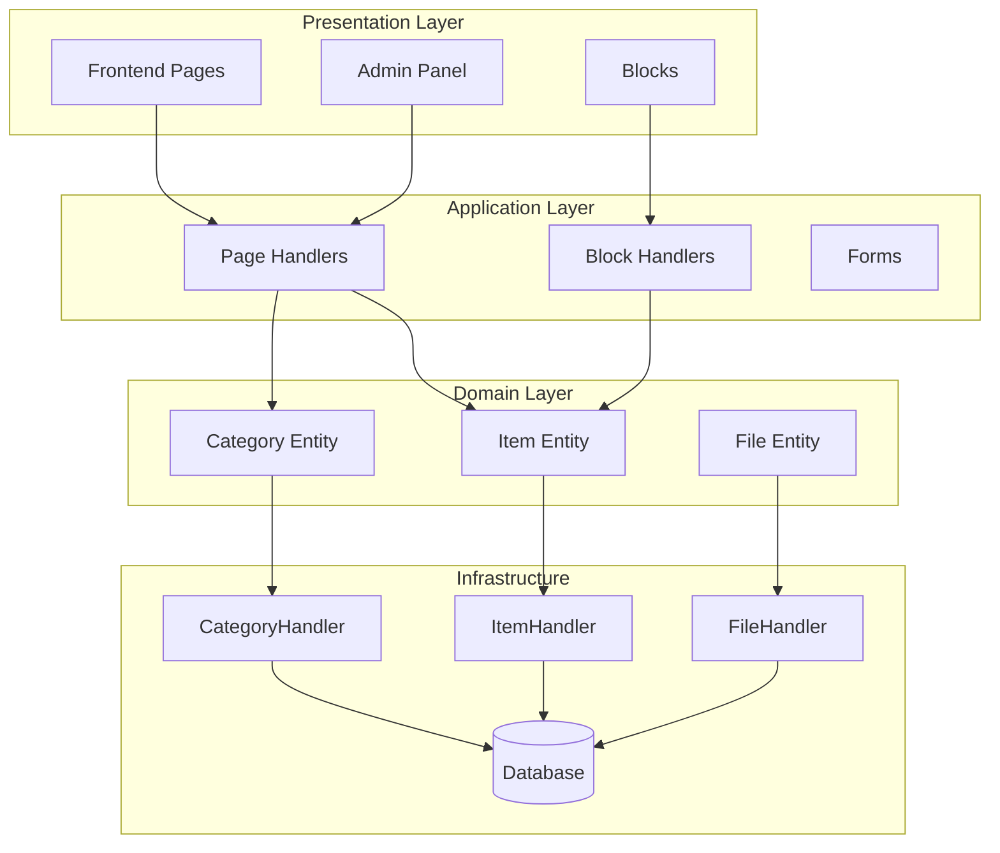
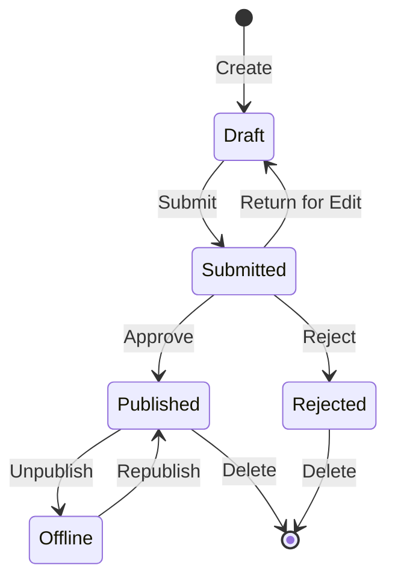

## Огляд

Цей документ містить технічний аналіз архітектури модуля Publisher, шаблонів і деталей реалізації. Використовуйте це як довідник, щоб зрозуміти структуру високоякісного модуля XOOPS.

## Огляд архітектури

## Структура каталогу
```
publisher/
├── admin/
│   ├── index.php           # Admin dashboard
│   ├── item.php            # Article management
│   ├── category.php        # Category management
│   ├── permission.php      # Permissions
│   ├── file.php            # File manager
│   └── menu.php            # Admin menu
├── assets/
│   ├── css/
│   ├── js/
│   └── images/
├── class/
│   ├── Category.php        # Category entity
│   ├── CategoryHandler.php # Category data access
│   ├── Item.php            # Article entity
│   ├── ItemHandler.php     # Article data access
│   ├── File.php            # File attachment
│   ├── FileHandler.php     # File data access
│   ├── Form/               # Form classes
│   ├── Common/             # Utilities
│   └── Helper.php          # Module helper
├── include/
│   ├── common.php          # Initialization
│   ├── functions.php       # Utility functions
│   ├── oninstall.php       # Install hooks
│   ├── onupdate.php        # Update hooks
│   └── search.php          # Search integration
├── language/
├── templates/
├── sql/
└── xoops_version.php
```
## Аналіз сутностей

### Пункт (стаття) Сутність
```php
class Item extends \XoopsObject
{
    // Fields
    public function initVar(): void
    {
        $this->initVar('itemid', XOBJ_DTYPE_INT, null, false);
        $this->initVar('categoryid', XOBJ_DTYPE_INT, 0, false);
        $this->initVar('title', XOBJ_DTYPE_TXTBOX, '', true);
        $this->initVar('subtitle', XOBJ_DTYPE_TXTBOX, '');
        $this->initVar('summary', XOBJ_DTYPE_TXTAREA, '');
        $this->initVar('body', XOBJ_DTYPE_TXTAREA, '', true);
        $this->initVar('uid', XOBJ_DTYPE_INT, 0);
        $this->initVar('status', XOBJ_DTYPE_INT, 0);
        $this->initVar('datesub', XOBJ_DTYPE_INT, time());
        // ... more fields
    }

    // Business methods
    public function isPublished(): bool
    {
        return $this->getVar('status') == _PUBLISHER_STATUS_PUBLISHED;
    }

    public function canEdit(int $userId): bool
    {
        return $this->getVar('uid') == $userId
            || $this->isAdmin($userId);
    }
}
```
### Шаблон обробника
```php
class ItemHandler extends \XoopsPersistableObjectHandler
{
    public function __construct(\XoopsDatabase $db)
    {
        parent::__construct(
            $db,
            'publisher_items',
            Item::class,
            'itemid',
            'title'
        );
    }

    public function getPublishedItems(int $limit = 10): array
    {
        $criteria = new \CriteriaCompo();
        $criteria->add(new \Criteria('status', _PUBLISHER_STATUS_PUBLISHED));
        $criteria->setSort('datesub');
        $criteria->setOrder('DESC');
        $criteria->setLimit($limit);

        return $this->getObjects($criteria);
    }
}
```
## Система дозволів

### Типи дозволів

| Дозвіл | Опис |
|------------|-------------|
| `publisher_view` | Переглянути category/articles |
| `publisher_submit` | Надіслати нові статті |
| `publisher_approve` | Автоматичне затвердження подання |
| `publisher_moderate` | Огляд статей, що очікують на розгляд |
| `publisher_global` | Глобальні дозволи модуля |

### Перевірка дозволу
```php
class PermissionHandler
{
    public function isGranted(string $permission, int $categoryId): bool
    {
        $userId = $GLOBALS['xoopsUser']?->uid() ?? 0;
        $groups = $this->getUserGroups($userId);

        return $this->grouppermHandler->checkRight(
            $permission,
            $categoryId,
            $groups,
            $this->helper->getModule()->mid()
        );
    }
}
```
## Стани робочого процесу

## Структура шаблону

### Шаблони інтерфейсу

| Шаблон | Призначення |
|----------|---------|
| `publisher_index.tpl` | Головна сторінка модуля |
| `publisher_item.tpl` | Окрема стаття |
| `publisher_category.tpl` | Перелік категорій |
| `publisher_submit.tpl` | Форма подання |
| `publisher_search.tpl` | Результати пошуку |

### Шаблони блоків

| Шаблон | Призначення |
|----------|---------|
| `publisher_block_latest.tpl` | Останні статті |
| `publisher_block_spotlight.tpl` | Вибрана стаття |
| `publisher_block_category.tpl` | Меню категорій |

## Використані ключові шаблони

1. **Шаблон обробника** – інкапсуляція доступу до даних
2. **Value Object** – константи стану
3. **Метод шаблону** - генерація форми
4. **Стратегія** - Різні режими відображення
5. **Спостерігач** - Повідомлення про події

## Уроки для розробки модулів

1. Використовуйте XoopsPersistableObjectHandler для CRUD
2. Впровадити детальні дозволи
3. Відокремте виклад від логіки
4. Використовуйте критерії для запитів
5. Підтримка кількох статусів вмісту
6. Інтеграція з системою сповіщень XOOPS

## Пов'язана документація

- Створення статей - Управління статтями
- Managing-Categories - Система категорій
- Permissions-Setup - Налаштування дозволів
- Developer-Guide/Hooks-and-Events - Точки розширення