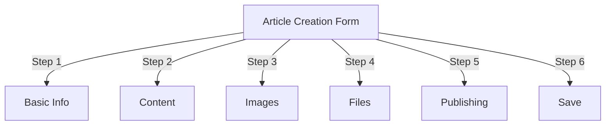
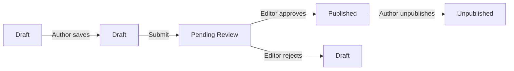
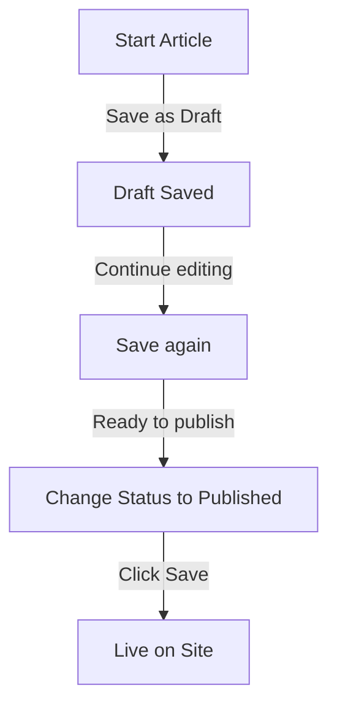

# Створення статей у Publisher

> Покроковий посібник зі створення, редагування, форматування та публікації статей у модулі Publisher.

---

## Доступ до керування статтями

### Навігація панелі адміністратора
```
Admin Panel
└── Modules
    └── Publisher
        └── Articles
            ├── Create New
            ├── Edit
            ├── Delete
            └── Publish
```
### Найшвидший шлях

1. Увійдіть як **Адміністратор**
2. Натисніть **Модулі** на панелі адміністратора
3. Знайдіть **Видавця**
4. Натисніть посилання **Адміністратор**
5. Натисніть **Статті** в меню ліворуч
6. Натисніть кнопку **Додати статтю**

---

## Форма створення статті

### Основна інформація

При створенні нової статті заповніть наступні розділи:

---

## Крок 1: Основна інформація

### Обов'язкові поля

#### Назва статті
```
Field: Title
Type: Text input (required)
Max length: 255 characters
Example: "Top 5 Tips for Better Photography"
```
**Рекомендації:**
- Описово-конкретні
- Додайте ключові слова для SEO
- Уникайте ВСІХ ВЕЛИКИХ БУКВ
- Зберігайте менше 60 символів для найкращого відображення

#### Виберіть категорію
```
Field: Category
Type: Dropdown (required)
Options: List of created categories
Example: Photography > Tutorials
```
**Поради:**
- Доступні батьківські та підкатегорії
- Виберіть найбільш відповідну категорію
- Тільки одна категорія на статтю
- Можна змінити пізніше

#### Підзаголовок статті (необов'язково)
```
Field: Subtitle
Type: Text input (optional)
Max length: 255 characters
Example: "Learn photography fundamentals in 5 easy steps"
```
**Використовувати для:**
- Короткий заголовок
- Текст тизера
- Розширена назва

### Опис статті

#### Короткий опис
```
Field: Short Description
Type: Textarea (optional)
Max length: 500 characters
```
**Мета:**
- Текст попереднього перегляду статті
- Відображення в списку категорій
- Використовується в результатах пошуку
— Метаопис для SEO

**Приклад:**
```
"Discover essential photography techniques that will transform your photos
from ordinary to extraordinary. This comprehensive guide covers composition,
lighting, and exposure settings."
```
#### Повний вміст
```
Field: Article Body
Type: WYSIWYG Editor (required)
Max length: Unlimited
Format: HTML
```
Область основного вмісту статті з редагуванням форматованого тексту.

---

## Крок 2: Форматування вмісту

### Використання редактора WYSIWYG

#### Форматування тексту
```
Bold:           Ctrl+B or click [B] button
Italic:         Ctrl+I or click [I] button
Underline:      Ctrl+U or click [U] button
Strikethrough:  Alt+Shift+D or click [S] button
Subscript:      Ctrl+, (comma)
Superscript:    Ctrl+. (period)
```
#### Структура заголовка

Створіть правильну ієрархію документів:
```html
<h1>Article Title</h1>      <!-- Use once at top -->
<h2>Main Section</h2>        <!-- For major sections -->
<h3>Subsection</h3>          <!-- For subtopics -->
<h4>Sub-subsection</h4>      <!-- For details -->
```
**У редакторі:**
- Натисніть спадне меню **Формат**
- Виберіть рівень заголовка (H1-H6)
- Введіть свій заголовок

#### Списки

**Невпорядкований список (маркери):**
```markdown
• Point one
• Point two
• Point three
```
Кроки в редакторі:
1. Натисніть [≡] кнопку списку маркерів
2. Введіть кожну точку
3. Натисніть Enter для наступного пункту
4. Двічі натисніть Backspace, щоб завершити список

**Упорядкований список (нумерований):**
```markdown
1. First step
2. Second step
3. Third step
```
Кроки в редакторі:
1. Натисніть кнопку [1.] Нумерований список
2. Введіть кожен елемент
3. Натисніть Enter для наступного
4. Двічі натисніть Backspace, щоб завершити

**Вкладені списки:**
```markdown
1. Main point
   a. Sub-point
   b. Sub-point
2. Next point
```
Кроки:
1. Створіть перший список
2. Натисніть Tab, щоб зробити відступ
3. Створіть вкладені елементи
4. Щоб зменшити відступ, натисніть Shift+Tab

#### Посилання

**Додати гіперпосилання:**

1. Виберіть текст для посилання
2. Натисніть кнопку **[🔗] Посилання**
3. Введіть URL: `https://example.com`
4. Додатково: додайте title/target
5. Натисніть **Вставити посилання**

**Видалити посилання:**

1. Клацніть у тексті посилання
2. Натисніть кнопку **[🔗] Видалити посилання**

#### Код і цитати

**Цитата:**
```
"This is an important quote from an expert"
- Attribution
```
Кроки:
1. Наберіть текст цитати
2. Натисніть кнопку **[❝] Цитата**
3. Текст з відступом і стилем

**Кодовий блок:**
```python
def hello_world():
    print("Hello, World!")
```
Кроки:
1. Натисніть **Формат → Код**
2. Вставте код
3. Виберіть мову (необов'язково)
4. Відображення коду з підсвічуванням синтаксису

---

## Крок 3: Додавання зображень

### Рекомендоване зображення (геройське зображення)
```
Field: Featured Image / Main Image
Type: Image upload
Format: JPG, PNG, GIF, WebP
Max size: 5 MB
Recommended: 600x400 px
```
**Для завантаження:**

1. Натисніть кнопку **Завантажити зображення**
2. Виберіть зображення з комп’ютера
3. Crop/resize, якщо потрібно
4. Натисніть **Використати це зображення**

**Розміщення зображення:**
- Відображається у верхній частині статті
- Використовується в списках категорій
- Показано в архіві
- Використовується для поширення в соціальних мережах

### Вбудовані зображення

Вставте зображення в текст статті:

1. Розмістіть курсор у редакторі там, де має бути зображення
2. Натисніть кнопку **[🖼️] Зображення** на панелі інструментів
3. Виберіть варіант завантаження:
   - Завантажте нове зображення
   - Виберіть із галереї
   - Введіть зображення URL
4. Налаштуйте:   
```
   Image Size:
   - Width: 300-600 px
   - Height: Auto (maintains ratio)
   - Alignment: Left/Center/Right
   
```
5. Натисніть **Вставити зображення**

**Обтікання текстом навколо зображення:**

У редакторі після вставки:
```html
<!-- Image floats left, text wraps around -->

```
### Галерея зображень

Створити галерею з кількома зображеннями:

1. Натисніть кнопку **Галерея** (якщо доступна)
2. Завантажте декілька зображень:
   - Один клік: Додати один
   - Перетягніть: додайте декілька
3. Упорядкуйте порядок перетягуванням
4. Встановіть підписи для кожного зображення
5. Натисніть **Створити галерею**

---

## Крок 4: Вкладення файлів

### Додати вкладені файли
```
Field: File Attachments
Type: File upload (multiple allowed)
Supported: PDF, DOC, XLS, ZIP, etc.
Max per file: 10 MB
Max per article: 5 files
```
**Щоб прикріпити:**

1. Натисніть кнопку **Додати файл**
2. Виберіть файл із комп’ютера
3. Додатково: додайте опис файлу
4. Натисніть **Прикріпити файл**
5. Повторіть для кількох файлів

**Приклади файлів:**
- посібники у форматі PDF
- Електронні таблиці Excel
- Документи Word
- ZIP архіви
- Вихідний код

### Керування вкладеними файлами

**Редагувати файл:**

1. Натисніть назву файлу
2. Редагувати опис
3. Натисніть **Зберегти**

**Видалити файл:**

1. Знайти файл у списку
2. Натисніть значок **[×] Видалити**
3. Підтвердьте видалення

---

## Крок 5: Публікація та статус

### Статус статті
```
Field: Status
Type: Dropdown
Options:
  - Draft: Not published, only author sees
  - Pending: Waiting for approval
  - Published: Live on site
  - Archived: Old content
  - Unpublished: Was published, now hidden
```
**Робочий процес стану:**

### Параметри публікації

#### Опублікувати негайно
```
Status: Published
Start Date: Today (auto-filled)
End Date: (leave blank for no expiration)
```
#### Розклад на потім
```
Status: Scheduled
Start Date: Future date/time
Example: February 15, 2024 at 9:00 AM
```
Стаття буде автоматично опублікована у вказаний час.

#### Встановити термін дії
```
Enable Expiration: Yes
Expiration Date: Future date
Action: Archive/Hide/Delete
Example: April 1, 2024 (article auto-archives)
```
### Параметри видимості
```yaml
Show Article:
  - Display on front page: Yes/No
  - Show in category: Yes/No
  - Include in search: Yes/No
  - Include in recent articles: Yes/No

Featured Article:
  - Mark as featured: Yes/No
  - Featured section position: (number)
```
---

## Крок 6: SEO і метадані

### SEO Налаштування
```
Field: SEO Settings (Expand section)
```
#### Метаопис
```
Field: Meta Description
Type: Text (160 characters recommended)
Used by: Search engines, social media

Example:
"Learn photography fundamentals in 5 easy steps.
Discover composition, lighting, and exposure techniques."
```
#### Мета-ключові слова
```
Field: Meta Keywords
Type: Comma-separated list
Max: 5-10 keywords

Example: Photography, Tutorial, Composition, Lighting, Exposure
```
#### URL Слимак
```
Field: URL Slug (auto-generated from title)
Type: Text
Format: lowercase, hyphens, no spaces

Auto: "top-5-tips-for-better-photography"
Edit: Change before publishing
```
#### Теги відкритого графіка

Автоматично створено з інформації про статтю:
- Назва
- Опис
- Рекомендоване зображення
- Артикул URL
- Дата публікації

Використовується Facebook, LinkedIn, WhatsApp тощо.

---

## Крок 7: Коментарі та взаємодія

### Налаштування коментарів
```yaml
Allow Comments:
  - Enable: Yes/No
  - Default: Inherit from preferences
  - Override: Specific to this article

Moderate Comments:
  - Require approval: Yes/No
  - Default: Inherit from preferences
```
### Налаштування рейтингу
```yaml
Allow Ratings:
  - Enable: Yes/No
  - Scale: 5 stars (default)
  - Show average: Yes/No
  - Show count: Yes/No
```
---

## Крок 8: Додаткові параметри

### Автор і автор
```
Field: Author
Type: Dropdown
Default: Current user
Options: All users with author permission

Display:
  - Show author name: Yes/No
  - Show author bio: Yes/No
  - Show author avatar: Yes/No
```
### Редагувати блокування
```
Field: Edit Lock
Purpose: Prevent accidental changes

Lock Article:
  - Locked: Yes/No
  - Lock reason: "Final version"
  - Unlock date: (optional)
```
### Історія версій

Автоматично збережені версії статті:
```
View Revisions:
  - Click "Revision History"
  - Shows all saved versions
  - Compare versions
  - Restore previous version
```
---

## Збереження та публікація

### Зберегти робочий процес

### Зберегти статтю

**Автозбереження:**
- Спрацьовує кожні 60 секунд
- Автоматично зберігає як чернетку
- Показує "Востаннє збережено: 2 хвилини тому"

**Збереження вручну:**
- Натисніть **Зберегти та продовжити**, щоб продовжити редагування
- Натисніть **Зберегти та переглянути**, щоб переглянути опубліковану версію
- Натисніть **Зберегти**, щоб зберегти та закрити

### Опублікувати статтю

1. Встановіть **Статус**: Опубліковано
2. Встановіть **Дата початку**: Зараз (або дата в майбутньому)
3. Натисніть **Зберегти** або **Опублікувати**
4. З'явиться повідомлення про підтвердження
5. Стаття опублікована (або запланована)

---

## Редагування існуючих статей

### Доступ до редактора статей

1. Перейдіть до **Адміністратор → Видавець → Статті**
2. Знайти статтю в списку
3. Натисніть **Редагувати** icon/button
4. Внесіть зміни
5. Натисніть **Зберегти**

### Масове редагування

Редагувати кілька статей одночасно:
```
1. Go to Articles list
2. Select articles (checkboxes)
3. Choose "Bulk Edit" from dropdown
4. Change selected field
5. Click "Update All"

Available for:
  - Status
  - Category
  - Featured (Yes/No)
  - Author
```
### Попередній перегляд статті

Перед публікацією:

1. Натисніть кнопку **Попередній перегляд**
2. Перегляньте так, як побачать читачі
3. Перевірте форматування
4. Тестові посилання
5. Поверніться до редактора, щоб налаштувати

---

## Управління статтями

### Переглянути всі статті

**Перегляд списку статей:**
```
Admin → Publisher → Articles

Columns:
  - Title
  - Category
  - Author
  - Status
  - Created date
  - Modified date
  - Actions (Edit, Delete, Preview)

Sorting:
  - By title (A-Z)
  - By date (newest/oldest)
  - By status (Published/Draft)
  - By category
```
### Фільтрувати статті
```
Filter Options:
  - By category
  - By status
  - By author
  - By date range
  - Search by title

Example: Show all "Draft" articles by "John" in "News" category
```
### Видалити статтю

**М'яке видалення (рекомендовано):**

1. Змінити **Статус**: Не опубліковано
2. Натисніть **Зберегти**
3. Стаття прихована, але не видалена
4. Можна відновити пізніше

**Жорстке видалення:**

1. Виберіть статтю зі списку
2. Натисніть кнопку **Видалити**
3. Підтвердьте видалення
4. Статтю видалено остаточно

---

## Рекомендації щодо вмісту

### Написання якісних статей
```
Structure:
  ✓ Compelling title
  ✓ Clear subtitle/description
  ✓ Engaging opening paragraph
  ✓ Logical sections with headers
  ✓ Supporting visuals
  ✓ Conclusion/summary
  ✓ Call-to-action

Length:
  - Blog posts: 500-2000 words
  - News: 300-800 words
  - Guides: 2000-5000 words
  - Minimum: 300 words
```
### SEO Оптимізація
```
Title Optimization:
  ✓ Include primary keyword
  ✓ Keep under 60 characters
  ✓ Put keyword near beginning
  ✓ Be descriptive and specific

Content Optimization:
  ✓ Use headings (H1, H2, H3)
  ✓ Include keyword in heading
  ✓ Use bold for important terms
  ✓ Add descriptive links
  ✓ Include images with alt text

Meta Description:
  ✓ Include primary keyword
  ✓ 155-160 characters
  ✓ Action-oriented
  ✓ Unique per article
```
### Поради щодо форматування
```
Readability:
  ✓ Short paragraphs (2-4 sentences)
  ✓ Bullet points for lists
  ✓ Subheadings every 300 words
  ✓ Generous whitespace
  ✓ Line breaks between sections

Visual Appeal:
  ✓ Featured image at top
  ✓ Inline images in content
  ✓ Alt text on all images
  ✓ Code blocks for technical
  ✓ Blockquotes for emphasis
```
---

## Комбінації клавіш

### Ярлики редактора
```
Bold:               Ctrl+B
Italic:             Ctrl+I
Underline:          Ctrl+U
Link:               Ctrl+K
Save Draft:         Ctrl+S
```
### Текстові ярлики
```
-- →  (dash to em dash)
... → … (three dots to ellipsis)
(c) → © (copyright)
(r) → ® (registered)
(tm) → ™ (trademark)
```
---

## Загальні завдання

### Копіювати статтю

1. Відкрити статтю
2. Натисніть кнопку **Дублювати** або **Клонувати**
3. Стаття скопійована як чернетка
4. Відредагуйте назву та зміст
5. Опублікувати

### Стаття розкладу

1. Створити статтю
2. Встановіть **Дата початку**: майбутнє date/time
3. Встановіть **Статус**: Опубліковано
4. Натисніть **Зберегти**
5. Стаття публікується автоматично

### Пакетна публікація

1. Створіть статті як чернетки
2. Встановіть дати публікації
3. Статті автоматично публікуються в запланований час
4. Монітор із перегляду «За розкладом».

### Переміщення між категоріями

1. Редагувати статтю
2. Змініть спадне меню **Категорія**
3. Натисніть **Зберегти**
4. Стаття з'являється в новій категорії

---

## Усунення несправностей

### Проблема: не вдається зберегти статтю

**Рішення:**
```
1. Check form for required fields
2. Verify category is selected
3. Check PHP memory limit
4. Try saving as draft first
5. Clear browser cache
```
### Проблема: зображення не відображаються

**Рішення:**
```
1. Verify image upload succeeded
2. Check image file format (JPG, PNG)
3. Verify image path in database
4. Check upload directory permissions
5. Try re-uploading image
```
### Проблема: панель інструментів редактора не відображається

**Рішення:**
```
1. Clear browser cache
2. Try different browser
3. Disable browser extensions
4. Check JavaScript console for errors
5. Verify editor plugin installed
```
### Проблема: стаття не публікується

**Рішення:**
```
1. Verify Status = "Published"
2. Check Start Date is today or earlier
3. Verify permissions allow publishing
4. Check category is published
5. Clear module cache
```
---

## Пов'язані посібники

- Керівництво з налаштування
- Управління категоріями
- Налаштування дозволу
- Користувацькі шаблони

---

## Наступні кроки

- Створіть свою першу статтю
- Налаштувати категорії
- Налаштувати дозволи
- Перегляньте налаштування шаблону

---

#видавництво #статті #контент #створення #форматування #редагування #xoops