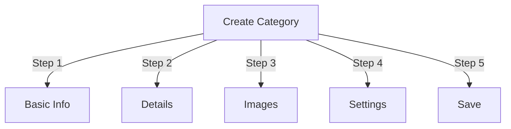

# Керування категоріями в Publisher

> Повний посібник зі створення, організації ієрархій і керування категоріями в модулі Publisher.

---

## Основи категорій

### Що таке категорії?

Категорії впорядковують статті в логічні групи:
```
Example Structure:

  News (Main Category)
    ├── Technology
    ├── Sports
    └── Entertainment

  Tutorials (Main Category)
    ├── Photography
    │   ├── Basics
    │   └── Advanced
    └── Writing
        └── Blogging
```
### Переваги хорошої структури категорій
```
✓ Better user navigation
✓ Organized content
✓ Improved SEO
✓ Easier content management
✓ Better editorial workflow
```
---

## Керування категоріями доступу

### Навігація панелі адміністратора
```
Admin Panel
└── Modules
    └── Publisher
        └── Categories
            ├── Create New
            ├── Edit
            ├── Delete
            ├── Permissions
            └── Organize
```
### Швидкий доступ

1. Увійдіть як **Адміністратор**
2. Перейдіть до **Адміністратор → Модулі**
3. Натисніть **Видавець → Адміністратор**
4. Натисніть **Категорії** в меню ліворуч

---

## Створення категорій

### Форма створення категорії

### Крок 1: Основна інформація

#### Назва категорії
```
Field: Category Name
Type: Text input (required)
Max length: 100 characters
Uniqueness: Should be unique
Example: "Photography"
```
**Рекомендації:**
- Опис і послідовно в однині чи множині
- Правильно з великої літери
- Уникайте спеціальних символів
- Будьте досить короткими

#### Опис категорії
```
Field: Description
Type: Textarea (optional)
Max length: 500 characters
Used in: Category listing pages, category blocks
```
**Мета:**
- Пояснює зміст категорії
- З’являється над статтями категорії
- Допомагає користувачам зрозуміти масштаб
- Використовується для метаопису SEO

**Приклад:**
```
"Photography tips, tutorials, and inspiration for
all skill levels. From composition basics to advanced
lighting techniques, master your craft."
```
### Крок 2: Батьківська категорія

#### Створити ієрархію
```
Field: Parent Category
Type: Dropdown
Options: None (root), or existing categories
```
**Приклади ієрархії:**
```
Flat Structure:
  News
  Tutorials
  Reviews

Nested Structure:
  News
    Technology
    Business
    Sports
  Tutorials
    Photography
      Basics
      Advanced
    Writing
```
**Створити підкатегорію:**

1. Натисніть спадне меню **Батьківська категорія**
2. Виберіть головний елемент (наприклад, «Новини»)
3. Введіть назву категорії
4. Зберегти
5. Нова категорія з'являється як дочірня

### Крок 3: Зображення категорії

#### Завантажте зображення категорії
```
Field: Category Image
Type: Image upload (optional)
Format: JPG, PNG, GIF, WebP
Max size: 5 MB
Recommended: 300x200 px (or your theme size)
```
**Для завантаження:**

1. Натисніть кнопку **Завантажити зображення**
2. Виберіть зображення з комп’ютера
3. Crop/resize, якщо потрібно
4. Натисніть **Використати це зображення**

**Де використовується:**
- Сторінка списку категорій
- Заголовок блоку категорії
- Хлібна крихта (деякі теми)
- Обмін у соціальних мережах

### Крок 4: Налаштування категорії

#### Налаштування дисплея
```yaml
Status:
  - Enabled: Yes/No
  - Hidden: Yes/No (hidden from menus, still accessible)

Display Options:
  - Show description: Yes/No
  - Show image: Yes/No
  - Show article count: Yes/No
  - Show subcategories: Yes/No

Layout:
  - Items per page: 10-50
  - Display order: Date/Title/Author
  - Display direction: Ascending/Descending
```
#### Дозволи категорій
```yaml
Who Can View:
  - Anonymous: Yes/No
  - Registered: Yes/No
  - Specific groups: Configure per group

Who Can Submit:
  - Registered: Yes/No
  - Specific groups: Configure per group
  - Author must have: "submit articles" permission
```
### Крок 5: Налаштування SEO

#### Мета-теги
```
Field: Meta Description
Type: Text (160 characters)
Purpose: Search engine description

Field: Meta Keywords
Type: Comma-separated list
Example: photography, tutorials, tips, techniques
```
#### Конфігурація URL
```
Field: URL Slug
Type: Text
Auto-generated from category name
Example: "photography" from "Photography"
Can be customized before saving
```
### Зберегти категорію

1. Заповніть усі необхідні поля:
   - Назва категорії ✓
   - Опис (рекомендовано)
2. Додатково: завантажте зображення, установіть SEO
3. Натисніть **Зберегти категорію**
4. З'явиться повідомлення про підтвердження
5. Категорія тепер доступна

---

## Ієрархія категорій

### Створити вкладену структуру
```
Step-by-step example: Create News → Technology subcategory

1. Go to Categories admin
2. Click "Add Category"
3. Name: "News"
4. Parent: (leave blank - this is root)
5. Save
6. Click "Add Category" again
7. Name: "Technology"
8. Parent: "News" (select from dropdown)
9. Save
```
### Переглянути дерево ієрархії
```
Categories view shows tree structure:

📁 News
  📄 Technology
  📄 Sports
  📄 Entertainment
📁 Tutorials
  📄 Photography
    📄 Basics
    📄 Advanced
  📄 Writing
```
Натисніть стрілки розгортання до підкатегорій show/hide.

### Реорганізувати категорії

#### Перемістити категорію

1. Перейдіть до списку категорій
2. Натисніть **Редагувати** у категорії
3. Змініть **Батьківську категорію**
4. Натисніть **Зберегти**
5. Категорія переміщена на нову позицію

#### Змінити порядок категорій

Якщо доступно, використовуйте перетягування:

1. Перейдіть до списку категорій
2. Натисніть і перетягніть категорію
3. Опустіться в нове положення
4. Замовлення зберігається автоматично

#### Видалити категорію

**Варіант 1: м’яке видалення (приховати)**

1. Редагувати категорію
2. Установіть **Статус**: вимкнено
3. Натисніть **Зберегти**
4. Категорія прихована, але не видалена

**Варіант 2: жорстке видалення**

1. Перейдіть до списку категорій
2. Натисніть **Видалити** на категорії
3. Виберіть дію для статей:   
```
   ☐ Move articles to parent category
   ☐ Move articles to root (News)
   ☐ Delete all articles in category
   
```
4. Підтвердьте видалення

---

## Операції з категоріями

### Редагувати категорію

1. Перейдіть до **Адміністратор → Видавець → Категорії**
2. Натисніть **Редагувати** у категорії
3. Змінити поля:
   - Ім'я
   - Опис
   - Батьківська категорія
   - Імідж
   - Налаштування
4. Натисніть **Зберегти**

### Редагувати дозволи категорії

1. Перейдіть до категорій
2. Натисніть **Дозволи** на категорії (або клацніть категорію, а потім натисніть Дозволи)
3. Налаштуйте групи:
```
For each group:
  ☐ View articles in this category
  ☐ Submit articles to this category
  ☐ Edit own articles
  ☐ Edit all articles
  ☐ Approve/Moderate articles
  ☐ Manage category
```
4. Натисніть **Зберегти дозволи**

### Встановити зображення категорії

**Завантажити нове зображення:**

1. Редагувати категорію
2. Натисніть **Змінити зображення**
3. Завантажте або виберіть зображення
4. Crop/resize
5. Натисніть **Використати зображення**
6. Натисніть **Зберегти категорію**

**Видалити зображення:**

1. Редагувати категорію
2. Натисніть **Видалити зображення** (якщо доступно)
3. Натисніть **Зберегти категорію**

---

## Дозволи категорії

### Матриця дозволів
```
                 Anonymous  Registered  Editor  Admin
View category        ✓         ✓         ✓       ✓
Submit article       ✗         ✓         ✓       ✓
Edit own article     ✗         ✓         ✓       ✓
Edit all articles    ✗         ✗         ✓       ✓
Moderate articles    ✗         ✗         ✓       ✓
Manage category      ✗         ✗         ✗       ✓
```
### Встановити дозволи на рівні категорії

#### Контроль доступу за категоріями

1. Перейдіть до списку **Категорії**
2. Виберіть категорію
3. Натисніть **Дозволи**
4. Для кожної групи виберіть дозволи:
```
Example: News category
  Anonymous:   View only
  Registered:  Submit articles
  Editors:     Approve articles
  Admins:      Full control
```
5. Натисніть **Зберегти**

#### Дозволи на рівні поля

Контролюйте, які поля форми можуть заповнювати користувачі see/edit:
```
Example: Limit field visibility for Registered users

Registered users can see/edit:
  ✓ Title
  ✓ Description
  ✓ Content
  ✗ Author (auto-set to current user)
  ✗ Scheduled date (only editors)
  ✗ Featured (only admins)
```
**Налаштувати в:**
- Дозволи категорій
- Знайдіть розділ «Видимість поля».

---

## Найкращі методи роботи з категоріями

### Структура категорії
```
✓ Keep hierarchy 2-3 levels deep
✗ Don't create too many top-level categories
✗ Don't create categories with one article

✓ Use consistent naming (plural or singular)
✗ Don't use vague names ("Stuff", "Other")

✓ Create categories for articles that exist
✗ Don't create empty categories in advance
```
### Правила іменування
```
Good names:
  "Photography"
  "Web Development"
  "Travel Tips"
  "Business News"

Avoid:
  "Articles" (too vague)
  "Content" (redundant)
  "News&Updates" (inconsistent)
  "PHOTOGRAPHY STUFF" (formatting)
```
### Організаційні поради
```
By Topic:
  News
    Technology
    Sports
    Entertainment

By Type:
  Tutorials
    Video
    Text
    Interactive

By Audience:
  For Beginners
  For Experts
  Case Studies

Geographic:
  North America
    United States
    Canada
  Europe
```
---

## Блоки категорій

### Блок категорії видавця

Показати списки категорій на вашому сайті:

1. Перейдіть до **Адміністратор → Блоки**
2. Знайдіть **Видавець - Категорії**
3. Натисніть **Редагувати**
4. Налаштуйте:
```
Block Title: "News Categories"
Show subcategories: Yes/No
Show article count: Yes/No
Height: (pixels or auto)
```
5. Натисніть **Зберегти**

### Блок статей категорій

Показати останні статті з певної категорії:

1. Перейдіть до **Адміністратор → Блоки**
2. Знайдіть **Видавництво - Статті категорії**
3. Натисніть **Редагувати**
4. Виберіть:
```
Category: News (or specific category)
Number of articles: 5
Show images: Yes/No
Show description: Yes/No
```
5. Натисніть **Зберегти**

---

## Аналітика категорій

### Переглянути статистику категорії

Від адміністратора категорій:
```
Each category shows:
  - Total articles: 45
  - Published: 42
  - Draft: 2
  - Pending approval: 1
  - Total views: 5,234
  - Latest article: 2 hours ago
```
### Переглянути трафік категорії

Якщо аналітику ввімкнено:

1. Натисніть назву категорії
2. Перейдіть на вкладку **Статистика**
3. Перегляд:
   - Перегляди сторінок
   - Популярні статті
   - Тенденції трафіку
   - Використані терміни пошуку

---

## Шаблони категорій

### Налаштувати відображення категорії

Якщо використовуються спеціальні шаблони, кожна категорія може замінити:
```
publisher_category.tpl
  ├── Category header
  ├── Category description
  ├── Category image
  ├── Article listing
  └── Pagination
```
**Щоб налаштувати:**

1. Скопіюйте файл шаблону
2. Змініть HTML/CSS
3. Призначте категорію в адмінці
4. Категорія використовує спеціальний шаблон

---

## Загальні завдання

### Створення ієрархії новин
```
Admin → Publisher → Categories
1. Create "News" (parent)
2. Create "Technology" (parent: News)
3. Create "Sports" (parent: News)
4. Create "Entertainment" (parent: News)
```
### Переміщення статей між категоріями

1. Перейдіть до адміністратора **Статті**
2. Виберіть статті (прапорці)
3. Виберіть **"Змінити категорію"** зі спадного списку групових дій
4. Виберіть нову категорію
5. Натисніть **Оновити все**

### Приховати категорію без видалення

1. Редагувати категорію
2. Встановіть **Статус**: Disabled/Hidden
3. Зберегти
4. Категорія не відображається в меню (все ще доступна через URL)

### Створити категорію для чернеток
```
Best Practice:

Create "In Review" category
  ├── Purpose: Articles awaiting approval
  ├── Permissions: Hidden from public
  ├── Only admins/editors can see
  ├── Move articles here until approved
  └── Move to "News" when published
```
---

## Import/Export Категорії

### Експорт категорій

Якщо доступно:

1. Перейдіть до **Категорії** адмін
2. Натисніть **Експортувати**
3. Виберіть формат: CSV/JSON/XML
4. Завантажити файл
5. Резервну копію збережено

### Імпорт категорій

Якщо доступно:

1. Підготуйте файл з категоріями
2. Перейдіть до **Категорії** адмін
3. Натисніть **Імпортувати**
4. Завантажте файл
5. Виберіть стратегію оновлення:
   - Тільки створювати нові
   - Оновлення існуючих
   - Замінити все
6. Натисніть **Імпортувати**

---

## Категорії усунення несправностей

### Проблема: підкатегорії не відображаються

**Рішення:**
```
1. Verify parent category status is "Enabled"
2. Check permissions allow viewing
3. Verify subcategories have status "Enabled"
4. Clear cache: Admin → Tools → Clear Cache
5. Check theme shows subcategories
```
### Проблема: не вдається видалити категорію

**Рішення:**
```
1. Category must have no articles
2. Move or delete articles first:
   Admin → Articles
   Select articles in category
   Change category to another
3. Then delete empty category
4. Or choose "move articles" option when deleting
```
### Проблема: зображення категорії не відображається

**Рішення:**
```
1. Verify image uploaded successfully
2. Check image file format (JPG, PNG)
3. Verify upload directory permissions
4. Check theme displays category images
5. Try re-uploading image
6. Clear browser cache
```
### Проблема: дозволи не діють

**Рішення:**
```
1. Check group permissions in Category
2. Check global Publisher permissions
3. Check user belongs to configured group
4. Clear session cache
5. Log out and log back in
6. Check permission modules installed
```
---

## Категорія Перелік передових практик

Перед розгортанням категорій:

- [ ] Ієрархія складається з 2-3 рівнів
- [ ] Кожна категорія містить 5+ статей
- [ ] Назви категорій узгоджуються
- [ ] Дозволи належні
- [ ] Зображення категорій оптимізовано
- [ ] Описи повні
- [ ] Заповнено метадані SEO
- [ ] URL-адреси дружні
- [ ] Категорії перевірені на інтерфейсі
- [ ] Документацію оновлено

---

## Пов'язані посібники

- Створення статті
- Управління дозволами
- Конфігурація модуля
- Керівництво по установці

---

## Наступні кроки

- Створення статей у категоріях
- Налаштувати дозволи
- Налаштування за допомогою спеціальних шаблонів

---

#видавництво #категорії #організація #ієрархія #управління #xoops