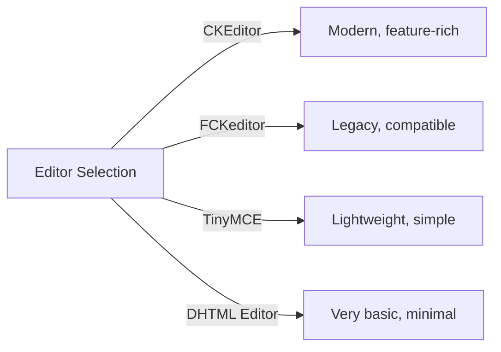
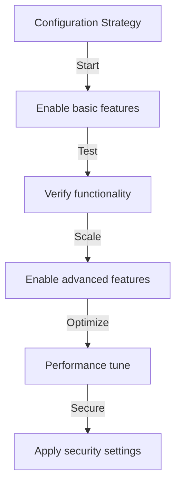

# Базова конфігурація видавця

> Налаштуйте параметри, параметри та загальні параметри модуля Publisher для інсталяції XOOPS.

---

## Доступ до конфігурації

### Навігація панелі адміністратора
```
XOOPS Admin Panel
└── Modules
    └── Publisher
        ├── Preferences
        ├── Settings
        └── Configuration
```
1. Увійдіть як **Адміністратор**
2. Перейдіть до **Панелі адміністратора → Модулі**
3. Знайдіть модуль **Publisher**
4. Натисніть **Налаштування** або посилання **Адміністратор**

---

## Загальні налаштування

### Конфігурація доступу
```
Admin Panel → Modules → Publisher
```
Натисніть **значок шестірні** або **Налаштування**, щоб переглянути ці параметри:

#### Параметри відображення

| Налаштування | Параметри | За замовчуванням | Опис |
|---------|---------|---------|-------------|
| **Елементів на сторінці** | 5-50 | 10 | Статті, показані в списках |
| **Показати навігаційну крихту** | Yes/No | Так | Відображення навігаційної стежки |
| **Використовуйте сторінку** | Yes/No | Так | Пагінація довгих списків |
| **Показати дату** | Yes/No | Так | Показати дату статті |
| **Показати категорію** | Yes/No | Так | Показати категорію статті |
| **Показати автора** | Yes/No | Так | Показати автора статті |
| **Показати перегляди** | Yes/No | Так | Показати кількість переглядів статті |

**Приклад конфігурації:**
```yaml
Items Per Page: 15
Show Breadcrumb: Yes
Use Paging: Yes
Show Date: Yes
Show Category: Yes
Show Author: Yes
Show Views: Yes
```
#### Параметри автора

| Налаштування | За замовчуванням | Опис |
|---------|---------|-------------|
| **Показати ім’я автора** | Так | Відображення справжнього імені або імені користувача |
| **Використовуйте ім’я користувача** | Ні | Показати ім'я користувача замість імені |
| **Показати електронну адресу автора** | Ні | Показати контактну електронну адресу автора |
| **Показати аватар автора** | Так | Показати аватар користувача |

---

## Конфігурація редактора

### Виберіть редактор WYSIWYG

Publisher підтримує декілька редакторів:

#### Доступні редактори

### CKEditor (рекомендовано)

**Найкраще для:** більшості користувачів, сучасні браузери, повні функції

1. Перейдіть до **Налаштування**
2. Встановіть **Редактор**: CKEditor
3. Налаштуйте параметри:
```
Editor: CKEditor 4.x
Toolbar: Full
Height: 400px
Width: 100%
Remove plugins: []
Add plugins: [mathjax, codesnippet]
```
### FCKeditor

**Найкраще для:** Сумісність, старіші системи
```
Editor: FCKeditor
Toolbar: Default
Custom config: (optional)
```
### TinyMCE

**Найкраще для:** Мінімальний розмір, базове редагування
```
Editor: TinyMCE
Plugins: [paste, table, link, image]
Toolbar: minimal
```
---

## Налаштування файлів і завантаження

### Налаштувати каталоги завантаження
```
Admin → Publisher → Preferences → Upload Settings
```
#### Налаштування типу файлу
```yaml
Allowed File Types:
  Images:
    - jpg
    - jpeg
    - gif
    - png
    - webp
  Documents:
    - pdf
    - doc
    - docx
    - xls
    - xlsx
    - ppt
    - pptx
  Archives:
    - zip
    - rar
    - 7z
  Media:
    - mp3
    - mp4
    - webm
    - mov
```
#### Обмеження розміру файлу

| Тип файлу | Максимальний розмір | Примітки |
|-----------|----------|-------|
| **Зображення** | 5 Мб | За файл зображення |
| **Документи** | 10 Мб | PDF, файли Office |
| **Медіа** | 50 МБ | Файли Video/audio |
| **Усі файли** | 100 Мб | Усього за завантаження |

**Конфігурація:**
```
Max Image Upload Size: 5 MB
Max Document Upload Size: 10 MB
Max Media Upload Size: 50 MB
Total Upload Size: 100 MB
Max Files per Article: 5
```
### Зміна розміру зображення

Видавець автоматично змінює розміри зображень для узгодженості:
```yaml
Thumbnail Size:
  Width: 150
  Height: 150
  Mode: Crop/Resize

Category Image Size:
  Width: 300
  Height: 200
  Mode: Resize

Article Featured Image:
  Width: 600
  Height: 400
  Mode: Resize
```
---

## Налаштування коментарів і взаємодії

### Конфігурація коментарів
```
Preferences → Comments Section
```
#### Параметри коментарів
```yaml
Allow Comments:
  - Enabled: Yes/No
  - Default: Yes
  - Per-article override: Yes

Comment Moderation:
  - Moderate comments: Yes/No
  - Moderate guest comments only: Yes/No
  - Spam filter: Enabled
  - Max comments per day: (unlimited)

Comment Display:
  - Display format: Threaded/Flat
  - Comments per page: 10
  - Date format: Full date/Time ago
  - Show comment count: Yes/No
```
### Конфігурація оцінок
```yaml
Allow Ratings:
  - Enabled: Yes/No
  - Default: Yes
  - Per-article override: Yes

Rating Options:
  - Rating scale: 5 stars (default)
  - Allow user to rate own: No
  - Show average rating: Yes
  - Show rating count: Yes
```
---

## Налаштування SEO & URL

### Пошукова оптимізація
```
Preferences → SEO Settings
```
#### Конфігурація URL
```yaml
SEO URLs:
  - Enabled: No (set to Yes for SEO URLs)
  - URL rewriting: None/Apache mod_rewrite/IIS rewrite

URL Format:
  - Category: /category/news
  - Article: /article/welcome-to-site
  - Archive: /archive/2024/01

Meta Description:
  - Auto-generate: Yes
  - Max length: 160 characters

Meta Keywords:
  - Auto-generate: Yes
  - From: Article tags, title
```
### Увімкнути URL-адреси SEO (Додатково)

**Попередні умови:**
- Apache з увімкненим `mod_rewrite`
- Увімкнено підтримку `.htaccess`

**Кроки налаштування:**

1. Перейдіть до **Налаштування → Налаштування SEO**
2. Установіть **URL-адреси SEO**: Так
3. Встановіть **URL Rewriting**: Apache mod_rewrite
4. Переконайтеся, що файл `.htaccess` існує в папці Publisher

**Налаштування .htaccess:**
```apache
<IfModule mod_rewrite.c>
    RewriteEngine On
    RewriteBase /modules/publisher/

    # Category rewrites
    RewriteRule ^category/([0-9]+)-(.*)\.html$ index.php?op=showcategory&categoryid=$1 [L,QSA]

    # Article rewrites
    RewriteRule ^article/([0-9]+)-(.*)\.html$ index.php?op=showitem&itemid=$1 [L,QSA]

    # Archive rewrites
    RewriteRule ^archive/([0-9]+)/([0-9]+)/$ index.php?op=archive&year=$1&month=$2 [L,QSA]
</IfModule>
```
---

## Кеш і продуктивність

### Конфігурація кешування
```
Preferences → Cache Settings
```

```yaml
Enable Caching:
  - Enabled: Yes
  - Cache type: File (or Memcache)

Cache Lifetime:
  - Category lists: 3600 seconds (1 hour)
  - Article lists: 1800 seconds (30 minutes)
  - Single article: 7200 seconds (2 hours)
  - Recent articles block: 900 seconds (15 minutes)

Cache Clear:
  - Manual clear: Available in admin
  - Auto-clear on article save: Yes
  - Clear on category change: Yes
```
### Очистити кеш

**Ручне очищення кешу:**

1. Перейдіть до **Адміністратор → Видавець → Інструменти**
2. Натисніть **Очистити кеш**
3. Виберіть типи кешу для очищення:
   - [ ] Кеш категорій
   - [ ] Кеш статей
   - [ ] Блокувати кеш
   - [ ] Весь кеш
4. Натисніть **Очистити вибране**

**Командний рядок:**
```bash
# Clear all Publisher cache
php /path/to/xoops/admin/cache_manage.php publisher

# Or directly delete cache files
rm -rf /path/to/xoops/var/cache/publisher/*
```
---

## Сповіщення та робочий процес

### Сповіщення електронною поштою
```
Preferences → Notifications
```

```yaml
Notify Admin on New Article:
  - Enabled: Yes
  - Recipient: Admin email
  - Include summary: Yes

Notify Moderators:
  - Enabled: Yes
  - On new submission: Yes
  - On pending articles: Yes

Notify Author:
  - On approval: Yes
  - On rejection: Yes
  - On comment: No (optional)
```
### Робочий процес подання
```yaml
Require Approval:
  - Enabled: Yes
  - Editor approval: Yes
  - Admin approval: No

Draft Save:
  - Auto-save interval: 60 seconds
  - Save local versions: Yes
  - Revision history: Last 5 versions
```
---

## Налаштування вмісту

### Публікація за замовчуванням
```
Preferences → Content Settings
```

```yaml
Default Article Status:
  - Draft/Published: Draft
  - Featured by default: No
  - Auto-publish time: None

Default Visibility:
  - Public/Private: Public
  - Show on front page: Yes
  - Show in categories: Yes

Scheduled Publishing:
  - Enabled: Yes
  - Allow per-article: Yes

Content Expiration:
  - Enabled: No
  - Auto-archive old: No
  - Archive after days: (unlimited)
```
### Параметри вмісту WYSIWYG
```yaml
Allow HTML:
  - In articles: Yes
  - In comments: No

Allow Embedded Media:
  - Videos (iframe): Yes
  - Images: Yes
  - Plugins: No

Content Filtering:
  - Strip tags: No
  - XSS filter: Yes (recommended)
```
---

## Налаштування пошукової системи

### Налаштувати інтеграцію пошуку
```
Preferences → Search Settings
```

```yaml
Enable Article Indexing:
  - Include in site search: Yes
  - Index type: Full text/Title only

Search Options:
  - Search in titles: Yes
  - Search in content: Yes
  - Search in comments: Yes

Meta Tags:
  - Auto generate: Yes
  - OG tags (social): Yes
  - Twitter cards: Yes
```
---

## Розширені налаштування

### Режим налагодження (тільки для розробки)
```
Preferences → Advanced
```

```yaml
Debug Mode:
  - Enabled: No (only for development!)

Development Features:
  - Show SQL queries: No
  - Log errors: Yes
  - Error email: admin@example.com
```
### Оптимізація бази даних
```
Admin → Tools → Optimize Database
```

```bash
# Manual optimization
mysql> OPTIMIZE TABLE publisher_items;
mysql> OPTIMIZE TABLE publisher_categories;
mysql> OPTIMIZE TABLE publisher_comments;
```
---

## Налаштування модуля

### Шаблони тем
```
Preferences → Display → Templates
```
Виберіть набір шаблонів:
- За замовчуванням
- Класичний
- Сучасний
- Темний
- На замовлення

Кожен шаблон керує:
- Оформлення статті
- Перелік категорій
- Відображення архіву
- Відображення коментарів

---

## Поради щодо налаштування

### Найкращі практики

1. **Почніть із простого** – спочатку ввімкніть основні функції
2. **Тестуйте кожну зміну** - перевірте, перш ніж рухатися далі
3. **Увімкнути кешування** - покращує продуктивність
4. **Спочатку резервне копіювання** - експорт налаштувань перед серйозними змінами
5. **Моніторинг журналів** - регулярно перевіряйте журнали помилок

### Оптимізація продуктивності
```yaml
For Better Performance:
  - Enable caching: Yes
  - Cache lifetime: 3600 seconds
  - Limit items per page: 10-15
  - Compress images: Yes
  - Minify CSS/JS: Yes (if available)
```
### Посилення безпеки
```yaml
For Better Security:
  - Moderate comments: Yes
  - Disable HTML in comments: Yes
  - XSS filtering: Yes
  - File type whitelist: Strict
  - Max upload size: Reasonable limit
```
---

## Export/Import Налаштування

### Резервна конфігурація
```
Admin → Tools → Export Settings
```
**Щоб створити резервну копію поточної конфігурації:**

1. Натисніть **Експорт конфігурації**
2. Збережіть завантажений файл `.cfg`
3. Зберігайте в безпечному місці

**Для відновлення:**

1. Натисніть **Імпорт конфігурації**
2. Виберіть файл `.cfg`
3. Натисніть **Відновити**

---

## Відповідні посібники з налаштування

- Управління категоріями
- Створення статті
- Конфігурація дозволу
- Керівництво по установці

---

## Конфігурація усунення несправностей

### Налаштування не зберігаються

**Рішення:**
1. Перевірте права доступу до каталогу на `/var/config/`
2. Перевірте доступ для запису PHP
3. Перевірте журнал помилок PHP на наявність проблем
4. Очистіть кеш браузера та повторіть спробу

### Редактор не відображається

**Рішення:**
1. Переконайтеся, що плагін редактора встановлено
2. Перевірте конфігурацію редактора XOOPS
3. Спробуйте інший варіант редактора
4. Перевірте консоль браузера на наявність помилок JavaScript

### Проблеми з продуктивністю

**Рішення:**
1. Увімкніть кешування
2. Зменшіть кількість елементів на сторінці
3. Стискайте зображення
4. Перевірити оптимізацію бази даних
5. Перегляньте журнал повільних запитів

---

## Наступні кроки

- Налаштувати дозволи групи
- Створіть свою першу статтю
- Налаштувати категорії
- Перегляньте власні шаблони

---

#publisher #configuration #preferences #settings #xoops