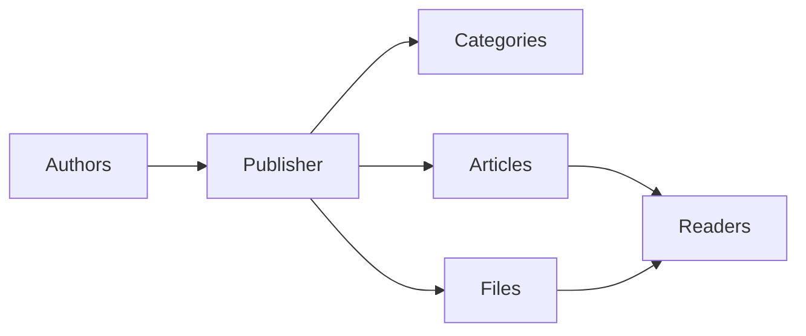
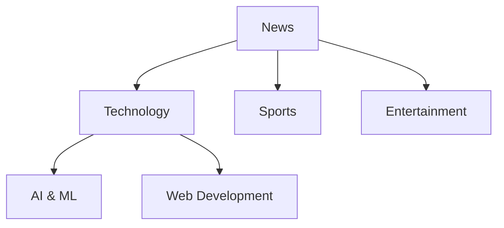
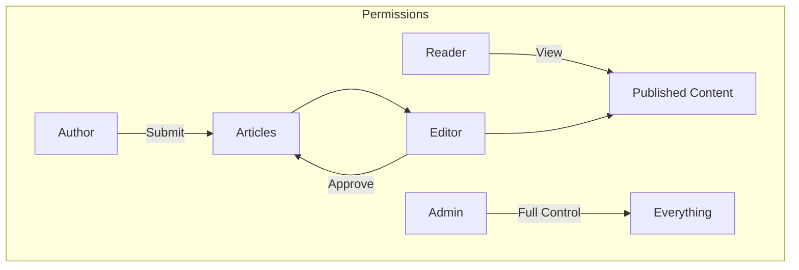
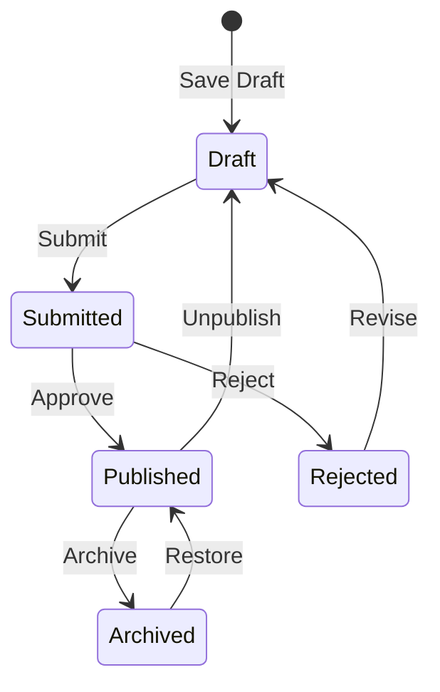

# Початок роботи з Publisher

> Покроковий посібник із налаштування та використання модуля Publisher news/blog.

---

## Що таке Publisher?

Publisher — це головний модуль керування вмістом для XOOPS, призначений для:

- **Новинні сайти** - Публікуйте статті з категоріями
- **Блоги** - персональне або багатоавторське ведення блогу``
- **Документація** - Упорядковані бази знань
- **Контент-портали** - Змішаний медіаконтент

---

## Швидке налаштування

### Крок 1: Встановіть Publisher

1. Завантажити з [GitHub](https://github.com/XoopsModules25x/publisher)
2. Завантажте в `modules/publisher/`
3. Перейдіть до Адміністратор → Модулі → Встановити

### Крок 2: Створіть категорії

1. Адміністратор → Видавець → Категорії
2. Натисніть «Додати категорію»
3. Заповніть:
   - **Назва**: назва категорії
   - **Опис**: вміст цієї категорії
   - **Зображення**: Додаткове зображення категорії
4. Встановіть дозволи (хто може submit/view)
5. Зберегти

### Крок 3: Налаштуйте параметри

1. Адміністратор → Видавець → Налаштування
2. Основні параметри для налаштування:

| Налаштування | Рекомендовано | Опис |
|---------|-------------|-------------|
| Елементів на сторінці | 10-20 | Статті за індексом |
| Редактор | TinyMCE/CKEditor | Текстовий редактор |
| Дозволити оцінки | Так | Відгуки читачів |
| Дозволити коментарі | Так | Обговорення |
| Автоматичне схвалення | Ні | Редакційний контроль |

### Крок 4: Створіть свою першу статтю

1. Головне меню → Видавець → Надіслати статтю
2. Заповніть форму:
   - **Назва**: заголовок статті
   - **Категорія**: де вона належить
   - **Резюме**: Короткий опис
   - **Основний текст**: повний вміст статті
3. Додайте додаткові елементи:
   - Рекомендоване зображення
   - Вкладення файлів
   - Налаштування SEO
4. Надішліть на перевірку або опублікуйте

---

## Ролі користувача

### Читач
- Перегляньте опубліковані статті
- Оцініть і прокоментуйте
- Пошук вмісту

### Автор
- Надсилайте нові статті
- Редагувати власні статті
- Прикріпити файли

### Редактор
- Подання Approve/reject
- Відредагуйте будь-яку статтю
- Керування категоріями

### Адміністратор
- Повний модульний контроль
- Налаштувати параметри
- Керувати дозволами

---

## Написання статей

### Редактор статей
```
┌─────────────────────────────────────────────────────┐
│ Title: [Your Article Title                        ] │
├─────────────────────────────────────────────────────┤
│ Category: [Select Category          ▼]              │
├─────────────────────────────────────────────────────┤
│ Summary:                                            │
│ ┌─────────────────────────────────────────────────┐ │
│ │ Brief description shown in listings...          │ │
│ └─────────────────────────────────────────────────┘ │
├─────────────────────────────────────────────────────┤
│ Body:                                               │
│ ┌─────────────────────────────────────────────────┐ │
│ │ [B] [I] [U] [Link] [Image] [Code]               │ │
│ ├─────────────────────────────────────────────────┤ │
│ │                                                  │ │
│ │ Full article content goes here...               │ │
│ │                                                  │ │
│ └─────────────────────────────────────────────────┘ │
├─────────────────────────────────────────────────────┤
│ [Submit] [Preview] [Save Draft]                     │
└─────────────────────────────────────────────────────┘
```
### Найкращі практики

1. **Переконливі заголовки** – чіткі, привабливі заголовки
2. **Хороші підсумки** - спонукайте читачів клацати
3. **Структурований вміст** - Використовуйте заголовки, списки, зображення
4. **Правильна категоризація** - Допоможіть читачам знайти вміст
5. **SEO optimization** - Ключові слова в заголовку та вмісті

---

## Керування вмістом

### Потік статусу статті

### Опис статусу

| Статус | Опис |
|--------|-------------|
| Чернетка | Незавершена робота |
| Надіслано | Очікує на розгляд |
| Опубліковано | Наживо на сайті |
| Термін дії минув | Минулий термін придатності |
| Відхилено | Потребує доопрацювання |
| Архівовано | Вилучено зі списків |

---

## Навігація

### Доступ до Publisher

- **Головне меню** → Видавець
- **Прямий URL**: `yoursite.com/modules/publisher/`

### Ключові сторінки

| Сторінка | URL | Призначення |
|------|-----|---------|
| Індекс | `/modules/publisher/` | Списки статей |
| Категорія | `/modules/publisher/category.php?id=X` | Категорія статей |
| Стаття | `/modules/publisher/item.php?itemid=X` | Окрема стаття |
| Надіслати | `/modules/publisher/submit.php` | Нова стаття |
| Пошук | `/modules/publisher/search.php` | Знайти статті |

---

## Блоки

Publisher надає кілька блоків для вашого сайту:

### Останні статті
Відображає останні опубліковані статті

### Меню категорій
Навігація за категоріями

### Популярні статті
Найбільш перегляданий контент

### Випадкова стаття
Демонструйте випадковий вміст

### Прожектор
Вибрані статті

---

## Пов'язана документація

- Створення та редагування статей
- Управління категоріями
- Розширення видавця

---

#xoops #publisher #user-guide #getting-started #cms