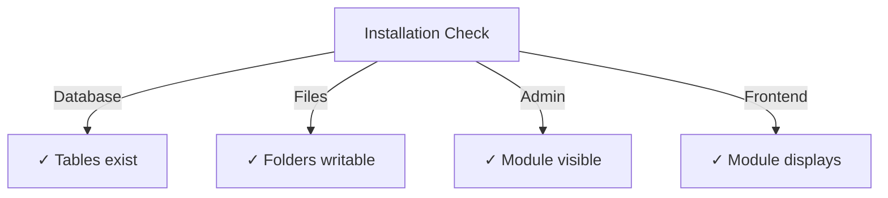

# Посібник із встановлення Publisher

> Повні інструкції щодо встановлення та налаштування модуля Publisher для XOOPS CMS.

---

## Системні вимоги

### Мінімальні вимоги

| Вимога | Версія | Примітки |
|-------------|---------|-------|
| XOOPS | 2.5.10+ | Основна платформа CMS |
| PHP | 7,1+ | Рекомендовано PHP 8.x |
| MySQL | 5,7+ | Сервер бази даних |
| Веб-сервер | Apache/Nginx | З підтримкою перезапису |

### PHP Розширення
```
- PDO (PHP Data Objects)
- pdo_mysql or mysqli
- mb_string (multibyte strings)
- curl (for external content)
- json
- gd (image processing)
```
### Дисковий простір

- **Файли модуля**: ~5 МБ
- **Каталог кешу**: рекомендовано 50+ МБ
- **Завантажити каталог**: за потреби для вмісту

---

## Контрольний список перед встановленням

Перед встановленням Publisher перевірте:

- [ ] Ядро XOOPS встановлено та працює
- [ ] Обліковий запис адміністратора має дозволи на керування модулями
- [ ] Створено резервну копію бази даних
- [ ] Права доступу до файлів дозволяють записувати до каталогу `/modules/`
- [ ] Обмеження пам’яті PHP становить щонайменше 128 МБ
- [ ] Обмеження розміру файлу для завантаження відповідні (мінімум 10 МБ)

---

## Етапи встановлення

### Крок 1. Завантажте Publisher

#### Варіант A: З GitHub (рекомендовано)
```bash
# Navigate to modules directory
cd /path/to/xoops/htdocs/modules/

# Clone the repository
git clone https://github.com/XoopsModules25x/publisher.git

# Verify download
ls -la publisher/
```
#### Варіант Б: завантаження вручну

1. Відвідайте [GitHub Publisher Releases](https://github.com/XoopsModules25x/publisher/releases)
2. Завантажте найновіший файл `.zip`
3. Розпакуйте до `modules/publisher/`

### Крок 2: Налаштуйте права доступу до файлу
```bash
# Set proper ownership
chown -R www-data:www-data /path/to/xoops/htdocs/modules/publisher

# Set directory permissions (755)
find publisher -type d -exec chmod 755 {} \;

# Set file permissions (644)
find publisher -type f -exec chmod 644 {} \;

# Make scripts executable
chmod 755 publisher/admin/index.php
chmod 755 publisher/index.php
```
### Крок 3: Встановіть через XOOPS Admin

1. Увійдіть до **панелі адміністратора XOOPS** як адміністратор
2. Перейдіть до **Система → Модулі**
3. Натисніть **Встановити модуль**
4. Знайдіть у списку **Видавця**
5. Натисніть кнопку **Встановити**
6. Дочекайтеся завершення встановлення (показує створені таблиці бази даних)
```
Installation Progress:
✓ Tables created
✓ Configuration initialized
✓ Permissions set
✓ Cache cleared
Installation Complete!
```
---

## Початкове налаштування

### Крок 1. Доступ до Publisher Admin

1. Перейдіть до **Панелі адміністратора → Модулі**
2. Знайдіть модуль **Publisher**
3. Натисніть посилання **Адміністратор**
4. Ви перебуваєте в Publisher Administration

### Крок 2: Налаштуйте параметри модуля

1. Натисніть **Налаштування** в меню ліворуч
2. Налаштуйте основні параметри:
```
General Settings:
- Editor: Select your WYSIWYG editor
- Items per page: 10
- Show breadcrumb: Yes
- Allow comments: Yes
- Allow ratings: Yes

SEO Settings:
- SEO URLs: No (enable later if needed)
- URL rewriting: None

Upload Settings:
- Max upload size: 5 MB
- Allowed file types: jpg, png, gif, pdf, doc, docx
```
3. Натисніть **Зберегти налаштування**

### Крок 3: Створіть першу категорію

1. Натисніть **Категорії** в меню ліворуч
2. Натисніть **Додати категорію**
3. Заповніть форму:
```
Category Name: News
Description: Latest news and updates
Image: (optional) Upload category image
Parent Category: (leave blank for top-level)
Status: Enabled
```
4. Натисніть **Зберегти категорію**

### Крок 4: Перевірте встановлення

Перевірте ці показники:

#### Перевірка бази даних
```bash
mysql -u xoops_user -p xoops_database
mysql> SHOW TABLES LIKE 'publisher%';

# Should show tables:
# - publisher_categories
# - publisher_items
# - publisher_comments
# - publisher_files
```
#### Внутрішня перевірка

1. Відвідайте свою домашню сторінку XOOPS
2. Знайдіть блок **Видавець** або **Новини**
3. Має відображати останні статті

---

## Конфігурація після встановлення

### Вибір редактора

Publisher підтримує декілька редакторів WYSIWYG:

| Редактор | Плюси | Мінуси |
|--------|------|------|
| FCKeditor | Багатофункціональний | Старший, більший |
| CKEditor | Сучасний стандарт | Складність конфігурації |
| TinyMCE | Легкий | Обмежені можливості |
| Редактор DHTML | Основні | Дуже простий |

**Щоб змінити редактор:**

1. Перейдіть до **Налаштування**
2. Перейдіть до параметра **Редактор**
3. Виберіть зі спадного меню
4. Збережіть і протестуйте

### Налаштування каталогу завантаження
```bash
# Create upload directories
mkdir -p /path/to/xoops/uploads/publisher/
mkdir -p /path/to/xoops/uploads/publisher/categories/
mkdir -p /path/to/xoops/uploads/publisher/images/
mkdir -p /path/to/xoops/uploads/publisher/files/

# Set permissions
chmod 755 /path/to/xoops/uploads/publisher/
chmod 755 /path/to/xoops/uploads/publisher/*
```
### Налаштувати розмір зображення

У налаштуваннях встановіть розміри мініатюр:
```
Category image size: 300 x 200 px
Article image size: 600 x 400 px
Thumbnail size: 150 x 100 px
```
---

## Етапи після інсталяції

### 1. Встановіть дозволи групи

1. Перейдіть до **Дозволи** в меню адміністратора
2. Налаштувати доступ для груп:
   - Анонім: лише перегляд
   - Зареєстровані користувачі: надсилайте статті
   - Редактори: статті Approve/edit
   - Адміністратори: повний доступ

### 2. Налаштуйте видимість модуля

1. Перейдіть до **Блоки** в XOOPS admin
2. Знайдіть блоки видавця:
   - Видавець - Останні статті
   - Видавець - Категорії
   – Видавництво – Архів
3. Налаштуйте видимість блоків на сторінку

### 3. Імпорт тестового вмісту (необов’язково)

Для тестування імпортуйте зразки статей:

1. Перейдіть до **Адміністратор видавця → Імпортувати**
2. Виберіть **Зразок вмісту**
3. Натисніть **Імпортувати**

### 4. Увімкніть URL-адреси SEO (необов’язково)

Для зручних для пошуку URL-адрес:

1. Перейдіть до **Налаштування**
2. Установіть URL-адреси **SEO**: Так
3. Увімкніть перезапис **.htaccess**
4. Переконайтеся, що файл `.htaccess` існує в папці Publisher
```apache
# .htaccess example
<IfModule mod_rewrite.c>
    RewriteEngine On
    RewriteBase /modules/publisher/
    RewriteRule ^category/([0-9]+)-(.*)\.html$ index.php?op=showcategory&categoryid=$1 [L]
    RewriteRule ^article/([0-9]+)-(.*)\.html$ index.php?op=showitem&itemid=$1 [L]
</IfModule>
```
---

## Усунення несправностей встановлення

### Проблема: модуль не відображається в адмінці

**Рішення:**
```bash
# Check file permissions
ls -la /path/to/xoops/modules/publisher/

# Check xoops_version.php exists
ls /path/to/xoops/modules/publisher/xoops_version.php

# Verify PHP syntax
php -l /path/to/xoops/modules/publisher/xoops_version.php
```
### Проблема: таблиці бази даних не створені

**Рішення:**
1. Перевірте, чи має користувач MySQL привілей CREATE TABLE
2. Перевірте журнал помилок бази даних:   
```bash
   mysql> SHOW WARNINGS;
   
```
3. Імпортуйте SQL вручну:   
```bash
   mysql -u user -p database < modules/publisher/sql/mysql.sql
   
```
### Проблема: не вдається завантажити файл

**Рішення:**
```bash
# Check directory exists and is writable
stat /path/to/xoops/uploads/publisher/

# Fix permissions
chmod 777 /path/to/xoops/uploads/publisher/

# Verify PHP settings
php -i | grep upload_max_filesize
```
### Проблема: помилки "Сторінка не знайдена".

**Рішення:**
1. Перевірте наявність файлу `.htaccess`
2. Переконайтеся, що Apache `mod_rewrite` увімкнено:   
```bash
   a2enmod rewrite
   systemctl restart apache2
   
```
3. Перевірте `AllowOverride All` у конфігурації Apache

---

## Оновлення з попередніх версій

### Від Publisher 1.x до 2.x

1. **Резервна поточна інсталяція:**   
```bash
   cp -r modules/publisher/ modules/publisher-backup/
   mysqldump -u user -p database > publisher-backup.sql
   
```
2. **Завантажити Publisher 2.x**

3. **Перезаписати файли:**   
```bash
   rm -rf modules/publisher/
   unzip publisher-2.0.zip -d modules/
   
```
4. **Запустіть оновлення:**
   - Перейдіть до **Адміністратор → Видавець → Оновлення**
   - Натисніть **Оновити базу даних**
   - Дочекайтеся завершення

5. **Підтвердити:**
   - Перевірте, чи правильно відображаються всі статті
   - Переконайтеся, що дозволи цілі
   - Завантаження тестових файлів

---

## Міркування безпеки

### Права доступу до файлу
```
- Core files: 644 (readable by web server)
- Directories: 755 (browseable by web server)
- Upload directories: 755 or 777
- Config files: 600 (not readable by web)
```
### Вимкніть прямий доступ до конфіденційних файлів

Створіть `.htaccess` у каталогах завантаження:
```apache
<FilesMatch "\.(php|phtml|php3|php4|php5|phtml)$">
    Deny from all
</FilesMatch>
```
### Безпека бази даних
```bash
# Use strong password
ALTER USER 'publisher_user'@'localhost' IDENTIFIED BY 'strong_password_here';

# Grant minimal permissions
GRANT SELECT, INSERT, UPDATE, DELETE ON publisher_db.* TO 'publisher_user'@'localhost';
FLUSH PRIVILEGES;
```
---

## Контрольний список перевірки

Після встановлення перевірте:

- [ ] Модуль відображається в списку модулів адміністратора
- [ ] Має доступ до розділу адміністратора видавця
- [ ] Може створювати категорії
- [ ] Може створювати статті
- [ ] Відображення статей у інтерфейсі
- [ ] Завантаження файлів працює
- [ ] Зображення відображаються правильно
- [ ] Дозволи застосовано правильно
- [ ] Створено таблиці бази даних
- [ ] Каталог кешу доступний для запису

---

## Наступні кроки

Після успішного встановлення:

1. Прочитайте Посібник з основного налаштування
2. Створіть свою першу статтю
3. Налаштуйте дозволи групи
4. Перегляньте Управління категоріями

---

## Підтримка та ресурси

- **Проблеми GitHub**: [Проблеми видавця](https://github.com/XoopsModules25x/publisher/issues)
- **Форум XOOPS**: [Підтримка спільноти](https://www.xoops.org/modules/newbb/)
- **GitHub Wiki**: [Довідка зі встановлення](https://github.com/XoopsModules25x/publisher/wiki)

---

#publisher #installation #setup #xoops #module #configuration