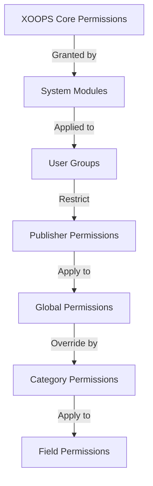

# Налаштування дозволів видавця

> Повний посібник із налаштування групових дозволів, контролю доступу та керування доступом користувачів у Publisher.

---

## Основи дозволів

### Що таке дозволи?

Дозволи контролюють, що можуть робити різні групи користувачів у Publisher:
```
Who can:
  - View articles
  - Submit articles
  - Edit articles
  - Approve articles
  - Manage categories
  - Configure settings
```
### Рівні дозволів
```
Anonymous
  └── View published articles only

Registered Users
  ├── View articles
  ├── Submit articles (pending approval)
  └── Edit own articles

Editors/Moderators
  ├── All registered permissions
  ├── Approve articles
  ├── Edit all articles
  └── Manage some categories

Administrators
  └── Full access to everything
```
---

## Керування дозволами доступу

### Перейдіть до Дозволи
```
Admin Panel
└── Modules
    └── Publisher
        ├── Permissions
        ├── Category Permissions
        └── Group Management
```
### Швидкий доступ

1. Увійдіть як **Адміністратор**
2. Перейдіть до **Адміністратор → Модулі**
3. Натисніть **Видавець → Адміністратор**
4. Натисніть **Дозволи** в меню ліворуч

---

## Глобальні дозволи

### Дозволи на рівні модуля

Керуйте доступом до модуля Publisher і функцій:
```
Permissions configuration view:
┌─────────────────────────────────────┐
│ Permission             │ Anon │ Reg │ Editor │ Admin │
├────────────────────────┼──────┼─────┼────────┼───────┤
│ View articles          │  ✓   │  ✓  │   ✓    │  ✓   │
│ Submit articles        │  ✗   │  ✓  │   ✓    │  ✓   │
│ Edit own articles      │  ✗   │  ✓  │   ✓    │  ✓   │
│ Edit all articles      │  ✗   │  ✗  │   ✓    │  ✓   │
│ Approve articles       │  ✗   │  ✗  │   ✓    │  ✓   │
│ Manage categories      │  ✗   │  ✗  │   ✗    │  ✓   │
│ Access admin panel     │  ✗   │  ✗  │   ✓    │  ✓   │
└─────────────────────────────────────┘
```
### Опис дозволів

| Дозвіл | Користувачі | Ефект |
|------------|-------|--------|
| **Переглянути статті** | Всі групи | Може переглядати опубліковані статті на інтерфейсі |
| **Надіслати статті** | Зареєстровано+ | Може створювати нові статті (очікує затвердження) |
| **Редагувати власні статті** | Зареєстровано+ | Чи може edit/delete власні статті |
| **Редагувати всі статті** | Редактори+ | Може редагувати будь-які статті користувача |
| **Видалити власні статті** | Зареєстровано+ | Може видаляти власні неопубліковані статті |
| **Видалити всі статті** | Редактори+ | Може видалити будь-яку статтю |
| **Схвалити статті** | Редактори+ | Може публікувати статті, що очікують на розгляд |
| **Керувати категоріями** | Адміністратори | Створення, редагування, видалення категорій |
| **Доступ адміністратора** | Редактори+ | Доступ до інтерфейсу адміністратора |

---

## Налаштувати глобальні дозволи

### Крок 1: Доступ до налаштувань дозволу

1. Перейдіть до **Адміністратор → Модулі**
2. Знайдіть **Видавця**
3. Натисніть **Дозволи** (або посилання «Адміністратор», а потім «Дозволи»)
4. Ви бачите матрицю дозволів

### Крок 2: Налаштуйте дозволи групи

Для кожної групи налаштуйте, що вони можуть робити:

#### Анонімні користувачі
```yaml
Anonymous Group Permissions:
  View articles: ✓ YES
  Submit articles: ✗ NO
  Edit articles: ✗ NO
  Delete articles: ✗ NO
  Approve articles: ✗ NO
  Manage categories: ✗ NO
  Admin access: ✗ NO

Result: Anonymous users can only view published content
```
#### Зареєстровані користувачі
```yaml
Registered Group Permissions:
  View articles: ✓ YES
  Submit articles: ✓ YES (with approval required)
  Edit own articles: ✓ YES
  Edit all articles: ✗ NO
  Delete own articles: ✓ YES (drafts only)
  Delete all articles: ✗ NO
  Approve articles: ✗ NO
  Manage categories: ✗ NO
  Admin access: ✗ NO

Result: Registered users can contribute content after approval
```
#### Редакторська група
```yaml
Editors Group Permissions:
  View articles: ✓ YES
  Submit articles: ✓ YES
  Edit own articles: ✓ YES
  Edit all articles: ✓ YES
  Delete own articles: ✓ YES
  Delete all articles: ✓ YES
  Approve articles: ✓ YES
  Manage categories: ✓ LIMITED
  Admin access: ✓ YES
  Configure settings: ✗ NO

Result: Editors manage content but not settings
```
#### Адміністратори
```yaml
Admins Group Permissions:
  ✓ FULL ACCESS to all features

  - All editor permissions
  - Manage all categories
  - Configure all settings
  - Manage permissions
  - Install/uninstall
```
### Крок 3: Збережіть дозволи

1. Налаштуйте дозволи кожної групи
2. Поставте прапорці для дозволених дій
3. Зніміть прапорці для заборонених дій
4. Натисніть **Зберегти дозволи**
5. З'явиться повідомлення про підтвердження

---

## Дозволи на рівні категорії

### Встановити доступ до категорії

Контролюйте, хто може view/submit до певних категорій:
```
Admin → Publisher → Categories
→ Select category → Permissions
```
### Матриця дозволів категорії
```
                 Anonymous  Registered  Editor  Admin
View category        ✓         ✓         ✓       ✓
Submit to category   ✗         ✓         ✓       ✓
Edit own in category ✗         ✓         ✓       ✓
Edit all in category ✗         ✗         ✓       ✓
Approve in category  ✗         ✗         ✓       ✓
Manage category      ✗         ✗         ✗       ✓
```
### Налаштувати дозволи категорій

1. Перейдіть до **Категорії** адмін
2. Знайдіть категорію
3. Натисніть кнопку **Дозволи**
4. Для кожної групи виберіть:
   - [ ] Переглянути цю категорію
   - [ ] Надіслати статті
   - [ ] Редагувати власні статті
   - [ ] Редагувати всі статті
   - [ ] Затвердити статті
   - [ ] Керувати категорією
5. Натисніть **Зберегти**

### Приклади дозволів категорій

#### Категорія публічних новин
```
Anonymous: View only
Registered: View + Submit (pending approval)
Editors: Approve + Edit
Admins: Full control
```
#### Категорія внутрішніх оновлень
```
Anonymous: No access
Registered: View only
Editors: Submit + Approve
Admins: Full control
```
#### Категорія гостьового блогу
```
Anonymous: View only
Registered: Submit (pending approval)
Editors: Approve
Admins: Full control
```
---

## Дозволи на рівні поля

### Контроль видимості полів форми

Обмежити, які поля форми можуть використовувати користувачі see/edit:
```
Admin → Publisher → Permissions → Fields
```
### Параметри полів
```yaml
Visible Fields for Registered Users:
  ✓ Title
  ✓ Description
  ✓ Content (body)
  ✓ Featured image
  ✓ Category
  ✓ Tags
  ✗ Author (auto-set)
  ✗ Publication date (editors only)
  ✗ Scheduled date (editors only)
  ✗ Featured flag (editors only)
  ✗ Permissions (admins only)
```
### Приклади

#### Обмежене подання для зареєстрованих

Зареєстровані користувачі бачать менше варіантів:
```
Available fields:
  - Title ✓
  - Description ✓
  - Content ✓
  - Featured image ✓
  - Category ✓

Hidden fields:
  - Author (auto-current user)
  - Publication date (editors decide)
  - Scheduled date (admins only)
  - Featured status (editors choose)
```
#### Повна форма для редакторів

Редактори бачать усі варіанти:
```
Available fields:
  - All basic fields
  - All metadata
  - Author selection ✓
  - Publication date/time ✓
  - Scheduled date ✓
  - Featured status ✓
  - Expiration date ✓
  - Permissions ✓
```
---

## Конфігурація групи користувачів

### Створити спеціальну групу

1. Перейдіть до **Адміністратор → Користувачі → Групи**
2. Натисніть **Створити групу**
3. Введіть дані групи:
```
Group Name: "Community Bloggers"
Group Description: "Users who contribute blog content"
Type: Regular group
```
4. Натисніть **Зберегти групу**
5. Поверніться до дозволів видавця
6. Встановіть дозволи для нової групи

### Приклади груп
```
Suggested Groups for Publisher:

Group: Contributors
  - Regular members who submit articles
  - Can edit own articles
  - Cannot approve articles

Group: Reviewers
  - Can see submitted articles
  - Can approve/reject articles
  - Cannot delete others' articles

Group: Editors
  - Can edit any article
  - Can approve articles
  - Can moderate comments
  - Can manage some categories

Group: Publishers
  - Can edit any article
  - Can publish directly (no approval)
  - Can manage all categories
  - Can configure settings
```
---

## Ієрархії дозволів

### Потік дозволів

### Успадкування дозволів
```
Base: Global module permissions
  ↓
Category: Overrides for specific categories
  ↓
Field: Further restricts available fields
  ↓
User: Has permission if ALL levels allow
```
**Приклад:**
```
User wants to edit article:
1. User group must have "edit articles" permission (global)
2. Category must allow editing (category level)
3. Field restrictions must allow (if applicable)
4. User must be author OR editor (for own vs all)

If ANY level denies → Permission denied
```
---

## Дозволи робочого процесу затвердження

### Налаштувати затвердження подання

Контролюйте, чи потребують схвалення статті:
```
Admin → Publisher → Preferences → Workflow
```
#### Параметри затвердження
```yaml
Submission Workflow:
  Require Approval: Yes

  For Registered Users:
    - New articles: Draft (pending approval)
    - Editors must approve
    - User can edit while pending
    - After approval: User can still edit

  For Editors:
    - New articles: Publish directly (optional)
    - Skip approval queue
    - Or always require approval
```
#### Налаштувати для кожної групи

1. Перейдіть до Налаштувань
2. Знайдіть «Робочий процес надсилання»
3. Для кожної групи встановіть:
```
Group: Registered Users
  Require approval: ✓ YES
  Default status: Draft
  Can modify while pending: ✓ YES

Group: Editors
  Require approval: ✗ NO
  Default status: Published
  Can modify published: ✓ YES
```
4. Натисніть **Зберегти**

---

## Модеруйте статті

### Схвалити статті, що очікують на розгляд

Для користувачів із дозволом «затверджувати статті»:

1. Перейдіть до **Адміністратор → Видавець → Статті**
2. Фільтруйте за **Статусом**: Очікує на розгляд
3. Натисніть статтю, щоб переглянути
4. Перевірте якість контенту
5. Встановіть **Статус**: Опубліковано
6. Додатково: додайте редакційні примітки
7. Натисніть **Зберегти**

### Відхилити статті

Якщо стаття не відповідає стандартам:

1. Відкрити статтю
2. Встановіть **Статус**: чернетка
3. Додайте причину відмови (у коментарі або електронною поштою)
4. Натисніть **Зберегти**
5. Надішліть повідомлення автору з поясненням відмови

### Модерувати коментарі

Якщо модерувати коментарі:

1. Перейдіть до **Адміністратор → Видавець → Коментарі**
2. Фільтруйте за **Статусом**: Очікує на розгляд
3. Огляд коментаря
4. Опції:
   - Схвалити: натисніть **Схвалити**
   - Відхилити: натисніть **Видалити**
   - Редагувати: натисніть **Редагувати**, виправити, зберегти
5. Натисніть **Зберегти**

---

## Керування доступом користувачів

### Перегляд груп користувачів

Подивіться, які користувачі належать до груп:
```
Admin → Users → User Groups

For each user:
  - Primary group (one)
  - Secondary groups (multiple)

Permissions apply from all groups (union)
```
### Додати користувача до групи

1. Перейдіть до **Адміністратор → Користувачі**
2. Знайти користувача
3. Натисніть **Редагувати**
4. У розділі **Групи** позначте групи, які потрібно додати
5. Натисніть **Зберегти**

### Змінити права доступу користувача

Для окремих користувачів (якщо підтримується):

1. Перейдіть до адміністратора користувачів
2. Знайти користувача
3. Натисніть **Редагувати**
4. Шукайте перевизначення окремих дозволів
5. Налаштуйте за потреби
6. Натисніть **Зберегти**

---

## Поширені сценарії дозволів

### Сценарій 1: відкрити блог

Дозволити будь-кому надсилати:
```
Anonymous: View
Registered: Submit, edit own, delete own
Editors: Approve, edit all, delete all
Admins: Full control

Result: Open community blog
```
### Сценарій 2: Модерований сайт новин

Суворий процес затвердження:
```
Anonymous: View only
Registered: Cannot submit
Editors: Submit, approve others
Admins: Full control

Result: Only approved professionals publish
```
### Сценарій 3: Блог співробітників

Співробітники можуть внести:
```
Create group: "Staff"
Anonymous: View
Registered: View only (non-staff)
Staff: Submit, edit own, publish directly
Admins: Full control

Result: Staff-authored blog
```
### Сценарій 4: Багатокатегорія з різними редакторами

Різні редактори для різних категорій:
```
News category:
  Editors group A: Full control

Reviews category:
  Editors group B: Full control

Tutorials category:
  Editors group C: Full control

Result: Decentralized editorial control
```
---

## Перевірка дозволів

### Перевірка роботи дозволів

1. Створіть тестового користувача в кожній групі
2. Увійдіть як кожен тестовий користувач
3. Спробуйте:
   - Переглянути статті
   - Надіслати статтю (необхідно створити чернетку, якщо це дозволено)
   - Редагувати статтю (власну та чужу)
   - Видалити статтю
   - Доступ до панелі адміністратора
   - Категорії доступу

4. Перевірте відповідність результатів очікуваним дозволам

### Загальні тестові випадки
```
Test Case 1: Anonymous user
  [ ] Can view published articles: ✓
  [ ] Cannot submit articles: ✓
  [ ] Cannot access admin: ✓

Test Case 2: Registered user
  [ ] Can submit articles: ✓
  [ ] Articles go to Draft: ✓
  [ ] Can edit own article: ✓
  [ ] Cannot edit others: ✓
  [ ] Cannot access admin: ✓

Test Case 3: Editor
  [ ] Can approve articles: ✓
  [ ] Can edit any article: ✓
  [ ] Can access admin: ✓
  [ ] Cannot delete all: ✓ (or ✓ if allowed)

Test Case 4: Admin
  [ ] Can do everything: ✓
```
---

## Дозволи для вирішення проблем

### Проблема: Користувач не може надсилати статті

**Перевірити:**
```
1. User group has "submit articles" permission
   Admin → Publisher → Permissions

2. User belongs to allowed group
   Admin → Users → Edit user → Groups

3. Category allows submission from user's group
   Admin → Publisher → Categories → Permissions

4. User is registered (not anonymous)
```
**Рішення:**
```bash
1. Verify registered user group has submission permission
2. Add user to appropriate group
3. Check category permissions
4. Clear user session cache
```
### Проблема: редактор не може затверджувати статті

**Перевірити:**
```
1. Editor group has "approve articles" permission
2. Articles exist with "Pending" status
3. Editor is in correct group
4. Category allows approval from editor's group
```
**Рішення:**
```bash
1. Go to Permissions, check "approve articles" is checked for editor group
2. Create test article, set to Draft
3. Try to approve as editor
4. Check error messages in system log
```
### Проблема: можна переглянути статті, але не отримати доступ до категорії

**Перевірити:**
```
1. Category is not disabled/hidden
2. Category permissions allow viewing
3. User's group is permitted to view category
4. Category is published
```
**Рішення:**
```bash
1. Go to Categories, check category status is "Enabled"
2. Check category permissions are set
3. Add user's group to category view permission
```
### Проблема: дозволи змінено, але вони не діють

**Рішення:**
```bash
1. Clear cache: Admin → Tools → Clear Cache
2. Clear session: Logout and login again
3. Check system log for errors
4. Verify permissions actually saved
5. Try different browser/incognito window
```
---

## Резервне копіювання та експорт дозволів

### Дозволи на експорт

Деякі системи дозволяють експортувати:

1. Перейдіть до **Адміністратор → Видавець → Інструменти**
2. Натисніть **Дозволи на експорт**
3. Збережіть файл `.xml` або `.json`
4. Зберігайте як резервну копію

### Дозволи на імпорт

Відновити з резервної копії:

1. Перейдіть до **Адміністратор → Видавець → Інструменти**
2. Натисніть **Дозволи на імпорт**
3. Виберіть файл резервної копії
4. Перегляньте зміни
5. Натисніть **Імпортувати**

---

## Найкращі практики

### Контрольний список конфігурації дозволів

- [ ] Визначте групи користувачів
- [ ] Призначте чіткі назви групам
- [ ] Встановити базові дозволи для кожної групи
- [ ] Перевірте кожен рівень дозволу
- [ ] Структура дозволів документа
- [ ] Створення робочого процесу затвердження
- [ ] Навчіть редакторів модерації
- [ ] Контроль використання дозволів
- [ ] Щокварталу переглядайте дозволи
- [ ] Налаштування дозволу на резервне копіювання

### Найкращі методи безпеки
```
✓ Principle of Least Privilege
  - Grant minimum necessary permissions

✓ Role-Based Access
  - Use groups for roles (editor, moderator, etc)

✓ Audit Permissions
  - Review who has what access

✓ Separate Duties
  - Submitter, approver, publisher are different

✓ Regular Review
  - Check permissions quarterly
  - Remove access when users leave
  - Update for new requirements
```
---

## Пов'язані посібники

- Створення статей
- Управління категоріями
- Базова конфігурація
- Монтаж

---

## Наступні кроки

- Налаштування дозволів для робочого процесу
- Створюйте статті з відповідними дозволами
- Налаштувати категорії з дозволами
- Навчання користувачів створенню статей

---

#publisher #permissions #groups #access-control #security #moderation #xoops