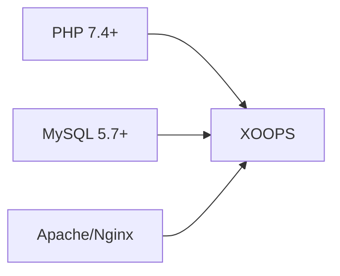
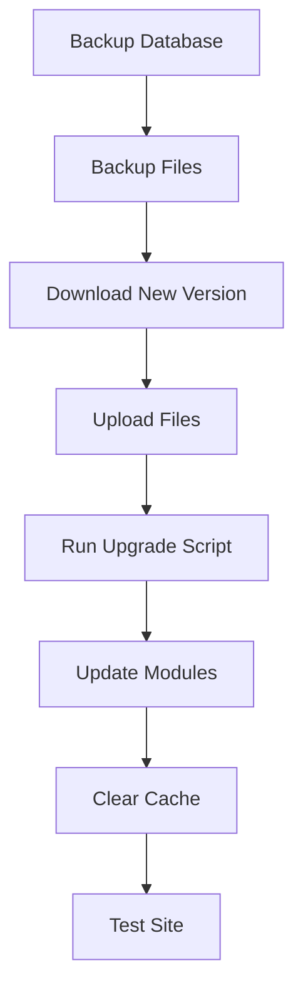

> Поширені запитання та відповіді щодо встановлення XOOPS.

---

## Попереднє встановлення

### Q: Які мінімальні вимоги до сервера?

**A:** XOOPS 2.5.x вимагає:
- PHP 7.4 або вище (рекомендується PHP 8.x)
- MySQL 5.7+ або MariaDB 10.3+
- Apache з mod_rewrite або Nginx
- Обмеження пам'яті принаймні 64 МБ PHP (рекомендується 128 МБ+)

### Q: Чи можу я встановити XOOPS на спільному хостингу?

**A:** Так, XOOPS добре працює на більшості спільних хостингів, які відповідають вимогам. Переконайтеся, що ваш хост надає:
- PHP з необхідними розширеннями (mysqli, gd, curl, json, mbstring)
- Доступ до бази даних MySQL
- Можливість завантаження файлів
- Підтримка .htaccess (для Apache)

### Q: Які розширення PHP потрібні?

**A:** Необхідні розширення:
- `mysqli` - Підключення до бази даних
- `gd` - Обробка зображень
- `json` - JSON поводження
- `mbstring` - Підтримка багатобайтових рядків

Рекомендовано:
- `curl` - Зовнішні дзвінки API
- `zip` - Установка модуля
- `intl` - Інтернаціоналізація

---

## Процес встановлення

### Q: Майстер встановлення показує порожню сторінку

**A:** Зазвичай це помилка PHP. Спробуйте:

1. Тимчасово ввімкніть відображення помилок:
```php
// Add to htdocs/install/index.php at the top
error_reporting(E_ALL);
ini_set('display_errors', 1);
```
2. Перевірте журнал помилок PHP
3. Перевірте сумісність версії PHP
4. Переконайтеся, що всі необхідні розширення завантажено

### Q: Я отримую "Не можу записати в mainfile.php"

**A:** Установіть дозволи на запис перед встановленням:
```bash
chmod 666 mainfile.php
# After installation, secure it:
chmod 444 mainfile.php
```
### Q: Таблиці бази даних не створюються

**A:** Перевірити:

1. Користувач MySQL має привілеї CREATE TABLE:
```sql
GRANT ALL PRIVILEGES ON xoopsdb.* TO 'xoopsuser'@'localhost';
FLUSH PRIVILEGES;
```
2. База даних існує:
```sql
CREATE DATABASE xoopsdb CHARACTER SET utf8mb4 COLLATE utf8mb4_unicode_ci;
```
3. Облікові дані в майстрі відповідають налаштуванням бази даних

### Q: Встановлення завершено, але сайт показує помилки

**A:** Поширені виправлення після встановлення:

1. Видаліть або перейменуйте каталог встановлення:
```bash
mv htdocs/install htdocs/install.bak
```
2. Встановіть відповідні дозволи:
```bash
chmod -R 755 htdocs/
chmod -R 777 xoops_data/
chmod 444 mainfile.php
```
3. Очистити кеш:
```bash
rm -rf xoops_data/caches/smarty_cache/*
rm -rf xoops_data/caches/smarty_compile/*
```
---

## Конфігурація

### Q: Де конфігураційний файл?

**A:** Основна конфігурація знаходиться в `mainfile.php` у кореневій папці XOOPS. Основні налаштування:
```php
define('XOOPS_ROOT_PATH', '/path/to/htdocs');
define('XOOPS_VAR_PATH', '/path/to/xoops_data');
define('XOOPS_URL', 'https://yoursite.com');
define('XOOPS_DB_HOST', 'localhost');
define('XOOPS_DB_USER', 'username');
define('XOOPS_DB_PASS', 'password');
define('XOOPS_DB_NAME', 'database');
define('XOOPS_DB_PREFIX', 'xoops');
```
### З: Як змінити сайт URL?

**A:** Редагувати `mainfile.php`:
```php
define('XOOPS_URL', 'https://newdomain.com');
```
Потім очистіть кеш і оновіть усі жорстко закодовані URL-адреси в базі даних.

### Q: Як мені перемістити XOOPS в інший каталог?

**A:**

1. Перемістіть файли в нове місце
2. Оновіть шляхи в `mainfile.php`:
```php
define('XOOPS_ROOT_PATH', '/new/path/to/htdocs');
define('XOOPS_VAR_PATH', '/new/path/to/xoops_data');
```
3. За потреби оновіть базу даних
4. Очистіть усі кеші

---

## Оновлення

### З: Як оновити XOOPS?

**A:**

1. **Створіть резервну копію всього** (база даних + файли)
2. Завантажте нову версію XOOPS
3. Завантажте файли (не перезаписуйте `mainfile.php`)
4. Запустіть `htdocs/upgrade/`, якщо є
5. Оновіть модулі через панель адміністратора
6. Очистіть усі кеші
7. Ретельно перевірте

### Q: Чи можу я пропустити версії під час оновлення?

**A:** Зазвичай ні. Послідовно оновлюйте основні версії, щоб забезпечити правильну роботу міграції бази даних. Перегляньте примітки до випуску, щоб отримати конкретні вказівки.

### Q: Мої модулі перестали працювати після оновлення

**A:**

1. Перевірте сумісність модуля з новою версією XOOPS
2. Оновіть модулі до останніх версій
3. Повторно створіть шаблони: Адміністратор → Система → Обслуговування → Шаблони
4. Очистіть усі кеші
5. Перевірте журнали помилок PHP на наявність певних помилок

---

## Усунення несправностей

### Q: Я забув пароль адміністратора

**A:** Скидання через базу даних:
```sql
-- Generate new password hash
UPDATE xoops_users
SET pass = MD5('newpassword')
WHERE uname = 'admin';
```
Або скористайтеся функцією скидання пароля, якщо налаштовано електронну пошту.

### Q: Після встановлення сайт працює дуже повільно

**A:**

1. Увімкніть кешування в Адміністратор → Система → Параметри
2. Оптимізація бази даних:
```sql
OPTIMIZE TABLE xoops_session;
OPTIMIZE TABLE xoops_online;
```
3. Перевірте наявність повільних запитів у режимі налагодження
4. Увімкніть PHP OpCache

### Q: Images/CSS не завантажується

**A:**

1. Перевірте права доступу до файлів (644 для файлів, 755 для каталогів)
2. Переконайтеся, що `XOOPS_URL` правильний у `mainfile.php`
3. Перевірте .htaccess на наявність конфліктів перезапису
4. Перевірте консоль браузера на наявність помилок 404

---

## Пов'язана документація

- Керівництво по установці
- Базова конфігурація
- Білий екран смерті

---

#xoops #faq #installation #troubleshooting