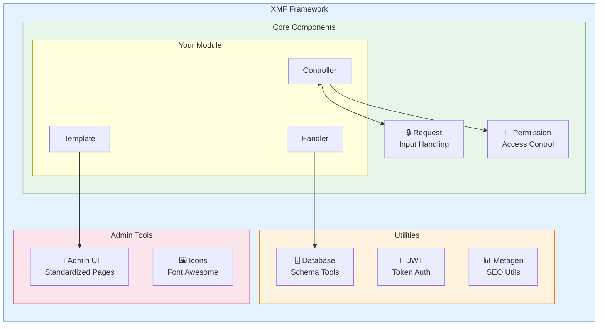
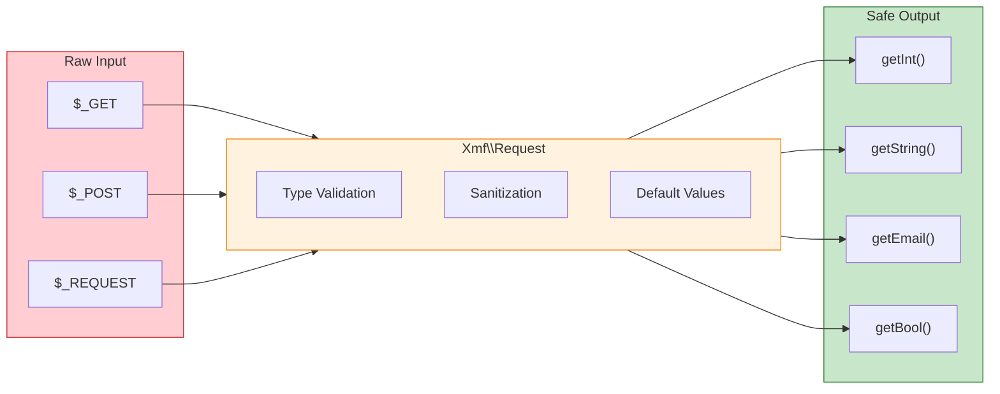

<span class="version-badge version-25x">2.5.x ✅</span> <span class="version-badge version-40x">4.0.x ✅</span>

:::tip[The Bridge to Modern XOOPS]
XMF працює як у XOOPS 2.5.x, так і в XOOPS 4.0.x**. Це рекомендований спосіб модернізації ваших модулів сьогодні під час підготовки до XOOPS 4.0. XMF забезпечує автозавантаження PSR-4, простори імен і помічники, які згладжують перехід.
:::

**XOOPS Module Framework (XMF)** — це потужна бібліотека, призначена для спрощення та стандартизації розробки модулів XOOPS. XMF надає сучасні методи PHP, включаючи простори імен, автозавантаження та повний набір допоміжних класів, які зменшують шаблонний код і покращують обслуговування.

## Що таке XMF?

XMF – це набір класів і утиліт, які забезпечують:

- **Сучасна підтримка PHP** - Повна підтримка простору імен із автозавантаженням PSR-4
- **Обробка запитів** - Безпечна перевірка та дезінфекція введених даних
- **Допоміжні модулі** - спрощений доступ до конфігурацій модулів і об'єктів
- **Система дозволів** - Просте у використанні керування дозволами
- **Утиліти бази даних** - інструменти міграції схем і керування таблицями
- **JWT Підтримка** - JSON Реалізація веб-токена для безпечної автентифікації
- **Генерація метаданих** - SEO та утиліти вилучення вмісту
- **Інтерфейс адміністратора** - Стандартизовані сторінки адміністрування модуля### XMF Огляд компонентів

## Ключові характеристики

### Простори імен і автозавантаження

Усі класи XMF знаходяться в просторі імен `XMF`. Класи завантажуються автоматично при посиланні - не потрібно включати посібник.
```php
use Xmf\Request;
use Xmf\Module\Helper;

// Classes load automatically when used
$input = Request::getString('input', '');
$helper = Helper::getHelper('mymodule');
```
### Безпечна обробка запитів

[Клас запиту](../05-XMF-Framework/Basics/XMF-Request.md) забезпечує типобезпечний доступ до даних запиту HTTP із вбудованою обробкою:


```php
use Xmf\Request;

$id = Request::getInt('id', 0);
$name = Request::getString('name', '');
$email = Request::getEmail('email', '');
```
### Допоміжна система модуля

[Module Helper] (../05-XMF-Framework/Basics/XMF-Module-Helper.md) забезпечує зручний доступ до функцій, пов’язаних із модулями:
```php
$helper = \Xmf\Module\Helper::getHelper('mymodule');

// Access module configuration
$configValue = $helper->getConfig('setting_name', 'default');

// Get module object
$module = $helper->getModule();

// Access handlers
$handler = $helper->getHandler('items');
```
### Керування дозволами

[Permission-Helper](../05-XMF-Framework/Recipes/Permission-Helper.md) спрощує XOOPS обробку дозволів:
```php
$permHelper = new \Xmf\Module\Helper\Permission();

// Check user permission
if ($permHelper->checkPermission('view', $itemId)) {
    // User has permission
}
```
## Структура документації

### Основи

- [Початок роботи з-XMF](../05-XMF-Framework/Basics/Getting-Started-with-XMF.md) - Встановлення та базове використання
- [XMF-Запит](../05-XMF-Framework/Basics/XMF-Request.md) - Обробка запитів і перевірка введених даних
- [XMF-Module-Helper](../05-XMF-Framework/Basics/XMF-Module-Helper.md) - Використання допоміжного класу модуля

### Рецепти

- [Permission-Helper](../05-XMF-Framework/Recipes/Permission-Helper.md) - Робота з дозволами
- [Module-Admin-Pages](../05-XMF-Framework/Recipes/Module-Admin-Pages.md) - Створення стандартизованих інтерфейсів адміністратора

### Довідка

- [JWT](../05-XMF-Framework/Reference/JWT.md) - Реалізація веб-токена JSON
- [База даних](../05-XMF-Framework/Reference/Database.md) - Утиліти бази даних і керування схемою
- [Metagen](Reference/Metagen.md) - Метадані та SEO утиліти

## Вимоги

- XOOPS 2.5.8 або новіша версія
- PHP 7.2 або пізнішої версії (PHP 8.x рекомендовано)

## Встановлення

XMF входить до XOOPS 2.5.8 і пізніших версій. Для попередніх версій або встановлення вручну:

1. Завантажте пакет XMF з репозиторію XOOPS
2. Витягніть у свій каталог XOOPS `/class/XMF/`
3. Автозавантажувач автоматично оброблятиме завантаження класу

## Приклад швидкого запускуОсь повний приклад, що демонструє загальні шаблони використання XMF:
```php
<?php
use Xmf\Request;
use Xmf\Module\Helper;
use Xmf\Module\Helper\Permission;

// Get module helper
$helper = Helper::getHelper('mymodule');

// Get configuration values
$itemsPerPage = $helper->getConfig('items_per_page', 10);

// Handle request input
$op = Request::getCmd('op', 'list');
$id = Request::getInt('id', 0);

// Check permissions
$permHelper = new Permission();
if (!$permHelper->checkPermission('view', $id)) {
    redirect_header('index.php', 3, 'Access denied');
}

// Process based on operation
switch ($op) {
    case 'view':
        $handler = $helper->getHandler('items');
        $item = $handler->get($id);
        // ... display item
        break;
    case 'list':
    default:
        // ... list items
        break;
}
```
## Ресурси

- [XMF GitHub Repository](https://github.com/XOOPS/XMF)
- [XOOPS Веб-сайт проекту](https://XOOPS.org)

---

#XMF #XOOPS #framework #php #module-development