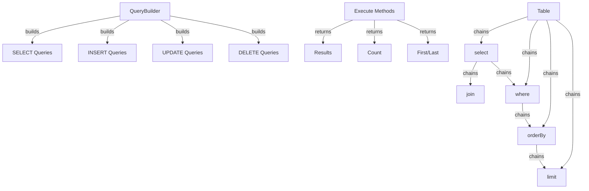

Trình tạo truy vấn XOOPS cung cấp giao diện hiện đại, trôi chảy để xây dựng các truy vấn SQL. Nó giúp ngăn chặn việc tiêm SQL, cải thiện khả năng đọc và cung cấp khả năng trừu tượng hóa cơ sở dữ liệu cho nhiều hệ thống cơ sở dữ liệu.

## Kiến trúc trình tạo truy vấn



## Lớp Trình tạo truy vấn

Trình tạo truy vấn chính class với giao diện thông thạo.

### Tổng quan về lớp học

```php
namespace Xoops\Database;

class QueryBuilder
{
    protected string $table = '';
    protected string $type = 'SELECT';
    protected array $selects = [];
    protected array $joins = [];
    protected array $wheres = [];
    protected array $orders = [];
    protected int $limit = 0;
    protected int $offset = 0;
    protected array $bindings = [];
}
```

### Phương thức tĩnh

#### bảng

Tạo trình tạo truy vấn mới cho một bảng.

```php
public static function table(string $table): QueryBuilder
```

**Thông số:**

| Tham số | Loại | Mô tả |
|----------|------|-------------|
| `$table` | chuỗi | Tên bảng (có hoặc không có tiền tố) |

**Trả về:** `QueryBuilder` - Phiên bản trình tạo truy vấn

**Ví dụ:**
```php
$query = QueryBuilder::table('users');
$query = QueryBuilder::table('xoops_users'); // With prefix
```

## Truy vấn CHỌN

### chọn

Chỉ định các cột để chọn.

```php
public function select(...$columns): self
```

**Thông số:**

| Tham số | Loại | Mô tả |
|----------|------|-------------|
| `...$columns` | mảng | Tên cột hoặc biểu thức |

**Trả về:** `self` - Dành cho chuỗi phương thức

**Ví dụ:**
```php
// Simple select
QueryBuilder::table('users')
    ->select('id', 'username', 'email')
    ->get();

// Select with aliases
QueryBuilder::table('users')
    ->select('id as user_id', 'username as name')
    ->get();

// Select all columns
QueryBuilder::table('users')
    ->select('*')
    ->get();

// Select with expressions
QueryBuilder::table('orders')
    ->select('id', 'COUNT(*) as total_items')
    ->groupBy('id')
    ->get();
```

### ở đâu

Thêm điều kiện WHERE.

```php
public function where(string $column, string $operator = '=', mixed $value = null): self
```

**Thông số:**

| Tham số | Loại | Mô tả |
|----------|------|-------------|
| `$column` | chuỗi | Tên cột |
| `$operator` | chuỗi | Toán tử so sánh |
| `$value` | hỗn hợp | Giá trị để so sánh |

**Trả về:** `self` - Dành cho chuỗi phương thức

**Người vận hành:**

| Nhà điều hành | Mô tả | Ví dụ |
|----------|-------------|----------|
| `=` | Bằng | `->where('status', '=', 'active')` |
| `!=` hoặc `<>` | Không bằng | `->where('status', '!=', 'deleted')` |
| `>` | Lớn hơn | `->where('price', '>', 100)` |
| `<` | Ít hơn | `->where('price', '<', 100)` |
| `>=` | Lớn hơn hoặc bằng | `->where('age', '>=', 18)` |
| `<=` | Ít hơn hoặc bằng | `->where('age', '<=', 65)` |
| `LIKE` | Khớp mẫu | `->where('name', 'LIKE', '%john%')` |
| `IN` | Trong danh sách | `->where('status', 'IN', ['active', 'pending'])` |
| `NOT IN` | Không có trong danh sách | `->where('id', 'NOT IN', [1, 2, 3])` |
| `BETWEEN` | Phạm vi | `->where('age', 'BETWEEN', [18, 65])` |
| `IS NULL` | Là vô giá trị | `->where('deleted_at', 'IS NULL')` |
| `IS NOT NULL` | Không rỗng | `->where('deleted_at', 'IS NOT NULL')` |

**Ví dụ:**
```php
// Single condition
QueryBuilder::table('users')
    ->select('*')
    ->where('status', '=', 'active')
    ->get();

// Multiple conditions (AND)
QueryBuilder::table('users')
    ->select('*')
    ->where('status', '=', 'active')
    ->where('age', '>=', 18)
    ->get();

// IN operator
QueryBuilder::table('products')
    ->select('*')
    ->where('category_id', 'IN', [1, 2, 3])
    ->get();

// LIKE operator
QueryBuilder::table('users')
    ->select('*')
    ->where('email', 'LIKE', '%@example.com')
    ->get();

// NULL check
QueryBuilder::table('users')
    ->select('*')
    ->where('deleted_at', 'IS NULL')
    ->get();
```

### hoặcỞ đâu

Thêm điều kiện OR.

```php
public function orWhere(string $column, string $operator = '=', mixed $value = null): self
```

**Ví dụ:**
```php
QueryBuilder::table('users')
    ->select('*')
    ->where('status', '=', 'active')
    ->orWhere('premium', '=', 1)
    ->get();
    // SELECT * FROM users WHERE status = 'active' OR premium = 1
```

### ở đâuTrong / ở đâuKhôngTrong

Các phương pháp thuận tiện cho IN/NOT IN.

```php
public function whereIn(string $column, array $values): self
public function whereNotIn(string $column, array $values): self
```

**Ví dụ:**
```php
QueryBuilder::table('posts')
    ->select('*')
    ->whereIn('status', ['published', 'scheduled'])
    ->get();

QueryBuilder::table('comments')
    ->select('*')
    ->whereNotIn('spam_score', [8, 9, 10])
    ->get();
```

### whereNull /whereNotNull

Các phương pháp thuận tiện để kiểm tra NULL.

```php
public function whereNull(string $column): self
public function whereNotNull(string $column): self
```

**Ví dụ:**
```php
QueryBuilder::table('users')
    ->select('*')
    ->whereNotNull('verified_at')
    ->get();
```

### ở đâu giữa

Kiểm tra xem giá trị có nằm giữa hai giá trị hay không.

```php
public function whereBetween(string $column, array $values): self
```

**Ví dụ:**
```php
QueryBuilder::table('products')
    ->select('*')
    ->whereBetween('price', [10, 100])
    ->get();

QueryBuilder::table('orders')
    ->select('*')
    ->whereBetween('created_at', ['2024-01-01', '2024-12-31'])
    ->get();
```

### tham gia

Thêm INNER THAM GIA.

```php
public function join(
    string $table,
    string $first,
    string $operator = '=',
    string $second = null
): self
```

**Ví dụ:**
```php
QueryBuilder::table('posts')
    ->select('posts.*', 'users.username', 'categories.name')
    ->join('users', 'posts.user_id', '=', 'users.id')
    ->join('categories', 'posts.category_id', '=', 'categories.id')
    ->where('posts.published', '=', 1)
    ->get();
```

### leftJoin / rightJoin

Các loại tham gia thay thế.

```php
public function leftJoin(
    string $table,
    string $first,
    string $operator = '=',
    string $second = null
): self

public function rightJoin(
    string $table,
    string $first,
    string $operator = '=',
    string $second = null
): self
```

**Ví dụ:**
```php
QueryBuilder::table('users')
    ->select('users.*', 'COUNT(posts.id) as post_count')
    ->leftJoin('posts', 'users.id', '=', 'posts.user_id')
    ->groupBy('users.id')
    ->get();
```

### nhómBy

Nhóm kết quả theo (các) cột.

```php
public function groupBy(...$columns): self
```

**Ví dụ:**
```php
QueryBuilder::table('orders')
    ->select('user_id', 'COUNT(*) as order_count', 'SUM(total) as total_spent')
    ->groupBy('user_id')
    ->get();

QueryBuilder::table('sales')
    ->select('department', 'region', 'SUM(amount) as total')
    ->groupBy('department', 'region')
    ->get();
```

### có

Thêm điều kiện HAVING.

```php
public function having(string $column, string $operator = '=', mixed $value = null): self
```

**Ví dụ:**
```php
QueryBuilder::table('orders')
    ->select('user_id', 'COUNT(*) as order_count')
    ->groupBy('user_id')
    ->having('order_count', '>', 5)
    ->get();
```

### đặt hàngBy

Kết quả đơn hàng.

```php
public function orderBy(string $column, string $direction = 'ASC'): self
```

**Thông số:**| Tham số | Loại | Mô tả |
|----------|------|-------------|
| `$column` | chuỗi | Cột sắp xếp theo |
| `$direction` | chuỗi | `ASC` hoặc `DESC` |

**Ví dụ:**
```php
// Single order
QueryBuilder::table('users')
    ->select('*')
    ->orderBy('created_at', 'DESC')
    ->get();

// Multiple orders
QueryBuilder::table('posts')
    ->select('*')
    ->orderBy('category_id', 'ASC')
    ->orderBy('created_at', 'DESC')
    ->get();

// Random order
QueryBuilder::table('quotes')
    ->select('*')
    ->orderBy('RAND()')
    ->get();
```

### giới hạn/bù đắp

Kết quả giới hạn và bù trừ.

```php
public function limit(int $limit): self
public function offset(int $offset): self
```

**Ví dụ:**
```php
// Simple limit
QueryBuilder::table('posts')
    ->select('*')
    ->limit(10)
    ->get();

// Pagination
$page = 2;
$perPage = 20;
$offset = ($page - 1) * $perPage;

QueryBuilder::table('posts')
    ->select('*')
    ->limit($perPage)
    ->offset($offset)
    ->get();
```

## Phương pháp thực hiện

### nhận được

Thực hiện truy vấn và trả về tất cả kết quả.

```php
public function get(): array
```

**Trả về:** `array` - Mảng các hàng kết quả

**Ví dụ:**
```php
$users = QueryBuilder::table('users')
    ->select('id', 'username', 'email')
    ->where('status', '=', 'active')
    ->orderBy('username')
    ->get();

foreach ($users as $user) {
    echo $user['username'] . ' (' . $user['email'] . ')' . "\n";
}
```

### đầu tiên

Nhận được kết quả đầu tiên.

```php
public function first(): ?array
```

**Trả về:** `?array` - Hàng đầu tiên hoặc rỗng

**Ví dụ:**
```php
$user = QueryBuilder::table('users')
    ->select('*')
    ->where('id', '=', 123)
    ->first();

if ($user) {
    echo 'Found: ' . $user['username'];
}
```

### cuối cùng

Nhận được kết quả cuối cùng.

```php
public function last(): ?array
```

**Ví dụ:**
```php
$latestPost = QueryBuilder::table('posts')
    ->select('*')
    ->orderBy('created_at', 'DESC')
    ->last();
```

### đếm

Nhận được số lượng kết quả.

```php
public function count(): int
```

**Trả về:** `int` - Số lượng hàng

**Ví dụ:**
```php
$activeUsers = QueryBuilder::table('users')
    ->where('status', '=', 'active')
    ->count();

echo "Active users: $activeUsers";
```

### tồn tại

Kiểm tra xem truy vấn có trả về kết quả nào không.

```php
public function exists(): bool
```

**Trả về:** `bool` - Đúng nếu có kết quả

**Ví dụ:**
```php
if (QueryBuilder::table('users')->where('email', '=', 'test@example.com')->exists()) {
    echo 'User already exists';
}
```

### tổng hợp

Nhận các giá trị tổng hợp.

```php
public function aggregate(string $function, string $column): mixed
```

**Ví dụ:**
```php
$maxPrice = QueryBuilder::table('products')
    ->aggregate('MAX', 'price');

$avgAge = QueryBuilder::table('users')
    ->aggregate('AVG', 'age');

$totalSales = QueryBuilder::table('orders')
    ->aggregate('SUM', 'total');
```

## CHÈN Truy vấn

### chèn

Chèn một hàng.

```php
public function insert(array $values): bool
```

**Ví dụ:**
```php
QueryBuilder::table('users')->insert([
    'username' => 'john',
    'email' => 'john@example.com',
    'password' => password_hash('secret', PASSWORD_BCRYPT),
    'created_at' => date('Y-m-d H:i:s')
]);
```

### chènNhiều

Chèn nhiều hàng.

```php
public function insertMany(array $rows): bool
```

**Ví dụ:**
```php
QueryBuilder::table('log_entries')->insertMany([
    ['action' => 'login', 'user_id' => 1, 'timestamp' => time()],
    ['action' => 'logout', 'user_id' => 2, 'timestamp' => time()],
    ['action' => 'update', 'user_id' => 3, 'timestamp' => time()]
]);
```

## CẬP NHẬT Truy vấn

### cập nhật

Cập nhật hàng.

```php
public function update(array $values): int
```

**Trả về:** `int` - Số lượng hàng bị ảnh hưởng

**Ví dụ:**
```php
// Update single user
QueryBuilder::table('users')
    ->where('id', '=', 123)
    ->update([
        'email' => 'newemail@example.com',
        'updated_at' => date('Y-m-d H:i:s')
    ]);

// Update multiple rows
QueryBuilder::table('posts')
    ->where('status', '=', 'draft')
    ->where('created_at', '<', date('Y-m-d', strtotime('-30 days')))
    ->update([
        'status' => 'archived'
    ]);
```

### tăng/giảm

Tăng hoặc giảm một cột.

```php
public function increment(string $column, int $amount = 1): int
public function decrement(string $column, int $amount = 1): int
```

**Ví dụ:**
```php
// Increment view count
QueryBuilder::table('posts')
    ->where('id', '=', 123)
    ->increment('views');

// Decrement stock
QueryBuilder::table('products')
    ->where('id', '=', 456)
    ->decrement('stock', 5);
```

## XÓA Truy vấn

### xóa

Xóa hàng.

```php
public function delete(): int
```

**Trả về:** `int` - Số hàng đã xóa

**Ví dụ:**
```php
// Delete single record
QueryBuilder::table('comments')
    ->where('id', '=', 789)
    ->delete();

// Delete multiple records
QueryBuilder::table('log_entries')
    ->where('created_at', '<', date('Y-m-d', strtotime('-30 days')))
    ->delete();
```

### cắt ngắn

Xóa tất cả các hàng khỏi bảng.

```php
public function truncate(): bool
```

**Ví dụ:**
```php
// Clear all sessions
QueryBuilder::table('sessions')->truncate();
```

## Tính năng nâng cao

### Biểu thức thô

```php
QueryBuilder::table('products')
    ->select('id', 'name', QueryBuilder::raw('price * quantity as total'))
    ->get();
```

### Truy vấn phụ

```php
$recentPostIds = QueryBuilder::table('posts')
    ->select('id')
    ->where('created_at', '>', date('Y-m-d', strtotime('-7 days')))
    ->toSql();

$comments = QueryBuilder::table('comments')
    ->select('*')
    ->whereIn('post_id', $recentPostIds)
    ->get();
```

### Lấy SQL

```php
public function toSql(): string
```

**Ví dụ:**
```php
$sql = QueryBuilder::table('users')
    ->select('id', 'username')
    ->where('status', '=', 'active')
    ->toSql();

echo $sql;
// SELECT id, username FROM xoops_users WHERE status = ?
```

## Ví dụ hoàn chỉnh

### Chọn phức hợp với các phép nối

```php
<?php
/**
 * Get posts with author and category info
 */

$posts = QueryBuilder::table('posts')
    ->select(
        'posts.id',
        'posts.title',
        'posts.content',
        'posts.created_at',
        'users.username as author',
        'categories.name as category'
    )
    ->join('users', 'posts.user_id', '=', 'users.id')
    ->join('categories', 'posts.category_id', '=', 'categories.id')
    ->where('posts.published', '=', 1)
    ->orderBy('posts.created_at', 'DESC')
    ->limit(10)
    ->get();

foreach ($posts as $post) {
    echo '<article>';
    echo '<h2>' . htmlspecialchars($post['title']) . '</h2>';
    echo '<p class="meta">By ' . htmlspecialchars($post['author']) . ' in ' . htmlspecialchars($post['category']) . '</p>';
    echo '<p>' . htmlspecialchars($post['content']) . '</p>';
    echo '</article>';
}
```

### Phân trang bằng QueryBuilder

```php
<?php
/**
 * Paginated results
 */

$page = isset($_GET['page']) ? (int)$_GET['page'] : 1;
$perPage = 20;
$offset = ($page - 1) * $perPage;

// Get total count
$total = QueryBuilder::table('articles')
    ->where('status', '=', 'published')
    ->count();

// Get page results
$articles = QueryBuilder::table('articles')
    ->select('*')
    ->where('status', '=', 'published')
    ->orderBy('created_at', 'DESC')
    ->limit($perPage)
    ->offset($offset)
    ->get();

// Calculate pagination
$pages = ceil($total / $perPage);

// Display results
foreach ($articles as $article) {
    echo '<div class="article">' . htmlspecialchars($article['title']) . '</div>';
}

// Display pagination links
if ($pages > 1) {
    echo '<nav class="pagination">';
    for ($i = 1; $i <= $pages; $i++) {
        if ($i == $page) {
            echo '<span class="current">' . $i . '</span>';
        } else {
            echo '<a href="?page=' . $i . '">' . $i . '</a>';
        }
    }
    echo '</nav>';
}
```

### Phân tích dữ liệu với tập hợp

```php
<?php
/**
 * Sales analysis
 */

// Total sales by region
$regionSales = QueryBuilder::table('orders')
    ->select('region', QueryBuilder::raw('SUM(total) as total_sales'), QueryBuilder::raw('COUNT(*) as order_count'))
    ->groupBy('region')
    ->orderBy('total_sales', 'DESC')
    ->get();

foreach ($regionSales as $region) {
    echo $region['region'] . ': $' . number_format($region['total_sales'], 2) . ' (' . $region['order_count'] . ' orders)' . "\n";
}

// Average order value
$avgOrderValue = QueryBuilder::table('orders')
    ->aggregate('AVG', 'total');

echo 'Average order value: $' . number_format($avgOrderValue, 2);
```

## Các phương pháp hay nhất

1. **Sử dụng truy vấn được tham số hóa** - QueryBuilder tự động xử lý liên kết tham số
2. **Phương thức chuỗi** - Tận dụng giao diện trôi chảy để có mã dễ đọc
3. **Kiểm tra đầu ra SQL** - Sử dụng `toSql()` để xác minh các truy vấn được tạo
4. **Sử dụng chỉ mục** - Đảm bảo các cột được truy vấn thường xuyên được lập chỉ mục
5. **Giới hạn kết quả** - Luôn sử dụng `limit()` cho các tập dữ liệu lớn
6. **Sử dụng Tổng hợp** - Cho phép cơ sở dữ liệu thực hiện đếm/tổng hợp thay vì PHP
7. **Escape Output** - Luôn thoát dữ liệu được hiển thị với `htmlspecialchars()`
8. **Hiệu suất chỉ mục** - Theo dõi các truy vấn chậm và tối ưu hóa tương ứng

## Tài liệu liên quan

- XoopsDatabase - Lớp cơ sở dữ liệu và các kết nối
- Tiêu chí - Hệ thống truy vấn dựa trên Tiêu chí kế thừa
- ../Core/XoopsObject - Tính bền vững của đối tượng dữ liệu
- ../Module/Module-System - Hoạt động cơ sở dữ liệu mô-đun

---

*Xem thêm: [Cơ sở dữ liệu XOOPS API](https://github.com/XOOPS/XoopsCore27/tree/master/htdocs/class)*