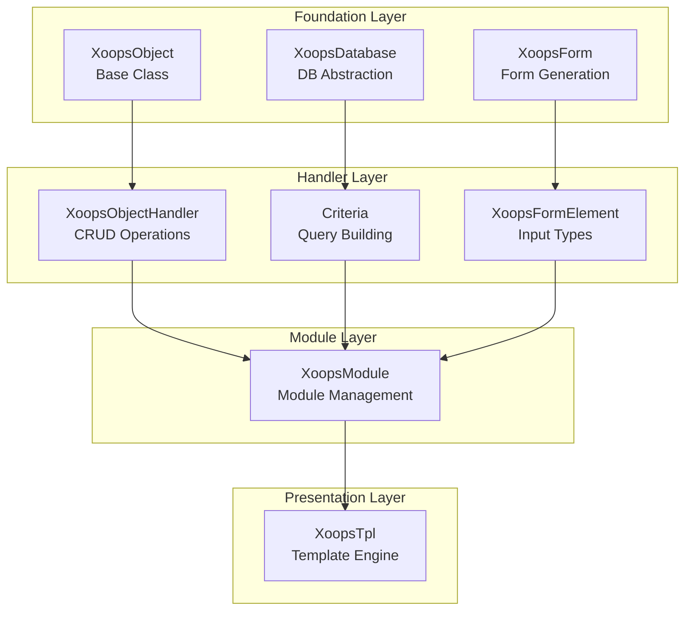
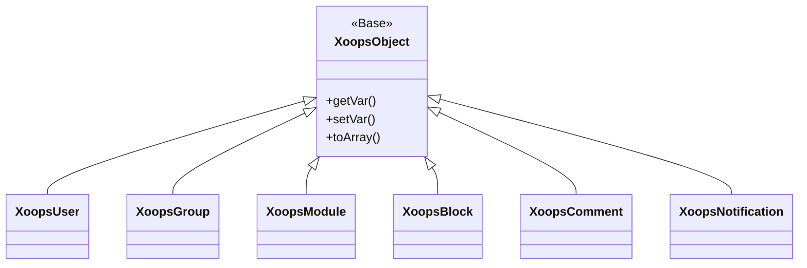
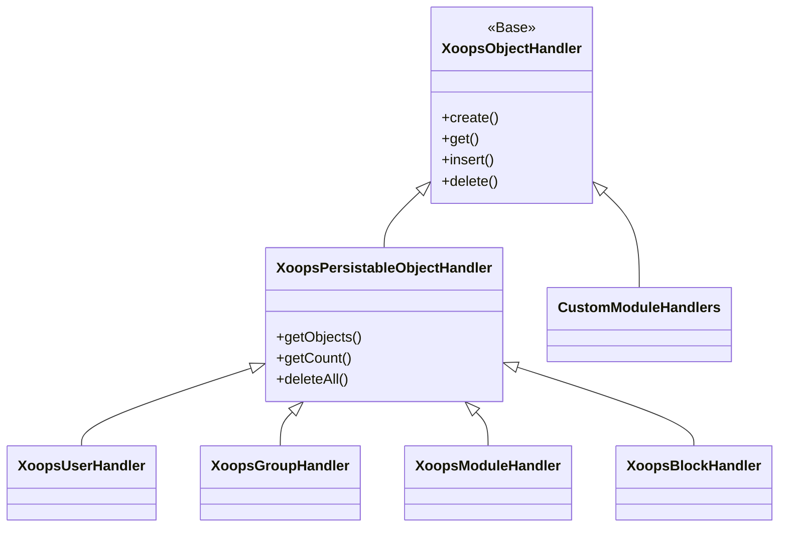
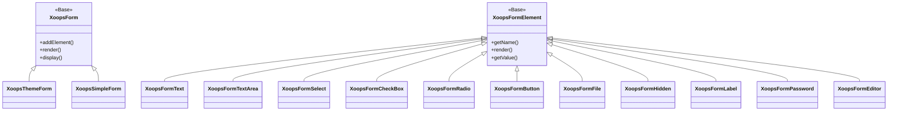

Chào mừng bạn đến với tài liệu tham khảo XOOPS API toàn diện. Phần này cung cấp tài liệu chi tiết cho tất cả classes cốt lõi, các phương pháp và hệ thống tạo nên Hệ thống quản lý nội dung XOOPS.

## Tổng quan

XOOPS API được tổ chức thành một số hệ thống con chính, mỗi hệ thống chịu trách nhiệm về một khía cạnh cụ thể của chức năng CMS. Hiểu các API này là điều cần thiết để phát triển modules, themes và các tiện ích mở rộng cho XOOPS.

## Phần API

### Lớp học cốt lõi

Nền tảng classes mà tất cả các thành phần XOOPS khác đều xây dựng dựa trên đó.

| Tài liệu | Mô tả |
|--------------|-------------|
| XoopsObject | Cơ sở class cho tất cả các đối tượng dữ liệu trong XOOPS |
| XoopsObjectHandler | Mẫu trình xử lý cho các hoạt động CRUD |

### Lớp cơ sở dữ liệu

Các tiện ích xây dựng truy vấn và trừu tượng hóa cơ sở dữ liệu.

| Tài liệu | Mô tả |
|--------------|-------------|
| Cơ sở dữ liệu Xoops | Lớp trừu tượng cơ sở dữ liệu |
| Hệ thống tiêu chí | Tiêu chí và điều kiện truy vấn |
| Trình tạo truy vấn | Xây dựng truy vấn thông thạo hiện đại |

### Hệ thống biểu mẫu

Tạo và xác thực biểu mẫu HTML.

| Tài liệu | Mô tả |
|--------------|-------------|
| XoopsForm | Vùng chứa và hiển thị biểu mẫu |
| Các phần tử biểu mẫu | Tất cả các loại phần tử biểu mẫu có sẵn |

### Các lớp hạt nhân

Các thành phần và dịch vụ của hệ thống cốt lõi.

| Tài liệu | Mô tả |
|--------------|-------------|
| Lớp hạt nhân | Hệ thống kernel và các thành phần cốt lõi |

### Hệ thống mô-đun

Quản lý mô-đun và vòng đời.

| Tài liệu | Mô tả |
|--------------|-------------|
| Hệ thống mô-đun | Tải, cài đặt và quản lý mô-đun |

### Hệ thống mẫu

Tích hợp mẫu Smarty.

| Tài liệu | Mô tả |
|--------------|-------------|
| Hệ thống mẫu | Quản lý mẫu và tích hợp Smarty |

### Hệ thống người dùng

Quản lý và xác thực người dùng.

| Tài liệu | Mô tả |
|--------------|-------------|
| Hệ thống người dùng | Tài khoản người dùng, nhóm và quyền |

## Tổng quan về kiến trúc



## Hệ thống phân cấp lớp

### Mô hình đối tượng



### Mô hình xử lý



### Mẫu biểu mẫu



## Mẫu thiết kế

XOOPS API triển khai một số mẫu thiết kế nổi tiếng:

### Mẫu đơn
Được sử dụng cho các dịch vụ toàn cầu như kết nối cơ sở dữ liệu và phiên bản vùng chứa.

```php
$db = XoopsDatabase::getInstance();
$container = XoopsContainer::getInstance();
```

### Mẫu nhà máy
Trình xử lý đối tượng tạo các đối tượng miền một cách nhất quán.

```php
$handler = xoops_getHandler('user');
$user = $handler->create();
```

### Mẫu tổng hợp
Biểu mẫu chứa nhiều thành phần biểu mẫu; tiêu chí có thể chứa các tiêu chí lồng nhau.

```php
$criteria = new CriteriaCompo();
$criteria->add(new Criteria('status', 1));
$criteria->add(new CriteriaCompo(...)); // Nested
```

### Mẫu quan sát
Hệ thống sự kiện cho phép ghép nối lỏng lẻo giữa modules.

```php
$dispatcher->addListener('module.news.article_published', $callback);
```

## Ví dụ bắt đầu nhanh

### Tạo và lưu một đối tượng

```php
// Get the handler
$handler = xoops_getHandler('user');

// Create a new object
$user = $handler->create();
$user->setVar('uname', 'newuser');
$user->setVar('email', 'user@example.com');

// Save to database
$handler->insert($user);
```

### Truy vấn có tiêu chí

```php
// Build criteria
$criteria = new CriteriaCompo();
$criteria->add(new Criteria('level', 0, '>'));
$criteria->setSort('uname');
$criteria->setOrder('ASC');
$criteria->setLimit(10);

// Get objects
$handler = xoops_getHandler('user');
$users = $handler->getObjects($criteria);
```

### Tạo biểu mẫu

```php
$form = new XoopsThemeForm('User Profile', 'userform', 'save.php', 'post', true);
$form->addElement(new XoopsFormText('Username', 'uname', 50, 255, $user->getVar('uname')));
$form->addElement(new XoopsFormTextArea('Bio', 'bio', $user->getVar('bio')));
$form->addElement(new XoopsFormButton('', 'submit', _SUBMIT, 'submit'));
echo $form->render();
```

## Công ước API

### Quy ước đặt tên| Loại | Công ước | Ví dụ |
|------|-------------|----------|
| Lớp học | PascalCase | `XoopsUser`, `CriteriaCompo` |
| Phương pháp | lạc đàCase | `getVar()`, `setVar()` |
| Thuộc tính | CamelCase (được bảo vệ) | `$_vars`, `$_handler` |
| Hằng số | UPPER_SNAKE_CASE | `XOBJ_DTYPE_INT` |
| Bảng cơ sở dữ liệu | trường hợp rắn | `users`, `groups_users_link` |

### Kiểu dữ liệu

XOOPS xác định các kiểu dữ liệu tiêu chuẩn cho các biến đối tượng:

| Hằng số | Loại | Mô tả |
|----------|------|-------------|
| `XOBJ_DTYPE_TXTBOX` | Chuỗi | Nhập văn bản (đã vệ sinh) |
| `XOBJ_DTYPE_TXTAREA` | Chuỗi | Nội dung vùng văn bản |
| `XOBJ_DTYPE_INT` | Số nguyên | Giá trị số |
| `XOBJ_DTYPE_URL` | Chuỗi | Xác thực URL |
| `XOBJ_DTYPE_EMAIL` | Chuỗi | Xác thực email |
| `XOBJ_DTYPE_ARRAY` | Mảng | Mảng nối tiếp |
| `XOBJ_DTYPE_OTHER` | Hỗn hợp | Xử lý tùy chỉnh |
| `XOBJ_DTYPE_SOURCE` | Chuỗi | Mã nguồn (khử trùng tối thiểu) |
| `XOBJ_DTYPE_STIME` | Số nguyên | Dấu thời gian ngắn |
| `XOBJ_DTYPE_MTIME` | Số nguyên | Dấu thời gian trung bình |
| `XOBJ_DTYPE_LTIME` | Số nguyên | Dấu thời gian dài |

## Phương thức xác thực

API hỗ trợ nhiều phương thức xác thực:

### Xác thực khóa API
```
X-API-Key: your-api-key
```

### Mã thông báo mang OAuth
```
Authorization: Bearer your-oauth-token
```

### Xác thực dựa trên phiên
Sử dụng phiên XOOPS hiện có khi đăng nhập.

## Điểm cuối REST API

Khi REST API được bật:

| Điểm cuối | Phương pháp | Mô tả |
|----------|--------|-------------|
| `/api.php/rest/users` | NHẬN | Liệt kê người dùng |
| `/api.php/rest/users/{id}` | NHẬN | Nhận người dùng theo ID |
| `/api.php/rest/users` | ĐĂNG | Tạo người dùng |
| `/api.php/rest/users/{id}` | ĐƯA | Cập nhật người dùng |
| `/api.php/rest/users/{id}` | XÓA | Xóa người dùng |
| `/api.php/rest/modules` | NHẬN | Danh sách modules |

## Tài liệu liên quan

- Hướng dẫn phát triển mô-đun
- Hướng dẫn phát triển chủ đề
- Cấu hình hệ thống
- Thực tiễn tốt nhất về bảo mật

## Lịch sử phiên bản

| Phiên bản | Thay đổi |
|----------|----------|
| 2.5.11 | Bản phát hành ổn định hiện tại |
| 2.5.10 | Đã thêm hỗ trợ GraphQL API |
| 2.5.9 | Hệ thống tiêu chí nâng cao |
| 2.5.8 | Hỗ trợ tự động tải PSR-4 |

---

*Tài liệu này là một phần của Cơ sở Kiến thức XOOPS. Để biết các bản cập nhật mới nhất, hãy truy cập [kho lưu trữ XOOPS GitHub](https://github.com/XOOPS).*