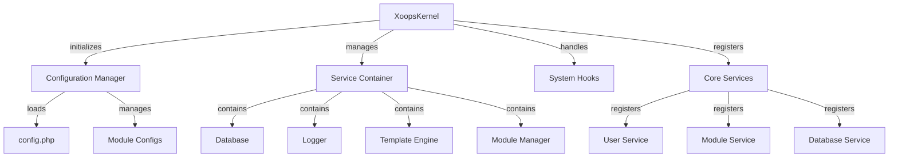

Hạt nhân XOOPS cung cấp khung nền tảng để khởi động hệ thống, quản lý cấu hình, xử lý các sự kiện hệ thống và cung cấp các tiện ích cốt lõi. Các classes này tạo thành xương sống của ứng dụng XOOPS.

## Kiến trúc hệ thống



## Lớp XoopsKernel

kernel class chính khởi tạo và quản lý hệ thống XOOPS.

### Tổng quan về lớp học

```php
namespace Xoops;

class XoopsKernel
{
    private static ?XoopsKernel $instance = null;
    protected ServiceContainer $services;
    protected ConfigurationManager $config;
    protected array $modules = [];
    protected bool $isLoaded = false;
}
```

### Trình xây dựng

```php
private function __construct()
```

Hàm tạo riêng thực thi mẫu đơn.

### lấy sơ thẩm

Truy xuất phiên bản kernel singleton.

```php
public static function getInstance(): XoopsKernel
```

**Trả về:** `XoopsKernel` - Phiên bản kernel đơn lẻ

**Ví dụ:**
```php
$kernel = XoopsKernel::getInstance();
```

### Quá trình khởi động

Quá trình khởi động kernel thực hiện theo các bước sau:

1. **Khởi tạo** - Đặt trình xử lý lỗi, xác định hằng số
2. **Cấu hình** - Tải tập tin cấu hình
3. **Đăng ký dịch vụ** - Đăng ký các dịch vụ cốt lõi
4. **Phát hiện mô-đun** - Quét và xác định modules đang hoạt động
5. **Khởi tạo cơ sở dữ liệu** - Kết nối với cơ sở dữ liệu
6. **Dọn dẹp** - Chuẩn bị xử lý yêu cầu

```php
public function boot(): void
```

**Ví dụ:**
```php
$kernel = XoopsKernel::getInstance();
$kernel->boot();
```

### Phương thức vùng chứa dịch vụ

#### đăng kýDịch vụ

Đăng ký một dịch vụ trong vùng chứa dịch vụ.

```php
public function registerService(
    string $name,
    callable|object $definition
): void
```

**Thông số:**

| Tham số | Loại | Mô tả |
|----------|------|-------------|
| `$name` | chuỗi | Mã định danh dịch vụ |
| `$definition` | có thể gọi được\|đối tượng | Nhà máy dịch vụ hoặc ví dụ |

**Ví dụ:**
```php
$kernel->registerService('custom.handler', function($c) {
    return new CustomHandler();
});
```

#### getService

Truy xuất một dịch vụ đã đăng ký.

```php
public function getService(string $name): mixed
```

**Thông số:**

| Tham số | Loại | Mô tả |
|----------|------|-------------|
| `$name` | chuỗi | Mã định danh dịch vụ |

**Trả về:** `mixed` - Dịch vụ được yêu cầu

**Ví dụ:**
```php
$database = $kernel->getService('database');
$logger = $kernel->getService('logger');
```

#### hasService

Kiểm tra nếu một dịch vụ được đăng ký.

```php
public function hasService(string $name): bool
```

**Ví dụ:**
```php
if ($kernel->hasService('cache')) {
    $cache = $kernel->getService('cache');
}
```

## Trình quản lý cấu hình

Quản lý cấu hình ứng dụng và cài đặt mô-đun.

### Tổng quan về lớp học

```php
namespace Xoops\Core;

class ConfigurationManager
{
    protected array $config = [];
    protected array $defaults = [];
    protected string $configPath;
}
```

### Phương pháp

#### tải

Tải cấu hình từ tập tin hoặc mảng.

```php
public function load(string|array $source): void
```

**Thông số:**

| Tham số | Loại | Mô tả |
|----------|------|-------------|
| `$source` | chuỗi\|mảng | Đường dẫn hoặc mảng tệp cấu hình |

**Ví dụ:**
```php
$config = $kernel->getService('config');
$config->load(XOOPS_ROOT_PATH . '/include/config.php');
$config->load(['sitename' => 'My Site', 'admin_email' => 'admin@example.com']);
```

#### nhận được

Truy xuất một giá trị cấu hình.

```php
public function get(string $key, mixed $default = null): mixed
```

**Thông số:**

| Tham số | Loại | Mô tả |
|----------|------|-------------|
| `$key` | chuỗi | Khóa cấu hình (ký hiệu dấu chấm) |
| `$default` | hỗn hợp | Giá trị mặc định nếu không tìm thấy |

**Trả về:** `mixed` - Giá trị cấu hình

**Ví dụ:**
```php
$siteName = $config->get('sitename');
$adminEmail = $config->get('admin.email', 'admin@example.com');
```

#### đã đặt

Đặt giá trị cấu hình.

```php
public function set(string $key, mixed $value): void
```

**Thông số:**

| Tham số | Loại | Mô tả |
|----------|------|-------------|
| `$key` | chuỗi | Phím cấu hình |
| `$value` | hỗn hợp | Giá trị cấu hình |

**Ví dụ:**
```php
$config->set('sitename', 'New Site Name');
$config->set('features.cache_enabled', true);
```

#### getModuleConfig

Nhận cấu hình cho một mô-đun cụ thể.

```php
public function getModuleConfig(
    string $moduleName
): array
```

**Thông số:**

| Tham số | Loại | Mô tả |
|----------|------|-------------|
| `$moduleName` | chuỗi | Tên thư mục mô-đun |

**Trả về:** `array` - Mảng cấu hình mô-đun**Ví dụ:**
```php
$publisherConfig = $config->getModuleConfig('publisher');
```

## Móc hệ thống

Móc hệ thống cho phép modules và các plugin thực thi mã tại các điểm cụ thể trong vòng đời ứng dụng.

### Lớp HookManager

```php
namespace Xoops\Core;

class HookManager
{
    protected array $hooks = [];
    protected array $listeners = [];
}
```

### Phương pháp

#### thêmHook

Đăng ký một điểm móc.

```php
public function addHook(string $name): void
```

**Thông số:**

| Tham số | Loại | Mô tả |
|----------|------|-------------|
| `$name` | chuỗi | Định danh móc |

**Ví dụ:**
```php
$hooks = $kernel->getService('hooks');
$hooks->addHook('system.startup');
$hooks->addHook('user.login');
$hooks->addHook('module.install');
```

#### lắng nghe

Gắn một người nghe vào một cái móc.

```php
public function listen(
    string $hookName,
    callable $callback,
    int $priority = 10
): void
```

**Thông số:**

| Tham số | Loại | Mô tả |
|----------|------|-------------|
| `$hookName` | chuỗi | Định danh móc |
| `$callback` | có thể gọi được | Chức năng thực thi |
| `$priority` | int | Ưu tiên thực thi (chạy cao hơn trước) |

**Ví dụ:**
```php
$hooks->listen('user.login', function($user) {
    error_log('User ' . $user->uname . ' logged in');
}, 10);

$hooks->listen('module.install', function($module) {
    // Custom module installation logic
    echo "Installing " . $module->getName();
}, 5);
```

#### kích hoạt

Thực hiện tất cả các trình nghe cho một hook.

```php
public function trigger(
    string $hookName,
    mixed $arguments = null
): array
```

**Thông số:**

| Tham số | Loại | Mô tả |
|----------|------|-------------|
| `$hookName` | chuỗi | Định danh móc |
| `$arguments` | hỗn hợp | Dữ liệu cần truyền tới người nghe |

**Trả về:** `array` - Kết quả từ tất cả người nghe

**Ví dụ:**
```php
$results = $hooks->trigger('system.startup');
$results = $hooks->trigger('user.created', $newUser);
```

## Tổng quan về dịch vụ cốt lõi

kernel đăng ký một số dịch vụ cốt lõi trong quá trình khởi động:

| Dịch vụ | Lớp | Mục đích |
|----------|-------|---------|
| `database` | Cơ sở dữ liệu Xoops | Lớp trừu tượng cơ sở dữ liệu |
| `config` | Trình quản lý cấu hình | Quản lý cấu hình |
| `logger` | Máy ghi nhật ký | Ghi nhật ký ứng dụng |
| `template` | XoopsTpl | Công cụ tạo mẫu |
| `user` | Trình quản lý người dùng | Dịch vụ quản lý người dùng |
| `module` | Trình quản lý mô-đun | Quản lý mô-đun |
| `cache` | Trình quản lý bộ đệm | Lớp bộ nhớ đệm |
| `hooks` | HookManager | Móc sự kiện hệ thống |

## Ví dụ sử dụng hoàn chỉnh

```php
<?php
/**
 * Custom module boot process utilizing kernel
 */

// Get kernel instance
$kernel = XoopsKernel::getInstance();

// Boot the system
$kernel->boot();

// Get services
$config = $kernel->getService('config');
$database = $kernel->getService('database');
$logger = $kernel->getService('logger');
$hooks = $kernel->getService('hooks');

// Access configuration
$siteName = $config->get('sitename');
$adminEmail = $config->get('admin.email');

// Register module-specific hooks
$hooks->listen('user.login', function($user) {
    // Log user login
    $logger->info('User login: ' . $user->uname);

    // Track in database
    $database->query(
        'INSERT INTO ' . $database->prefix('event_log') .
        ' (type, user_id, message, timestamp) VALUES (?, ?, ?, ?)',
        ['login', $user->uid(), 'User login', time()]
    );
});

$hooks->listen('module.install', function($module) {
    $logger->info('Module installed: ' . $module->getName());
});

// Trigger hooks
$hooks->trigger('system.startup');

// Use database service
$result = $database->query(
    'SELECT * FROM ' . $database->prefix('users') .
    ' LIMIT 10'
);

while ($row = $database->fetchArray($result)) {
    echo "User: " . htmlspecialchars($row['uname']) . "\n";
}

// Register custom service
$kernel->registerService('custom.repository', function($c) {
    return new CustomRepository($c->getService('database'));
});

// Later access custom service
$repo = $kernel->getService('custom.repository');
```

## Hằng số cốt lõi

kernel xác định một số hằng số quan trọng trong quá trình khởi động:

```php
// System paths
define('XOOPS_ROOT_PATH', '/var/www/xoops');
define('XOOPS_HTDOCS_PATH', XOOPS_ROOT_PATH . '/htdocs');
define('XOOPS_MODULES_PATH', XOOPS_ROOT_PATH . '/htdocs/modules');
define('XOOPS_THEMES_PATH', XOOPS_ROOT_PATH . '/htdocs/themes');

// Web paths
define('XOOPS_URL', 'http://example.com');
define('XOOPS_HTDOCS_URL', XOOPS_URL . '/htdocs');

// Database
define('XOOPS_DB_PREFIX', 'xoops_');
```

## Xử lý lỗi

kernel thiết lập trình xử lý lỗi trong khi khởi động:

```php
// Set custom error handler
set_error_handler(function($errno, $errstr, $errfile, $errline) {
    $kernel->getService('logger')->error(
        "Error: $errstr in $errfile:$errline"
    );
});

// Set exception handler
set_exception_handler(function($exception) {
    $kernel->getService('logger')->critical(
        "Exception: " . $exception->getMessage()
    );
});
```

## Các phương pháp hay nhất

1. **Khởi động một lần** - Chỉ gọi `boot()` một lần trong khi khởi động ứng dụng
2. **Sử dụng Service Container** - Đăng ký và truy xuất dịch vụ thông qua kernel
3. **Xử lý Hook sớm** - Đăng ký trình nghe hook trước khi kích hoạt chúng
4. **Ghi lại các sự kiện quan trọng** - Sử dụng dịch vụ ghi nhật ký để gỡ lỗi
5. **Cấu hình bộ đệm** - Tải cấu hình một lần và sử dụng lại
6. **Xử lý lỗi** - Luôn thiết lập trình xử lý lỗi trước khi xử lý yêu cầu

## Tài liệu liên quan

- ../Module/Module-System - Hệ thống mô-đun và vòng đời
- ../Template/Template-System - Tích hợp công cụ tạo mẫu
- ../User/User-System - Xác thực và quản lý người dùng
- ../Database/XoopsDatabase - Lớp cơ sở dữ liệu

---

*Xem thêm: [Nguồn hạt nhân XOOPS](https://github.com/XOOPS/XoopsCore27/tree/master/htdocs/class)*