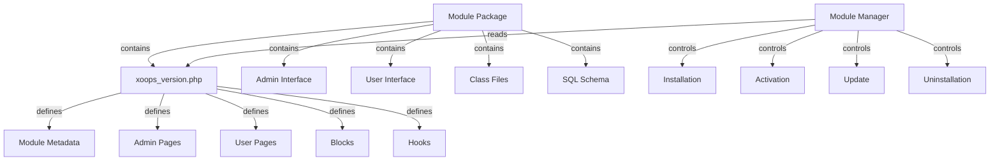

Hệ thống mô-đun XOOPS cung cấp một khung hoàn chỉnh để phát triển, cài đặt, quản lý và mở rộng chức năng mô-đun. Mô-đun là các gói độc lập mở rộng XOOPS với các tính năng và khả năng bổ sung.

## Kiến trúc mô-đun



## Cấu trúc mô-đun

Cấu trúc thư mục mô-đun XOOPS tiêu chuẩn:

```
mymodule/
├── xoops_version.php          # Module manifest and configuration
├── admin.php                  # Admin main page
├── index.php                  # User main page
├── admin/                     # Admin pages directory
│   ├── main.php
│   ├── manage.php
│   └── settings.php
├── class/                     # Module classes
│   ├── Handler/
│   │   ├── ItemHandler.php
│   │   └── CategoryHandler.php
│   └── Objects/
│       ├── Item.php
│       └── Category.php
├── sql/                       # Database schemas
│   ├── mysql.sql
│   └── postgres.sql
├── include/                   # Include files
│   ├── common.inc.php
│   └── functions.php
├── templates/                 # Module templates
│   ├── admin/
│   │   └── main.tpl
│   └── user/
│       ├── index.tpl
│       └── item.tpl
├── blocks/                    # Module blocks
│   └── blocks.php
├── tests/                     # Unit tests
├── language/                  # Language files
│   ├── english/
│   │   └── main.php
│   └── spanish/
│       └── main.php
└── docs/                      # Documentation
```

## Lớp XoopsModule

XoopsModule class đại diện cho mô-đun XOOPS đã được cài đặt.

### Tổng quan về lớp học

```php
namespace Xoops\Core\Module;

class XoopsModule extends XoopsObject
{
    protected int $moduleid = 0;
    protected string $name = '';
    protected string $dirname = '';
    protected string $version = '';
    protected string $description = '';
    protected array $config = [];
    protected array $blocks = [];
    protected array $adminPages = [];
    protected array $userPages = [];
}
```

### Thuộc tính

| Bất động sản | Loại | Mô tả |
|----------|------|-------------|
| `$moduleid` | int | ID mô-đun duy nhất |
| `$name` | chuỗi | Tên hiển thị mô-đun |
| `$dirname` | chuỗi | Tên thư mục mô-đun |
| `$version` | chuỗi | Phiên bản mô-đun hiện tại |
| `$description` | chuỗi | Mô tả mô-đun |
| `$config` | mảng | Cấu hình mô-đun |
| `$blocks` | mảng | Khối mô-đun |
| `$adminPages` | mảng | Trang bảng quản trị |
| `$userPages` | mảng | Các trang hướng tới người dùng |

### Trình xây dựng

```php
public function __construct()
```

Tạo một phiên bản mô-đun mới và khởi tạo các biến.

### Phương pháp cốt lõi

#### lấy Tên

Lấy tên hiển thị của mô-đun.

```php
public function getName(): string
```

**Trả về:** `string` - Tên hiển thị mô-đun

**Ví dụ:**
```php
$module = new XoopsModule();
$module->setVar('name', 'Publisher');
echo $module->getName(); // "Publisher"
```

#### lấyDirname

Lấy tên thư mục của mô-đun.

```php
public function getDirname(): string
```

**Trả về:** `string` - Tên thư mục mô-đun

**Ví dụ:**
```php
echo $module->getDirname(); // "publisher"
```

#### lấy Phiên bản

Lấy phiên bản mô-đun hiện tại.

```php
public function getVersion(): string
```

**Trả về:** `string` - Chuỗi phiên bản

**Ví dụ:**
```php
echo $module->getVersion(); // "2.1.0"
```

#### getMô tả

Lấy mô tả mô-đun.

```php
public function getDescription(): string
```

**Trả về:** `string` - Mô tả mô-đun

**Ví dụ:**
```php
$desc = $module->getDescription();
```

#### getConfig

Truy xuất cấu hình mô-đun.

```php
public function getConfig(string $key = null): mixed
```

**Thông số:**

| Tham số | Loại | Mô tả |
|----------|------|-------------|
| `$key` | chuỗi | Khóa cấu hình (null cho tất cả) |

**Trả về:** `mixed` - Giá trị cấu hình hoặc mảng

**Ví dụ:**
```php
$config = $module->getConfig();
$itemsPerPage = $module->getConfig('items_per_page');
```

#### setConfig

Đặt cấu hình mô-đun.

```php
public function setConfig(string $key, mixed $value): void
```

**Thông số:**

| Tham số | Loại | Mô tả |
|----------|------|-------------|
| `$key` | chuỗi | Phím cấu hình |
| `$value` | hỗn hợp | Giá trị cấu hình |

**Ví dụ:**
```php
$module->setConfig('items_per_page', 20);
$module->setConfig('enable_cache', true);
```

#### getPath

Lấy đường dẫn hệ thống tập tin đầy đủ đến mô-đun.

```php
public function getPath(): string
```

**Trả về:** `string` - Đường dẫn thư mục mô-đun tuyệt đối

**Ví dụ:**
```php
$path = $module->getPath(); // "/var/www/xoops/modules/publisher"
$classPath = $module->getPath() . '/class';
```

#### lấyUrl

Đưa URL vào mô-đun.

```php
public function getUrl(): string
```

**Trả về:** `string` - Mô-đun URL

**Ví dụ:**
```php
$url = $module->getUrl(); // "http://example.com/modules/publisher"
```

## Quá trình cài đặt mô-đun

### Chức năng xoops_module_install

Chức năng cài đặt mô-đun được xác định trong `xoops_version.php`:

```php
function xoops_module_install_modulename($module)
{
    // $module is an XoopsModule instance

    // Create database tables
    // Initialize default configuration
    // Create default folders
    // Set up file permissions

    return true; // Success
}
```

**Thông số:**

| Tham số | Loại | Mô tả |
|----------|------|-------------|
| `$module` | XoopsModule | Mô-đun đang được cài đặt |

**Trả về:** `bool` - Đúng nếu thành công, sai nếu thất bại

**Ví dụ:**
```php
function xoops_module_install_publisher($module)
{
    // Get module path
    $modulePath = $module->getPath();

    // Create uploads directory
    $uploadsPath = XOOPS_ROOT_PATH . '/uploads/publisher';
    if (!is_dir($uploadsPath)) {
        mkdir($uploadsPath, 0755, true);
    }

    // Get database connection
    global $xoopsDB;

    // Execute SQL installation script
    $sqlFile = $modulePath . '/sql/mysql.sql';
    if (file_exists($sqlFile)) {
        $sqlQueries = file_get_contents($sqlFile);
        // Execute queries (simplified)
        $xoopsDB->queryFromFile($sqlFile);
    }

    // Set default configuration
    $module->setConfig('items_per_page', 10);
    $module->setConfig('enable_comments', true);

    return true;
}
```

### Chức năng xoops_module_uninstall

Chức năng gỡ cài đặt mô-đun:

```php
function xoops_module_uninstall_modulename($module)
{
    // Drop database tables
    // Remove uploaded files
    // Clean up configuration

    return true;
}
```

**Ví dụ:**
```php
function xoops_module_uninstall_publisher($module)
{
    global $xoopsDB;

    // Drop tables
    $tables = ['publisher_items', 'publisher_categories', 'publisher_comments'];
    foreach ($tables as $table) {
        $xoopsDB->query('DROP TABLE IF EXISTS ' . $xoopsDB->prefix($table));
    }

    // Remove upload folder
    $uploadsPath = XOOPS_ROOT_PATH . '/uploads/publisher';
    if (is_dir($uploadsPath)) {
        // Recursive directory deletion
        $this->recursiveRemoveDir($uploadsPath);
    }

    return true;
}
```## Móc mô-đun

Móc mô-đun cho phép modules tích hợp với modules khác và hệ thống.

### Tuyên bố móc

Trong `xoops_version.php`:

```php
$modversion['hooks'] = [
    'system.page.footer' => [
        'function' => 'publisher_page_footer'
    ],
    'user.profile.view' => [
        'function' => 'publisher_user_articles'
    ],
];
```

### Thực hiện hook

```php
// In a module file (e.g., include/hooks.php)

function publisher_page_footer()
{
    // Return HTML for footer
    return '<div class="publisher-footer">Publisher Footer Content</div>';
}

function publisher_user_articles($user_id)
{
    global $xoopsDB;

    // Get user's articles
    $result = $xoopsDB->query(
        'SELECT * FROM ' . $xoopsDB->prefix('publisher_articles') .
        ' WHERE author_id = ? ORDER BY published DESC LIMIT 5',
        [$user_id]
    );

    $articles = [];
    while ($row = $xoopsDB->fetchAssoc($result)) {
        $articles[] = $row;
    }

    return $articles;
}
```

### Móc hệ thống có sẵn

| Móc | Thông số | Mô tả |
|------|-------------|-------------|
| `system.page.header` | Không có | Đầu ra tiêu đề trang |
| `system.page.footer` | Không có | Đầu ra chân trang |
| `user.login.success` | Đối tượng $user | Sau khi người dùng đăng nhập |
| `user.logout` | Đối tượng $user | Sau khi người dùng đăng xuất |
| `user.profile.view` | $user_id | Xem hồ sơ người dùng |
| `module.install` | Đối tượng $module | Cài đặt mô-đun |
| `module.uninstall` | Đối tượng $module | Gỡ cài đặt mô-đun |

## Dịch vụ quản lý mô-đun

Dịch vụ ModuleManager xử lý các hoạt động của mô-đun.

### Phương pháp

#### getModule

Truy xuất một mô-đun theo tên.

```php
public function getModule(string $dirname): ?XoopsModule
```

**Thông số:**

| Tham số | Loại | Mô tả |
|----------|------|-------------|
| `$dirname` | chuỗi | Tên thư mục mô-đun |

**Trả về:** `?XoopsModule` - Phiên bản mô-đun hoặc null

**Ví dụ:**
```php
$moduleManager = $kernel->getService('module');
$publisher = $moduleManager->getModule('publisher');
if ($publisher) {
    echo $publisher->getName();
}
```

#### getAllModules

Nhận tất cả cài đặt modules.

```php
public function getAllModules(bool $activeOnly = true): array
```

**Thông số:**

| Tham số | Loại | Mô tả |
|----------|------|-------------|
| `$activeOnly` | bool | Chỉ trả lại modules đang hoạt động |

**Trả về:** `array` - Mảng đối tượng XoopsModule

**Ví dụ:**
```php
$activeModules = $moduleManager->getAllModules(true);
foreach ($activeModules as $module) {
    echo $module->getName() . " - " . $module->getVersion() . "\n";
}
```

#### isModuleActive

Kiểm tra xem một mô-đun có đang hoạt động hay không.

```php
public function isModuleActive(string $dirname): bool
```

**Ví dụ:**
```php
if ($moduleManager->isModuleActive('publisher')) {
    // Publisher module is active
}
```

#### kích hoạtModule

Kích hoạt một mô-đun.

```php
public function activateModule(string $dirname): bool
```

**Ví dụ:**
```php
if ($moduleManager->activateModule('publisher')) {
    echo "Publisher activated";
}
```

#### hủy kích hoạt Mô-đun

Vô hiệu hóa một mô-đun.

```php
public function deactivateModule(string $dirname): bool
```

**Ví dụ:**
```php
if ($moduleManager->deactivateModule('publisher')) {
    echo "Publisher deactivated";
}
```

## Cấu hình mô-đun (xoops_version.php)

Ví dụ về bảng kê khai mô-đun hoàn chỉnh:

```php
<?php
/**
 * Module manifest for Publisher
 */

$modversion = [
    'name' => 'Publisher',
    'version' => '2.1.0',
    'description' => 'Professional content publishing module',
    'author' => 'XOOPS Community',
    'credits' => 'Based on original work by...',
    'license' => 'GPL v2',
    'official' => 1,
    'image' => 'images/logo.png',
    'dirname' => 'publisher',
    'onInstall' => 'xoops_module_install_publisher',
    'onUpdate' => 'xoops_module_update_publisher',
    'onUninstall' => 'xoops_module_uninstall_publisher',

    // Admin pages
    'hasAdmin' => 1,
    'adminindex' => 'admin/main.php',
    'adminmenu' => [
        [
            'title' => 'Dashboard',
            'link' => 'admin/main.php',
            'icon' => 'dashboard.png'
        ],
        [
            'title' => 'Manage Items',
            'link' => 'admin/items.php',
            'icon' => 'items.png'
        ],
        [
            'title' => 'Settings',
            'link' => 'admin/settings.php',
            'icon' => 'settings.png'
        ]
    ],

    // User pages
    'hasMain' => 1,
    'main_file' => 'index.php',

    // Blocks
    'blocks' => [
        [
            'file' => 'blocks/recent.php',
            'name' => 'Recent Articles',
            'description' => 'Display recent published articles',
            'show_func' => 'publisher_recent_show',
            'edit_func' => 'publisher_recent_edit',
            'options' => '5|0|0',
            'template' => 'publisher_block_recent.tpl'
        ],
        [
            'file' => 'blocks/featured.php',
            'name' => 'Featured Articles',
            'description' => 'Display featured articles',
            'show_func' => 'publisher_featured_show',
            'edit_func' => 'publisher_featured_edit'
        ]
    ],

    // Module hooks
    'hooks' => [
        'system.page.footer' => [
            'function' => 'publisher_page_footer'
        ],
        'user.profile.view' => [
            'function' => 'publisher_user_articles'
        ]
    ],

    // Configuration items
    'config' => [
        [
            'name' => 'items_per_page',
            'title' => '_MI_PUBLISHER_ITEMS_PER_PAGE',
            'description' => '_MI_PUBLISHER_ITEMS_PER_PAGE_DESC',
            'formtype' => 'text',
            'valuetype' => 'int',
            'default' => '10'
        ],
        [
            'name' => 'enable_comments',
            'title' => '_MI_PUBLISHER_ENABLE_COMMENTS',
            'description' => '_MI_PUBLISHER_ENABLE_COMMENTS_DESC',
            'formtype' => 'yesno',
            'valuetype' => 'int',
            'default' => '1'
        ]
    ]
];

function xoops_module_install_publisher($module)
{
    // Installation logic
    return true;
}

function xoops_module_update_publisher($module)
{
    // Update logic
    return true;
}

function xoops_module_uninstall_publisher($module)
{
    // Uninstallation logic
    return true;
}
```

## Các phương pháp hay nhất

1. **Không gian tên Lớp học của bạn** - Sử dụng không gian tên dành riêng cho mô-đun để tránh xung đột

2. **Sử dụng Trình xử lý** - Luôn sử dụng trình xử lý classes cho các thao tác cơ sở dữ liệu

3. **Quốc tế hóa nội dung** - Sử dụng hằng số language cho tất cả các chuỗi giao diện người dùng

4. **Tạo tập lệnh cài đặt** - Cung cấp lược đồ SQL cho các bảng cơ sở dữ liệu

5. **Móc tài liệu** - Ghi lại rõ ràng những gì mô-đun của bạn cung cấp

6. **Phiên bản mô-đun của bạn** - Tăng số phiên bản bằng các bản phát hành

7. **Cài đặt thử nghiệm** - Kiểm tra kỹ lưỡng quá trình cài đặt/gỡ cài đặt

8. **Xử lý quyền** - Kiểm tra quyền của người dùng trước khi cho phép hành động

## Ví dụ mô-đun hoàn chỉnh

```php
<?php
/**
 * Custom Article Module Main Page
 */

include __DIR__ . '/include/common.inc.php';

// Get module instance
$module = xoops_getModuleByDirname('mymodule');

// Check if module is active
if (!$module) {
    die('Module not found');
}

// Get module configuration
$itemsPerPage = $module->getConfig('items_per_page');

// Get item handler
$itemHandler = xoops_getModuleHandler('item', 'mymodule');

// Fetch items with pagination
$criteria = new CriteriaCompo();
$criteria->add(new Criteria('status', 1));
$items = $itemHandler->getObjects($criteria, $itemsPerPage);

// Prepare template
$xoopsTpl->assign('items', $items);
$xoopsTpl->assign('module_name', $module->getName());
$xoopsTpl->display($module->getPath() . '/templates/user/index.tpl');
```

## Tài liệu liên quan

- ../Kernel/Kernel-Classes - Khởi tạo hạt nhân và các dịch vụ cốt lõi
- ../Template/Template-System - Mô-đun templates và tích hợp chủ đề
- ../Database/QueryBuilder - Xây dựng truy vấn cơ sở dữ liệu
- ../Core/XoopsObject - Đối tượng cơ sở class

---

*Xem thêm: [Hướng dẫn phát triển mô-đun XOOPS](https://github.com/XOOPS/XoopsCore27/wiki/Module-Development)*