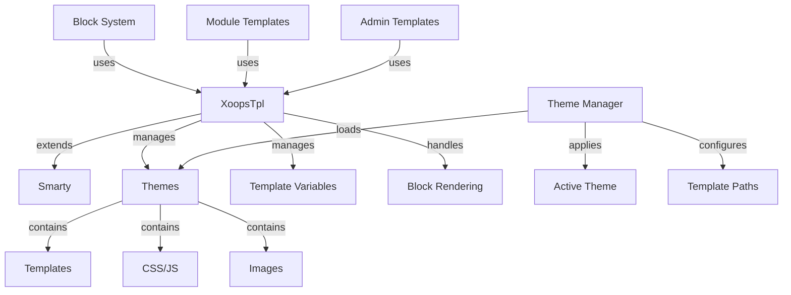

Hệ thống mẫu XOOPS được xây dựng trên công cụ mẫu Smarty mạnh mẽ, cung cấp một cách linh hoạt và có thể mở rộng để tách logic trình bày khỏi logic nghiệp vụ. Nó quản lý themes, kết xuất mẫu, gán biến và tạo nội dung động.

## Kiến trúc mẫu



## Lớp XoopsTpl

Công cụ tạo mẫu chính class mở rộng Smarty.

### Tổng quan về lớp học

```php
namespace Xoops\Core;

class XoopsTpl extends Smarty
{
    protected array $vars = [];
    protected string $currentTheme = '';
    protected array $blocks = [];
    protected bool $isAdmin = false;
}
```

### Mở rộng Smarty

```php
use Xoops\Core\XoopsTpl;

class XoopsTpl extends Smarty
{
    private static ?XoopsTpl $instance = null;

    private function __construct()
    {
        parent::__construct();
        $this->configureDirectories();
        $this->registerPlugins();
    }

    public static function getInstance(): XoopsTpl
    {
        if (!isset(self::$instance)) {
            self::$instance = new self();
        }
        return self::$instance;
    }
}
```

### Phương pháp cốt lõi

#### getInstance

Lấy phiên bản mẫu singleton.

```php
public static function getInstance(): XoopsTpl
```

**Trả về:** `XoopsTpl` - Phiên bản Singleton

**Ví dụ:**
```php
$xoopsTpl = XoopsTpl::getInstance();
```

#### chỉ định

Gán một biến cho mẫu.

```php
public function assign(
    string|array $tplVar,
    mixed $value = null
): void
```

**Thông số:**

| Tham số | Loại | Mô tả |
|----------|------|-------------|
| `$tplVar` | chuỗi\|mảng | Tên biến hoặc mảng kết hợp |
| `$value` | hỗn hợp | Giá trị biến |

**Ví dụ:**
```php
$xoopsTpl->assign('page_title', 'Welcome');
$xoopsTpl->assign('user_name', 'John Doe');

// Multiple assignments
$xoopsTpl->assign([
    'items' => $items,
    'total_count' => count($items),
    'show_pagination' => true
]);
```

#### nối thêmAssign

Nối các giá trị vào các biến mảng mẫu.

```php
public function appendAssign(
    string $tplVar,
    mixed $value
): void
```

**Thông số:**

| Tham số | Loại | Mô tả |
|----------|------|-------------|
| `$tplVar` | chuỗi | Tên biến |
| `$value` | hỗn hợp | Giá trị để nối thêm |

**Ví dụ:**
```php
$xoopsTpl->assign('breadcrumbs', ['Home']);
$xoopsTpl->appendAssign('breadcrumbs', 'Blog');
$xoopsTpl->appendAssign('breadcrumbs', 'Posts');
// breadcrumbs = ['Home', 'Blog', 'Posts']
```

#### getAssignedVars

Nhận tất cả các biến mẫu được chỉ định.

```php
public function getAssignedVars(): array
```

**Trả về:** `array` - Các biến được gán

**Ví dụ:**
```php
$vars = $xoopsTpl->getAssignedVars();
foreach ($vars as $name => $value) {
    echo "$name = " . var_export($value, true) . "\n";
}
```

#### hiển thị

Hiển thị một mẫu và xuất ra trình duyệt.

```php
public function display(
    string $resource,
    string|array $cache_id = null,
    string $compile_id = null,
    object $parent = null
): void
```

**Thông số:**

| Tham số | Loại | Mô tả |
|----------|------|-------------|
| `$resource` | chuỗi | Đường dẫn tệp mẫu |
| `$cache_id` | chuỗi\|mảng | Mã định danh bộ đệm |
| `$compile_id` | chuỗi | Biên dịch mã định danh |
| `$parent` | đối tượng | Đối tượng mẫu gốc |

**Ví dụ:**
```php
$xoopsTpl->assign('page_title', 'Home');
$xoopsTpl->display('user:index.tpl');

// With absolute path
$xoopsTpl->display(XOOPS_ROOT_PATH . '/templates/user/index.tpl');
```

#### tìm nạp

Hiển thị một mẫu và trả về dưới dạng chuỗi.

```php
public function fetch(
    string $resource,
    string|array $cache_id = null,
    string $compile_id = null,
    object $parent = null
): string
```

**Trả về:** `string` - Nội dung mẫu được hiển thị

**Ví dụ:**
```php
$xoopsTpl->assign('message', 'Hello World');
$html = $xoopsTpl->fetch('user:message.tpl');
echo $html;

// Use for email templates
$emailContent = $xoopsTpl->fetch('mail:notification.tpl');
mail($to, $subject, $emailContent);
```

#### tảiChủ đề

Tải một chủ đề cụ thể.

```php
public function loadTheme(string $themeName): bool
```

**Thông số:**

| Tham số | Loại | Mô tả |
|----------|------|-------------|
| `$themeName` | chuỗi | Tên thư mục chủ đề |

**Trả về:** `bool` - Đúng khi thành công

**Ví dụ:**
```php
if ($xoopsTpl->loadTheme('bluemoon')) {
    echo "Theme loaded successfully";
}
```

#### getCurrentTheme

Lấy tên của chủ đề hiện đang hoạt động.

```php
public function getCurrentTheme(): string
```

**Trả về:** `string` - Tên chủ đề

**Ví dụ:**
```php
$currentTheme = $xoopsTpl->getCurrentTheme();
echo "Active theme: $currentTheme";
```

#### setOutputFilter

Thêm bộ lọc đầu ra để xử lý đầu ra mẫu.

```php
public function setOutputFilter(string $function): void
```

**Thông số:**

| Tham số | Loại | Mô tả |
|----------|------|-------------|
| `$function` | chuỗi | Tên chức năng lọc |

**Ví dụ:**
```php
// Remove whitespace from output
$xoopsTpl->setOutputFilter('trim');

// Custom filter
function my_output_filter($output) {
    // Minify HTML
    $output = preg_replace('/\s+/', ' ', $output);
    return trim($output);
}
$xoopsTpl->setOutputFilter('my_output_filter');
```

#### đăng kýPlugin

Đăng ký plugin Smarty tùy chỉnh.

```php
public function registerPlugin(
    string $type,
    string $name,
    callable $callback
): void
```

**Thông số:**

| Tham số | Loại | Mô tả |
|----------|------|-------------|
| `$type` | chuỗi | Loại plugin (sửa đổi, khối, chức năng) |
| `$name` | chuỗi | Tên plugin |
| `$callback` | có thể gọi được | Chức năng gọi lại |

**Ví dụ:**
```php
// Register custom modifier
$xoopsTpl->registerPlugin('modifier', 'markdown', function($text) {
    return markdown_parse($text);
});

// Use in template: {$content|markdown}

// Register custom block tag
$xoopsTpl->registerPlugin('block', 'permission', function($params, $content, $smarty, &$repeat) {
    if ($repeat) return;

    // Check permission
    if (has_permission($params['name'])) {
        return $content;
    }
    return '';
});

// Use in template: {permission name="admin"}...{/permission}
```

## Hệ thống chủ đề

### Cấu trúc chủ đề

Cấu trúc thư mục chủ đề XOOPS tiêu chuẩn:

```
bluemoon/
├── style.css              # Main stylesheet
├── admin.css              # Admin stylesheet
├── theme.html             # Main page template
├── admin.html             # Admin page template
├── blocks/                # Block templates
│   ├── block_left.tpl
│   └── block_right.tpl
├── modules/               # Module templates
│   ├── publisher/
│   │   ├── index.tpl
│   │   └── item.tpl
│   └── news/
│       └── index.tpl
├── images/                # Theme images
│   ├── logo.png
│   └── banner.png
├── js/                    # Theme JavaScript
│   └── script.js
└── readme.txt             # Theme documentation
```

### Lớp quản lý chủ đề
```php
namespace Xoops\Core\Theme;

class ThemeManager
{
    protected array $themes = [];
    protected string $activeTheme = '';
    protected string $themeDirectory = '';

    public function getActiveTheme(): string {}
    public function setActiveTheme(string $theme): bool {}
    public function getThemeList(): array {}
    public function themeExists(string $name): bool {}
}
```

## Biến mẫu

### Biến toàn cục tiêu chuẩn

XOOPS tự động gán một số biến mẫu chung:

| Biến | Loại | Mô tả |
|----------|------|-------------|
| `$xoops_url` | chuỗi | Cài đặt XOOPS URL |
| `$xoops_user` | XoopsUser\|null | Đối tượng người dùng hiện tại |
| `$xoops_uname` | chuỗi | Tên người dùng hiện tại |
| `$xoops_isadmin` | bool | Người dùng là admin |
| `$xoops_banner` | chuỗi | Biểu ngữ HTML |
| `$xoops_notification` | chuỗi | Đánh dấu thông báo |
| `$xoops_version` | chuỗi | Phiên bản XOOPS |

### Biến cụ thể theo khối

Khi hiển thị các khối:

| Biến | Loại | Mô tả |
|----------|------|-------------|
| `$block` | mảng | Chặn thông tin |
| `$block.title` | chuỗi | Chặn tiêu đề |
| `$block.content` | chuỗi | Chặn nội dung |
| `$block.id` | int | Chặn ID |
| `$block.module` | chuỗi | Tên mô-đun |

### Biến mẫu mô-đun

Các mô-đun thường chỉ định:

| Biến | Loại | Mô tả |
|----------|------|-------------|
| `$module_name` | chuỗi | Tên hiển thị mô-đun |
| `$module_dir` | chuỗi | Thư mục mô-đun |
| `$xoops_module_header` | chuỗi | Mô-đun CSS/JS |

## Cấu hình Smarty

### Bộ sửa đổi Smarty phổ biến

| Công cụ sửa đổi | Mô tả | Ví dụ |
|----------|-------------|----------|
| `capitalize` | Viết hoa chữ cái đầu tiên | `{$title\|capitalize}` |
| `count_characters` | Số ký tự | `{$text\|count_characters}` |
| `date_format` | Định dạng dấu thời gian | `{$timestamp\|date_format:'%Y-%m-%d'}` |
| `escape` | Thoát ký tự đặc biệt | `{$html\|escape:'html'}` |
| `nl2br` | Chuyển đổi dòng mới sang `<br>` | `{$text\|nl2br}` |
| `strip_tags` | Xóa thẻ HTML | `{$content\|strip_tags}` |
| `truncate` | Giới hạn độ dài chuỗi | `{$text\|truncate:100}` |
| `upper` | Chuyển sang chữ hoa | `{$name\|upper}` |
| `lower` | Chuyển sang chữ thường | `{$name\|lower}` |

### Cấu trúc điều khiển

```smarty
{* If statement *}
{if $user->isAdmin()}
    <p>Admin content</p>
{else}
    <p>User content</p>
{/if}

{* For loop *}
{foreach $items as $item}
    <div class="item">{$item.title}</div>
{/foreach}

{* For loop with counter *}
{foreach $items as $item name=item_loop}
    {$smarty.foreach.item_loop.iteration}: {$item.title}
{/foreach}

{* While loop *}
{while $condition}
    <!-- content -->
{/while}

{* Switch statement *}
{switch $status}
    {case 'draft'}<span class="draft">Draft</span>{break}
    {case 'published'}<span class="published">Published</span>{break}
    {default}<span class="unknown">Unknown</span>
{/switch}
```

## Ví dụ mẫu hoàn chỉnh

### Mã PHP

```php
<?php
/**
 * Module Article List Page
 */

include __DIR__ . '/include/common.inc.php';

$xoopsTpl = XoopsTpl::getInstance();

// Check if module is active
$module = xoops_getModuleByDirname('articles');
if (!$module) {
    redirect_header(XOOPS_URL, 3, 'Module not found');
}

// Get item handler
$itemHandler = xoops_getModuleHandler('item', 'articles');

// Get pagination parameters
$page = !empty($_GET['page']) ? (int)$_GET['page'] : 1;
$perPage = $module->getConfig('items_per_page') ?: 10;
$offset = ($page - 1) * $perPage;

// Build criteria
$criteria = new CriteriaCompo();
$criteria->add(new Criteria('status', 1));
$criteria->setSort('published', 'DESC');
$criteria->setLimit($perPage);
$criteria->setStart($offset);

// Fetch items
$items = $itemHandler->getObjects($criteria);
$total = $itemHandler->getCount(new Criteria('status', 1));

// Calculate pagination
$pages = ceil($total / $perPage);

// Assign template variables
$xoopsTpl->assign([
    'module_name' => $module->getName(),
    'items' => $items,
    'total_items' => $total,
    'current_page' => $page,
    'total_pages' => $pages,
    'items_per_page' => $perPage,
    'show_pagination' => $pages > 1
]);

// Add breadcrumbs
$xoopsTpl->assign('xoops_breadcrumbs', [
    ['url' => XOOPS_URL, 'title' => 'Home'],
    ['url' => $module->getUrl(), 'title' => $module->getName()],
    ['title' => 'Articles']
]);

// Display template
$xoopsTpl->display($module->getPath() . '/templates/user/list.tpl');
```

### Tệp mẫu (list.tpl)

```smarty
<div id="articles-list">
    <h1>{$module_name|escape}</h1>

    {if $items}
        <div class="articles-container">
            {foreach $items as $item}
                <article class="article-item">
                    <header>
                        <h2>
                            <a href="{$item.url|escape}">
                                {$item.title|escape}
                            </a>
                        </h2>
                        <div class="meta">
                            <span class="author">By {$item.author|escape}</span>
                            <span class="date">
                                {$item.published|date_format:'%B %d, %Y'}
                            </span>
                        </div>
                    </header>

                    <div class="content">
                        <p>{$item.summary|truncate:150}</p>
                    </div>

                    <footer>
                        <a href="{$item.url|escape}" class="read-more">
                            Read More »
                        </a>
                    </footer>
                </article>
            {/foreach}
        </div>

        {* Pagination *}
        {if $show_pagination}
            <nav class="pagination">
                {if $current_page > 1}
                    <a href="?page=1" class="first">« First</a>
                    <a href="?page={$current_page - 1}" class="prev">‹ Previous</a>
                {/if}

                {for $i=1 to $total_pages}
                    {if $i == $current_page}
                        <span class="current">{$i}</span>
                    {else}
                        <a href="?page={$i}">{$i}</a>
                    {/if}
                {/for}

                {if $current_page < $total_pages}
                    <a href="?page={$current_page + 1}" class="next">Next ›</a>
                    <a href="?page={$total_pages}" class="last">Last »</a>
                {/if}
            </nav>
        {/if}
    {else}
        <p class="no-items">No articles found.</p>
    {/if}
</div>
```

## Chức năng Smarty tùy chỉnh

### Tạo chức năng khối tùy chỉnh

```php
<?php
/**
 * Custom Smarty block function for permission checking
 */

function smarty_block_permission($params, $content, $smarty, &$repeat)
{
    if ($repeat) return;

    if (!isset($params['name'])) {
        return 'Permission name required';
    }

    $permName = $params['name'];
    $user = $GLOBALS['xoopsUser'];

    // Check if user has permission
    if ($user && $user->isAdmin()) {
        return $content;
    }

    if ($user && check_user_permission($user->uid(), $permName)) {
        return $content;
    }

    return '';
}
```

Đăng ký và sử dụng:

```php
$xoopsTpl->registerPlugin('block', 'permission', 'smarty_block_permission');
```

Mẫu:

```smarty
{permission name="edit_articles"}
    <button>Edit Article</button>
{/permission}
```

## Các phương pháp hay nhất

1. **Thoát khỏi nội dung của người dùng** - Luôn sử dụng `|escape` cho nội dung do người dùng tạo
2. **Sử dụng Đường dẫn Mẫu** - Tham khảo templates liên quan đến chủ đề
3. **Tách logic khỏi bản trình bày** - Giữ logic phức tạp trong PHP
4. **Mẫu bộ nhớ đệm** - Kích hoạt bộ nhớ đệm mẫu trong quá trình sản xuất
5. **Sử dụng công cụ sửa đổi chính xác** - Áp dụng các bộ lọc thích hợp cho ngữ cảnh
6. **Sắp xếp các khối** - Đặt khối templates vào thư mục chuyên dụng
7. **Biến tài liệu** - Ghi lại tất cả các biến mẫu trong PHP

## Tài liệu liên quan

- ../Module/Module-System - Hệ thống mô-đun và móc
- ../Kernel/Kernel-Classes - Hạt nhân và cấu hình
- ../Core/XoopsObject - Đối tượng cơ sở class

---

*Xem thêm: [Tài liệu Smarty](https://www.smarty.net/docs) | [XOOPS Mẫu API](https://github.com/XOOPS/XoopsCore27/tree/master/htdocs/class)*