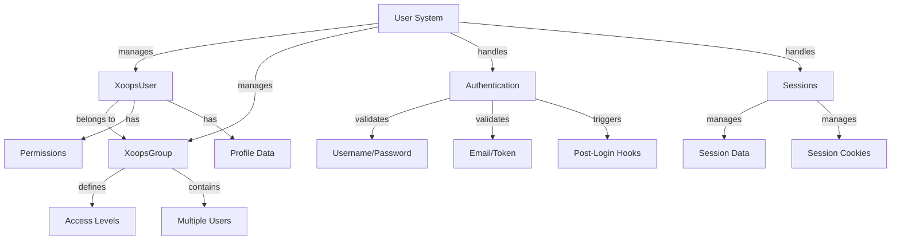

Hệ thống người dùng XOOPS quản lý tài khoản người dùng, xác thực, ủy quyền, thành viên nhóm và quản lý phiên. Nó cung cấp một khuôn khổ mạnh mẽ để bảo mật ứng dụng của bạn và kiểm soát quyền truy cập của người dùng.

## Kiến trúc hệ thống người dùng



## Lớp người dùng Xoops

Đối tượng người dùng chính class đại diện cho tài khoản người dùng.

### Tổng quan về lớp học

```php
namespace Xoops\Core\User;

class XoopsUser extends XoopsObject
{
    protected int $uid = 0;
    protected string $uname = '';
    protected string $email = '';
    protected string $pass = '';
    protected int $uregdate = 0;
    protected int $ulevel = 0;
    protected array $groups = [];
    protected array $permissions = [];
}
```

### Trình xây dựng

```php
public function __construct(int $uid = null)
```

Tạo một đối tượng người dùng mới, tùy chọn tải từ cơ sở dữ liệu theo ID.

**Thông số:**

| Tham số | Loại | Mô tả |
|----------|------|-------------|
| `$uid` | int | ID người dùng để tải (tùy chọn) |

**Ví dụ:**
```php
// Create new user
$user = new XoopsUser();

// Load existing user
$user = new XoopsUser(123);
```

### Thuộc tính cốt lõi

| Bất động sản | Loại | Mô tả |
|----------|------|-------------|
| `uid` | int | ID người dùng |
| `uname` | chuỗi | Tên người dùng |
| `email` | chuỗi | Địa chỉ email |
| `pass` | chuỗi | Băm mật khẩu |
| `uregdate` | int | Dấu thời gian đăng ký |
| `ulevel` | int | Cấp độ người dùng (9=admin, 1=người dùng) |
| `groups` | mảng | ID nhóm |
| `permissions` | mảng | Cờ cho phép |

### Phương pháp cốt lõi

#### getID / getUid

Lấy ID của người dùng.

```php
public function getID(): int
public function getUid(): int  // Alias
```

**Trả về:** `int` - ID người dùng

**Ví dụ:**
```php
$user = new XoopsUser(1);
echo $user->getID(); // 1
echo $user->getUid(); // 1
```

#### getUnameReal

Lấy tên hiển thị của người dùng.

```php
public function getUnameReal(): string
```

**Trả về:** `string` - Tên thật của người dùng

**Ví dụ:**
```php
$realName = $user->getUnameReal();
echo "Hello, $realName";
```

#### nhậnEmail

Lấy địa chỉ email của người dùng.

```php
public function getEmail(): string
```

**Trả về:** `string` - Địa chỉ email

**Ví dụ:**
```php
$email = $user->getEmail();
mail($email, 'Welcome', 'Welcome to XOOPS');
```

#### getVar / setVar

Nhận hoặc đặt một biến người dùng.

```php
public function getVar(string $key, string $format = 's'): mixed
public function setVar(string $key, mixed $value, bool $notGpc = false): bool
```

**Ví dụ:**
```php
// Get values
$username = $user->getVar('uname');
$email = $user->getVar('email', 's'); // Formatted for display

// Set values
$user->setVar('uname', 'newusername');
$user->setVar('email', 'user@example.com');
```

#### getGroup

Nhận tư cách thành viên nhóm của người dùng.

```php
public function getGroups(): array
```

**Trả về:** `array` - Mảng ID nhóm

**Ví dụ:**
```php
$groups = $user->getGroups();
echo "Member of " . count($groups) . " groups";
```

#### isInGroup

Kiểm tra xem người dùng có thuộc một nhóm hay không.

```php
public function isInGroup(int $groupId): bool
```

**Thông số:**

| Tham số | Loại | Mô tả |
|----------|------|-------------|
| `$groupId` | int | ID nhóm để kiểm tra |

**Trả về:** `bool` - Đúng nếu ở trong nhóm

**Ví dụ:**
```php
if ($user->isInGroup(1)) { // 1 = Webmasters
    echo 'User is a webmaster';
}
```

#### làQuản trị viên

Kiểm tra xem người dùng có phải là administrator hay không.

```php
public function isAdmin(): bool
```

**Trả về:** `bool` - Đúng nếu admin

**Ví dụ:**
```php
if ($user->isAdmin()) {
    // Show admin controls
    echo '<a href="admin/">Admin Panel</a>';
}
```

#### lấy hồ sơ

Nhận thông tin hồ sơ người dùng.

```php
public function getProfile(): array
```

**Trả về:** `array` - Dữ liệu hồ sơ

**Ví dụ:**
```php
$profile = $user->getProfile();
echo 'Bio: ' . $profile['bio'];
```

#### đang hoạt động

Kiểm tra xem tài khoản người dùng có đang hoạt động hay không.

```php
public function isActive(): bool
```

**Trả về:** `bool` - Đúng nếu hoạt động

**Ví dụ:**
```php
if ($user->isActive()) {
    // Allow user access
} else {
    // Restrict access
}
```

#### cập nhậtĐăng nhập lần cuối

Cập nhật dấu thời gian đăng nhập cuối cùng của người dùng.

```php
public function updateLastLogin(): bool
```

**Trả về:** `bool` - Đúng khi thành công

**Ví dụ:**
```php
if ($user->updateLastLogin()) {
    echo 'Login recorded';
}
```

## Lớp XoopsGroup

Quản lý nhóm người dùng và quyền.

### Tổng quan về lớp học

```php
namespace Xoops\Core\User;

class XoopsGroup extends XoopsObject
{
    protected int $groupid = 0;
    protected string $name = '';
    protected string $description = '';
    protected int $group_type = 0;
    protected array $users = [];
}
```

### Hằng số

| Hằng số | Giá trị | Mô tả |
|----------|-------|-------------|
| `TYPE_NORMAL` | 0 | Nhóm người dùng thông thường |
| `TYPE_ADMIN` | 1 | Nhóm hành chính |
| `TYPE_SYSTEM` | 2 | Nhóm hệ thống |

### Phương pháp

#### lấy Tên

Lấy tên nhóm.

```php
public function getName(): string
```

**Trả về:** `string` - Tên nhóm

**Ví dụ:**
```php
$group = new XoopsGroup(1);
echo $group->getName(); // "Webmasters"
```

#### getMô tảLấy mô tả nhóm.

```php
public function getDescription(): string
```

**Trả về:** `string` - Mô tả

**Ví dụ:**
```php
echo $group->getDescription();
```

#### lấy Người dùng

Nhận thành viên nhóm.

```php
public function getUsers(): array
```

**Trả về:** `array` - Mảng ID người dùng

**Ví dụ:**
```php
$users = $group->getUsers();
echo "Group has " . count($users) . " members";
```

#### thêm Người dùng

Thêm người dùng vào nhóm.

```php
public function addUser(int $uid): bool
```

**Thông số:**

| Tham số | Loại | Mô tả |
|----------|------|-------------|
| `$uid` | int | ID người dùng |

**Trả về:** `bool` - Đúng khi thành công

**Ví dụ:**
```php
$group = new XoopsGroup(2); // Editors
$group->addUser(123);
$groupHandler->insert($group);
```

#### xóaNgười dùng

Xóa một người dùng khỏi nhóm.

```php
public function removeUser(int $uid): bool
```

**Ví dụ:**
```php
$group->removeUser(123);
```

## Xác thực người dùng

### Quá trình đăng nhập

```php
/**
 * User login
 */
function xoops_user_login(string $uname, string $pass, bool $rememberMe = false): ?XoopsUser
{
    global $xoopsDB;

    // Sanitize username
    $uname = trim($uname);

    // Get user from database
    $query = $xoopsDB->prepare(
        'SELECT * FROM ' . $xoopsDB->prefix('users') .
        ' WHERE uname = ? AND active = 1'
    );
    $query->bind_param('s', $uname);
    $query->execute();
    $result = $query->get_result();

    if ($result->num_rows === 0) {
        return null; // User not found
    }

    $row = $result->fetch_assoc();

    // Verify password
    if (!password_verify($pass, $row['pass'])) {
        return null; // Invalid password
    }

    // Load user object
    $user = new XoopsUser($row['uid']);

    // Update last login
    $user->updateLastLogin();

    // Handle "Remember Me"
    if ($rememberMe) {
        // Set persistent cookie
        setcookie(
            'xoops_user_remember',
            $user->uid(),
            time() + (30 * 24 * 60 * 60), // 30 days
            '/',
            $_SERVER['HTTP_HOST'] ?? ''
        );
    }

    return $user;
}
```

### Quản lý mật khẩu

```php
/**
 * Hash password securely
 */
function xoops_hash_password(string $password): string
{
    return password_hash($password, PASSWORD_BCRYPT, [
        'cost' => 12
    ]);
}

/**
 * Verify password
 */
function xoops_verify_password(string $password, string $hash): bool
{
    return password_verify($password, $hash);
}

/**
 * Check if password needs rehashing
 */
function xoops_password_needs_rehash(string $hash): bool
{
    return password_needs_rehash($hash, PASSWORD_BCRYPT, [
        'cost' => 12
    ]);
}
```

## Quản lý phiên

### Lớp học phiên

```php
namespace Xoops\Core;

class SessionManager
{
    protected array $data = [];
    protected string $sessionId = '';

    public function start(): void {}
    public function get(string $key): mixed {}
    public function set(string $key, mixed $value): void {}
    public function destroy(): void {}
}
```

### Phương pháp phiên

#### Bắt đầu phiên

```php
<?php
session_start();

// Regenerate session ID for security
session_regenerate_id(true);

// Set session timeout
ini_set('session.gc_maxlifetime', 3600); // 1 hour

// Store user in session
if ($user) {
    $_SESSION['xoops_user'] = $user;
    $_SESSION['xoops_uid'] = $user->getID();
    $_SESSION['xoops_uname'] = $user->getVar('uname');
}
```

#### Kiểm tra phiên

```php
/**
 * Get current user from session
 */
function xoops_get_current_user(): ?XoopsUser
{
    if (isset($_SESSION['xoops_user']) && $_SESSION['xoops_user'] instanceof XoopsUser) {
        return $_SESSION['xoops_user'];
    }
    return null;
}

/**
 * Check if user is logged in
 */
function xoops_is_user_logged_in(): bool
{
    return isset($_SESSION['xoops_uid']) && $_SESSION['xoops_uid'] > 0;
}
```

#### Hủy phiên

```php
/**
 * User logout
 */
function xoops_user_logout()
{
    global $xoopsUser;

    // Log the logout
    if ($xoopsUser) {
        error_log('User ' . $xoopsUser->getVar('uname') . ' logged out');
    }

    // Destroy session data
    $_SESSION = [];

    // Delete session cookie
    if (ini_get('session.use_cookies')) {
        $params = session_get_cookie_params();
        setcookie(
            session_name(),
            '',
            time() - 42000,
            $params['path'],
            $params['domain'],
            $params['secure'],
            $params['httponly']
        );
    }

    // Destroy session
    session_destroy();
}
```

## Hệ thống cấp phép

### Hằng số quyền

| Hằng số | Giá trị | Mô tả |
|----------|-------|-------------|
| `XOOPS_PERMISSION_NONE` | 0 | Không được phép |
| `XOOPS_PERMISSION_VIEW` | 1 | Xem nội dung |
| `XOOPS_PERMISSION_SUBMIT` | 2 | Gửi nội dung |
| `XOOPS_PERMISSION_EDIT` | 4 | Chỉnh sửa nội dung |
| `XOOPS_PERMISSION_DELETE` | 8 | Xóa nội dung |
| `XOOPS_PERMISSION_ADMIN` | 16 | Quyền truy cập của quản trị viên |

### Kiểm tra quyền

```php
/**
 * Check if user has permission
 */
function xoops_check_permission($user, $resource, $permission)
{
    if (!$user) {
        return false;
    }

    // Admins have all permissions
    if ($user->isAdmin()) {
        return true;
    }

    // Check group permissions
    $groups = $user->getGroups();
    foreach ($groups as $groupId) {
        if (xoops_group_has_permission($groupId, $resource, $permission)) {
            return true;
        }
    }

    return false;
}
```

## Trình xử lý người dùng

UserHandler quản lý các hoạt động liên tục của người dùng.

```php
/**
 * Get user handler
 */
$userHandler = xoops_getHandler('user');

/**
 * Create new user
 */
$user = new XoopsUser();
$user->setVar('uname', 'newuser');
$user->setVar('email', 'user@example.com');
$user->setVar('pass', xoops_hash_password('password123'));
$user->setVar('uregdate', time());
$user->setVar('uactive', 1);

if ($userHandler->insert($user)) {
    echo 'User created with ID: ' . $user->getID();
}

/**
 * Update user
 */
$user = $userHandler->get(123);
$user->setVar('email', 'newemail@example.com');
$userHandler->insert($user);

/**
 * Get user by name
 */
$user = $userHandler->findByUsername('john');

/**
 * Delete user
 */
$userHandler->delete($user);

/**
 * Search users
 */
$criteria = new CriteriaCompo();
$criteria->add(new Criteria('uname', '%admin%', 'LIKE'));
$users = $userHandler->getObjects($criteria);
```

## Ví dụ hoàn chỉnh về quản lý người dùng

```php
<?php
/**
 * Complete user authentication and profile example
 */

require_once XOOPS_ROOT_PATH . '/include/common.inc.php';

$xoopsUser = $GLOBALS['xoopsUser'];

// Check if user is logged in
if (!$xoopsUser || !$xoopsUser->isActive()) {
    redirect_header(XOOPS_URL, 3, 'Please login');
}

// Get user handler
$userHandler = xoops_getHandler('user');

// Get current user with fresh data
$currentUser = $userHandler->get($xoopsUser->getID());

// User profile page
echo '<h1>Profile: ' . htmlspecialchars($currentUser->getVar('uname')) . '</h1>';

echo '<div class="user-profile">';
echo '<p><strong>Username:</strong> ' . htmlspecialchars($currentUser->getVar('uname')) . '</p>';
echo '<p><strong>Email:</strong> ' . htmlspecialchars($currentUser->getVar('email')) . '</p>';
echo '<p><strong>Registered:</strong> ' . date('Y-m-d H:i:s', $currentUser->getVar('uregdate')) . '</p>';
echo '<p><strong>Groups:</strong> ';

$groupHandler = xoops_getHandler('group');
$groups = $currentUser->getGroups();
$groupNames = [];
foreach ($groups as $groupId) {
    $group = $groupHandler->get($groupId);
    if ($group) {
        $groupNames[] = htmlspecialchars($group->getName());
    }
}
echo implode(', ', $groupNames);
echo '</p>';

// Admin status
if ($currentUser->isAdmin()) {
    echo '<p><strong>Status:</strong> Administrator</p>';
}

echo '</div>';

// Change password form
if ($_SERVER['REQUEST_METHOD'] === 'POST' && !empty($_POST['change_password'])) {
    $oldPassword = $_POST['old_password'] ?? '';
    $newPassword = $_POST['new_password'] ?? '';
    $confirmPassword = $_POST['confirm_password'] ?? '';

    // Verify old password
    if (!password_verify($oldPassword, $currentUser->getVar('pass'))) {
        echo '<div class="error">Current password is incorrect</div>';
    } elseif ($newPassword !== $confirmPassword) {
        echo '<div class="error">New passwords do not match</div>';
    } elseif (strlen($newPassword) < 6) {
        echo '<div class="error">Password must be at least 6 characters</div>';
    } else {
        // Update password
        $currentUser->setVar('pass', xoops_hash_password($newPassword));
        if ($userHandler->insert($currentUser)) {
            echo '<div class="success">Password changed successfully</div>';
        } else {
            echo '<div class="error">Failed to update password</div>';
        }
    }
}

// Password change form
echo '<form method="post">';
echo '<h3>Change Password</h3>';
echo '<div class="form-group">';
echo '<label>Current Password:</label>';
echo '<input type="password" name="old_password" required>';
echo '</div>';
echo '<div class="form-group">';
echo '<label>New Password:</label>';
echo '<input type="password" name="new_password" required>';
echo '</div>';
echo '<div class="form-group">';
echo '<label>Confirm Password:</label>';
echo '<input type="password" name="confirm_password" required>';
echo '</div>';
echo '<button type="submit" name="change_password">Change Password</button>';
echo '</form>';
```

## Các phương pháp hay nhất

1. **Mật khẩu băm** - Luôn sử dụng bcrypt hoặc argon2 để băm mật khẩu
2. **Xác thực đầu vào** - Xác thực và vệ sinh tất cả đầu vào của người dùng
3. **Kiểm tra quyền** - Luôn xác minh quyền của người dùng trước khi hành động
4. **Sử dụng phiên một cách an toàn** - Tạo lại ID phiên khi đăng nhập
5. **Ghi nhật ký hoạt động** - Đăng nhập, đăng xuất và các hành động quan trọng
6. **Giới hạn tỷ lệ** - Thực hiện giới hạn tỷ lệ đăng nhập
7. **Chỉ HTTPS** - Luôn sử dụng HTTPS để xác thực
8. **Quản lý nhóm** - Sử dụng nhóm để tổ chức quyền

## Tài liệu liên quan

- ../Kernel/Kernel-Classes - Dịch vụ hạt nhân và khởi động
- ../Database/QueryBuilder - Truy vấn cơ sở dữ liệu về dữ liệu người dùng
- ../Core/XoopsObject - Đối tượng cơ sở class

---

*Xem thêm: [XOOPS Người dùng API](https://github.com/XOOPS/XoopsCore27/tree/master/htdocs/class) | [PHP Bảo mật](https://www.php.net/manual/en/book.password.php)*