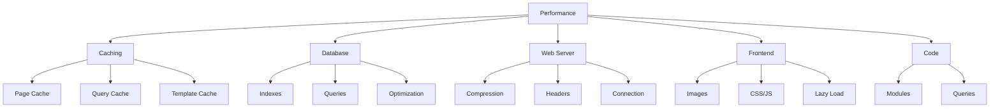

# XOOPS Tối Ưu Hiệu Năng

Hướng dẫn toàn diện để tối ưu hóa XOOPS để có tốc độ và hiệu quả tối đa.

## Tổng quan về tối ưu hóa hiệu suất



## Cấu hình bộ nhớ đệm

Bộ nhớ đệm là cách nhanh nhất để cải thiện hiệu suất.

### Bộ nhớ đệm cấp trang

Kích hoạt bộ nhớ đệm toàn trang trong XOOPS:

**Bảng quản trị > Hệ thống > Tùy chọn > Cài đặt bộ đệm**

```
Enable Caching: Yes
Cache Type: File Cache (or APCu/Memcache)
Cache Lifetime: 3600 seconds (1 hour)
Cache Module Lists: Yes
Cache Configuration: Yes
Cache Search Results: Yes
```

### Bộ nhớ đệm dựa trên tệp

Định cấu hình vị trí bộ đệm của tệp:

```bash
# Create cache directory outside web root (more secure)
mkdir -p /var/cache/xoops
chown www-data:www-data /var/cache/xoops
chmod 755 /var/cache/xoops

# Edit mainfile.php
define('XOOPS_CACHE_PATH', '/var/cache/xoops/');
```

### Bộ nhớ đệm APCu

APCu cung cấp bộ nhớ đệm trong bộ nhớ (rất nhanh):

```bash
# Install APCu
apt-get install php-apcu

# Verify installation
php -m | grep apcu

# Configure in php.ini
apc.enabled = 1
apc.memory_size = 128M
apc.ttl = 0
apc.user_ttl = 3600
apc.shm_size = 128
```

Kích hoạt trong XOOPS:

**Bảng quản trị > Hệ thống > Tùy chọn > Cài đặt bộ đệm**

```
Cache Type: APCu
```

### Bộ nhớ đệm Memcache/Redis

Bộ nhớ đệm phân tán cho các trang web có lưu lượng truy cập cao:

**Cài đặt Memcache:**

```bash
# Install Memcache server
apt-get install memcached

# Start service
systemctl start memcached
systemctl enable memcached

# Verify running
netstat -tlnp | grep memcached
# Should show listening on port 11211
```

**Định cấu hình trong XOOPS:**

Chỉnh sửa mainfile.php:

```php
// Memcache configuration
define('XOOPS_CACHE_TYPE', 'memcache');
define('XOOPS_CACHE_HOST', 'localhost');
define('XOOPS_CACHE_PORT', 11211);
define('XOOPS_CACHE_TIMEOUT', 0);
```

Hoặc trong bảng admin:

```
Cache Type: Memcache
Memcache Host: localhost:11211
```

### Bộ nhớ đệm mẫu

Biên dịch và lưu vào bộ đệm XOOPS templates:

```bash
# Ensure templates_c is writable
chmod 777 /var/www/html/xoops/templates_c/

# Clear old cached templates
rm -rf /var/www/html/xoops/templates_c/*
```

Cấu hình trong chủ đề:

```html
<!-- In theme xoops_version.php -->
{smarty.const.XOOPS_VAR_PATH|constant}
<{$xoops_meta}>

<!-- Templates use caching -->
{cache}
    [Cached content here]
{/cache}
```

## Tối ưu hóa cơ sở dữ liệu

### Thêm chỉ mục cơ sở dữ liệu

Cơ sở dữ liệu được lập chỉ mục đúng truy vấn nhanh hơn nhiều.

```sql
-- Check current indexes
SHOW INDEXES FROM xoops_users;

-- Common indexes to add
ALTER TABLE xoops_users ADD INDEX idx_uname (uname);
ALTER TABLE xoops_users ADD INDEX idx_email (email);
ALTER TABLE xoops_users ADD INDEX idx_uid_active (uid, user_actkey);

-- Add indexes to posts/content tables
ALTER TABLE xoops_posts ADD INDEX idx_post_published (post_published);
ALTER TABLE xoops_posts ADD INDEX idx_post_uid (post_uid);
ALTER TABLE xoops_posts ADD INDEX idx_post_created (post_created);

-- Verify indexes created
SHOW INDEXES FROM xoops_users\G
```

### Tối ưu hóa bảng

Tối ưu hóa bảng thường xuyên cải thiện hiệu suất:

```sql
-- Optimize all tables
OPTIMIZE TABLE xoops_users;
OPTIMIZE TABLE xoops_posts;
OPTIMIZE TABLE xoops_config;
OPTIMIZE TABLE xoops_comments;

-- Or optimize all at once
REPAIR TABLE xoops_users;
OPTIMIZE TABLE xoops_users;
REPAIR TABLE xoops_posts;
OPTIMIZE TABLE xoops_posts;
```

Tạo tập lệnh tối ưu hóa tự động:

```bash
#!/bin/bash
# Database optimization script

echo "Optimizing XOOPS database..."

mysql -u xoops_user -p xoops_db << EOF
-- Optimize all tables
OPTIMIZE TABLE xoops_users;
OPTIMIZE TABLE xoops_posts;
OPTIMIZE TABLE xoops_config;
OPTIMIZE TABLE xoops_comments;
OPTIMIZE TABLE xoops_users_online;

-- Show database size
SELECT table_schema,
       ROUND(SUM(data_length + index_length) / 1024 / 1024, 2) as total_mb
FROM information_schema.tables
WHERE table_schema = 'xoops_db'
GROUP BY table_schema;
EOF

echo "Database optimization completed!"
```

Lên lịch với cron:

```bash
# Weekly optimization
crontab -e
# Add: 0 3 * * 0 /usr/local/bin/optimize-xoops-db.sh
```

### Tối ưu hóa truy vấn

Xem lại các truy vấn chậm:

```sql
-- Enable slow query log
SET GLOBAL slow_query_log = 'ON';
SET GLOBAL long_query_time = 2;

-- View slow queries
SELECT * FROM mysql.slow_log;

-- Or check slow log file
tail -100 /var/log/mysql/slow.log
```

Các kỹ thuật tối ưu hóa phổ biến:

```php
// SLOW - Avoid unnecessary queries in loops
foreach ($users as $user) {
    $profile = getUserProfile($user['uid']);  // Query in loop!
    echo $profile['name'];
}

// FAST - Get all data at once
$profiles = getAllUserProfiles($user_ids);
foreach ($users as $user) {
    echo $profiles[$user['uid']]['name'];
}
```

### Tăng vùng đệm

Định cấu hình MySQL để lưu vào bộ nhớ đệm tốt hơn:

Chỉnh sửa `/etc/mysql/mysql.conf.d/mysqld.cnf`:

```ini
# InnoDB Buffer Pool (50-80% of system RAM)
innodb_buffer_pool_size = 1G

# Query Cache (optional, can be disabled in MySQL 5.7+)
query_cache_size = 64M
query_cache_type = 1

# Max Connections
max_connections = 500

# Max Allowed Packet
max_allowed_packet = 256M

# Connection timeout
connect_timeout = 10
```

Khởi động lại MySQL:

```bash
systemctl restart mysql
```

## Tối ưu hóa máy chủ web

### Kích hoạt tính năng nén Gzip

Nén phản hồi để giảm băng thông:

**Cấu hình Apache:**

```apache
<IfModule mod_deflate.c>
    AddOutputFilterByType DEFLATE text/html text/plain text/xml text/css text/javascript application/javascript application/json

    # Don't compress images and already compressed files
    SetEnvIfNoCase Request_URI \.(jpg|jpeg|png|gif|zip|gzip)$ no-gzip dont-vary

    # Log compressed responses
    DeflateBufferSize 8096
</IfModule>
```

**Cấu hình Nginx:**

```nginx
gzip on;
gzip_types text/html text/plain text/css text/javascript application/javascript application/json;
gzip_min_length 1000;
gzip_vary on;
gzip_comp_level 6;

# Don't compress already compressed formats
gzip_disable "msie6";
```

Xác minh nén:

```bash
# Check if response is gzipped
curl -I -H "Accept-Encoding: gzip" http://your-domain.com/xoops/

# Should show:
# Content-Encoding: gzip
```

### Tiêu đề bộ nhớ đệm của trình duyệt

Đặt hết hạn bộ đệm cho assets tĩnh:

**Apache:**

```apache
<IfModule mod_expires.c>
    ExpiresActive On

    # Cache images for 30 days
    ExpiresByType image/jpeg "access plus 30 days"
    ExpiresByType image/gif "access plus 30 days"
    ExpiresByType image/png "access plus 30 days"
    ExpiresByType image/svg+xml "access plus 30 days"

    # Cache CSS/JS for 30 days
    ExpiresByType text/css "access plus 30 days"
    ExpiresByType application/javascript "access plus 30 days"
    ExpiresByType text/javascript "access plus 30 days"

    # Cache fonts for 1 year
    ExpiresByType font/eot "access plus 1 year"
    ExpiresByType font/ttf "access plus 1 year"
    ExpiresByType font/woff "access plus 1 year"
    ExpiresByType font/woff2 "access plus 1 year"

    # Don't cache HTML
    ExpiresByType text/html "access plus 1 hour"
</IfModule>
```

**Nginx:**

```nginx
location ~* \.(jpg|jpeg|png|gif|ico|svg|woff|woff2|ttf|eot)$ {
    expires 30d;
    add_header Cache-Control "public, immutable";
}

location ~* \.(css|js)$ {
    expires 30d;
    add_header Cache-Control "public";
}

location ~ \.html$ {
    expires 1h;
    add_header Cache-Control "public";
}
```

### Duy trì kết nối

Kích hoạt kết nối HTTP liên tục:

**Apache:**

```apache
<IfModule mod_http.c>
    KeepAlive On
    KeepAliveTimeout 15
    MaxKeepAliveRequests 100
</IfModule>
```

**Nginx:**

```nginx
keepalive_timeout 15s;
keepalive_requests 100;
```

## Tối ưu hóa giao diện người dùng

### Tối ưu hóa hình ảnh

Giảm kích thước file ảnh:

```bash
# Batch compress JPEG images
for img in *.jpg; do
    convert "$img" -quality 85 "optimized_$img"
done

# Batch compress PNG images
for img in *.png; do
    optipng -o2 "$img"
done

# Or use imagemin CLI
npm install -g imagemin-cli
imagemin images/ --out-dir=images-optimized
```

### Giảm thiểu CSS và JavaScript

Giảm kích thước tệp CSS/JS:

**Sử dụng công cụ Node.js:**

```bash
# Install minifiers
npm install -g uglify-js clean-css-cli

# Minify JavaScript
uglifyjs script.js -o script.min.js

# Minify CSS
cleancss style.css -o style.min.css
```

**Sử dụng các công cụ trực tuyến:**
- Công cụ khai thác CSS: https://cssminifier.com/
- Công cụ khai thác JavaScript: https://www.minifycode.com/javascript-minifier/

### Hình ảnh tải chậm

Chỉ tải hình ảnh khi cần thiết:

```html
<!-- Add loading="lazy" attribute -->


<!-- Or use JavaScript library for older browsers -->


<script src="https://cdnjs.cloudflare.com/ajax/libs/vanilla-lazyload/17.1.2/lazyload.min.js"></script>
<script>
    var lazyLoad = new LazyLoad({
        elements_selector: ".lazy"
    });
</script>
```

### Giảm tài nguyên chặn hiển thị

Tải CSS/JS một cách chiến lược:

```html
<!-- Load critical CSS inline -->
<style>
    /* Critical styles for above-the-fold */
</style>

<!-- Defer non-critical CSS -->
<link rel="stylesheet" href="style.css" media="print" onload="this.media='all'">

<!-- Defer JavaScript -->
<script src="script.js" defer></script>

<!-- Or use async for non-critical scripts -->
<script src="analytics.js" async></script>
```

## Tích hợp CDN

Sử dụng Mạng phân phối nội dung để truy cập toàn cầu nhanh hơn.

### CDN phổ biến

| CDN | Chi phí | Tính năng |
|---|---|---|
| Đám mây | Miễn phí/Trả phí | DDoS, DNS, Bộ nhớ đệm, Phân tích |
| Đám mây AWS | Đã trả tiền | Hiệu suất cao, toàn cầu |
| Thỏ CDN | Giá cả phải chăng | Lưu trữ, video, bộ nhớ đệm |
| jsDelivr | Miễn phí | Thư viện JavaScript |
| cdnjs | Miễn phí | Thư viện phổ biến |

### Thiết lập Cloudflare

1. Đăng ký tại https://www.cloudflare.com/
2. Thêm tên miền của bạn
3. Cập nhật máy chủ tên bằng Cloudflare's
4. Kích hoạt tùy chọn bộ nhớ đệm:
   - Cấp độ bộ đệm: Tích cực
   - Bộ nhớ đệm trên mọi thứ: Bật
   - Bộ nhớ đệm trình duyệt TTL: 1 tháng5. Trong XOOPS, hãy cập nhật miền của bạn để sử dụng Cloudflare DNS

### Định cấu hình CDN trong XOOPS

Cập nhật URL hình ảnh lên CDN:

Chỉnh sửa mẫu chủ đề:

```html
<!-- Original -->


<!-- With CDN -->

```

Hoặc đặt trong PHP:

```php
// In mainfile.php or config
define('XOOPS_CDN_URL', 'https://cdn.your-domain.com');

// In template

```

## Giám sát hiệu suất

### Kiểm tra thông tin chi tiết về tốc độ trang

Kiểm tra hiệu suất trang web của bạn:

1. Truy cập Thông tin chi tiết về tốc độ trang của Google: https://pagespeed.web.dev/
2. Nhập XOOPS URL của bạn
3. Xem xét các khuyến nghị
4. Thực hiện các cải tiến được đề xuất

### Giám sát hiệu suất máy chủ

Theo dõi số liệu máy chủ thời gian thực:

```bash
# Install monitoring tools
apt-get install htop iotop nethogs

# Monitor CPU and memory
htop

# Monitor disk I/O
iotop

# Monitor network
nethogs
```

### Hồ sơ hiệu suất PHP

Xác định mã PHP chậm:

```php
<?php
// Use Xdebug for profiling
xdebug_start_trace('profile');

// Your code here
$result = someExpensiveFunction();

xdebug_stop_trace();
?>
```

### Giám sát truy vấn MySQL

Theo dõi các truy vấn chậm:

```bash
# Enable query logging
mysql -u root -p

SET GLOBAL general_log = 'ON';
SET GLOBAL log_output = 'FILE';
SET GLOBAL general_log_file = '/var/log/mysql/query.log';

# Review slow queries
tail -f /var/log/mysql/slow.log

# Analyze query with EXPLAIN
EXPLAIN SELECT * FROM xoops_users WHERE uid = 1\G
```

## Danh sách kiểm tra tối ưu hóa hiệu suất

Thực hiện những điều này để có hiệu suất tốt nhất:

- [ ] **Bộ nhớ đệm:** Kích hoạt bộ nhớ đệm tệp/APCu/Memcache
- [ ] **Cơ sở dữ liệu:** Thêm chỉ mục, tối ưu hóa bảng
- [ ] **Nén:** Bật nén Gzip
- [ ] **Bộ đệm của trình duyệt:** Đặt tiêu đề bộ đệm
- [ ] **Hình ảnh:** Tối ưu hóa và nén
- [ ] **CSS/JS:** Giảm thiểu tệp
- [ ] **Lazy Loading:** Triển khai cho hình ảnh
- [ ] **CDN:** Sử dụng cho assets tĩnh
- [ ] **Keep-Alive:** Kích hoạt kết nối liên tục
- [ ] **Mô-đun:** Vô hiệu hóa modules không sử dụng
- [ ] **Chủ đề:** Sử dụng themes nhẹ, được tối ưu hóa
- [ ] **Giám sát:** Theo dõi số liệu hiệu suất
- [ ] **Bảo trì thường xuyên:** Xóa bộ nhớ cache, tối ưu hóa DB

## Tập lệnh tối ưu hóa hiệu suất

Tối ưu hóa tự động:

```bash
#!/bin/bash
# Performance optimization script

echo "=== XOOPS Performance Optimization ==="

# Clear cache
echo "Clearing cache..."
rm -rf /var/www/html/xoops/cache/*
rm -rf /var/www/html/xoops/templates_c/*

# Optimize database
echo "Optimizing database..."
mysql -u xoops_user -p xoops_db << EOF
OPTIMIZE TABLE xoops_users;
OPTIMIZE TABLE xoops_posts;
OPTIMIZE TABLE xoops_config;
OPTIMIZE TABLE xoops_comments;
EOF

# Check file permissions
echo "Verifying file permissions..."
find /var/www/html/xoops -type f -exec chmod 644 {} \;
find /var/www/html/xoops -type d -exec chmod 755 {} \;
chmod 777 /var/www/html/xoops/cache
chmod 777 /var/www/html/xoops/templates_c
chmod 777 /var/www/html/xoops/uploads
chmod 777 /var/www/html/xoops/var

# Generate performance report
echo "Performance Optimization Complete!"
echo ""
echo "Next steps:"
echo "1. Test site at https://pagespeed.web.dev/"
echo "2. Monitor performance in admin panel"
echo "3. Consider CDN for static assets"
echo "4. Review slow queries in MySQL"
```

## Số liệu trước và sau

Theo dõi cải tiến:

```
Before Optimization:
- Page Load Time: 3.5 seconds
- Database Queries: 45
- Cache Hit Rate: 0%
- Database Size: 250MB

After Optimization:
- Page Load Time: 0.8 seconds (77% faster)
- Database Queries: 8 (cached)
- Cache Hit Rate: 85%
- Database Size: 120MB (optimized)
```

## Các bước tiếp theo

1. Xem lại cấu hình cơ bản
2. Đảm bảo các biện pháp an ninh
3. Triển khai bộ nhớ đệm
4. Giám sát hiệu suất bằng các công cụ
5. Điều chỉnh dựa trên số liệu

---

**Thẻ:** #performance #optimization #caching #database #cdn

**Bài viết liên quan:**
- ../../06-Publisher-Module/User-Guide/Basic-Configuration
- Cài đặt hệ thống
- Cấu hình bảo mật
- ../Cài đặt/Yêu cầu máy chủ