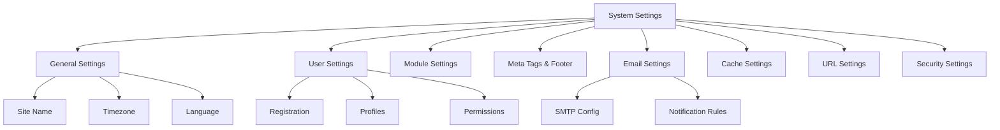

# XOOPS Cài đặt hệ thống

Hướng dẫn này bao gồm các cài đặt hệ thống hoàn chỉnh có sẵn trong bảng XOOPS admin, được sắp xếp theo danh mục.

## Kiến trúc cài đặt hệ thống



## Truy cập cài đặt hệ thống

### Vị trí

**Bảng quản trị > Hệ thống > Tùy chọn**

Hoặc điều hướng trực tiếp:

```
http://your-domain.com/xoops/admin/index.php?fct=preferences
```

### Yêu cầu về quyền

- Chỉ administrators (quản trị viên web) mới có thể truy cập cài đặt hệ thống
- Những thay đổi ảnh hưởng đến toàn bộ trang web
- Hầu hết các thay đổi đều có hiệu lực ngay lập tức

## Cài đặt chung

Cấu hình cơ bản cho quá trình cài đặt XOOPS của bạn.

### Thông tin cơ bản

```
Site Name: [Your Site Name]
Default Description: [Brief description of your site]
Site Slogan: [Catchy slogan]
Admin Email: admin@your-domain.com
Webmaster Name: Administrator Name
Webmaster Email: admin@your-domain.com
```

### Cài đặt giao diện

```
Default Theme: [Select theme]
Default Language: English (or preferred language)
Items Per Page: 15 (typically 10-25)
Words in Snippet: 25 (for search results)
Theme Upload Permission: Disabled (security)
```

### Cài đặt khu vực

```
Default Timezone: [Your timezone]
Date Format: %Y-%m-%d (YYYY-MM-DD format)
Time Format: %H:%M:%S (HH:MM:SS format)
Daylight Saving Time: [Auto/Manual/None]
```

**Bảng định dạng múi giờ:**

| Vùng | Múi giờ | Bù đắp UTC |
|---|---|---|
| Miền Đông Hoa Kỳ | Mỹ/New_York | -5/-4 |
| Miền Trung Hoa Kỳ | Mỹ/Chicago | -6 / -5 |
| Núi Mỹ | Mỹ/Denver | -7/-6 |
| Thái Bình Dương Hoa Kỳ | Mỹ/Los_Angeles | -8/-7 |
| Vương quốc Anh/Luân Đôn | Châu Âu/Luân Đôn | 0 / +1 |
| Pháp/Đức | Châu Âu/Paris | +1 / +2 |
| Nhật Bản | Châu Á/Tokyo | +9 |
| Trung Quốc | Châu Á/Thượng Hải | +8 |
| Úc/Sydney | Úc/Sydney | +10 / +11 |

### Cấu hình tìm kiếm

```
Enable Search: Yes
Search Admin Pages: Yes/No
Search Archives: Yes
Default Search Type: All / Pages only
Words Excluded from Search: [Comma-separated list]
```

**Các từ bị loại trừ phổ biến:** the, a, an, and, or, but, in, on, at, by, to, from

## Cài đặt người dùng

Kiểm soát hành vi tài khoản người dùng và quá trình đăng ký.

### Đăng ký người dùng

```
Allow User Registration: Yes/No
Registration Type:
  ☐ Auto-activate (Instant access)
  ☐ Admin approval (Admin must approve)
  ☐ Email verification (User must verify email)

Notification to Users: Yes/No
User Email Verification: Required/Optional
```

### Cấu hình người dùng mới

```
Auto-login New Users: Yes/No
Assign Default User Group: Yes
Default User Group: [Select group]
Create User Avatar: Yes/No
Initial User Avatar: [Select default]
```

### Cài đặt hồ sơ người dùng

```
Allow User Profiles: Yes
Show Member List: Yes
Show User Statistics: Yes
Show Last Online Time: Yes
Allow User Avatar: Yes
Avatar Max File Size: 100KB
Avatar Dimensions: 100x100 pixels
```

### Cài đặt email người dùng

```
Allow Users to Hide Email: Yes
Show Email on Profile: Yes
Notification Email Interval: Immediately/Daily/Weekly/Never
```

### Theo dõi hoạt động của người dùng

```
Track User Activity: Yes
Log User Logins: Yes
Log Failed Logins: Yes
Track IP Address: Yes
Clear Activity Logs Older Than: 90 days
```

### Giới hạn tài khoản

```
Allow Duplicate Email: No
Minimum Username Length: 3 characters
Maximum Username Length: 15 characters
Minimum Password Length: 6 characters
Require Special Characters: Yes
Require Numbers: Yes
Password Expiration: 90 days (or Never)
Accounts Inactive Days to Delete: 365 days
```

## Cài đặt mô-đun

Định cấu hình hành vi mô-đun riêng lẻ.

### Tùy chọn mô-đun chung

Đối với mỗi mô-đun được cài đặt, bạn có thể đặt:

```
Module Status: Active/Inactive
Display in Menu: Yes/No
Module Weight: [1-999] (higher = lower in display)
Homepage Default: This module shows when visiting /
Admin Access: [Allowed user groups]
User Access: [Allowed user groups]
```

### Cài đặt mô-đun hệ thống

```
Show Homepage as: Portal / Module / Static Page
Default Homepage Module: [Select module]
Show Footer Menu: Yes
Footer Color: [Color selector]
Show System Stats: Yes
Show Memory Usage: Yes
```

### Cấu hình cho mỗi mô-đun

Mỗi mô-đun có thể có các cài đặt dành riêng cho mô-đun:

**Ví dụ - Mô-đun trang:**
```
Enable Comments: Yes/No
Moderate Comments: Yes/No
Comments Per Page: 10
Enable Ratings: Yes
Allow Anonymous Ratings: Yes
```

**Ví dụ - Mô-đun người dùng:**
```
Avatar Upload Folder: ./uploads/
Maximum Upload Size: 100KB
Allow File Upload: Yes
Allowed File Types: jpg, gif, png
```

Truy cập cài đặt dành riêng cho mô-đun:
- **Quản trị viên > Mô-đun > [Tên mô-đun] > Tùy chọn**

## Thẻ Meta & Cài đặt SEO

Định cấu hình thẻ meta để tối ưu hóa công cụ tìm kiếm.

### Thẻ Meta toàn cầu

```
Meta Keywords: xoops, cms, content management system
Meta Description: A powerful content management system for building dynamic websites
Meta Author: Your Name
Meta Copyright: Copyright 2025, Your Company
Meta Robots: index, follow
Meta Revisit: 30 days
```

### Các phương pháp hay nhất về thẻ Meta

| Gắn thẻ | Mục đích | Khuyến nghị |
|---|---|---|
| Từ khóa | Thuật ngữ tìm kiếm | 5-10 từ khóa có liên quan, được phân tách bằng dấu phẩy |
| Mô tả | Tìm kiếm danh sách | 150-160 ký tự |
| Tác giả | Người tạo trang | Tên hoặc công ty của bạn |
| Bản quyền | Pháp lý | Thông báo bản quyền của bạn |
| Robot | Hướng dẫn thu thập thông tin | lập chỉ mục, theo dõi (cho phép lập chỉ mục) |

### Cài đặt chân trang

```
Show Footer: Yes
Footer Color: Dark/Light
Footer Background: [Color code]
Footer Text: [HTML allowed]
Additional Footer Links: [URL and text pairs]
```

**Chân trang mẫu HTML:**
```html
<p>Copyright &copy; 2025 Your Company. All rights reserved.</p>
<p><a href="/privacy">Privacy Policy</a> | <a href="/terms">Terms of Use</a></p>
```

### Thẻ Meta xã hội (Biểu đồ mở)

```
Enable Open Graph: Yes
Facebook App ID: [App ID]
Twitter Card Type: summary / summary_large_image / player
Default Share Image: [Image URL]
```

## Cài đặt email

Cấu hình hệ thống gửi email và thông báo.

### Phương thức gửi email

```
Use SMTP: Yes/No

If SMTP:
  SMTP Host: smtp.gmail.com
  SMTP Port: 587 (TLS) or 465 (SSL)
  SMTP Security: TLS / SSL / None
  SMTP Username: [email@example.com]
  SMTP Password: [password]
  SMTP Authentication: Yes/No
  SMTP Timeout: 10 seconds

If PHP mail():
  Sendmail Path: /usr/sbin/sendmail -t -i
```

### Cấu hình email

```
From Address: noreply@your-domain.com
From Name: Your Site Name
Reply-To Address: support@your-domain.com
BCC Admin Emails: Yes/No
```

### Cài đặt thông báo

```
Send Welcome Email: Yes/No
Welcome Email Subject: Welcome to [Site Name]
Welcome Email Body: [Custom message]

Send Password Reset Email: Yes/No
Include Random Password: Yes/No
Token Expiration: 24 hours
```

### Thông báo của quản trị viên

```
Notify Admin on Registration: Yes
Notify Admin on Comments: Yes
Notify Admin on Submissions: Yes
Notify Admin on Errors: Yes
```

### Thông báo người dùng

```
Notify User on Registration: Yes
Notify User on Comments: Yes
Notify User on Private Messages: Yes
Allow Users to Disable Notifications: Yes
Default Notification Frequency: Immediately
```

### Mẫu email

Tùy chỉnh email thông báo trong bảng admin:

**Đường dẫn:** Hệ thống > Mẫu email

Có sẵn templates:
- Đăng ký người dùng
- Đặt lại mật khẩu
- Thông báo bình luận
- Tin nhắn riêng tư
- Cảnh báo hệ thống
- Email dành riêng cho mô-đun

## Cài đặt bộ đệmTối ưu hóa hiệu suất thông qua bộ nhớ đệm.

### Cấu hình bộ đệm

```
Enable Caching: Yes/No
Cache Type:
  ☐ File Cache
  ☐ APCu (Alternative PHP Cache)
  ☐ Memcache (Distributed caching)
  ☐ Redis (Advanced caching)

Cache Lifetime: 3600 seconds (1 hour)
```

### Tùy chọn bộ đệm theo loại

**Bộ đệm tệp:**
```
Cache Directory: /var/www/html/xoops/cache/
Clear Interval: Daily
Maximum Cache Files: 1000
```

**Bộ nhớ đệm APCu:**
```
Memory Allocation: 128MB
Fragmentation Level: Low
```

**Memcache/Redis:**
```
Server Host: localhost
Server Port: 11211 (Memcache) / 6379 (Redis)
Persistent Connection: Yes
```

### Nội dung nào được lưu vào bộ nhớ đệm

```
Cache Module Lists: Yes
Cache Configuration Data: Yes
Cache Template Data: Yes
Cache User Session Data: Yes
Cache Search Results: Yes
Cache Database Queries: Yes
Cache RSS Feeds: Yes
Cache Images: Yes
```

## Cài đặt URL

Định cấu hình viết lại và định dạng URL.

### Cài đặt URL thân thiện

```
Enable Friendly URLs: Yes/No
Friendly URL Type:
  ☐ Path Info: /page/about
  ☐ Query String: /index.php?p=about

Trailing Slash: Include / Omit
URL Case: Lower case / Case sensitive
```

### Quy tắc viết lại URL

```
.htaccess Rules: [Display current]
Nginx Rules: [Display current if Nginx]
IIS Rules: [Display current if IIS]
```

## Cài đặt bảo mật

Kiểm soát cấu hình liên quan đến bảo mật.

### Bảo mật bằng mật khẩu

```
Password Policy:
  ☐ Require uppercase letters
  ☐ Require lowercase letters
  ☐ Require numbers
  ☐ Require special characters

Minimum Password Length: 8 characters
Password Expiration: 90 days
Password History: Remember last 5 passwords
Force Password Change: On next login
```

### Bảo mật đăng nhập

```
Lock Account After Failed Attempts: 5 attempts
Lock Duration: 15 minutes
Log All Login Attempts: Yes
Log Failed Logins: Yes
Admin Login Alert: Send email on admin login
Two-Factor Authentication: Disabled/Enabled
```

### Bảo mật tải lên tệp

```
Allow File Uploads: Yes/No
Maximum File Size: 128MB
Allowed File Types: jpg, gif, png, pdf, zip, doc, docx
Scan Uploads for Malware: Yes (if available)
Quarantine Suspicious Files: Yes
```

### Bảo mật phiên

```
Session Management: Database/Files
Session Timeout: 1800 seconds (30 min)
Session Cookie Lifetime: 0 (until browser closes)
Secure Cookie: Yes (HTTPS only)
HTTP Only Cookie: Yes (prevent JavaScript access)
```

### Cài đặt CORS

```
Allow Cross-Origin Requests: No
Allowed Origins: [List domains]
Allow Credentials: No
Allowed Methods: GET, POST
```

## Cài đặt nâng cao

Tùy chọn cấu hình bổ sung cho người dùng nâng cao.

### Chế độ gỡ lỗi

```
Debug Mode: Disabled/Enabled
Log Level: Error / Warning / Info / Debug
Debug Log File: /var/log/xoops_debug.log
Display Errors: Disabled (production)
```

### Điều chỉnh hiệu suất

```
Optimize Database Queries: Yes
Use Query Cache: Yes
Compress Output: Yes
Minify CSS/JavaScript: Yes
Lazy Load Images: Yes
```

### Cài đặt nội dung

```
Allow HTML in Posts: Yes/No
Allowed HTML Tags: [Configure]
Strip Harmful Code: Yes
Allow Embed: Yes/No
Content Moderation: Automatic/Manual
Spam Detection: Yes
```

## Cài đặt Xuất/Nhập

### Cài đặt sao lưu

Xuất cài đặt hiện tại:

**Bảng quản trị > Hệ thống > Công cụ > Cài đặt xuất**

```bash
# Settings exported as JSON file
# Download and store securely
```

### Khôi phục cài đặt

Nhập cài đặt đã xuất trước đó:

**Bảng quản trị > Hệ thống > Công cụ > Cài đặt nhập**

```bash
# Upload JSON file
# Verify changes before confirming
```

## Phân cấp cấu hình

Phân cấp cài đặt XOOPS (từ trên xuống dưới - trận đầu tiên thắng):

```
1. mainfile.php (Constants)
2. Module-specific config
3. Admin System Settings
4. Theme configuration
5. User preferences (for user-specific settings)
```

## Tập lệnh sao lưu cài đặt

Tạo bản sao lưu các cài đặt hiện tại:

```php
<?php
// Backup script: /var/www/html/xoops/backup-settings.php
require_once __DIR__ . '/mainfile.php';

$config_handler = xoops_getHandler('config');
$configs = $config_handler->getConfigs();

$backup = [
    'exported_date' => date('Y-m-d H:i:s'),
    'xoops_version' => XOOPS_VERSION,
    'php_version' => PHP_VERSION,
    'settings' => []
];

foreach ($configs as $config) {
    $backup['settings'][$config->getVar('conf_name')] = [
        'value' => $config->getVar('conf_value'),
        'description' => $config->getVar('conf_desc'),
        'type' => $config->getVar('conf_type'),
    ];
}

// Save to JSON file
file_put_contents(
    '/backups/xoops_settings_' . date('YmdHis') . '.json',
    json_encode($backup, JSON_PRETTY_PRINT)
);

echo "Settings backed up successfully!";
?>
```

## Thay đổi cài đặt chung

### Thay đổi tên trang web

1. Quản trị viên > Hệ thống > Tùy chọn > Cài đặt chung
2. Sửa đổi "Tên trang web"
3. Nhấp vào "Lưu"

### Bật/Tắt đăng ký

1. Quản trị viên > Hệ thống > Tùy chọn > Cài đặt người dùng
2. Chuyển đổi "Cho phép đăng ký người dùng"
3. Chọn loại đăng ký
4. Nhấp vào "Lưu"

### Thay đổi chủ đề mặc định

1. Quản trị viên > Hệ thống > Tùy chọn > Cài đặt chung
2. Chọn "Chủ đề mặc định"
3. Nhấp vào "Lưu"
4. Xóa bộ nhớ đệm để thay đổi có hiệu lực

### Cập nhật Email liên hệ

1. Quản trị viên > Hệ thống > Tùy chọn > Cài đặt chung
2. Sửa đổi "Email quản trị"
3. Sửa đổi "Email quản trị trang web"
4. Nhấp vào "Lưu"

## Danh sách kiểm tra xác minh

Sau khi định cấu hình cài đặt hệ thống, hãy xác minh:

- [ ] Tên trang web hiển thị chính xác
- [] Múi giờ hiển thị thời gian chính xác
- [ ] Thông báo qua email được gửi đúng cách
- [ ] Đăng ký người dùng hoạt động như được định cấu hình
- [ ] Trang chủ hiển thị mặc định đã chọn
- [] Chức năng tìm kiếm hoạt động
- [ ] Cache cải thiện thời gian tải trang
- [ ] URL thân thiện hoạt động (nếu được bật)
- [] Thẻ meta xuất hiện trong nguồn trang
- [ ] Đã nhận được thông báo của quản trị viên
- [ ] Cài đặt bảo mật được thực thi

## Cài đặt khắc phục sự cố

### Cài đặt Không lưu

**Giải pháp:**
```bash
# Check file permissions on config directory
chmod 755 /var/www/html/xoops/var/

# Verify database writable
# Try saving again in admin panel
```

### Thay đổi không có hiệu lực

**Giải pháp:**
```bash
# Clear cache
rm -rf /var/www/html/xoops/cache/*
rm -rf /var/www/html/xoops/templates_c/*

# If still not working, restart web server
systemctl restart apache2
```

### Email không gửi được

**Giải pháp:**
1. Xác minh thông tin xác thực SMTP trong cài đặt email
2. Kiểm tra bằng nút "Gửi email kiểm tra"
3. Kiểm tra nhật ký lỗi
4. Thử sử dụng PHP mail() thay vì SMTP

## Các bước tiếp theo

Sau khi cấu hình cài đặt hệ thống:

1. Cấu hình cài đặt bảo mật
2. Tối ưu hóa hiệu suất
3. Khám phá các tính năng của bảng điều khiển admin
4. Thiết lập quản lý người dùng

---

**Tags:** #system-settings #configuration #preferences #admin-panel

**Bài viết liên quan:**
- ../../06-Publisher-Module/User-Guide/Basic-Configuration
- Cấu hình bảo mật
- Tối ưu hóa hiệu suất
- ../First-Steps/Admin-Panel-Tổng quan