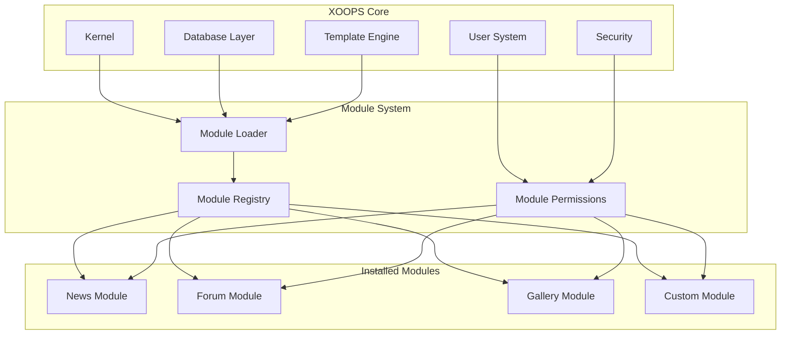
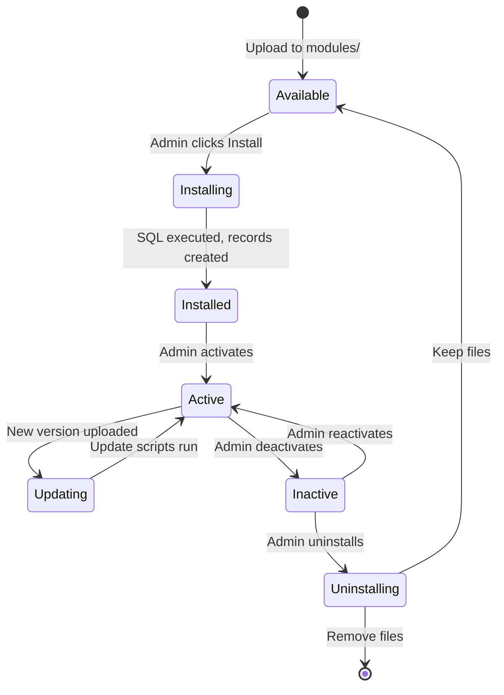

# ADR-001: Kiến trúc mô-đun

> Bản ghi Quyết định Kiến trúc cho triết lý thiết kế mô-đun cốt lõi của XOOPS.

---

## Trạng thái

**Được chấp nhận** - Quyết định cơ bản kể từ khi thành lập XOOPS

---

## Bối cảnh

XOOPS (Hệ thống cổng thông tin hướng đối tượng có thể mở rộng) cần một kiến trúc có thể:

1. Cho phép nhà phát triển bên thứ ba mở rộng chức năng
2. Cho phép trang administrators tùy chỉnh mà không cần mã hóa
3. Hỗ trợ phát triển và cập nhật độc lập
4. Cung cấp sự tách biệt giữa các tính năng khác nhau
5. Mở rộng quy mô từ blog đơn giản đến cổng thông tin phức tạp

Bối cảnh CMS đầu những năm 2000 cung cấp các hệ thống nguyên khối rất khó tùy chỉnh và mở rộng.

---

## Sơ đồ quyết định



---

## Quyết định

Chúng tôi sẽ triển khai **kiến trúc mô-đun** trong đó:

### 1. Cốt lõi cung cấp cơ sở hạ tầng
- Trừu tượng hóa cơ sở dữ liệu
- Xác thực người dùng và quyền
- Kết xuất mẫu (Smarty)
- Tiện ích bảo mật
- Tạo biểu mẫu
- Tiện ích chung

### 2. Các mô-đun được khép kín
Mỗi mô-đun:
- Có cấu trúc thư mục riêng
- Chứa classes, templates, SQL của riêng nó
- Xác định cấu hình riêng của nó
- Có thể cài đặt/gỡ cài đặt độc lập
- Có theo dõi phiên bản

### 3. Cấu trúc module chuẩn
```
modules/modulename/
├── admin/                  # Admin interface
│   ├── index.php
│   └── menu.php
├── class/                  # PHP classes
├── include/                # Include files
├── language/               # Translations
├── sql/                    # Database schema
├── templates/              # Smarty templates
├── blocks/                 # Block definitions
├── xoops_version.php       # Module manifest
├── index.php               # Entry point
└── header.php              # Module bootstrap
```

### 4. Bản kê khai mô-đun (xoops_version.php)
```php
<?php
$modversion['name']        = 'Module Name';
$modversion['version']     = '1.0.0';
$modversion['description'] = 'Module description';
$modversion['dirname']     = basename(__DIR__);
$modversion['hasMain']     = 1;
$modversion['hasAdmin']    = 1;
$modversion['sqlfile']['mysql'] = 'sql/mysql.sql';
$modversion['tables']      = ['modulename_table1'];
$modversion['templates']   = [...];
$modversion['config']      = [...];
$modversion['blocks']      = [...];
```

### 5. Mô-đun giao tiếp
- Thông qua các API cốt lõi (trình xử lý, sự kiện)
- Mối quan hệ cơ sở dữ liệu
- Móc tải trước
- Dịch vụ chia sẻ

---

## Vòng đời mô-đun



---

## Hậu quả

### Tích cực

1. **Khả năng mở rộng**: Hàng nghìn modules do cộng đồng tạo ra
2. **Độc lập**: Các mô-đun có thể được phát triển riêng biệt
3. **Tính linh hoạt**: Các trang web có thể kết hợp các tính năng
4. **Khả năng bảo trì**: Các bản cập nhật không ảnh hưởng đến modules khác
5. **Thị trường**: Hệ sinh thái mô-đun xuất hiện
6. **Đường cong học tập**: Nhà phát triển học một mẫu

### Tiêu cực

1. **Chi phí chung**: Mỗi mô-đun có chi phí khởi động
2. **Sao chép**: Mã chung có thể bị lặp lại
3. **Tích hợp**: Các tính năng đa mô-đun cần được thiết kế cẩn thận
4. **Phiên bản**: Cần quản lý khả năng tương thích của mô-đun
5. **Sự khác biệt về chất lượng**: Chất lượng mô-đun của bên thứ ba thay đổi

### Trung lập

1. **Cơ sở dữ liệu**: Mỗi mô-đun quản lý các bảng riêng
2. **Mẫu**: Chủ đề phải chứa nhiều modules khác nhau
3. **Cập nhật**: Core và modules cập nhật độc lập

---

## Các lựa chọn thay thế được xem xét

### 1. Kiến trúc nguyên khối
**Bị từ chối** - Quá cứng nhắc, khó tùy chỉnh

### 2. Kiến trúc plugin (kiểu WordPress)
**Được áp dụng một phần** - Các khối và tải trước cung cấp các móc nối giống như plugin trong modules

### 3. Kiến trúc thành phần (kiểu Joomla)
**Bị từ chối** - Phức tạp hơn, ít thân thiện với nhà phát triển hơn

### 4. Vi dịch vụ
**Không áp dụng** - Quá phức tạp đối với thời đại lưu trữ chia sẻ

---

## Các quyết định liên quan

- ADR-002: Truy cập cơ sở dữ liệu hướng đối tượng
- ADR-003: Công cụ mẫu Smarty
- ADR-005: Hệ thống cấp phép

---

## Tài liệu tham khảo

- Lịch sử dự án XOOPS
- Mẫu kiến trúc ứng dụng PHP
- Nghiên cứu so sánh CMS (2001-2005)

---

#xoops #architecture #adr #modules #design-decision