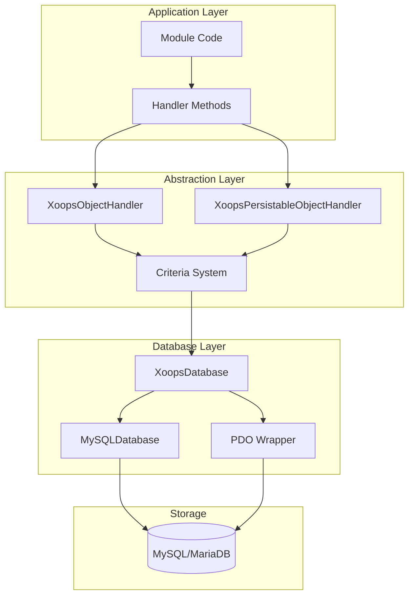
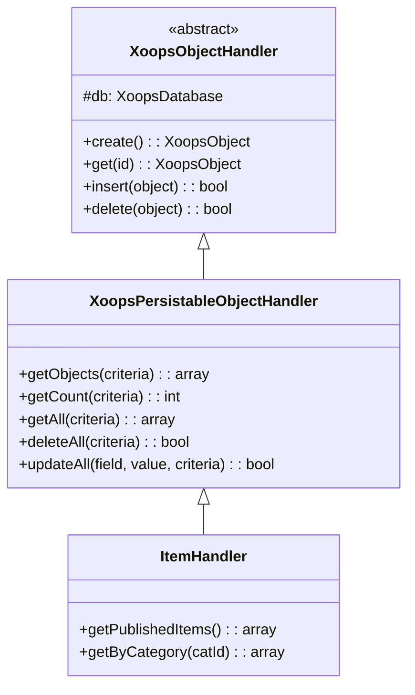
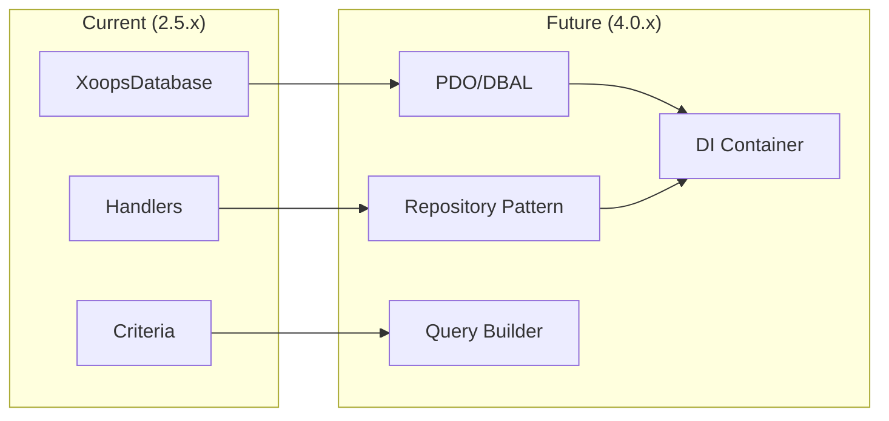

# ADR-002: Trừu tượng hóa cơ sở dữ liệu

> Bản ghi quyết định kiến trúc cho mẫu truy cập cơ sở dữ liệu hướng đối tượng của XOOPS.

---

## Trạng thái

**Được chấp nhận** - Mẫu lõi kể từ XOOPS 2.0

---

## Bối cảnh

XOOPS cần một chiến lược tương tác cơ sở dữ liệu có thể:

1. Tóm tắt cú pháp SQL dành riêng cho cơ sở dữ liệu
2. Cung cấp các hoạt động CRUD nhất quán trên tất cả modules
3. Kích hoạt tính năng tự động dọn dẹp và thoát dữ liệu
4. Hỗ trợ các thay đổi về công cụ cơ sở dữ liệu trong tương lai
5. Đơn giản hóa các thao tác chung cho nhà phát triển

Các lựa chọn thay thế là:
- SQL thô trong toàn bộ cơ sở mã
- ORM đầy đủ (Học thuyết, Hùng biện)
- Trừu tượng nhẹ tùy chỉnh

---

## Sơ đồ quyết định



---

## Quyết định

Chúng tôi sẽ triển khai **Mẫu trình xử lý** với:

### 1. XoopsObject - Nơi chứa dữ liệu

Mỗi thực thể dữ liệu mở rộng XoopsObject:

```php
class Item extends XoopsObject
{
    public function __construct()
    {
        $this->initVar('id', XOBJ_DTYPE_INT, null, false);
        $this->initVar('title', XOBJ_DTYPE_TXTBOX, '', true, 255);
        $this->initVar('content', XOBJ_DTYPE_TXTAREA, '', false);
        $this->initVar('status', XOBJ_DTYPE_INT, 0, false);
    }
}
```

### 2. Handler - Trình quản lý vận hành

Mỗi đối tượng có một trình xử lý tương ứng:

```php
class ItemHandler extends XoopsPersistableObjectHandler
{
    public function __construct($db)
    {
        parent::__construct($db, 'mymodule_items', Item::class, 'id', 'title');
    }

    // CRUD methods inherited:
    // - create(), get(), insert(), delete()
    // - getObjects(), getCount(), getAll()
}
```

### 3. Tiêu chí - Trình tạo truy vấn

Điều kiện truy vấn hướng đối tượng:

```php
$criteria = new CriteriaCompo();
$criteria->add(new Criteria('status', 1));
$criteria->add(new Criteria('created', time() - 86400, '>='));
$criteria->setSort('created');
$criteria->setOrder('DESC');
$criteria->setLimit(10);

$items = $handler->getObjects($criteria);
```

---

## Hằng số kiểu dữ liệu

```php
// Variable types with automatic sanitization
XOBJ_DTYPE_INT       // Integer
XOBJ_DTYPE_TXTBOX    // Single-line text (escaped)
XOBJ_DTYPE_TXTAREA   // Multi-line text (escaped)
XOBJ_DTYPE_EMAIL     // Email validation
XOBJ_DTYPE_URL       // URL validation
XOBJ_DTYPE_ARRAY     // Serialized array
XOBJ_DTYPE_OTHER     // No processing
XOBJ_DTYPE_FLOAT     // Floating point
```

---

## Kế thừa trình xử lý



---

## Hậu quả

### Tích cực

1. **Tính nhất quán**: Tất cả modules đều sử dụng các mẫu giống nhau
2. **Bảo mật**: Tự động thoát ngăn chặn việc tiêm SQL
3. **Đơn giản**: Các thao tác thông thường yêu cầu mã tối thiểu
4. **Khả năng bảo trì**: Các thay đổi đối với lớp cơ sở dữ liệu không ảnh hưởng đến modules
5. **Khả năng kiểm tra**: Trình xử lý có thể bị mô phỏng để kiểm tra

### Tiêu cực

1. **Hiệu suất**: Chi phí trừu tượng bổ sung
2. **Độ phức tạp**: Đường cong học tập dành cho nhà phát triển mới
3. **Hạn chế**: Các truy vấn phức tạp có thể cần SQL thô
4. **Vấn đề N+1**: Không có tính năng tải háo hức tích hợp

### Biện pháp giảm nhẹ

- **Hiệu suất**: Lưu vào bộ nhớ đệm các đối tượng được truy cập thường xuyên
- **Truy vấn phức tạp**: Cho phép SQL thô khi cần
- **N+1**: Sử dụng getAll() với tiêu chí phù hợp

---

## Tiến hóa lên XOOPS 4.0



Gói XOOPS 4.0:
- Học thuyết DBAL để trừu tượng hóa cơ sở dữ liệu
- Mẫu lưu trữ thay thế trình xử lý
- Trình tạo truy vấn cho các truy vấn phức tạp
- Tích hợp container PSR-11 đầy đủ

---

## Ví dụ về mã

### CRUD cơ bản

```php
$helper = Helper::getInstance();
$handler = $helper->getHandler('Item');

// Create
$item = $handler->create();
$item->setVar('title', 'New Item');
$handler->insert($item);

// Read
$item = $handler->get($id);
$title = $item->getVar('title');

// Update
$item->setVar('title', 'Updated Title');
$handler->insert($item);

// Delete
$handler->delete($item);
```

### Truy vấn phức tạp

```php
$criteria = new CriteriaCompo();
$criteria->add(new Criteria('status', 'published'));
$criteria->add(new Criteria('category_id', '(1,2,3)', 'IN'));
$criteria->add(new Criteria('created', strtotime('-30 days'), '>='));
$criteria->setSort('views');
$criteria->setOrder('DESC');
$criteria->setLimit(10);
$criteria->setStart(0);

$items = $handler->getObjects($criteria);
$total = $handler->getCount($criteria);
```

---

## Các quyết định liên quan

- ADR-001: Kiến trúc mô-đun
- ADR-003: Công cụ mẫu Smarty

---

## Tài liệu tham khảo

- Martin Fowler - Các mô hình kiến trúc ứng dụng doanh nghiệp
- Khái niệm thiết kế hướng tên miền
- Mẫu bản ghi hoạt động và bản đồ dữ liệu

---

#xoops #architecture #adr #database #handler #design-decision