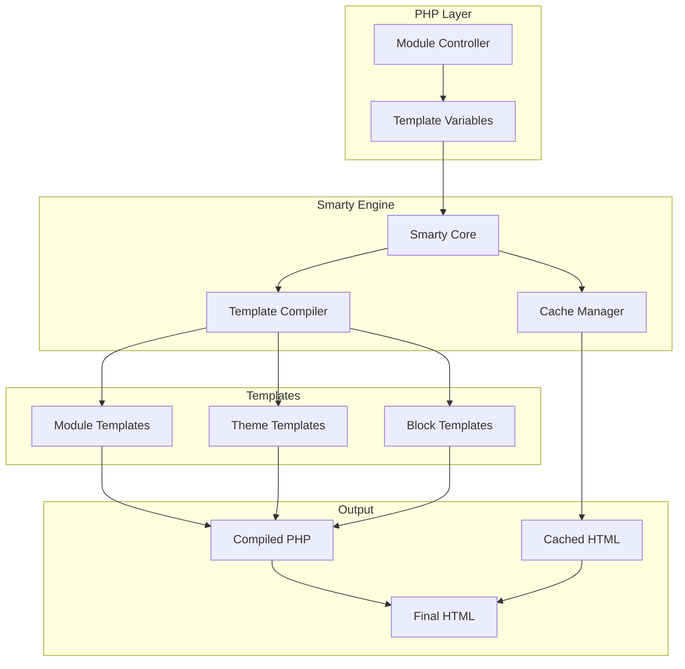
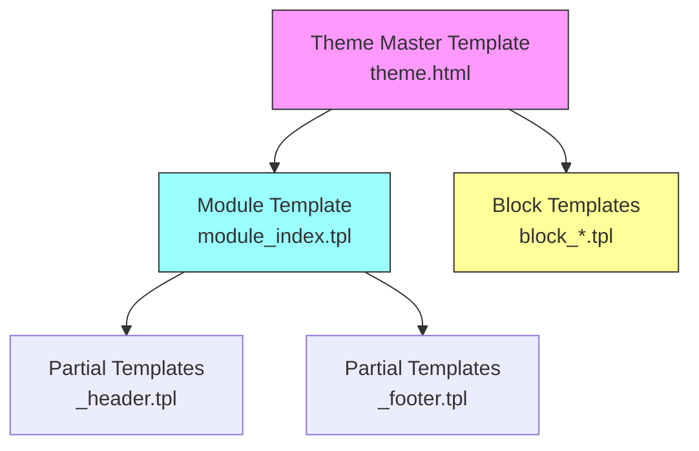
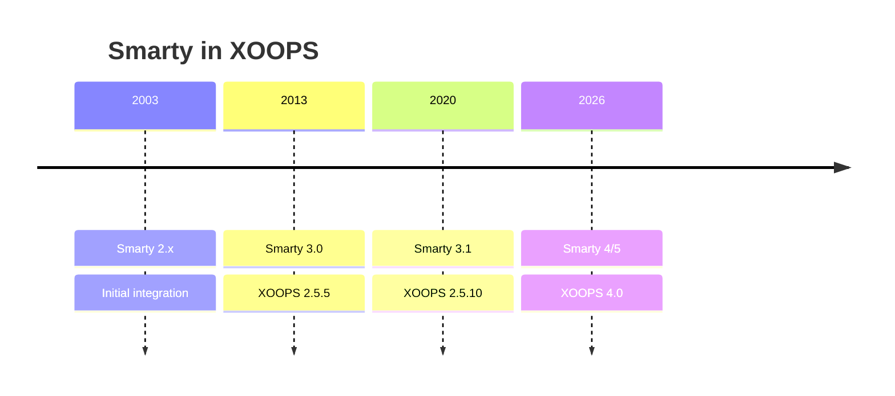

# ADR-003: Công cụ mẫu (Smarty)

> Bản ghi quyết định kiến trúc cho việc XOOPS áp dụng công cụ mẫu Smarty.

---

## Trạng thái

**Được chấp nhận** - Quyết định cốt lõi kể từ XOOPS 2.0

**Đang phát triển** - Đã lên kế hoạch di chuyển sang Smarty 4/5 cho XOOPS 4.0

---

## Bối cảnh

XOOPS cần một giải pháp tạo khuôn mẫu có thể:

1. Tách biệt phần trình bày khỏi logic nghiệp vụ
2. Cho phép các nhà thiết kế chủ đề làm việc mà không cần kiến thức về PHP
3. Hỗ trợ kế thừa mẫu và includes
4. Cung cấp bộ nhớ đệm cho hiệu suất
5. Kích hoạt templates do người dùng tùy chỉnh
6. Hỗ trợ quốc tế hóa

---

## Sơ đồ quyết định



---

## Quyết định

Chúng tôi sẽ sử dụng **Smarty** làm công cụ tạo mẫu vì:

### 1. Tách biệt mối quan tâm

```php
// PHP (Controller) - Business logic
$items = $itemHandler->getPublishedItems();
$xoopsTpl->assign('items', $items);

// Smarty (View) - Presentation
// templates/items.tpl
```

```smarty
{* Smarty template - No PHP logic *}
<{foreach item=item from=$items}>
    <article>
        <h2><{$item.title}></h2>
        <p><{$item.summary}></p>
    </article>
<{/foreach}>
```

### 2. Dấu phân cách XOOPS

XOOPS sử dụng `<{` và `}>` thay vì `{` `}` tiêu chuẩn:

```smarty
{* Standard Smarty *}
{$variable}

{* XOOPS Smarty - Avoids JavaScript conflicts *}
<{$variable}>
```

### 3. Phân cấp mẫu



### 4. Lưu trữ mẫu

- **Cơ sở dữ liệu**: templates được tùy chỉnh được lưu trữ để phục vụ khả năng hoàn nguyên
- **Hệ thống tệp**: templates gốc trong thư mục mô-đun
- **Bộ nhớ đệm**: templates được biên dịch để tăng hiệu suất

---

## Cấu hình Smarty

```php
// XOOPS Smarty initialization
$xoopsTpl = new XoopsTpl();

// Custom delimiters
$xoopsTpl->left_delim = '<{';
$xoopsTpl->right_delim = '}>';

// Caching
$xoopsTpl->caching = XOOPS_TEMPLATE_CACHE;
$xoopsTpl->cache_lifetime = 3600;

// Security
$xoopsTpl->security_policy = new Smarty_Security($xoopsTpl);
$xoopsTpl->security_policy->php_functions = [];
$xoopsTpl->security_policy->php_modifiers = ['escape', 'count'];
```

---

## Tính năng mẫu được sử dụng

### Biến

```smarty
{* Simple variable *}
<{$title}>

{* Object property *}
<{$item.title}>

{* With modifier *}
<{$content|truncate:200:'...'}>

{* Escaped output *}
<{$userInput|escape:'html'}>
```

### Cấu trúc điều khiển

```smarty
{* Conditional *}
<{if $isAdmin}>
    <a href="admin.php">Admin</a>
<{elseif $isUser}>
    <a href="profile.php">Profile</a>
<{else}>
    <a href="login.php">Login</a>
<{/if}>

{* Loop *}
<{foreach item=item from=$items name=itemloop}>
    <{$smarty.foreach.itemloop.index}>: <{$item.title}>
<{/foreach}>
```

### Bao gồm

```smarty
{* Include another template *}
<{include file="db:mymodule_header.tpl"}>

{* Include with variables *}
<{include file="db:mymodule_item.tpl" item=$currentItem}>

{* Include from theme *}
<{include file="file:$theme_path/partials/sidebar.tpl"}>
```

---

## Hậu quả

### Tích cực

1. **Thân thiện với nhà thiết kế**: Cú pháp giống HTML
2. **Bộ nhớ đệm**: Bộ nhớ đệm mẫu tích hợp
3. **Bảo mật**: Cách ly mã PHP
4. **Tính linh hoạt**: Công cụ sửa đổi, chức năng, plugin
5. **Tùy chỉnh**: Người dùng có thể sửa đổi templates
6. **Cộng đồng**: Hệ sinh thái Smarty lớn

### Tiêu cực

1. **Đường cong học tập**: Cú pháp dành riêng cho Smarty
2. **Chi phí chung**: Cần có bước biên dịch
3. **Gỡ lỗi**: Lỗi mẫu có thể khó hiểu
4. **Vấn đề về phiên bản**: Các thay đổi nhỏ giữa các phiên bản

### Biện pháp giảm nhẹ

- **Học**: Tài liệu toàn diện
- **Hiệu suất**: Bộ nhớ đệm linh hoạt
- **Gỡ lỗi**: Bảng điều khiển gỡ lỗi, xóa thông báo lỗi
- **Phiên bản**: Lớp tương thích trong XOOPS

---

## Lịch sử phiên bản



---

## Di chuyển: Smarty 3 đến 4/5

### Những thay đổi đột phá

```smarty
{* Smarty 3 - Deprecated *}
<{php}>echo date('Y');<{/php}>

{* Smarty 4+ - Use modifiers or assign from PHP *}
<{$current_year}>

{* Smarty 3 - {section} deprecated *}
<{section name=i loop=$items}>
    <{$items[i].title}>
<{/section}>

{* Smarty 4+ - Use {foreach} *}
<{foreach $items as $item}>
    <{$item.title}>
<{/foreach}>
```

### Lớp tương thích

XOOPS cung cấp lớp tương thích để chuyển tiếp suôn sẻ:

```php
// XoopsTpl extends Smarty with compatibility methods
class XoopsTpl extends Smarty
{
    public function assign($tpl_var, $value = null)
    {
        // Handles both Smarty 3 and 4 syntax
        return parent::assign($tpl_var, $value);
    }
}
```

---

## Các lựa chọn thay thế được xem xét

### 1. Cành cây
**Ưu điểm**: Hệ sinh thái Symfony hiện đại
**Nhược điểm**: Cú pháp khác, nỗ lực di chuyển
**Quyết định**: Tùy chọn có thể có trong tương lai cho XOOPS 3.x

### 2. Lưỡi dao (Laravel)
**Ưu điểm**: Cú pháp rõ ràng, phổ biến
**Nhược điểm**: Dành riêng cho Laravel
**Quyết định**: Không phù hợp để sử dụng độc lập

### 3. Mẫu PHP gốc
**Ưu điểm**: Không có đường cong học tập, nhanh chóng
**Nhược điểm**: Rủi ro về bảo mật, không có sự tách biệt
**Quyết định**: Bị từ chối vì lý do bảo trì

---

## Các quyết định liên quan

- ADR-001: Kiến trúc mô-đun
- ADR-002: Trừu tượng hóa cơ sở dữ liệu

---

## Tài liệu tham khảo

- Smarty Tài liệu: https://www.smarty.net/docs/en/
- Hướng dẫn hệ thống mẫu XOOPS
- Mẫu MVC trong ứng dụng web

---#xoops #architecture #adr #smarty #templates #design-decision