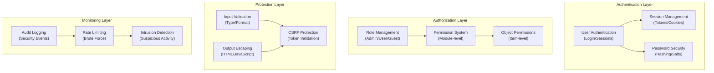

# ADR-004: Kiến trúc hệ thống bảo mật

> Kiến trúc bảo mật toàn diện cho XOOPS CMS bảo vệ khỏi các mối đe dọa hiện đại.

---

## Trạng thái

**Được chấp nhận** - Lớp bảo mật cốt lõi kể từ XOOPS 2.5

---

## Bối cảnh

### Tuyên bố vấn đề

XOOPS cần một hệ thống bảo mật mạnh mẽ:

1. **Bảo vệ khỏi các lỗ hổng web phổ biến** (Top 10 OWASP)
2. **Cung cấp khả năng kiểm soát quyền chi tiết** trên modules
3. **Cho phép xác thực người dùng an toàn** với các tiêu chuẩn hiện đại
4. **Ngăn chặn vi phạm dữ liệu** và truy cập trái phép
5. **Hỗ trợ kiểm soát truy cập đa cấp** (admin, người điều hành, người dùng, khách)
6. **Tích hợp liền mạch với tất cả modules**

### Các mối đe dọa hiện tại

Các cuộc tấn công web hiện đại include:

- **SQL Tiêm** - SQL độc hại trong đầu vào của người dùng
- **XSS (Tập lệnh chéo trang)** - Đã chèn JavaScript vào các trang
- **CSRF (Giả mạo yêu cầu trên nhiều trang web)** - Gửi biểu mẫu trái phép
- **Bỏ qua xác thực** - Xử lý phiên/mật khẩu yếu
- **Bỏ qua ủy quyền** - Leo thang đặc quyền
- **Lộ lộ dữ liệu** - Dữ liệu nhạy cảm trong URL, nhật ký hoặc bộ nhớ đệm

### Yêu cầu bảo mật XOOPS

1. Xác thực người dùng và quản lý phiên
2. Kiểm soát truy cập dựa trên vai trò (RBAC)
3. Hệ thống cấp phép cho modules và các đối tượng
4. Xác thực đầu vào và thoát đầu ra
5. Bảo vệ chống lại các cuộc tấn công thông thường
6. Kiểm tra nhật ký các sự kiện bảo mật
7. Xử lý mật khẩu an toàn
8. Bảo vệ mã thông báo CSRF

---

## Quyết định

### Kiến trúc bảo mật cốt lõi



---

## Thành phần bảo mật

### 1. Hệ thống xác thực

**Quy trình đăng nhập của người dùng:**

```php
<?php
// 1. Validate credentials
$user = $userHandler->findByLogin($username);
if (!$user || !password_verify($password, $user->getVar('pass'))) {
    throw new AuthenticationException('Invalid credentials');
}

// 2. Check if account is active
if (!$user->getVar('uactive')) {
    throw new AuthenticationException('Account inactive');
}

// 3. Create secure session
session_regenerate_id(true);
$_SESSION['uid'] = $user->getVar('uid');
$_SESSION['token'] = bin2hex(random_bytes(32));
$_SESSION['created'] = time();

// 4. Log the login
$this->auditLog('USER_LOGIN', $user->getVar('uid'));
```

**Bảo mật mật khẩu:**

```php
<?php
// Use password_hash (not MD5 or SHA1)
$hashed = password_hash($password, PASSWORD_BCRYPT, [
    'cost' => 12, // High cost = slow brute force
]);

// Verify password
if (!password_verify($inputPassword, $hashed)) {
    throw new Exception('Invalid password');
}

// Rehash if algorithm or cost changed
if (password_needs_rehash($hashed, PASSWORD_BCRYPT, ['cost' => 12])) {
    $newHash = password_hash($password, PASSWORD_BCRYPT, ['cost' => 12]);
    $user->setVar('pass', $newHash);
    $userHandler->insert($user);
}
```

### 2. Quản lý phiên

**Xử lý phiên an toàn:**

```php
<?php
// Session configuration
ini_set('session.cookie_httponly', true);  // No JS access
ini_set('session.cookie_secure', true);     // HTTPS only
ini_set('session.cookie_samesite', 'Strict'); // CSRF protection
ini_set('session.gc_maxlifetime', 3600);   // 1 hour timeout
ini_set('session.sid_length', 64);         // 64-char session ID

// Validate session
function validateSession() {
    // Check timeout
    if (time() - $_SESSION['created'] > 3600) {
        session_destroy();
        throw new SessionExpiredException();
    }

    // Validate user agent (prevent session hijacking)
    if ($_SESSION['user_agent'] !== $_SERVER['HTTP_USER_AGENT']) {
        throw new SessionInvalidException();
    }

    // Validate IP (optional, can be too strict)
    if (!in_array($_SERVER['REMOTE_ADDR'], $_SESSION['ips'])) {
        $_SESSION['ips'][] = $_SERVER['REMOTE_ADDR'];
    }
}
```

### 3. Ủy quyền (RBAC)

**Kiểm soát truy cập dựa trên vai trò:**

```php
<?php
class XoopsUser {
    public function hasPermission(string $permissionName): bool
    {
        // Get user groups
        $groups = $this->getGroups();

        // Check if any group has permission
        foreach ($groups as $groupId) {
            if ($this->checkGroupPermission($groupId, $permissionName)) {
                return true;
            }
        }

        return false;
    }

    /**
     * User groups and their permissions
     * Admin: Full access
     * Moderator: Content management
     * User: Create own content
     * Guest: Read-only access
     */
    private function checkGroupPermission(int $groupId, string $permission): bool
    {
        $permissions = [
            1 => ['admin_access'],                 // Admin group
            2 => ['moderate_content', 'edit_own'], // Moderator group
            3 => ['create_content', 'edit_own'],   // User group
            4 => [],                               // Guest group (no permissions)
        ];

        return in_array($permission, $permissions[$groupId] ?? []);
    }
}
```

### 4. Xác thực đầu vào

**Ngăn chặn lỗi nhập và gõ SQL:**

```php
<?php
// Always use prepared statements
$sql = 'SELECT * FROM users WHERE id = ?';
$result = $db->query($sql, [$userId]); // ✅ Safe

// Input validation
function validateUserInput(array $data): array
{
    return [
        'email' => filter_var($data['email'] ?? '', FILTER_VALIDATE_EMAIL),
        'age' => filter_var($data['age'] ?? 0, FILTER_VALIDATE_INT),
        'website' => filter_var($data['website'] ?? '', FILTER_VALIDATE_URL),
        'title' => substr(trim($data['title'] ?? ''), 0, 255),
    ];
}

// XOOPS Safe Input class
$safe = \Xmf\Request::getHtmlRequest('var_name', '');
$int = \Xmf\Request::getInt('page', 1);
```

### 5. Thoát đầu ra

**Ngăn chặn các cuộc tấn công XSS:**

```php
<?php
// In PHP templates
echo htmlspecialchars($userInput, ENT_QUOTES, 'UTF-8');

// In Smarty templates (automatic escaping)
<{$user_input}>  {* Escaped by default *}
<{$html|escape:false}>  {* Only when needed *}

// JavaScript context
<script>
var message = "<{$userMessage|escape:'javascript'}>";
</script>

// URL context
<a href="<{$url|escape:'url'}>">Link</a>
```

### 6. Bảo vệ CSRF

**Ngăn chặn giả mạo yêu cầu trên nhiều trang web:**

```php
<?php
// Generate CSRF token
session_start();
if (empty($_SESSION['csrf_token'])) {
    $_SESSION['csrf_token'] = bin2hex(random_bytes(32));
}

// In forms
<form method="POST">
    <input type="hidden" name="csrf_token" value="<{$csrf_token}>">
    <button type="submit">Submit</button>
</form>

// Validate token
if ($_SERVER['REQUEST_METHOD'] === 'POST') {
    if (hash_equals($_SESSION['csrf_token'], $_POST['csrf_token'] ?? '')) {
        // Process form
    } else {
        throw new InvalidTokenException('CSRF token invalid');
    }
}
```

---

## Hậu quả

### Hiệu ứng tích cực

1. **Bảo vệ toàn diện** - Che lỗ hổng lớn classes
2. **Bảo mật nhiều lớp** - Nhiều lớp bảo vệ
3. **RBAC linh hoạt** - Kiểm soát quyền chi tiết
4. **Audit Trail** - Theo dõi các sự kiện bảo mật
5. **Tiêu chuẩn ngành** - Phù hợp với khuyến nghị của OWASP
6. **Tích hợp mô-đun** - modules dễ dàng sử dụng API bảo mật

### Tác động tiêu cực

1. **Độ phức tạp** - Cần thêm mã và cấu hình
2. **Hiệu suất** - Việc băm và xác thực thêm chi phí
3. **Trải nghiệm người dùng** - Bảo mật đôi khi bất tiện
4. **Bảo trì** - Yêu cầu cập nhật bảo mật liên tục
5. **Yêu cầu đào tạo** - Nhà phát triển phải tuân theo các thông lệ

### Rủi ro và biện pháp giảm thiểu

| Rủi ro | Mức độ nghiêm trọng | Giảm nhẹ |
|------|----------|----------|
| Nhà phát triển bỏ qua bảo mật | Cao | Đánh giá mã, đào tạo bảo mật |
| Lỗ hổng mới được phát hiện | Trung bình | Kiểm tra, cập nhật bảo mật thường xuyên |
| Tác động hiệu suất | Thấp | Tối ưu hóa đường dẫn nóng, bộ nhớ đệm |
| Quyền quá phức tạp | Trung bình | Tài liệu, ví dụ rõ ràng |

---

## Các phương pháp bảo mật tốt nhất

### Dành cho nhà phát triển mô-đun
```php
<?php
// ✅ DO: Use prepared statements
$result = $db->prepare('SELECT * FROM table WHERE id = ?')->execute([$id]);

// ❌ DON'T: Concatenate queries
$result = $db->query("SELECT * FROM table WHERE id = $id");

// ✅ DO: Escape output
echo htmlspecialchars($user_input, ENT_QUOTES, 'UTF-8');

// ❌ DON'T: Output raw user data
echo $user_input;

// ✅ DO: Check permissions
if (!$user->hasPermission('edit_content')) {
    throw new PermissionException();
}

// ❌ DON'T: Trust user roles directly
if ($_POST['is_admin']) {
    // Make user admin - SECURITY HOLE!
}

// ✅ DO: Validate input types
$page = (int)$_GET['page'];

// ❌ DON'T: Use untrusted values directly
$sql .= " LIMIT " . $_GET['limit'];
```

---

## Các lựa chọn thay thế được xem xét

### Kết nối OAuth/OpenID

**Tại sao không được chọn ban đầu:** Quá phức tạp đối với môi trường lưu trữ dùng chung nhưng lại phù hợp để tích hợp trong tương lai với các hệ thống xác thực bên ngoài.

### Xác thực hai yếu tố (2FA)

**Trạng thái:** Được chấp nhận dưới dạng phần mở rộng, không phải yêu cầu cốt lõi, xem ADR-006

### Cookie phiên chỉ có HTTP

**Trạng thái:** Đã triển khai - ngăn JavaScript truy cập vào dữ liệu phiên

---

## Các quyết định liên quan

- ADR-001: Kiến trúc mô-đun - Mô-đun thực hiện bảo mật
- ADR-005: Hệ thống cấp phép mô-đun
- ADR-006: Xác thực hai yếu tố (tương lai)

---

## Tài liệu tham khảo

### Tiêu chuẩn bảo mật

- [Top 10 OWASP](https://owasp.org/www-project-top-ten/)
- [Khung bảo mật mạng NIST](https://www.nist.gov/cyberframework)
- [25 CWE hàng đầu](https://cwe.mitre.org/top25/)

### PHP Bảo mật

- [Hướng dẫn bảo mật PHP](https://www.php.net/manual/en/security.php)
- [Tài liệu password_hash()](https://www.php.net/manual/en/function.password-hash.php)
- [Bảo mật phiên](https://www.php.net/manual/en/session.security.php)

### Công cụ

- [OWASP ZAP](https://www.zaproxy.org/) - Kiểm tra bảo mật
- [Snyk](https://snyk.io/) - Quét lỗ hổng
- [SonarQube](https://www.sonarqube.org/) - Chất lượng mã

---

## Danh sách kiểm tra thực hiện

- [ ] Hệ thống xác thực người dùng
- [] Quản lý phiên
- [ ] Băm mật khẩu (bcrypt)
- [ ] Kiểm soát truy cập dựa trên vai trò
- [] Quyền mô-đun
- [] Khung xác thực đầu vào
- [ ] Thoát đầu ra (PHP + Smarty)
- [ ] Bảo vệ mã thông báo CSRF
- [ ] Ghi nhật ký kiểm tra bảo mật
- [ ] Giới hạn tỷ lệ
- [] Tiêu đề bảo mật

---

## Lịch sử phiên bản

| Phiên bản | Ngày | Thay đổi |
|----------|------|----------|
| 1.0.0 | 28-01-2024 | Tài liệu ban đầu |

---

#xoops #adr #bảo mật #kiến trúc #xác thực #ủy quyền #rbac