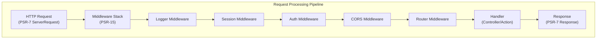

# ADR-005: PSR-15 Middleware Pattern cho XOOPS 4.0

> Áp dụng trình xử lý yêu cầu máy chủ HTTP PSR-15 (phần mềm trung gian) để cải thiện quy trình xử lý yêu cầu.

:::caution[XOOPS 4.0 Đề xuất — Không có sẵn trong 2.5.x]
ADR này mô tả **kiến trúc được đề xuất cho XOOPS 4.0**. Phần mềm trung gian PSR-15 **không có sẵn trong XOOPS 2.5.x**. 2.5.x modules hiện tại sử dụng mẫu Trình điều khiển Trang với bootstrap `mainfile.php`. Xem Kiến trúc XOOPS để biết vòng đời yêu cầu hiện tại.
:::

---

## Trạng thái

**Đề xuất** - Đang được đánh giá để phát hành XOOPS 4.0

---

## Bối cảnh

### Cách tiếp cận hiện tại

XOOPS 2.5 sử dụng phương pháp xử lý yêu cầu nguyên khối:

```php
// Current: Sequential processing
require_once 'mainfile.php';
// → Kernel initialization
// → User authentication
// → Module loading
// → Page rendering

// All in one flow, mixed concerns
```

### Vấn đề với cách tiếp cận hiện tại

1. **Mối quan tâm hỗn hợp** - Xác thực, ghi nhật ký, định tuyến tất cả đều đan xen
2. **Khó kiểm tra** - Các bước xử lý yêu cầu riêng lẻ khó kiểm tra đơn vị
3. **Khó mở rộng** - Mô-đun chỉ có thể kết nối thông qua tải trước/sự kiện
4. **Tách biệt kém** - Logic xử lý yêu cầu nằm rải rác khắp cơ sở mã
5. **Không thể kết hợp** - Không thể dễ dàng xâu chuỗi hoặc sắp xếp lại các bước xử lý

### Phần mềm trung gian PSR-15 là gì?

PSR-15 xác định giao diện chuẩn cho phần mềm trung gian HTTP:

```php
<?php
interface RequestHandlerInterface {
    public function handle(ServerRequestInterface $request): ResponseInterface;
}

interface MiddlewareInterface {
    public function process(
        ServerRequestInterface $request,
        RequestHandlerInterface $handler
    ): ResponseInterface;
}
```

**Chuỗi phần mềm trung gian:**

```
Request
  ↓
[Logger] → logs request
  ↓
[Auth] → validates user session
  ↓
[CORS] → checks cross-origin
  ↓
[Router] → dispatches to handler
  ↓
[Handler] → generates response
  ↓
Response
```

---

## Quyết định

### Áp dụng ngăn xếp phần mềm trung gian PSR-15 cho XOOPS 4.0

Triển khai quy trình xử lý yêu cầu dựa trên phần mềm trung gian theo tiêu chuẩn PSR-15.

### Tổng quan về kiến trúc



### Các thành phần cốt lõi của Middleware

#### 1. Application Middleware (Lớp lõi)

```php
<?php
declare(strict_types=1);

namespace XoopsCore;

use Psr\Http\Message\ResponseInterface;
use Psr\Http\Message\ServerRequestInterface;
use Psr\Http\Server\MiddlewareInterface;
use Psr\Http\Server\RequestHandlerInterface;

class SessionMiddleware implements MiddlewareInterface
{
    public function process(
        ServerRequestInterface $request,
        RequestHandlerInterface $handler
    ): ResponseInterface {
        // 1. Retrieve session (or start new)
        $sessionId = $request->getCookieParams()['PHPSESSID'] ?? null;
        $session = $this->sessionManager->load($sessionId);

        // 2. Attach session to request
        $request = $request->withAttribute('session', $session);

        // 3. Pass to next middleware
        $response = $handler->handle($request);

        // 4. Set session cookie if needed
        if ($session->isModified()) {
            $response = $response->withAddedHeader(
                'Set-Cookie',
                'PHPSESSID=' . $session->getId() . '; HttpOnly; SameSite=Strict'
            );
        }

        return $response;
    }
}
```

#### 2. Phần mềm trung gian xác thực

```php
<?php
class AuthMiddleware implements MiddlewareInterface
{
    public function process(
        ServerRequestInterface $request,
        RequestHandlerInterface $handler
    ): ResponseInterface {
        // Get session from previous middleware
        $session = $request->getAttribute('session');

        // Authenticate user from session
        $user = $this->authenticate($session);

        // Attach user to request
        $request = $request->withAttribute('user', $user);

        return $handler->handle($request);
    }

    private function authenticate(?Session $session): User
    {
        if ($session && $session->has('uid')) {
            return $this->userRepository->findById($session->get('uid'));
        }

        return new AnonymousUser();
    }
}
```

#### 3. Phần mềm trung gian ủy quyền

```php
<?php
class AuthorizationMiddleware implements MiddlewareInterface
{
    public function __construct(private AuthorizationChecker $checker)
    {
    }

    public function process(
        ServerRequestInterface $request,
        RequestHandlerInterface $handler
    ): ResponseInterface {
        $user = $request->getAttribute('user');
        $route = $request->getAttribute('route');

        // Check if user has permission for this route
        if (!$this->checker->isGranted($user, $route)) {
            return new JsonResponse(
                ['error' => 'Unauthorized'],
                403
            );
        }

        return $handler->handle($request);
    }
}
```

#### 4. Phần mềm trung gian mô-đun

```php
<?php
// Modules can provide their own middleware
class PublisherAccessMiddleware implements MiddlewareInterface
{
    public function process(
        ServerRequestInterface $request,
        RequestHandlerInterface $handler
    ): ResponseInterface {
        $user = $request->getAttribute('user');

        // Module-specific access control
        if (!$user->hasPermission('publisher_view')) {
            return new HtmlResponse('Access denied', 403);
        }

        return $handler->handle($request);
    }
}
```

### Ví dụ triển khai

```php
<?php
// bootstrap.php - Application setup

use Psr\Http\Message\ServerRequestInterface;
use Psr\Http\Server\RequestHandlerInterface;
use Xoops\Core\Middleware\{
    LoggerMiddleware,
    SessionMiddleware,
    AuthMiddleware,
    CorsMiddleware,
    ErrorHandlingMiddleware
};

// Create middleware pipeline
$middlewareStack = [
    // 1. Error handling (outermost)
    new ErrorHandlingMiddleware(),

    // 2. Logging
    new LoggerMiddleware($logger),

    // 3. CORS handling
    new CorsMiddleware($corsConfig),

    // 4. Session management
    new SessionMiddleware($sessionManager),

    // 5. Authentication
    new AuthMiddleware($userRepository),

    // 6. Authorization
    new AuthorizationMiddleware($authChecker),

    // 7. Routing and dispatching
    new RoutingMiddleware($router),

    // 8. Module middleware (dynamic)
    ...$this->loadModuleMiddleware(),
];

// Process request through middleware stack
$request = ServerRequestFactory::fromGlobals();
$dispatcher = new MiddlewareDispatcher($middlewareStack);
$response = $dispatcher->dispatch($request);

// Send response
http_response_code($response->getStatusCode());
foreach ($response->getHeaders() as $name => $values) {
    foreach ($values as $value) {
        header("$name: $value", false);
    }
}
echo $response->getBody();
```

### Tích hợp mô-đun

Các mô-đun có thể cung cấp phần mềm trung gian:

```php
<?php
// Publisher module - xoops_version.php

$modversion['middleware'] = [
    'PublisherAccessMiddleware' => true,      // Auto-load
    'PublisherLogMiddleware' => true,
];

// Or custom:
$modversion['middleware_factory'] = function() {
    return [
        new PublisherCacheMiddleware(),
        new PublisherPermissionMiddleware(),
    ];
};
```

---

## Hậu quả

### Hiệu ứng tích cực

1. **Tách biệt mối quan tâm** - Mỗi phần mềm trung gian xử lý một trách nhiệm
2. **Khả năng kiểm tra** - Dễ dàng kiểm tra đơn vị các thành phần phần mềm trung gian riêng lẻ
3. **Khả năng kết hợp** - Middleware có thể được trộn lẫn và sắp xếp lại
4. **Tuân thủ các tiêu chuẩn** - Sử dụng các tiêu chuẩn PSR-15 và PSR-7
5. **Khả năng mở rộng** - Các mô-đun có thể dễ dàng thêm phần mềm trung gian tùy chỉnh
6. **Gỡ lỗi** - Xóa luồng yêu cầu qua đường ống
7. **Hiệu suất** - Có thể tối ưu hóa các lớp phần mềm trung gian cụ thể
8. **Khả năng tương tác** - Có thể sử dụng phần mềm trung gian PSR-15 của bên thứ ba

### Tác động tiêu cực

1. **Đường cong học tập** - Nhà phát triển phải hiểu PSR-15
2. **Chi phí hoạt động** - Nhiều lệnh gọi hàm khác đang được triển khai
3. **Độ phức tạp** - Nhiều bộ phận chuyển động hơn so với phương pháp nguyên khối
4. **Nỗ lực di chuyển** - Yêu cầu cấu trúc lại mã hiện có
5. **Phụ thuộc** - Yêu cầu thư viện HTTP PSR-7

### Rủi ro và biện pháp giảm thiểu

| Rủi ro | Mức độ nghiêm trọng | Giảm nhẹ |
|------|----------|----------|
| Chuỗi phần mềm trung gian phức tạp | Trung bình | Tài liệu, ví dụ rõ ràng |
| Suy thoái hiệu suất | Trung bình | Điểm chuẩn, tối ưu hóa đường dẫn nóng |
| Nhà phát triển lạm dụng | Trung bình | Đánh giá mã, hướng dẫn thực hành tốt nhất |
| Những thay đổi đột phá trong quá trình di chuyển | Cao | Thời gian khấu hao, người trợ giúp |
| Vấn đề đặt hàng phần mềm trung gian | Trung bình | Xóa biểu đồ phụ thuộc |---

## Kế hoạch thực hiện

### Giai đoạn 1: Nền tảng (Q2 2026)

- [ ] Triển khai trình bao bọc tin nhắn HTTP PSR-7
- [] Tạo MiddlewareDispatcher
- [] Triển khai phần mềm trung gian cốt lõi (phiên, xác thực)
- [ ] Cập nhật kernel để sử dụng phần mềm trung gian

### Giai đoạn 2: Tích hợp (Q3 2026)

- [] Di chuyển chức năng hiện có sang phần mềm trung gian
- [] Thêm hỗ trợ phần mềm trung gian mô-đun
- [] Tạo tiện ích kiểm tra phần mềm trung gian
- [ ] Viết tài liệu toàn diện

### Giai đoạn 3: Di chuyển (Q4 2026)

- [] Cung cấp lớp tương thích cho mã cũ
- [ ] Trợ giúp modules cập nhật middleware mới
- [ ] Tối ưu hóa hiệu suất
- [ ] Kiểm tra an ninh

### Giai đoạn 4: Phát hành (Q1 2027)

- [ ] XOOPS 4.0 phát hành với phần mềm trung gian
- [ ] Không dùng hệ thống tải trước/móc cũ
- [ ] Phản hồi và cập nhật của cộng đồng

---

## Tiêu chí thành công

- [ ] Tất cả chức năng cốt lõi được di chuyển sang phần mềm trung gian
- [ ] 90%+ phạm vi kiểm tra cho phần mềm trung gian
- [ ] Tài liệu đầy đủ với các ví dụ
- [ ] Hiệu suất trong vòng 10% so với phiên bản trước
- [] Các module sử dụng thành công hệ thống middleware mới
- [ ] Tỷ lệ chấp nhận của cộng đồng >80%

---

## Thực tiễn tốt nhất về phần mềm trung gian

### Làm

- Tập trung vào phần mềm trung gian (trách nhiệm duy nhất)
- Sử dụng tính bất biến (tạo yêu cầu/phản hồi mới)
- Xử lý lỗi khéo léo
- Phụ thuộc tài liệu
- Thêm gợi ý loại
- Viết bài test cho middleware
- Sử dụng giao diện PSR-15 tiêu chuẩn

### Đừng

- Không sửa đổi các đối tượng yêu cầu/phản hồi được chia sẻ
- Không truy cập trực tiếp vào toàn cầu
- Không tạo sự phụ thuộc vào thứ tự phần mềm trung gian
- Không bắt được tất cả các ngoại lệ
- Không trộn lẫn logic nghiệp vụ với phần mềm trung gian
- Đừng bắt middleware làm quá nhiều việc

---

## Ví dụ

### Phần mềm trung gian tùy chỉnh

```php
<?php
// Example: Rate limiting middleware

use Psr\Http\Message\ResponseInterface;
use Psr\Http\Message\ServerRequestInterface;
use Psr\Http\Server\MiddlewareInterface;
use Psr\Http\Server\RequestHandlerInterface;

class RateLimitMiddleware implements MiddlewareInterface
{
    public function __construct(
        private RateLimiter $limiter,
        private int $limit = 100,
        private int $window = 3600
    ) {
    }

    public function process(
        ServerRequestInterface $request,
        RequestHandlerInterface $handler
    ): ResponseInterface {
        $user = $request->getAttribute('user');
        $identifier = $user->getId() ?? $request->getClientIp();

        // Check rate limit
        $remaining = $this->limiter->check($identifier, $this->limit, $this->window);

        if ($remaining < 0) {
            return new JsonResponse(
                ['error' => 'Rate limit exceeded'],
                429
            );
        }

        // Add rate limit headers
        $response = $handler->handle($request);
        return $response
            ->withAddedHeader('X-RateLimit-Limit', (string)$this->limit)
            ->withAddedHeader('X-RateLimit-Remaining', (string)$remaining);
    }
}
```

---

## Các quyết định liên quan

- ADR-001: Kiến trúc mô-đun - Nền tảng
- ADR-004: Hệ thống bảo mật - Sử dụng phần mềm trung gian để xác thực
- ADR-006: Xác thực hai yếu tố - Có thể là phần mềm trung gian

---

## Tài liệu tham khảo

### Tiêu chuẩn PSR

- [PSR-7: Giao diện tin nhắn HTTP](https://www.php-fig.org/psr/psr-7/)
- [PSR-15: Trình xử lý yêu cầu máy chủ HTTP](https://www.php-fig.org/psr/psr-15/)

### Khung phần mềm trung gian

- [Slim Framework](https://www.slimframework.com/) - Ví dụ về phần mềm trung gian
- [Zend Expressive](https://docs.zendframework.com/zend-expressive/) - Khung PSR-15
- [Guzzle](https://docs.guzzlephp.org/) - Phần mềm trung gian máy khách HTTP

### Công cụ

- [RelayPHP](https://relayphp.com/) - Thư viện phần mềm trung gian
- [PSR-15 Middleware](https://github.com/middlewares) - Bộ sưu tập các phần mềm trung gian

---

## Lịch sử phiên bản

| Phiên bản | Ngày | Thay đổi |
|----------|------|----------|
| 1.0.0 | 28-01-2024 | Đề xuất ban đầu |

---

#xoops #adr #psr-15 #middleware #architecture #psr-7