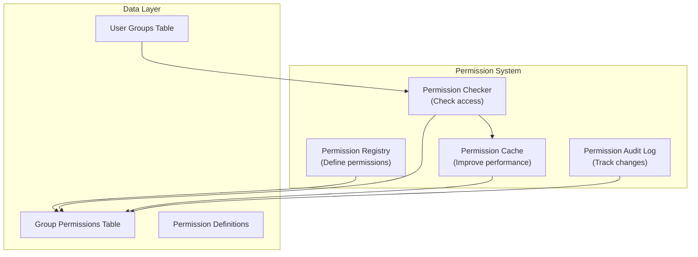

# ADR-006: Hệ thống cấp phép mô-đun

> Hệ thống cấp phép phân cấp, chi tiết dành cho XOOPS modules cho phép kiểm soát truy cập chi tiết.

---

## Trạng thái

**Được chấp nhận** - Được triển khai trong XOOPS 2.5.x và được mở rộng trong XOOPS 4.0

---

## Bối cảnh

### Tuyên bố vấn đề

XOOPS modules cần các biện pháp kiểm soát quyền linh hoạt cho phép:

1. **Quyền cấp mô-đun** - Người dùng có thể truy cập mô-đun này không?
2. **Quyền cấp đối tượng** - Người dùng có thể truy cập mục cụ thể này không?
3. **Quyền cấp hành động** - Người dùng có thể thực hiện hành động này không?
4. **Quyền tùy chỉnh** - modules có thể xác định quyền riêng của họ không?

### Trạng thái hiện tại

XOOPS 2.5 sử dụng hệ thống XoopsGroupPermission:

```php
<?php
$perm_handler = xoops_getHandler('groupperm');
$isAllowed = $perm_handler->checkRight(
    'modulename',
    'action',
    $itemId,
    $groupId
);
```

### Thử thách

1. **Truy vấn phức tạp** - Kiểm tra quyền yêu cầu tham gia cơ sở dữ liệu
2. **Giới hạn thứ bậc** - Khó tạo nhóm quyền
3. **Bộ nhớ đệm kém** - Không có bộ nhớ đệm quyền tích hợp
4. **Biến thể mô-đun** - Mỗi mô-đun triển khai khác nhau
5. **Hiệu suất** - Nhiều truy vấn DB để kiểm tra quyền

---

## Quyết định

### Triển khai hệ thống cấp phép phân cấp

Tạo một hệ thống cấp phép được lưu trữ và chuẩn hóa hỗ trợ:

1. **Quyền phân cấp** - Kế thừa từ nhóm mẹ
2. **Quyền truy cập dựa trên vai trò** - Ánh xạ quyền tới các vai trò (admin, người kiểm duyệt, người dùng, khách)
3. **Quyền đối tượng** - Kiểm soát chi tiết cho mỗi mục
4. **Bộ nhớ đệm** - Quyền bộ nhớ đệm để giảm truy vấn
5. **Quyền tùy chỉnh** - Các mô-đun tự xác định
6. **Dấu vết kiểm tra** - Thay đổi quyền ghi nhật ký

### Phân cấp quyền

```
User
  └── Group 1 (Admin)
      └── Permission: admin_module
      └── Permission: edit_all_items
      └── Permission: delete_all_items
  └── Group 2 (Moderator)
      └── Permission: moderate_comments
      └── Permission: edit_own_items
  └── Group 3 (User)
      └── Permission: view_published_items
      └── Permission: edit_own_items
  └── Group 4 (Guest)
      └── Permission: view_published_items
```

### Kiến trúc



---

## Thành phần cốt lõi

### 1. Định nghĩa quyền

```php
<?php
// Module defines its permissions in xoops_version.php

$modversion['permissions'] = [
    [
        'name' => 'module_view',
        'description' => 'Can view module',
        'level' => 'module',
    ],
    [
        'name' => 'item_view',
        'description' => 'Can view items',
        'level' => 'item',
    ],
    [
        'name' => 'item_create',
        'description' => 'Can create items',
        'level' => 'item',
    ],
    [
        'name' => 'item_edit',
        'description' => 'Can edit items',
        'level' => 'item',
    ],
    [
        'name' => 'item_delete',
        'description' => 'Can delete items',
        'level' => 'item',
    ],
    [
        'name' => 'admin_manage',
        'description' => 'Can manage module',
        'level' => 'admin',
    ],
];

// Default permissions by group
$modversion['group_permissions'] = [
    // Admin group gets all permissions
    '1' => [
        'module_view' => 1,
        'item_view' => 1,
        'item_create' => 1,
        'item_edit' => 1,
        'item_delete' => 1,
        'admin_manage' => 1,
    ],
    // User group
    '3' => [
        'module_view' => 1,
        'item_view' => 1,
        'item_create' => 1,
        'item_edit' => 0,
        'item_delete' => 0,
        'admin_manage' => 0,
    ],
    // Guest group
    '4' => [
        'module_view' => 1,
        'item_view' => 1,
        'item_create' => 0,
        'item_edit' => 0,
        'item_delete' => 0,
        'admin_manage' => 0,
    ],
];
```

### 2. Trình kiểm tra quyền

```php
<?php
declare(strict_types=1);

namespace XoopsCore\Permission;

class PermissionChecker
{
    private PermissionCache $cache;
    private PermissionRepository $repository;

    public function hasPermission(
        User $user,
        string $permissionName,
        ?int $itemId = null
    ): bool {
        // Check cache first
        $cacheKey = "perm_{$user->getId()}_{$permissionName}_{$itemId}";
        if ($this->cache->has($cacheKey)) {
            return $this->cache->get($cacheKey);
        }

        $hasPermission = false;

        // Check all user groups
        foreach ($user->getGroups() as $group) {
            if ($this->checkGroupPermission($group, $permissionName, $itemId)) {
                $hasPermission = true;
                break;
            }
        }

        // Cache result
        $this->cache->set($cacheKey, $hasPermission, 3600);

        // Log high-level access checks
        if ($hasPermission && $this->shouldAuditLog($permissionName)) {
            $this->auditLog('PERMISSION_CHECKED', [
                'user_id' => $user->getId(),
                'permission' => $permissionName,
                'item_id' => $itemId,
                'result' => 'ALLOWED',
            ]);
        }

        return $hasPermission;
    }

    private function checkGroupPermission(
        Group $group,
        string $permissionName,
        ?int $itemId = null
    ): bool {
        $sql = 'SELECT COUNT(*) FROM ' . $this->table . '
                WHERE groupid = ?
                AND permission = ?
                AND itemid = ?
                AND granted = 1';

        $stmt = $this->db->prepare($sql);
        $stmt->execute([$group->getId(), $permissionName, $itemId ?? 0]);

        return $stmt->fetchColumn() > 0;
    }
}
```

### 3. Cấp độ quyền

```php
<?php
// Different permission levels with different scopes

class PermissionLevel
{
    // Module-level: Affects entire module
    public const LEVEL_MODULE = 'module';

    // Admin-level: Admin panel access
    public const LEVEL_ADMIN = 'admin';

    // Item-level: Specific objects/items
    public const LEVEL_ITEM = 'item';

    // Field-level: Specific object fields
    public const LEVEL_FIELD = 'field';

    // Action-level: Specific actions/operations
    public const LEVEL_ACTION = 'action';
}
```

### 4. Quyền cấp đối tượng

```php
<?php
// Fine-grained control for specific items

class Item extends XoopsObject
{
    /**
     * Check if user can view this item
     */
    public function canView(User $user): bool
    {
        // Public items anyone can view
        if ($this->getVar('status') === 'published') {
            return true;
        }

        // Owner can always view their items
        if ($this->getVar('user_id') === $user->getId()) {
            return true;
        }

        // Check group permissions
        $permChecker = xoops_getActiveModule()->getPermissionChecker();
        return $permChecker->hasPermission(
            $user,
            'item_view',
            $this->getVar('id')
        );
    }

    public function canEdit(User $user): bool
    {
        // Owner can edit their items
        if ($this->getVar('user_id') === $user->getId()) {
            return $permChecker->hasPermission($user, 'item_edit', $this->getVar('id'));
        }

        // Check if user can edit all items
        return $permChecker->hasPermission($user, 'item_edit_all', $this->getVar('id'));
    }

    public function canDelete(User $user): bool
    {
        return $permChecker->hasPermission($user, 'item_delete', $this->getVar('id'));
    }
}
```

### 5. Cách sử dụng trong Controller

```php
<?php
// Example: Article controller

class ArticleController
{
    private PermissionChecker $permChecker;

    public function view(int $id, User $user): Response
    {
        $article = $this->repository->find($id);

        // Check permission
        if (!$article->canView($user)) {
            throw new AccessDeniedException('Cannot view this article');
        }

        return new HtmlResponse($this->renderArticle($article));
    }

    public function edit(int $id, User $user): Response
    {
        $article = $this->repository->find($id);

        // Check permission
        if (!$article->canEdit($user)) {
            throw new AccessDeniedException('Cannot edit this article');
        }

        // Handle form submission
        if ($this->request->isMethod('POST')) {
            $article->setVar('title', $this->request->getPost('title'));
            $article->setVar('content', $this->request->getPost('content'));
            $this->repository->insert($article);

            $this->auditLog('ARTICLE_EDITED', ['id' => $id, 'user_id' => $user->getId()]);

            // Invalidate permission cache
            $this->permChecker->clearCache($user->getId());

            return new RedirectResponse('/article/' . $id);
        }

        return new HtmlResponse($this->renderForm($article));
    }

    public function delete(int $id, User $user): Response
    {
        $article = $this->repository->find($id);

        if (!$article->canDelete($user)) {
            throw new AccessDeniedException('Cannot delete this article');
        }

        $this->repository->delete($article);

        $this->auditLog('ARTICLE_DELETED', ['id' => $id, 'user_id' => $user->getId()]);

        // Invalidate cache
        $this->permChecker->clearCache($user->getId());

        return new JsonResponse(['success' => true]);
    }
}
```

---

## Hậu quả

### Hiệu ứng tích cực

1. **Kiểm soát chi tiết** - Quản lý quyền tinh chỉnh
2. **Được chuẩn hóa** - Nhất quán trên modules
3. **Đã lưu vào bộ nhớ đệm** - Cải thiện hiệu suất với bộ nhớ đệm
4. **Có thể kiểm tra** - Theo dõi ai đã thay đổi nội dung gì
5. **Linh hoạt** - Hỗ trợ quyền tùy chỉnh
6. **Có thể mở rộng** - Xử lý các hệ thống phân cấp quyền phức tạp
7. **Có thể kiểm tra** - Dễ dàng kiểm tra đơn vị

### Tác động tiêu cực

1. **Độ phức tạp** - Cần nhiều mã hơn để quản lý
2. **Chi phí cơ sở dữ liệu** - Nhiều bảng và kết nối hơn
3. **Vô hiệu hóa bộ đệm** - Phải xóa bộ nhớ đệm khi có thay đổi
4. **Đường cong học tập** - Nhà phát triển phải hiểu hệ thống
5. **Hiệu suất** - Nếu bộ đệm không được cấu hình đúng cách

### Rủi ro và biện pháp giảm thiểu

| Rủi ro | Mức độ nghiêm trọng | Giảm nhẹ |
|------|----------|----------|
| Quyền quá phức tạp | Trung bình | Mặc định tốt, tài liệu |
| Dữ liệu cũ trong bộ nhớ đệm | Cao | TTL, vô hiệu hóa thông minh |
| Hồi quy hiệu suất | Trung bình | Điểm chuẩn, tối ưu hóa truy vấn |
| Bỏ qua quyền | Cao | Kiểm tra, kiểm tra an ninh |

---

## Mẫu thiết kế quyền

### Mẫu 1: Quyền của chủ sở hữu

```php
<?php
// User can edit their own items but not others'

public function canEdit(User $user): bool
{
    // Owner can always edit
    if ($this->isOwner($user)) {
        return true;
    }

    // Check group permissions for editing others' items
    return $this->permChecker->hasPermission($user, 'edit_all_items');
}

private function isOwner(User $user): bool
{
    return $this->getVar('user_id') === $user->getId();
}
```

### Mẫu 2: Quyền dựa trên trạng thái

```php
<?php
// Different permissions based on status

public function canView(User $user): bool
{
    switch ($this->getVar('status')) {
        case 'published':
            // Anyone with module permission can view
            return $this->permChecker->hasPermission($user, 'item_view');

        case 'draft':
            // Only owner or admin can view
            return $this->isOwner($user) ||
                   $this->permChecker->hasPermission($user, 'admin_manage');

        case 'archived':
            // Only admin can view
            return $this->permChecker->hasPermission($user, 'admin_manage');

        default:
            return false;
    }
}
```

### Mẫu 3: Quyền dựa trên vai trò

```php
<?php
// Check against specific roles

public function hasAdminRole(User $user): bool
{
    return $user->getGroups()->contains('admin_group');
}

public function hasModeratorRole(User $user): bool
{
    return $user->getGroups()->contains('moderator_group') ||
           $this->hasAdminRole($user);
}

public function canModerate(User $user): bool
{
    return $this->hasModeratorRole($user);
}
```

---

## Các quyết định liên quan

- ADR-001: Kiến trúc mô-đun - Mô-đun xác định quyền
- ADR-004: Hệ thống bảo mật - Nền tảng bảo mật
- ADR-005: Middleware - Có thể thực thi quyền

---## Tài liệu tham khảo

### Mô hình quyền

- [RBAC (Kiểm soát truy cập dựa trên vai trò)](https://en.wikipedia.org/wiki/Role-based_access_control)
- [ABAC (Kiểm soát truy cập dựa trên thuộc tính)](https://en.wikipedia.org/wiki/Attribute-based_access_control)
- [ACL (Danh sách điều khiển truy cập)](https://en.wikipedia.org/wiki/Access-control_list)

### Triển khai

- [Bảo mật Symfony](https://symfony.com/doc/current/security.html)
- [Ủy quyền của Laravel](https://laravel.com/docs/authorization)

---

## Danh sách kiểm tra thực hiện

- [ ] Xác định mức độ cho phép tiêu chuẩn
- [ ] Tạo PermissionChecker class
- [] Triển khai chiến lược bộ nhớ đệm
- [] Thêm ghi nhật ký kiểm tra
- [] Tạo các hàm trợ giúp
- [ ] Viết bài kiểm tra toàn diện
- [] Tài liệu dành cho nhà phát triển
- [ ] Cập nhật tất cả modules
- [ ] Tối ưu hóa hiệu suất
- [ ] Đánh giá bảo mật

---

## Lịch sử phiên bản

| Phiên bản | Ngày | Thay đổi |
|----------|------|----------|
| 1.0.0 | 28-01-2024 | Tài liệu ban đầu |

---

#xoops #adr #quyền #ủy quyền #rbac #bảo mật