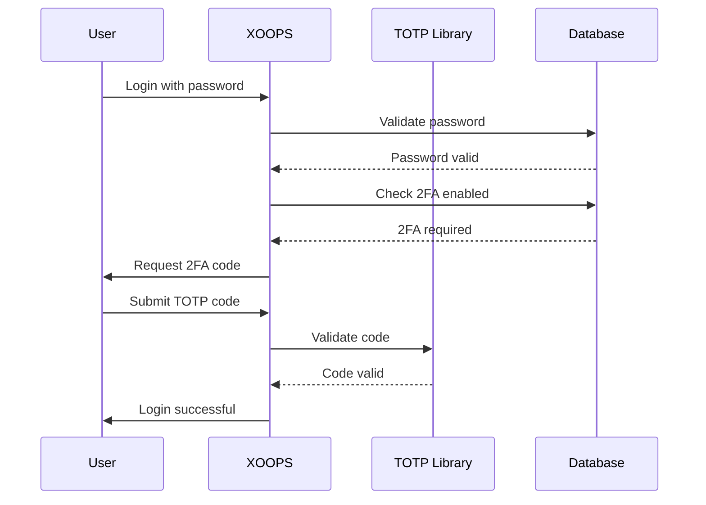

## Trạng thái

Đề xuất

## Bối cảnh

XOOPS cần tăng cường bảo mật để xác thực người dùng. Xác thực hai yếu tố (2FA) cung cấp một lớp bảo mật bổ sung ngoài mật khẩu, bảo vệ tài khoản ngay cả khi mật khẩu bị xâm phạm.

Những cân nhắc chính:
- Khả năng tương thích ngược với xác thực hiện có
- Hỗ trợ nhiều phương thức 2FA
- Trải nghiệm người dùng trong quá trình thiết lập và đăng nhập
- Cơ chế phục hồi thiết bị bị mất
- Tích hợp với hệ thống cấp phép hiện có

## Quyết định

Chúng tôi sẽ triển khai TOTP (Mật khẩu một lần dựa trên thời gian) làm phương pháp 2FA chính với sự hỗ trợ cho mã dự phòng.

### Phương pháp triển khai



### Lược đồ cơ sở dữ liệu

```sql
CREATE TABLE `{PREFIX}_users_2fa` (
    `user_id` INT(11) NOT NULL,
    `secret` VARCHAR(32) NOT NULL,
    `enabled` TINYINT(1) DEFAULT 0,
    `backup_codes` TEXT,
    `last_used` INT(11),
    `created` INT(11) NOT NULL,
    PRIMARY KEY (`user_id`),
    FOREIGN KEY (`user_id`) REFERENCES `{PREFIX}_users`(`uid`)
);
```

### Giao diện dịch vụ

```php
interface TwoFactorAuthInterface
{
    public function enable(int $userId): TwoFactorSetup;
    public function disable(int $userId): void;
    public function verify(int $userId, string $code): bool;
    public function generateBackupCodes(int $userId): array;
    public function isEnabled(int $userId): bool;
}
```

### Tích hợp phần mềm trung gian

```php
class TwoFactorMiddleware implements MiddlewareInterface
{
    public function process(
        ServerRequestInterface $request,
        RequestHandlerInterface $handler
    ): ResponseInterface {
        $session = $request->getAttribute('session');

        if ($session->has('pending_2fa_user_id')) {
            // User needs to complete 2FA
            if ($this->isVerificationRequest($request)) {
                return $handler->handle($request);
            }
            return new RedirectResponse('/2fa/verify');
        }

        return $handler->handle($request);
    }
}
```

## Hậu quả

### Tích cực

- Bảo mật tài khoản được cải thiện đáng kể
- Khả năng tương thích TOTP tiêu chuẩn ngành (Google Authenticator, Authy, v.v.)
- Mã dự phòng chống khóa tài khoản
- Tùy chọn cho mỗi người dùng - không bắt buộc áp dụng
- Phần mềm trung gian PSR-15 cho phép tích hợp rõ ràng

### Tiêu cực

- Bước đăng nhập bổ sung tác động đến trải nghiệm người dùng
- Người dùng phải quản lý ứng dụng xác thực
- Thiết bị bị mất yêu cầu quá trình khôi phục
- Lưu trữ và truy vấn cơ sở dữ liệu bổ sung
- Yêu cầu phụ thuộc vào thư viện mật mã

### Đường dẫn di chuyển

1. Thêm bảng cơ sở dữ liệu cho dữ liệu 2FA
2. Triển khai dịch vụ TOTP phụ thuộc vào thư viện
3. Thêm phần mềm trung gian vào chuỗi xác thực
4. Tạo giao diện người dùng thiết lập và xác minh
5. Tùy chọn quản trị viên để yêu cầu 2FA cho các nhóm cụ thể

## Các lựa chọn thay thế được xem xét

### OTP dựa trên SMS

Bị từ chối vì:
- Lỗ hổng trao đổi SIM
- Cước cổng SMS
- Độ phức tạp của việc xác minh số điện thoại
- Những lo ngại về quyền riêng tư

### Khóa bảo mật phần cứng (WebAuthn)

Trì hoãn cho ADR trong tương lai:
- Thực hiện phức tạp hơn
- Hỗ trợ trình duyệt hạn chế trong lịch sử
- Chi phí sử dụng cao hơn
- Có thể được thêm vào cùng với TOTP sau

### OTP dựa trên email

Bị từ chối vì:
- Việc xâm phạm tài khoản email không đạt được mục đích
- Sự chậm trễ giao hàng ảnh hưởng đến UX
- Vấn đề về bộ lọc thư rác

## Tài liệu tham khảo

- [RFC 6238 - TOTP](https://tools.ietf.org/html/rfc6238)
- [Định dạng khóa Google Authenticator](https://github.com/google/google-authenticator/wiki/Key-Uri-Format)
- ../../02-Core-Concepts/Security/Security-Best-Thực hành tốt nhất - Nguyên tắc bảo mật
- ../../02-Core-Concepts/Users-Permissions/Authentication - Tài liệu hệ thống xác thực