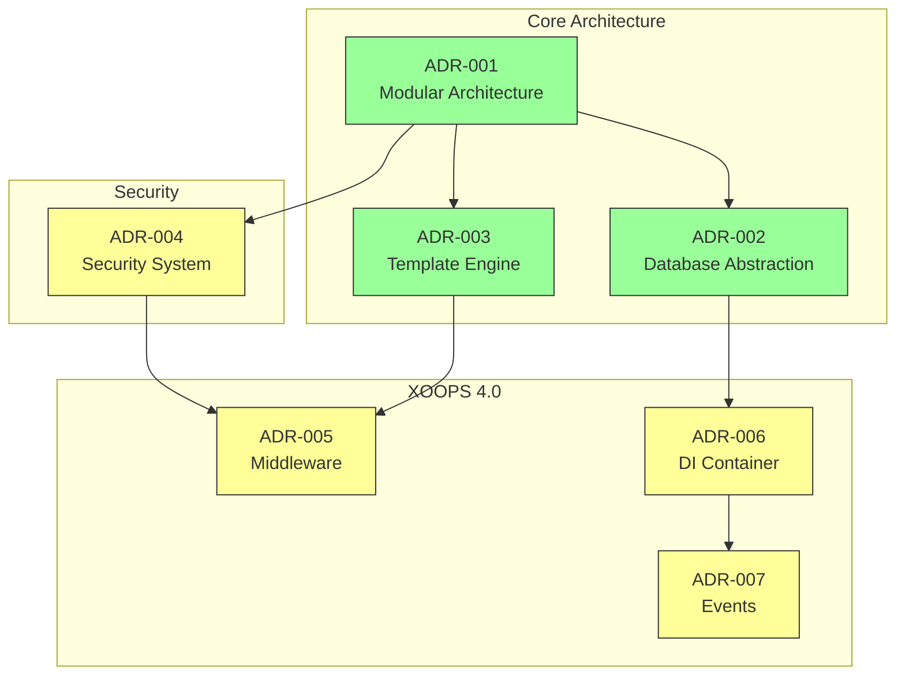
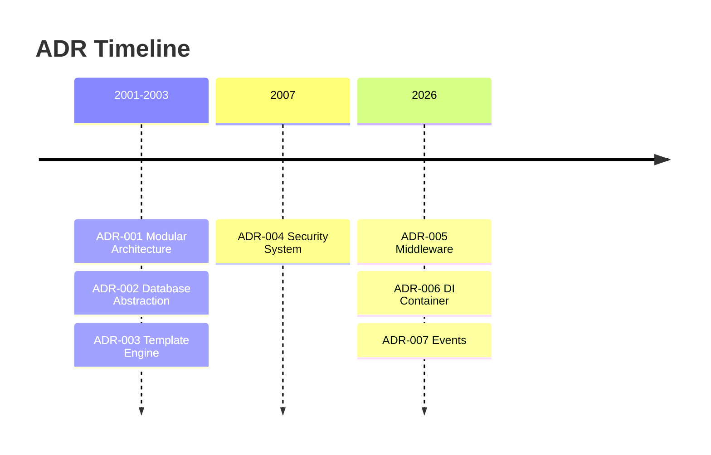

# 📋 Chỉ mục hồ sơ quyết định kiến trúc

> Chỉ mục toàn diện về các quyết định kiến trúc đã định hình XOOPS CMS.

---

## ADR là gì?

Bản ghi Quyết định Kiến trúc (ADR) ghi lại các quyết định kiến ​​trúc quan trọng được thực hiện trong quá trình phát triển XOOPS. Chúng nắm bắt bối cảnh, quyết định và hậu quả của mỗi lựa chọn, cung cấp bối cảnh lịch sử có giá trị cho những người duy trì và đóng góp.

---

## Chú giải trạng thái ADR

| Trạng thái | Ý nghĩa |
|--------|----------|
| **Đề xuất** | Đang thảo luận, chưa được chấp nhận |
| **Được chấp nhận** | Quyết định đã được thông qua |
| **Không dùng nữa** | Không còn được đề xuất |
| **Đã thay thế** | Được thay thế bằng ADR khác |

---

## ADR hiện tại

### Các quyết định cơ bản

| ADR | Tiêu đề | Trạng thái | Tác động |
|------|-------|--------|--------|
| ADR-001 | Kiến trúc mô-đun | Đã chấp nhận | Cốt lõi |
| ADR-002 | Truy cập cơ sở dữ liệu hướng đối tượng | Đã chấp nhận | Cốt lõi |
| ADR-003 | Công cụ tạo mẫu Smarty | Đã chấp nhận | Cốt lõi |

### ADR theo kế hoạch (XOOPS 4.0)

| ADR | Tiêu đề | Trạng thái | Tác động |
|------|-------|--------|--------|
| ADR-004 | Thiết kế hệ thống an ninh | Đề xuất | An ninh |
| ADR-005 | Phần mềm trung gian PSR-15 | Đề xuất | Kiến trúc |
| ADR-006 | Vùng chứa phụ thuộc | Đề xuất | Kiến trúc |
| ADR-007 | Thiết kế lại hệ thống sự kiện | Đề xuất | Kiến trúc |

---

## Mối quan hệ ADR



---

## Dòng thời gian



---

## Tạo ADR mới

Khi đề xuất một quyết định kiến trúc mới:

1. Sao chép mẫu ADR
2. Điền vào tất cả các phần
3. Gửi dưới dạng yêu cầu kéo
4. Thảo luận về các vấn đề GitHub
5. Cập nhật trạng thái sau quyết định

### Cấu trúc mẫu ADR

```markdown
# ADR-XXX: Title

## Status
Proposed | Accepted | Deprecated | Superseded

## Context
What is the issue motivating this decision?

## Decision
What is the change that we're proposing?

## Consequences
What becomes easier or harder as a result?

## Alternatives Considered
What other options were evaluated?
```

---

## 🔗 Tài liệu liên quan

- Khái niệm cốt lõi
- Hướng dẫn đóng góp
- Lộ trình XOOPS 4.0

---

#xoops #adr #architecture #index #decisions