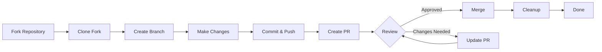

> Hướng dẫn này hướng dẫn bạn toàn bộ quy trình đóng góp cho XOOPS, từ thiết lập ban đầu đến yêu cầu kéo hợp nhất.

---

## Điều kiện tiên quyết

Trước khi bạn bắt đầu đóng góp, hãy đảm bảo bạn có:

- **Git** được cài đặt và cấu hình
- **Tài khoản GitHub** (miễn phí)
- **PHP 7.4+** để phát triển XOOPS
- **Trình soạn thảo** để quản lý phần phụ thuộc
- Kiến thức cơ bản về quy trình làm việc Git
- Làm quen với Quy tắc ứng xử

---

## Bước 1: Fork kho lưu trữ

### Trên giao diện web GitHub

1. Điều hướng đến kho lưu trữ (ví dụ: `XOOPS/XoopsCore27`)
2. Nhấp vào nút **Fork** ở góc trên bên phải
3. Chọn nơi phân nhánh (tài khoản cá nhân của bạn)
4. Đợi fork hoàn tất

### Tại sao lại phân nhánh?

- Bạn có bản sao của riêng mình để làm việc
- Người bảo trì không cần quản lý nhiều chi nhánh
- Bạn có toàn quyền kiểm soát ngã ba của mình
- Yêu cầu kéo tham chiếu ngã ba của bạn và repo ngược dòng

---

## Bước 2: Sao chép cục bộ fork của bạn

```bash
# Clone your fork (replace YOUR_USERNAME)
git clone https://github.com/YOUR_USERNAME/XoopsCore27.git
cd XoopsCore27

# Add upstream remote to track original repository
git remote add upstream https://github.com/XOOPS/XoopsCore27.git

# Verify remotes are set correctly
git remote -v
# origin    https://github.com/YOUR_USERNAME/XoopsCore27.git (fetch)
# origin    https://github.com/YOUR_USERNAME/XoopsCore27.git (push)
# upstream  https://github.com/XOOPS/XoopsCore27.git (fetch)
# upstream  https://github.com/XOOPS/XoopsCore27.git (nofetch)
```

---

## Bước 3: Thiết lập môi trường phát triển

### Cài đặt phụ thuộc

```bash
# Install Composer dependencies
composer install

# Install development dependencies
composer install --dev

# For module development
cd modules/mymodule
composer install
```

### Định cấu hình Git

```bash
# Set your Git identity
git config user.name "Your Name"
git config user.email "your.email@example.com"

# Optional: Set global Git config
git config --global user.name "Your Name"
git config --global user.email "your.email@example.com"
```

### Chạy thử nghiệm

```bash
# Make sure tests pass in clean state
./vendor/bin/phpunit

# Run specific test suite
./vendor/bin/phpunit --testsuite unit
```

---

## Bước 4: Tạo nhánh tính năng

### Quy ước đặt tên chi nhánh

Thực hiện theo mẫu sau: `<type>/<description>`

**Các loại:**
- `feature/` - Tính năng mới
- `fix/` - Sửa lỗi
- `docs/` - Chỉ tài liệu
- `refactor/` - Tái cấu trúc mã
- `test/` - Bổ sung thử nghiệm
- `chore/` - Bảo trì, dụng cụ

**Ví dụ:**
```bash
# Feature branch
git checkout -b feature/add-two-factor-auth

# Bug fix branch
git checkout -b fix/prevent-xss-in-forms

# Documentation branch
git checkout -b docs/update-api-guide

# Always branch from upstream/main (or develop)
git checkout -b feature/my-feature upstream/main
```

### Luôn cập nhật chi nhánh

```bash
# Before you start work, sync with upstream
git fetch upstream
git merge upstream/main

# Later, if upstream has changed
git fetch upstream
git rebase upstream/main
```

---

## Bước 5: Thực hiện thay đổi của bạn

### Thực tiễn phát triển

1. **Viết mã** theo tiêu chuẩn PHP
2. **Viết bài kiểm tra** cho chức năng mới
3. **Cập nhật tài liệu** nếu cần
4. **Chạy linters** và trình định dạng mã

### Kiểm tra chất lượng mã

```bash
# Run all tests
./vendor/bin/phpunit

# Run with coverage
./vendor/bin/phpunit --coverage-html coverage/

# Run PHP CS Fixer
./vendor/bin/php-cs-fixer fix --dry-run

# Run PHPStan static analysis
./vendor/bin/phpstan analyse class/ src/
```

### Cam kết những thay đổi tốt

```bash
# Check what you changed
git status
git diff

# Stage specific files
git add class/MyClass.php
git add tests/MyClassTest.php

# Or stage all changes
git add .

# Commit with descriptive message
git commit -m "feat(auth): add two-factor authentication support"
```

---

## Bước 6: Đồng bộ hóa nhánh

Trong khi làm việc với tính năng của bạn, nhánh chính có thể tiến triển:

```bash
# Fetch latest changes from upstream
git fetch upstream

# Option A: Rebase (preferred for clean history)
git rebase upstream/main

# Option B: Merge (simpler but adds merge commits)
git merge upstream/main

# If conflicts occur, resolve them then:
git add .
git rebase --continue  # or git merge --continue
```

---

## Bước 7: Đẩy tới ngã ba của bạn

```bash
# Push your branch to your fork
git push origin feature/my-feature

# On subsequent pushes
git push

# If you rebased, you might need force push (use carefully!)
git push --force-with-lease origin feature/my-feature
```

---

## Bước 8: Tạo yêu cầu kéo

### Trên giao diện web GitHub

1. Đi tới ngã ba của bạn trên GitHub
2. Bạn sẽ thấy thông báo tạo PR từ chi nhánh của mình
3. Nhấp vào **"So sánh và lấy yêu cầu"**
4. Hoặc nhấp thủ công **"Yêu cầu kéo mới"** và chọn chi nhánh của bạn

### Tiêu đề và mô tả PR

**Định dạng tiêu đề:**
```
<type>(<scope>): <subject>
```

Ví dụ:
```
feat(auth): add two-factor authentication
fix(forms): prevent XSS in text input
docs: update installation guide
refactor(core): improve performance
```

**Mẫu mô tả:**

```markdown
## Description
Brief explanation of what this PR does.

## Changes
- Changed X from A to B
- Added feature Y
- Fixed bug Z

## Type of Change
- [ ] New feature (adds new functionality)
- [ ] Bug fix (fixes an issue)
- [ ] Breaking change (API/behavior change)
- [ ] Documentation update

## Testing
- [ ] Added tests for new functionality
- [ ] All existing tests pass
- [ ] Manual testing performed

## Screenshots (if applicable)
Include before/after screenshots for UI changes.

## Related Issues
Closes #123
Related to #456

## Checklist
- [ ] Code follows style guidelines
- [ ] Self-reviewed own code
- [ ] Commented complex code
- [ ] Updated documentation
- [ ] No new warnings generated
- [ ] Tests pass locally
```

### Danh sách kiểm tra đánh giá PR

Trước khi gửi, hãy đảm bảo:

- [ ] Mã theo tiêu chuẩn PHP
- [ ] Các bài kiểm tra là included và đạt
- [ ] Tài liệu được cập nhật (nếu cần)
- [] Không có xung đột hợp nhất
- [ ] Thông báo cam kết rõ ràng
- [] Các vấn đề liên quan được tham khảo
- [] Mô tả PR thật chi tiết
- [] Không có mã gỡ lỗi hoặc nhật ký bảng điều khiển

---

## Bước 9: Phản hồi phản hồi

### Trong quá trình xem xét mã

1. **Đọc kỹ bình luận** - Tìm hiểu phản hồi
2. **Đặt câu hỏi** - Nếu chưa rõ, hãy yêu cầu làm rõ
3. **Thảo luận các phương án thay thế** - Tranh luận một cách tôn trọng các phương pháp tiếp cận
4. **Thực hiện các thay đổi được yêu cầu** - Cập nhật chi nhánh của bạn
5. **Bắt buộc cập nhật các cam kết** - Nếu viết lại lịch sử

```bash
# Make changes
git add .
git commit --amend  # Modify last commit
git push --force-with-lease origin feature/my-feature

# Or add new commits
git commit -m "Address feedback on PR review"
git push origin feature/my-feature
```

### Mong đợi sự lặp lại

- Hầu hết các PR đều yêu cầu nhiều vòng xét duyệt
- Hãy kiên nhẫn và mang tính xây dựng
- Xem phản hồi là cơ hội học tập
- Người bảo trì có thể đề xuất các bộ tái cấu trúc

---## Bước 10: Hợp nhất và dọn dẹp

### Sau khi được phê duyệt

Sau khi người bảo trì phê duyệt và hợp nhất:

1. **Tự động hợp nhất GitHub** hoặc hợp nhất các lần nhấp chuột của người bảo trì
2. **Chi nhánh của bạn bị xóa** (thường là tự động)
3. **Những thay đổi đang diễn ra**

### Dọn dẹp cục bộ

```bash
# Switch to main branch
git checkout main

# Update main with merged changes
git fetch upstream
git merge upstream/main

# Delete local feature branch
git branch -d feature/my-feature

# Delete from your fork (if not auto-deleted)
git push origin --delete feature/my-feature
```

---

## Sơ đồ quy trình làm việc



---

## Các tình huống phổ biến

### Đồng bộ hóa trước khi bắt đầu

```bash
# Always start fresh
git fetch upstream
git checkout -b feature/new-thing upstream/main
```

### Thêm nhiều cam kết hơn

```bash
# Just push again
git add .
git commit -m "feat: additional changes"
git push origin feature/new-thing
```

### Sửa lỗi

```bash
# Last commit has wrong message
git commit --amend -m "Correct message"
git push --force-with-lease

# Revert to previous state (careful!)
git reset --soft HEAD~1  # Keep changes
git reset --hard HEAD~1  # Discard changes
```

### Xử lý xung đột hợp nhất

```bash
# Rebase and resolve conflicts
git fetch upstream
git rebase upstream/main

# Edit conflicted files to resolve
# Then continue
git add .
git rebase --continue
git push --force-with-lease
```

---

## Các phương pháp hay nhất

### Làm

- Giữ các chi nhánh tập trung vào các vấn đề duy nhất
- Thực hiện các cam kết nhỏ, hợp lý
- Viết thông điệp cam kết mô tả
- Cập nhật chi nhánh của bạn thường xuyên
- Kiểm tra trước khi đẩy
- Thay đổi tài liệu
- Hãy phản hồi lại những phản hồi

### Đừng

- Làm việc trực tiếp trên nhánh chính/chính
- Trộn các thay đổi không liên quan trong một PR
- Cam kết các tệp được tạo hoặc node_modules
- Buộc đẩy sau khi PR được công khai (sử dụng --force-with-lease)
- Bỏ qua phản hồi đánh giá mã
- Tạo PR lớn (chia thành những PR nhỏ hơn)
- Cam kết dữ liệu nhạy cảm (khóa API, mật khẩu)

---

## Lời khuyên để thành công

### Giao tiếp

- Đặt câu hỏi trong các vấn đề trước khi bắt đầu công việc
- Yêu cầu hướng dẫn về những thay đổi phức tạp
- Thảo luận cách tiếp cận trong phần mô tả PR
- Trả lời phản hồi kịp thời

### Tuân thủ các tiêu chuẩn

- Đánh giá chuẩn PHP
- Kiểm tra hướng dẫn báo cáo vấn đề
- Đọc đóng góp Tổng quan
- Thực hiện theo Nguyên tắc yêu cầu kéo

### Tìm hiểu cơ sở mã

- Đọc các mẫu mã hiện có
- Nghiên cứu triển khai tương tự
- Tìm hiểu kiến trúc
- Kiểm tra các khái niệm cốt lõi

---

## Tài liệu liên quan

- Quy tắc ứng xử
- Nguyên tắc yêu cầu kéo
- Báo cáo vấn đề
- Tiêu chuẩn mã hóa PHP
- Đóng góp Tổng quan

---

#xoops #git #github #contributing #workflow #pull-request