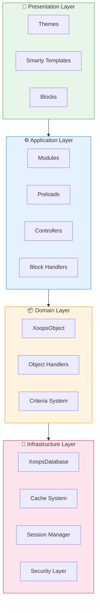
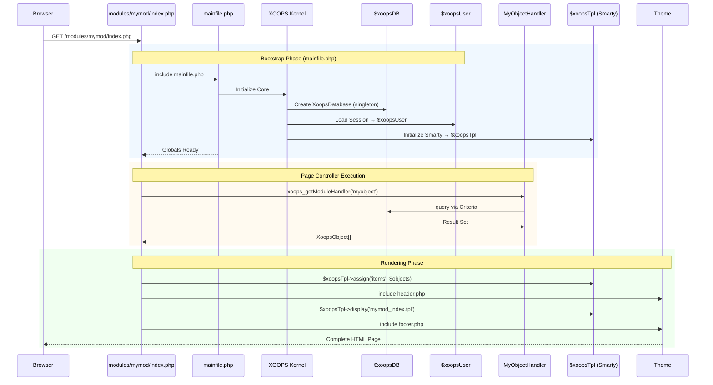

:::note[Giới thiệu về tài liệu này]
Trang này mô tả **kiến trúc khái niệm** của XOOPS áp dụng cho cả phiên bản hiện tại (2.5.x) và tương lai (4.0.x). Một số sơ đồ thể hiện tầm nhìn thiết kế theo lớp.

**Để biết thông tin chi tiết về từng phiên bản:**
- **XOOPS 2.5.x Hôm nay:** Sử dụng `mainfile.php`, toàn cầu (`$xoopsDB`, `$xoopsUser`), tải trước và mẫu trình xử lý
- **XOOPS 4.0 Mục tiêu:** PSR-15 phần mềm trung gian, bộ chứa DI, bộ định tuyến - xem [Lộ trình](../../07-XOOPS-4.0/XOOPS-4.0-Roadmap.md)
:::

Tài liệu này cung cấp cái nhìn tổng quan toàn diện về kiến trúc hệ thống XOOPS, giải thích cách các thành phần khác nhau phối hợp với nhau để tạo ra một hệ thống quản lý nội dung linh hoạt và có thể mở rộng.

## Tổng quan

XOOPS tuân theo kiến trúc mô-đun phân chia các mối quan tâm thành các lớp riêng biệt. Hệ thống được xây dựng xung quanh một số nguyên tắc cốt lõi:

- **Tính mô-đun**: Chức năng được tổ chức thành modules độc lập, có thể cài đặt
- **Khả năng mở rộng**: Hệ thống có thể được mở rộng mà không cần sửa đổi mã lõi
- **Tóm tắt**: Cơ sở dữ liệu và các lớp trình bày được trừu tượng hóa khỏi logic nghiệp vụ
- **Bảo mật**: Cơ chế bảo mật tích hợp bảo vệ khỏi các lỗ hổng phổ biến

## Lớp hệ thống



### 1. Lớp trình bày

Lớp trình bày xử lý việc hiển thị giao diện người dùng bằng cách sử dụng công cụ mẫu Smarty.

**Thành phần chính:**
- **Chủ đề**: Kiểu dáng và bố cục trực quan
- **Mẫu Smarty**: Hiển thị nội dung động
- **Khối**: Các tiện ích nội dung có thể tái sử dụng

### 2. Lớp ứng dụng

Lớp ứng dụng chứa logic nghiệp vụ, bộ điều khiển và chức năng mô-đun.

**Thành phần chính:**
- **Mô-đun**: Gói chức năng độc lập
- **Trình xử lý**: Thao tác dữ liệu classes
- **Tải trước**: Trình nghe và hook sự kiện

### 3. Lớp miền

Lớp miền chứa các đối tượng và quy tắc kinh doanh cốt lõi.

**Thành phần chính:**
- **XoopsObject**: class cơ sở cho tất cả các đối tượng miền
- **Trình xử lý**: Hoạt động CRUD cho đối tượng miền

### 4. Lớp cơ sở hạ tầng

Lớp cơ sở hạ tầng cung cấp các dịch vụ cốt lõi như truy cập cơ sở dữ liệu và bộ nhớ đệm.

## Vòng đời yêu cầu

Hiểu vòng đời yêu cầu là rất quan trọng để phát triển XOOPS hiệu quả.

### Luồng điều khiển trang XOOPS 2.5.x

XOOPS 2.5.x hiện tại sử dụng mẫu **Trình điều khiển trang** trong đó mỗi tệp PHP xử lý yêu cầu riêng của nó. Globals (`$xoopsDB`, `$xoopsUser`, `$xoopsTpl`, v.v.) được khởi tạo trong quá trình khởi động và có sẵn trong suốt quá trình thực thi.



### Các quả cầu chính trong 2.5.x

| Toàn cầu | Loại | Đã khởi tạo | Mục đích |
|--------|------|-------------|--------|
| `$xoopsDB` | `XoopsDatabase` | Khởi động | Kết nối cơ sở dữ liệu (singleton) |
| `$xoopsUser` | `XoopsUser\|null` | Tải phiên | Người dùng đã đăng nhập hiện tại |
| `$xoopsTpl` | `XoopsTpl` | Mẫu khởi tạo | Công cụ tạo mẫu Smarty |
| `$xoopsModule` | `XoopsModule` | Tải mô-đun | Bối cảnh mô-đun hiện tại |
| `$xoopsConfig` | `array` | Tải cấu hình | Cấu hình hệ thống |:::lưu ý[So sánh XOOPS 4.0]
Trong XOOPS 4.0, mẫu Bộ điều khiển trang được thay thế bằng **PSR-15 Middleware Pipeline** và điều phối dựa trên bộ định tuyến. Toàn cầu được thay thế bằng nội xạ phụ thuộc. Xem [Hợp đồng chế độ kết hợp](../../07-XOOPS-4.0/Specifications/Hybrid-Mode-Contract.md) để biết đảm bảo tính tương thích trong quá trình di chuyển.
:::

### 1. Giai đoạn khởi động

```php
// mainfile.php is the entry point
include_once XOOPS_ROOT_PATH . '/mainfile.php';

// Core initialization
$xoops = Xoops::getInstance();
$xoops->boot();
```

**Các bước:**
1. Cấu hình tải (`mainfile.php`)
2. Khởi tạo trình tải tự động
3. Thiết lập xử lý lỗi
4. Thiết lập kết nối cơ sở dữ liệu
5. Tải phiên người dùng
6. Khởi tạo công cụ mẫu Smarty

### 2. Giai đoạn định tuyến

```php
// Request routing to appropriate module
$module = $GLOBALS['xoopsModule'];
$controller = $module->getController();
$controller->dispatch($request);
```

**Các bước:**
1. Yêu cầu phân tích cú pháp URL
2. Xác định module mục tiêu
3. Tải cấu hình mô-đun
4. Kiểm tra quyền
5. Hướng đến người xử lý thích hợp

### 3. Giai đoạn thực hiện

```php
// Controller execution
$data = $handler->getObjects($criteria);
$xoopsTpl->assign('items', $data);
```

**Các bước:**
1. Thực thi logic điều khiển
2. Tương tác với lớp dữ liệu
3. Xử lý quy tắc kinh doanh
4. Chuẩn bị dữ liệu xem

### 4. Giai đoạn kết xuất

```php
// Template rendering
include XOOPS_ROOT_PATH . '/header.php';
$xoopsTpl->display('db:module_template.tpl');
include XOOPS_ROOT_PATH . '/footer.php';
```

**Các bước:**
1. Áp dụng bố cục chủ đề
2. Kết xuất mẫu mô-đun
3. Khối xử lý
4. Phản hồi đầu ra

## Thành phần cốt lõi

### XoopsObject

class cơ sở cho tất cả các đối tượng dữ liệu trong XOOPS.

```php
<?php
class MyModuleItem extends XoopsObject
{
    public function __construct()
    {
        $this->initVar('id', XOBJ_DTYPE_INT, null, false);
        $this->initVar('title', XOBJ_DTYPE_TXTBOX, '', true, 255);
        $this->initVar('content', XOBJ_DTYPE_TXTAREA, '', false);
        $this->initVar('created', XOBJ_DTYPE_INT, time(), false);
    }
}
```

**Các phương pháp chính:**
- `initVar()` - Xác định thuộc tính đối tượng
- `getVar()` - Truy xuất giá trị thuộc tính
- `setVar()` - Đặt giá trị thuộc tính
- `assignVars()` - Gán hàng loạt từ mảng

### XoopsPersistableObjectHandler

Xử lý các hoạt động CRUD cho các phiên bản XoopsObject.

```php
<?php
class MyModuleItemHandler extends XoopsPersistableObjectHandler
{
    public function __construct(\XoopsDatabase $db)
    {
        parent::__construct($db, 'mymodule_items', 'MyModuleItem', 'id', 'title');
    }

    public function getActiveItems($limit = 10)
    {
        $criteria = new CriteriaCompo();
        $criteria->add(new Criteria('status', 1));
        $criteria->setSort('created');
        $criteria->setOrder('DESC');
        $criteria->setLimit($limit);

        return $this->getObjects($criteria);
    }
}
```

**Các phương pháp chính:**
- `create()` - Tạo đối tượng mới
- `get()` - Truy xuất đối tượng theo ID
- `insert()` - Lưu đối tượng vào cơ sở dữ liệu
- `delete()` - Xóa đối tượng khỏi cơ sở dữ liệu
- `getObjects()` - Truy xuất nhiều đối tượng
- `getCount()` - Đếm các đối tượng phù hợp

### Cấu trúc mô-đun

Mỗi mô-đun XOOPS đều tuân theo cấu trúc thư mục chuẩn:

```
modules/mymodule/
├── class/                  # PHP classes
│   ├── MyModuleItem.php
│   └── MyModuleItemHandler.php
├── include/                # Include files
│   ├── common.php
│   └── functions.php
├── templates/              # Smarty templates
│   ├── mymodule_index.tpl
│   └── mymodule_item.tpl
├── admin/                  # Admin area
│   ├── index.php
│   └── menu.php
├── language/               # Translations
│   └── english/
│       ├── main.php
│       └── modinfo.php
├── sql/                    # Database schema
│   └── mysql.sql
├── xoops_version.php       # Module info
├── index.php               # Module entry
└── header.php              # Module header
```

## Vùng chứa phụ thuộc

Sự phát triển XOOPS hiện đại có thể tận dụng tính năng chèn phụ thuộc để có khả năng kiểm tra tốt hơn.

### Triển khai vùng chứa cơ bản

```php
<?php
class XoopsDependencyContainer
{
    private array $services = [];

    public function register(string $name, callable $factory): void
    {
        $this->services[$name] = $factory;
    }

    public function resolve(string $name): mixed
    {
        if (!isset($this->services[$name])) {
            throw new \InvalidArgumentException("Service not found: $name");
        }

        $factory = $this->services[$name];

        if (is_callable($factory)) {
            return $factory($this);
        }

        return $factory;
    }

    public function has(string $name): bool
    {
        return isset($this->services[$name]);
    }
}
```

### Thùng chứa tương thích PSR-11

```php
<?php
namespace Xmf\Di;

use Psr\Container\ContainerInterface;

class BasicContainer implements ContainerInterface
{
    protected array $definitions = [];

    public function set(string $id, mixed $value): void
    {
        $this->definitions[$id] = $value;
    }

    public function get(string $id): mixed
    {
        if (!$this->has($id)) {
            throw new \InvalidArgumentException("Service not found: $id");
        }

        $entry = $this->definitions[$id];

        if (is_callable($entry)) {
            return $entry($this);
        }

        return $entry;
    }

    public function has(string $id): bool
    {
        return isset($this->definitions[$id]);
    }
}
```

### Ví dụ sử dụng

```php
<?php
// Service registration
$container = new XoopsDependencyContainer();

$container->register('database', function () {
    return XoopsDatabaseFactory::getDatabaseConnection();
});

$container->register('userHandler', function ($c) {
    return new XoopsUserHandler($c->resolve('database'));
});

// Service resolution
$userHandler = $container->resolve('userHandler');
$user = $userHandler->get($userId);
```

## Điểm mở rộng

XOOPS cung cấp một số cơ chế mở rộng:

### 1. Tải trước

Tải trước cho phép modules tham gia vào các sự kiện cốt lõi.

```php
<?php
// modules/mymodule/preloads/core.php
class MymoduleCorePreload extends XoopsPreloadItem
{
    public static function eventCoreHeaderEnd($args)
    {
        // Execute when header processing ends
    }

    public static function eventCoreFooterStart($args)
    {
        // Execute when footer processing starts
    }
}
```

### 2. Plugin

Các plugin mở rộng chức năng cụ thể trong modules.

```php
<?php
// modules/mymodule/plugins/notify.php
class MymoduleNotifyPlugin
{
    public function onItemCreate($item)
    {
        // Send notification when item is created
    }
}
```

### 3. Bộ lọc

Bộ lọc sửa đổi dữ liệu khi nó đi qua hệ thống.

```php
<?php
// Content filter example
$myts = MyTextSanitizer::getInstance();
$content = $myts->displayTarea($rawContent, 1, 1, 1);
```

## Các phương pháp hay nhất

### Tổ chức mã

1. **Sử dụng không gian tên** cho mã mới:
   
```php
   namespace XoopsModules\MyModule;

   class Item extends \XoopsObject
   {
       // Implementation
   }
   
```

2. **Theo dõi quá trình tự động tải PSR-4**:
   
```json
   {
       "autoload": {
           "psr-4": {
               "XoopsModules\\MyModule\\": "class/"
           }
       }
   }
   
```

3. **Các mối quan tâm riêng**:
   - Logic miền trong `class/`
   - Trình bày trong `templates/`
   - Bộ điều khiển trong mô-đun gốc

### Hiệu suất

1. **Sử dụng bộ nhớ đệm** cho các hoạt động tốn kém
2. **Tải lười biếng** tài nguyên khi có thể
3. **Giảm thiểu các truy vấn cơ sở dữ liệu** bằng cách sử dụng nhóm tiêu chí
4. **Tối ưu hóa templates** bằng cách tránh logic phức tạp

### Bảo mật1. **Xác thực tất cả đầu vào** bằng `Xmf\Request`
2. **Đầu ra thoát** trong templates
3. **Sử dụng các câu lệnh đã chuẩn bị sẵn** cho các truy vấn cơ sở dữ liệu
4. **Kiểm tra quyền** trước các thao tác nhạy cảm

## Tài liệu liên quan

- [Các mẫu thiết kế](Design-Patterns.md) - Các mẫu thiết kế được sử dụng trong XOOPS
- [Lớp cơ sở dữ liệu](../Database/Database-Layer.md) - Chi tiết trừu tượng hóa cơ sở dữ liệu
- [Smarty Thông tin cơ bản](../Templates/Smarty-Basics.md) - Tài liệu hệ thống mẫu
- [Các phương pháp bảo mật tốt nhất](../Security/Security-Best-Practices.md) - Nguyên tắc bảo mật

---

#xoops #architecture #core #design #system-design