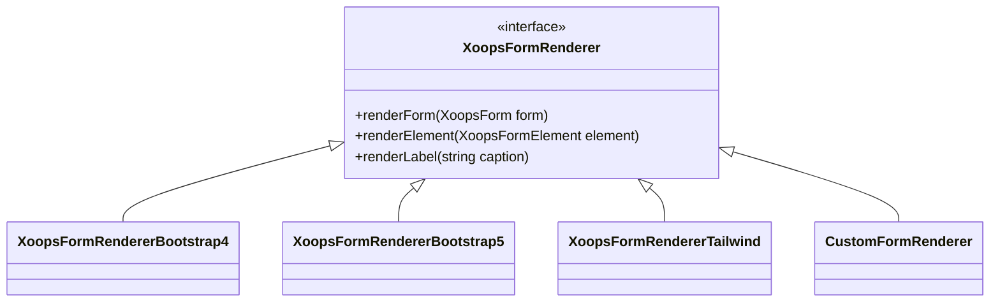

## Tổng quan

XOOPS cho phép tùy chỉnh hiển thị biểu mẫu thông qua trình kết xuất tùy chỉnh. Điều này cho phép tạo kiểu theo chủ đề cụ thể, cải thiện khả năng truy cập và tích hợp với các khung giao diện người dùng như Bootstrap hoặc Tailwind CSS.

## Hiển thị mặc định

Theo mặc định, các biểu mẫu XOOPS sử dụng `XoopsFormRenderer` class tạo ra HTML cơ bản:

```php
// Default rendering
$form = new XoopsThemeForm('My Form', 'myform', 'submit.php');
$form->addElement(new XoopsFormText('Name', 'name', 50, 255));
echo $form->render();
```

## Kiến trúc trình kết xuất tùy chỉnh



## Tạo Trình kết xuất tùy chỉnh

### Lớp trình kết xuất cơ bản

```php
namespace Xoops\Modules\MyModule\Form;

use XoopsFormRenderer;
use XoopsForm;
use XoopsFormElement;

class BootstrapRenderer extends XoopsFormRenderer
{
    public function renderFormStart(XoopsForm $form): string
    {
        $class = $form->getExtra() ?: 'needs-validation';
        return sprintf(
            '<form name="%s" id="%s" action="%s" method="%s" class="%s" %s>',
            $form->getName(),
            $form->getName(),
            $form->getAction(),
            $form->getMethod(),
            $class,
            $form->getExtra()
        );
    }

    public function renderFormEnd(): string
    {
        return '</form>';
    }

    public function renderElement(XoopsFormElement $element): string
    {
        $output = '<div class="mb-3">';

        // Label
        if ($element->getCaption()) {
            $output .= sprintf(
                '<label for="%s" class="form-label">%s</label>',
                $element->getName(),
                $element->getCaption()
            );
        }

        // Element with Bootstrap classes
        $element->setExtra($element->getExtra() . ' class="form-control"');
        $output .= $element->render();

        // Description
        if ($element->getDescription()) {
            $output .= sprintf(
                '<div class="form-text">%s</div>',
                $element->getDescription()
            );
        }

        $output .= '</div>';

        return $output;
    }

    public function renderButton(XoopsFormElement $button): string
    {
        $type = $button->getType() === 'submit' ? 'btn-primary' : 'btn-secondary';
        return sprintf(
            '<button type="%s" name="%s" class="btn %s">%s</button>',
            $button->getType(),
            $button->getName(),
            $type,
            $button->getValue()
        );
    }
}
```

### Đăng ký Trình kết xuất

```php
// In your module's xoops_version.php or bootstrap
$GLOBALS['xoopsOption']['form_renderer'] = new BootstrapRenderer();

// Or set it per-form
$form = new XoopsThemeForm('My Form', 'myform', 'submit.php');
$form->setRenderer(new BootstrapRenderer());
```

## Trình kết xuất tích hợp

### Trình kết xuất Bootstrap 4

```php
use Xoops\Form\Renderer\Bootstrap4Renderer;

$form->setRenderer(new Bootstrap4Renderer());
```

### Trình kết xuất Bootstrap 5

```php
use Xoops\Form\Renderer\Bootstrap5Renderer;

$form->setRenderer(new Bootstrap5Renderer([
    'floating_labels' => true,
    'validation_style' => 'tooltip'
]));
```

## Hiển thị các phần tử cụ thể

### Trình kết xuất chọn tùy chỉnh

```php
public function renderSelect(XoopsFormSelect $select): string
{
    $multiple = $select->isMultiple() ? 'multiple' : '';
    $size = $select->getSize();

    $output = sprintf(
        '<select name="%s%s" id="%s" class="form-select" %s size="%d">',
        $select->getName(),
        $multiple ? '[]' : '',
        $select->getName(),
        $multiple,
        $size
    );

    foreach ($select->getOptions() as $value => $label) {
        $selected = in_array($value, (array)$select->getValue()) ? 'selected' : '';
        $output .= sprintf(
            '<option value="%s" %s>%s</option>',
            htmlspecialchars($value),
            $selected,
            htmlspecialchars($label)
        );
    }

    $output .= '</select>';

    return $output;
}
```

### Trình kết xuất đầu vào tệp tùy chỉnh

```php
public function renderFile(XoopsFormFile $file): string
{
    return sprintf(
        '<div class="mb-3">
            <label for="%s" class="form-label">%s</label>
            <input type="file" class="form-control" id="%s" name="%s" %s>
        </div>',
        $file->getName(),
        $file->getCaption(),
        $file->getName(),
        $file->getName(),
        $file->getExtra()
    );
}
```

## Tích hợp chủ đề

### Trong mẫu chủ đề

```smarty
{* In theme's form.tpl *}
{foreach $form.elements as $element}
    <div class="form-group {$element.class}">
        {if $element.caption}
            <label class="control-label">{$element.caption}</label>
        {/if}
        {$element.body}
        {if $element.description}
            <span class="help-block">{$element.description}</span>
        {/if}
    </div>
{/foreach}
```

## Các phương pháp hay nhất

1. **Kế thừa từ trình kết xuất cơ sở** - Mở rộng `XoopsFormRenderer` để đảm bảo tính nhất quán
2. **Hỗ trợ tất cả các loại phần tử** - Xử lý văn bản, chọn, hộp kiểm, radio, v.v.
3. **Khả năng truy cập** - Bao gồm các nhãn thích hợp, thuộc tính ARIA
4. **Các kiểu xác thực** - Hiển thị trạng thái lỗi một cách thích hợp
5. **Thiết kế đáp ứng** - Đảm bảo biểu mẫu hoạt động trên thiết bị di động

## Tài liệu liên quan

- Tổng quan về biểu mẫu
- Tham khảo các phần tử biểu mẫu
- Xác thực mẫu
- Phát triển chủ đề