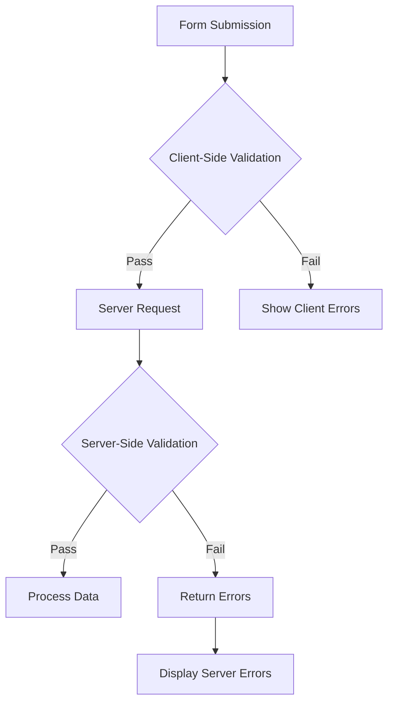

## Tổng quan

XOOPS cung cấp cả xác thực phía máy khách và phía máy chủ cho đầu vào biểu mẫu. Hướng dẫn này bao gồm các kỹ thuật xác thực, trình xác thực tích hợp và cách triển khai xác thực tùy chỉnh.

## Kiến trúc xác thực



## Xác thực phía máy chủ

### Sử dụng XoopsFormValidator

```php
use Xoops\Core\Form\Validator;

$validator = new Validator();

$validator->addRule('username', 'required', 'Username is required');
$validator->addRule('username', 'minLength:3', 'Username must be at least 3 characters');
$validator->addRule('username', 'maxLength:50', 'Username cannot exceed 50 characters');
$validator->addRule('email', 'email', 'Please enter a valid email address');
$validator->addRule('password', 'minLength:8', 'Password must be at least 8 characters');

if (!$validator->validate($_POST)) {
    $errors = $validator->getErrors();
    // Handle errors
}
```

### Quy tắc xác thực tích hợp

| Quy tắc | Mô tả | Ví dụ |
|------|-------------|----------|
| `required` | Trường không được để trống | `required` |
| `email` | Định dạng email hợp lệ | `email` |
| `url` | Định dạng URL hợp lệ | `url` |
| `numeric` | Chỉ giá trị số | `numeric` |
| `integer` | Chỉ giá trị số nguyên | `integer` |
| `minLength` | Độ dài chuỗi tối thiểu | `minLength:3` |
| `maxLength` | Độ dài chuỗi tối đa | `maxLength:100` |
| `min` | Giá trị số tối thiểu | `min:1` |
| `max` | Giá trị số tối đa | `max:100` |
| `regex` | Mẫu biểu thức chính quy tùy chỉnh | `regex:/^[a-z]+$/` |
| `in` | Giá trị trong danh sách | `in:draft,published,archived` |
| `date` | Định dạng ngày hợp lệ | `date` |
| `alpha` | Chỉ chữ cái | `alpha` |
| `alphanumeric` | Chữ và số | `alphanumeric` |

### Quy tắc xác thực tùy chỉnh

```php
$validator->addCustomRule('unique_username', function($value) {
    $memberHandler = xoops_getHandler('member');
    $criteria = new \CriteriaCompo();
    $criteria->add(new \Criteria('uname', $value));
    return $memberHandler->getUserCount($criteria) === 0;
}, 'Username already exists');

$validator->addRule('username', 'unique_username');
```

## Yêu cầu xác thực

### Đầu vào vệ sinh

```php
use Xoops\Core\Request;

// Get sanitized values
$username = Request::getString('username', '', 'POST');
$email = Request::getEmail('email', '', 'POST');
$age = Request::getInt('age', 0, 'POST');
$price = Request::getFloat('price', 0.0, 'POST');
$tags = Request::getArray('tags', [], 'POST');

// With validation
$username = Request::getString('username', '', 'POST', [
    'minLength' => 3,
    'maxLength' => 50
]);
```

### Phòng chống XSS

```php
use Xoops\Core\Text\Sanitizer;

$sanitizer = Sanitizer::getInstance();

// Sanitize HTML content
$cleanContent = $sanitizer->sanitizeForDisplay($userContent);

// Strip all HTML
$plainText = $sanitizer->stripHtml($userContent);

// Allow specific tags
$content = $sanitizer->sanitizeForDisplay($userContent, [
    'allowedTags' => '<p><br><strong><em><a>'
]);
```

## Xác thực phía máy khách

### Thuộc tính xác thực HTML5

```php
// Required field
$element->setExtra('required');

// Pattern validation
$element->setExtra('pattern="[a-zA-Z0-9]+" title="Alphanumeric only"');

// Length constraints
$element->setExtra('minlength="3" maxlength="50"');

// Numeric constraints
$element->setExtra('min="1" max="100"');
```

### Xác thực JavaScript

```javascript
document.getElementById('myForm').addEventListener('submit', function(e) {
    const username = document.getElementById('username').value;
    const errors = [];

    if (username.length < 3) {
        errors.push('Username must be at least 3 characters');
    }

    if (!/^[a-zA-Z0-9_]+$/.test(username)) {
        errors.push('Username can only contain letters, numbers, and underscores');
    }

    if (errors.length > 0) {
        e.preventDefault();
        displayErrors(errors);
    }
});
```

## Bảo vệ CSRF

### Tạo mã thông báo

```php
// Generate token in form
$form->addElement(new \XoopsFormHiddenToken());

// This adds a hidden field with security token
```

### Xác minh mã thông báo

```php
use Xoops\Core\Security;

if (!Security::checkReferer()) {
    die('Invalid request origin');
}

if (!Security::checkToken()) {
    die('Invalid security token');
}
```

## Xác thực tải lên tệp

```php
use Xoops\Core\Uploader;

$uploader = new Uploader(
    uploadDir: XOOPS_UPLOAD_PATH . '/images/',
    allowedMimeTypes: ['image/jpeg', 'image/png', 'image/gif'],
    maxFileSize: 2 * 1024 * 1024, // 2MB
    maxWidth: 1920,
    maxHeight: 1080
);

if ($uploader->fetchMedia('image_upload')) {
    if ($uploader->upload()) {
        $savedFile = $uploader->getSavedFileName();
    } else {
        $errors[] = $uploader->getErrors();
    }
}
```

## Hiển thị lỗi

### Thu thập lỗi

```php
$errors = [];

if (empty($username)) {
    $errors['username'] = 'Username is required';
}

if (!filter_var($email, FILTER_VALIDATE_EMAIL)) {
    $errors['email'] = 'Invalid email format';
}

if (!empty($errors)) {
    // Store in session for display after redirect
    $_SESSION['form_errors'] = $errors;
    $_SESSION['form_data'] = $_POST;
    header('Location: ' . $_SERVER['HTTP_REFERER']);
    exit;
}
```

### Hiển thị lỗi

```smarty
{if $errors}
<div class="alert alert-danger">
    <ul>
        {foreach $errors as $field => $message}
        <li>{$message}</li>
        {/foreach}
    </ul>
</div>
{/if}
```

## Các phương pháp hay nhất

1. **Luôn xác thực phía máy chủ** - Có thể bỏ qua xác thực phía máy khách
2. **Sử dụng các truy vấn được tham số hóa** - Ngăn chặn việc tiêm SQL
3. **Vệ sinh đầu ra** - Ngăn chặn các cuộc tấn công XSS
4. **Xác thực tệp uploads** - Kiểm tra loại và kích thước MIME
5. **Sử dụng mã thông báo CSRF** - Ngăn chặn giả mạo yêu cầu trên nhiều trang web
6. **Gửi giới hạn tỷ lệ** - Ngăn chặn lạm dụng

## Tài liệu liên quan

- Tham khảo các phần tử biểu mẫu
- Tổng quan về biểu mẫu
- Thực tiễn tốt nhất về bảo mật