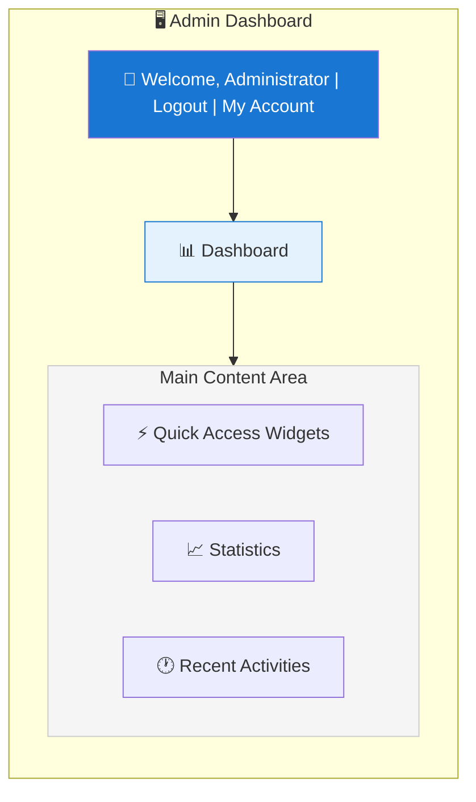
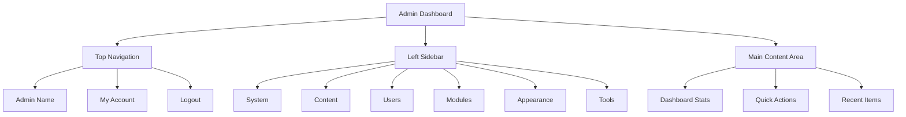

Tổng quan về bảng quản trị #XOOPS

Hướng dẫn đầy đủ về cách điều hướng và sử dụng bảng điều khiển XOOPS administrator.

## Truy cập Bảng quản trị

### Đăng nhập quản trị viên

Mở trình duyệt của bạn và điều hướng đến:

```
http://your-domain.com/xoops/admin/
```

Hoặc nếu XOOPS ở chế độ root:

```
http://your-domain.com/admin/
```

Nhập thông tin xác thực administrator của bạn:

```
Username: [Your admin username]
Password: [Your admin password]
```

### Sau khi đăng nhập

Bạn sẽ thấy bảng điều khiển admin chính:



## Bố cục bảng quản trị



## Thành phần bảng điều khiển

### Thanh trên cùng

Thanh trên cùng chứa các điều khiển cần thiết:

| Yếu tố | Mục đích |
|---|---|
| **Biểu tượng quản trị** | Nhấp để quay lại bảng điều khiển |
| **Tin nhắn chào mừng** | Hiển thị tên admin đã đăng nhập |
| **Tài khoản của tôi** | Chỉnh sửa hồ sơ và mật khẩu admin |
| **Trợ giúp** | Truy cập tài liệu |
| **Đăng xuất** | Đăng xuất khỏi bảng admin |

### Thanh bên điều hướng bên trái

Menu chính được sắp xếp theo chức năng:

```
├── System
│   ├── Dashboard
│   ├── Preferences
│   ├── Admin Users
│   ├── Groups
│   ├── Permissions
│   ├── Modules
│   └── Tools
├── Content
│   ├── Pages
│   ├── Categories
│   ├── Comments
│   └── Media Manager
├── Users
│   ├── Users
│   ├── User Requests
│   ├── Online Users
│   └── User Groups
├── Modules
│   ├── Modules
│   ├── Module Settings
│   └── Module Updates
├── Appearance
│   ├── Themes
│   ├── Templates
│   ├── Blocks
│   └── Images
└── Tools
    ├── Maintenance
    ├── Email
    ├── Statistics
    ├── Logs
    └── Backups
```

### Khu vực nội dung chính

Hiển thị thông tin và điều khiển cho phần đã chọn:

- Các biểu mẫu cấu hình
- Bảng dữ liệu với danh sách
- Biểu đồ và thống kê
- Nút hành động nhanh
- Văn bản trợ giúp và chú giải công cụ

### Tiện ích bảng điều khiển

Truy cập nhanh vào thông tin quan trọng:

- **Thông tin hệ thống:** Phiên bản PHP, phiên bản MySQL, phiên bản XOOPS
- **Thống kê nhanh:** Số người dùng, tổng số bài đăng, modules đã cài đặt
- **Hoạt động gần đây:** Lần đăng nhập mới nhất, thay đổi nội dung, lỗi
- **Trạng thái máy chủ:** Mức sử dụng CPU, bộ nhớ, ổ đĩa
- **Thông báo:** Cảnh báo hệ thống, cập nhật đang chờ xử lý

## Chức năng quản trị cốt lõi

### Quản lý hệ thống

**Vị trí:** Hệ thống > [Tùy chọn khác nhau]

#### Sở thích

Định cấu hình cài đặt hệ thống cơ bản:

```
System > Preferences > [Settings Category]
```

Thể loại:
- Cài đặt chung (tên trang web, múi giờ)
- Cài đặt người dùng (đăng ký, hồ sơ)
- Cài đặt Email (cấu hình SMTP)
- Cài đặt bộ đệm (tùy chọn bộ đệm)
- Cài đặt URL (URL thân thiện)
- Thẻ Meta (cài đặt SEO)

Xem Cấu hình cơ bản và cài đặt hệ thống.

#### Người dùng quản trị

Quản lý tài khoản administrator:

```
System > Admin Users
```

Chức năng:
- Thêm administrators mới
- Chỉnh sửa hồ sơ admin
- Đổi mật khẩu admin
- Xóa tài khoản admin
- Đặt quyền admin

### Quản lý nội dung

**Vị trí:** Nội dung > [Tùy chọn khác nhau]

#### Trang/Bài viết

Quản lý nội dung trang web:

```
Content > Pages (or your module)
```

Chức năng:
- Tạo trang mới
- Chỉnh sửa nội dung hiện có
- Xóa trang
- Xuất bản/hủy xuất bản
- Đặt danh mục
- Quản lý sửa đổi

#### Danh mục

Tổ chức nội dung:

```
Content > Categories
```

Chức năng:
- Tạo hệ thống phân cấp danh mục
- Chỉnh sửa danh mục
- Xóa danh mục
- Gán vào các trang

#### Bình luận

Kiểm duyệt bình luận của người dùng:

```
Content > Comments
```

Chức năng:
- Xem tất cả các ý kiến
- Phê duyệt ý kiến
- Chỉnh sửa bình luận
- Xóa thư rác
- Chặn người bình luận

### Quản lý người dùng

**Vị trí:** Người dùng > [Tùy chọn khác nhau]

#### Người dùng

Quản lý tài khoản người dùng:

```
Users > Users
```

Chức năng:
- Xem tất cả người dùng
- Tạo người dùng mới
- Chỉnh sửa hồ sơ người dùng
- Xóa tài khoản
- Đặt lại mật khẩu
- Thay đổi trạng thái người dùng
- Phân công cho các nhóm

#### Người dùng trực tuyến

Giám sát người dùng đang hoạt động:

```
Users > Online Users
```

Chương trình:
- Hiện đang là người dùng trực tuyến
- Thời gian hoạt động cuối cùng
- Địa chỉ IP
- Vị trí người dùng (nếu được cấu hình)

#### Nhóm người dùng

Quản lý vai trò và quyền của người dùng:

```
Users > Groups
```Chức năng:
- Tạo nhóm tùy chỉnh
- Đặt quyền nhóm
- Gán người dùng vào nhóm
- Xóa nhóm

### Quản lý mô-đun

**Vị trí:** Mô-đun > [Tùy chọn khác nhau]

#### Mô-đun

Cài đặt và cấu hình modules:

```
Modules > Modules
```

Chức năng:
- Xem modules đã cài đặt
- Bật/tắt modules
- Cập nhật modules
- Cấu hình cài đặt mô-đun
- Cài đặt mới modules
- Xem chi tiết mô-đun

#### Kiểm tra cập nhật

```
Modules > Modules > Check for Updates
```

Hiển thị:
- Cập nhật mô-đun có sẵn
- Nhật ký thay đổi
- Tùy chọn tải xuống và cài đặt

### Quản lý ngoại hình

**Vị trí:** Ngoại hình > [Tùy chọn khác nhau]

#### Chủ đề

Quản lý trang themes:

```
Appearance > Themes
```

Chức năng:
- Xem themes đã cài đặt
- Đặt chủ đề mặc định
- Tải lên themes mới
- Xóa themes
- Xem trước chủ đề
- Cấu hình chủ đề

#### Khối

Quản lý khối nội dung:

```
Appearance > Blocks
```

Chức năng:
- Tạo khối tùy chỉnh
- Chỉnh sửa nội dung khối
- Sắp xếp các khối trên trang
- Đặt mức độ hiển thị khối
- Xóa khối
- Cấu hình bộ nhớ đệm khối

#### Mẫu

Quản lý templates (nâng cao):

```
Appearance > Templates
```

Dành cho người dùng và nhà phát triển nâng cao.

### Công cụ hệ thống

**Vị trí:** Hệ thống > Công cụ

#### Chế độ bảo trì

Ngăn chặn quyền truy cập của người dùng trong quá trình bảo trì:

```
System > Maintenance Mode
```

Cấu hình:
- Bật/tắt bảo trì
- Thông báo bảo trì tùy chỉnh
- Địa chỉ IP được phép (để thử nghiệm)

#### Quản lý cơ sở dữ liệu

```
System > Database
```

Chức năng:
- Kiểm tra tính nhất quán của cơ sở dữ liệu
- Chạy cập nhật cơ sở dữ liệu
- Sửa chữa bàn
- Tối ưu hóa cơ sở dữ liệu
- Xuất cấu trúc cơ sở dữ liệu

#### Nhật ký hoạt động

```
System > Logs
```

Màn hình:
- Hoạt động của người dùng
- Hành động hành chính
- Sự kiện hệ thống
- Nhật ký lỗi

## Thao tác nhanh

Các tác vụ phổ biến có thể truy cập từ bảng điều khiển:

```
Quick Links:
├── Create New Page
├── Add New User
├── Create Content Block
├── Upload Image
├── Send Mass Email
├── Update All Modules
└── Clear Cache
```

## Phím tắt bảng quản trị

Điều hướng nhanh:

| Phím tắt | Hành động |
|---|---|
| `Ctrl+H` | Tới giúp đỡ |
| `Ctrl+D` | Chuyển đến bảng điều khiển |
| `Ctrl+Q` | Tìm kiếm nhanh |
| `Ctrl+L` | Đăng xuất |

## Quản lý tài khoản người dùng

### Tài khoản của tôi

Truy cập hồ sơ administrator của bạn:

1. Nhấp vào "Tài khoản của tôi" ở trên cùng bên phải
2. Chỉnh sửa thông tin hồ sơ:
   - Địa chỉ email
   - Tên thật
   - Thông tin người dùng
   - Hình đại diện

### Đổi mật khẩu

Thay đổi mật khẩu admin của bạn:

1. Đi tới **Tài khoản của tôi**
2. Nhấp vào "Đổi mật khẩu"
3. Nhập mật khẩu hiện tại
4. Nhập mật khẩu mới (hai lần)
5. Nhấp vào "Lưu"

**Mẹo bảo mật:**
- Sử dụng mật khẩu mạnh (16+ ký tự)
- Bao gồm chữ hoa, chữ thường, số, ký hiệu
- Đổi mật khẩu 90 ngày một lần
- Không bao giờ chia sẻ thông tin đăng nhập admin

### Đăng xuất

Đăng xuất khỏi bảng admin:

1. Nhấp vào "Đăng xuất" ở trên cùng bên phải
2. Bạn sẽ được chuyển hướng đến trang đăng nhập

## Thống kê của bảng quản trị

### Thống kê bảng điều khiển

Tổng quan nhanh về số liệu trang web:

| Số liệu | Giá trị |
|--------|-------|
| Người dùng trực tuyến | 12 |
| Tổng số người dùng | 256 |
| Tổng số bài viết | 1.234 |
| Tổng số ý kiến ​​| 5.678 |
| Tổng số mô-đun | 8 |

### Trạng thái hệ thống

Thông tin máy chủ và hiệu suất:

| Thành phần | Phiên bản/Giá trị |
|---|---|
| Phiên bản XOOPS | 2.5.11 |
| Phiên bản PHP | 8.2.x |
| Phiên bản MySQL | 8.0.x |
| Tải máy chủ | 0,45, 0,42 |
| Thời gian hoạt động | 45 ngày |

### Hoạt động gần đây

Dòng thời gian của các sự kiện gần đây:

```
12:45 - Admin login
12:30 - New user registered
12:15 - Page published
12:00 - Comment posted
11:45 - Module updated
```

## Hệ thống thông báo### Cảnh báo của quản trị viên

Nhận thông báo cho:

- Đăng ký người dùng mới
- Bình luận đang chờ kiểm duyệt
- Số lần đăng nhập không thành công
- Lỗi hệ thống
- Cập nhật mô-đun có sẵn
- Vấn đề về cơ sở dữ liệu
- Cảnh báo dung lượng ổ đĩa

Cấu hình cảnh báo:

**Hệ thống > Tùy chọn > Cài đặt email**

```
Notify Admin on Registration: Yes
Notify Admin on Comments: Yes
Notify Admin on Errors: Yes
Alert Email: admin@your-domain.com
```

## Nhiệm vụ quản trị chung

### Tạo một trang mới

1. Đi tới **Nội dung > Trang** (hoặc mô-đun có liên quan)
2. Nhấp vào "Thêm trang mới"
3. Điền vào:
   - Tiêu đề
   - Nội dung
   - Mô tả
   - Danh mục
   - Siêu dữ liệu
4. Nhấp vào "Xuất bản"

### Quản lý người dùng

1. Đi tới **Người dùng > Người dùng**
2. Xem danh sách người dùng với:
   - Tên người dùng
   - Email
   - Ngày đăng ký
   - Lần đăng nhập cuối cùng
   - Trạng thái

3. Nhấp vào tên người dùng để:
   - Chỉnh sửa hồ sơ
   - Thay đổi mật khẩu
   - Chỉnh sửa nhóm
   - Chặn/bỏ chặn người dùng

### Cấu hình mô-đun

1. Đi tới **Mô-đun > Mô-đun**
2. Tìm mô-đun trong danh sách
3. Nhấp vào tên mô-đun
4. Nhấp vào "Tùy chọn" hoặc "Cài đặt"
5. Cấu hình các tùy chọn mô-đun
6. Lưu thay đổi

### Tạo một khối mới

1. Đi tới **Giao diện > Khối**
2. Nhấp vào "Thêm khối mới"
3. Nhập:
   - Chặn tiêu đề
   - Chặn nội dung (cho phép HTML)
   - Vị trí trên trang
   - Khả năng hiển thị (tất cả các trang hoặc cụ thể)
   - Mô-đun (nếu có)
4. Nhấp vào "Gửi"

## Trợ giúp bảng quản trị

### Tài liệu tích hợp

Truy cập trợ giúp từ bảng admin:

1. Nhấp vào nút "Trợ giúp" ở thanh trên cùng
2. Trợ giúp theo ngữ cảnh cho trang hiện tại
3. Liên kết đến tài liệu
4. Câu hỏi thường gặp

### Tài nguyên bên ngoài

- Trang web chính thức của XOOPS: https://xoops.org/
- Diễn đàn cộng đồng: https://xoops.org/modules/newbb/
- Kho lưu trữ mô-đun: https://xoops.org/modules/repository/
- Lỗi/Sự cố: https://github.com/XOOPS/XoopsCore/issues

## Tùy chỉnh bảng quản trị

### Chủ đề quản trị

Chọn chủ đề giao diện admin:

**Hệ thống > Tùy chọn > Cài đặt chung**

```
Admin Theme: [Select theme]
```

Có sẵn themes:
- Mặc định (sáng)
- Chế độ tối
- themes tùy chỉnh

### Tùy chỉnh bảng điều khiển

Chọn tiện ích nào xuất hiện:

**Bảng điều khiển > Tùy chỉnh**

chọn:
- Thông tin hệ thống
- Thống kê
- Hoạt động gần đây
- Liên kết nhanh
- Tiện ích tùy chỉnh

## Quyền của bảng quản trị

Các cấp admin khác nhau có các quyền khác nhau:

| Vai trò | Khả năng |
|---|---|
| **Quản trị trang web** | Toàn quyền truy cập vào tất cả các chức năng admin |
| **Quản trị viên** | Chức năng admin bị giới hạn |
| **Người điều hành** | Chỉ kiểm duyệt nội dung |
| **Biên tập viên** | Tạo và chỉnh sửa nội dung |

Quản lý quyền:

**Hệ thống > Quyền**

## Các phương pháp bảo mật tốt nhất dành cho Bảng quản trị

1. **Mật khẩu mạnh:** Sử dụng mật khẩu dài hơn 16 ký tự
2. **Thay đổi thường xuyên:** Thay đổi mật khẩu 90 ngày một lần
3. **Giám sát quyền truy cập:** Kiểm tra nhật ký "Người dùng quản trị" thường xuyên
4. **Giới hạn quyền truy cập:** Đổi tên thư mục admin để tăng cường bảo mật
5. **Sử dụng HTTPS:** Luôn truy cập admin qua HTTPS
6. **Danh sách trắng IP:** Hạn chế quyền truy cập admin vào các IP cụ thể
7. **Đăng xuất thường xuyên:** Đăng xuất khi hoàn tất
8. **Bảo mật trình duyệt:** Xóa bộ nhớ đệm của trình duyệt thường xuyên

Xem Cấu hình bảo mật.

## Khắc phục sự cố Bảng quản trị

### Không vào được bảng quản trị

**Giải pháp:**
1. Xác minh thông tin đăng nhập
2. Xóa bộ nhớ cache và cookie của trình duyệt
3. Thử trình duyệt khác
4. Kiểm tra xem đường dẫn thư mục admin có đúng không
5. Xác minh quyền truy cập tệp trên thư mục admin
6. Kiểm tra kết nối cơ sở dữ liệu trong mainfile.php

### Trang quản trị trống

**Giải pháp:**
```bash
# Check PHP errors
tail -f /var/log/apache2/error.log

# Enable debug mode temporarily
sed -i "s/define('XOOPS_DEBUG', 0)/define('XOOPS_DEBUG', 1)/" /var/www/html/xoops/mainfile.php

# Check file permissions
ls -la /var/www/html/xoops/admin/
```### Bảng quản trị chậm

**Giải pháp:**
1. Xóa bộ nhớ đệm: **Hệ thống > Công cụ > Xóa bộ nhớ đệm**
2. Tối ưu hóa cơ sở dữ liệu: **Hệ thống > Cơ sở dữ liệu > Tối ưu hóa**
3. Kiểm tra tài nguyên máy chủ: `htop`
4. Xem lại các truy vấn chậm trong MySQL

### Mô-đun không xuất hiện

**Giải pháp:**
1. Xác minh mô-đun đã được cài đặt: **Mô-đun > Mô-đun**
2. Kiểm tra kích hoạt mô-đun
3. Xác minh quyền được chỉ định
4. Kiểm tra các tập tin mô-đun tồn tại
5. Xem lại nhật ký lỗi

## Các bước tiếp theo

Sau khi làm quen với bảng điều khiển admin:

1. Tạo trang đầu tiên của bạn
2. Thiết lập nhóm người dùng
3. Cài đặt thêm modules
4. Cấu hình các cài đặt cơ bản
5. Triển khai bảo mật

---

**Thẻ:** #admin-panel #dashboard #navigation #getting-started

**Bài viết liên quan:**
- ../Configuration/Cấu hình cơ bản
- ../Cấu hình/Cài đặt hệ thống
- Tạo trang đầu tiên của bạn
- Quản lý-Người dùng
- Cài đặt-Mô-đun