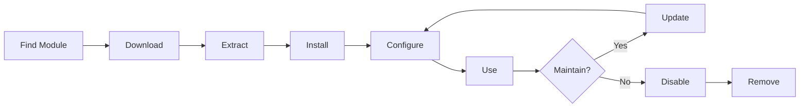

# Cài đặt và quản lý các mô-đun XOOPS

Tìm hiểu cách mở rộng chức năng XOOPS bằng cách cài đặt và định cấu hình modules.

## Tìm hiểu các mô-đun XOOPS

### Mô-đun là gì?

Mô-đun là các tiện ích mở rộng bổ sung chức năng cho XOOPS:

| Loại | Mục đích | Ví dụ |
|---|---|---|
| **Nội dung** | Quản lý các loại nội dung cụ thể | Tin Tức, Blog, Vé |
| **Cộng đồng** | Tương tác người dùng | Diễn đàn, Bình luận, Đánh giá |
| **Thương mại điện tử** | Bán sản phẩm | Mua sắm, Giỏ hàng, Thanh toán |
| **Truyền thông** | Xử lý tập tin/hình ảnh | Thư viện, Tải xuống, Video |
| **Tiện ích** | Công cụ và trợ giúp | Email, Sao lưu, Phân tích |

### Mô-đun lõi và mô-đun tùy chọn

| Mô-đun | Loại | Bao gồm | Có thể tháo rời |
|---|---|---|---|
| **Hệ thống** | Cốt lõi | Có | Không |
| **Người dùng** | Cốt lõi | Có | Không |
| **Hồ sơ** | Được đề xuất | Có | Có |
| **Chiều (Tin nhắn riêng)** | Được đề xuất | Có | Có |
| **Kênh WF** | Tùy chọn | Thường xuyên | Có |
| **Tin tức** | Tùy chọn | Không | Có |
| **Diễn đàn** | Tùy chọn | Không | Có |

## Vòng đời mô-đun



## Tìm mô-đun

### Kho lưu trữ mô-đun XOOPS

Kho lưu trữ mô-đun XOOPS chính thức:

**Truy cập:** https://xoops.org/modules/repository/

```
Directory > Modules > [Browse Categories]
```

Duyệt theo danh mục:
- Quản lý nội dung
- Cộng đồng
- Thương mại điện tử
- Đa phương tiện
- Phát triển
- Quản trị trang web

### Đánh giá các module

Trước khi cài đặt, hãy kiểm tra:

| Tiêu chí | Cần tìm gì |
|---|---|
| **Khả năng tương thích** | Hoạt động với phiên bản XOOPS của bạn |
| **Xếp hạng** | Đánh giá và xếp hạng của người dùng tốt |
| **Cập nhật** | Được bảo trì gần đây |
| **Tải xuống** | Phổ biến và được sử dụng rộng rãi |
| **Yêu cầu** | Tương thích với máy chủ của bạn |
| **Giấy phép** | GPL hoặc nguồn mở tương tự |
| **Hỗ trợ** | Nhà phát triển và cộng đồng tích cực |

### Đọc thông tin mô-đun

Mỗi danh sách mô-đun hiển thị:

```
Module Name: [Name]
Version: [X.X.X]
Requires: XOOPS [Version]
Author: [Name]
Last Update: [Date]
Downloads: [Number]
Rating: [Stars]
Description: [Brief description]
Compatibility: PHP [Version], MySQL [Version]
```

## Cài đặt mô-đun

### Cách 1: Cài đặt Admin Panel

**Bước 1: Truy cập phần Mô-đun**

1. Đăng nhập vào bảng admin
2. Điều hướng đến **Mô-đun > Mô-đun**
3. Nhấp vào **"Cài đặt mô-đun mới"** hoặc **"Duyệt mô-đun"**

**Bước 2: Tải mô-đun lên**

Tùy chọn A - Tải lên trực tiếp:
1. Nhấp vào **"Chọn tệp"**
2. Chọn tệp .zip mô-đun từ máy tính
3. Nhấp vào **"Tải lên"**

Tùy chọn B - Tải lên URL:
1. Dán mô-đun URL
2. Nhấp vào **"Tải xuống và cài đặt"**

**Bước 3: Xem lại thông tin mô-đun**

```
Module Name: [Name shown]
Version: [Version]
Author: [Author info]
Description: [Full description]
Requirements: [PHP/MySQL versions]
```

Xem lại và nhấp vào **"Tiến hành cài đặt"**

**Bước 4: Chọn Loại cài đặt**

```
☐ Fresh Install (New installation)
☐ Update (Upgrade existing)
☐ Delete Then Install (Replace existing)
```

Chọn tùy chọn thích hợp.

**Bước 5: Xác nhận cài đặt**

Xem lại xác nhận cuối cùng:
```
Module will be installed to: /modules/modulename/
Database: xoops_db
Proceed? [Yes] [No]
```

Nhấp vào **"Có"** để xác nhận.

**Bước 6: Hoàn tất cài đặt**

```
Installation successful!

Module: [Module Name]
Version: [Version]
Tables created: [Number]
Files installed: [Number]

[Go to Module Settings]  [Return to Modules]
```

### Cách 2: Cài đặt thủ công (Nâng cao)

Để cài đặt thủ công hoặc khắc phục sự cố:

**Bước 1: Tải mô-đun xuống**

1. Tải xuống mô-đun .zip từ kho lưu trữ
2. Giải nén ra `/var/www/html/xoops/modules/modulename/`

```bash
# Extract module
unzip module_name.zip
cp -r module_name /var/www/html/xoops/modules/

# Set permissions
chmod -R 755 /var/www/html/xoops/modules/module_name
```

**Bước 2: Chạy tập lệnh cài đặt**

```
Visit: http://your-domain.com/xoops/modules/module_name/admin/index.php?op=install
```

Hoặc thông qua bảng admin (Hệ thống > Mô-đun > Cập nhật DB).

**Bước 3: Xác minh cài đặt**

1. Đi tới **Mô-đun > Mô-đun** trong admin
2. Tìm mô-đun của bạn trong danh sách
3. Xác minh nó hiển thị là "Hoạt động"

## Cấu hình mô-đun

### Cài đặt mô-đun truy cập

1. Đi tới **Mô-đun > Mô-đun**
2. Tìm mô-đun của bạn
3. Bấm vào tên mô-đun
4. Nhấp vào **"Tùy chọn"** hoặc **"Cài đặt"**### Cài đặt mô-đun chung

Hầu hết modules đều cung cấp:

```
Module Status: [Enabled/Disabled]
Display in Menu: [Yes/No]
Module Weight: [1-999] (display order)
Visible To Groups: [Checkboxes for user groups]
```

### Tùy chọn dành riêng cho mô-đun

Mỗi mô-đun có các cài đặt riêng. Ví dụ:

**Mô-đun tin tức:**
```
Items Per Page: 10
Show Author: Yes
Allow Comments: Yes
Moderation Required: Yes
```

**Mô-đun diễn đàn:**
```
Topics Per Page: 20
Posts Per Page: 15
Maximum Attachment Size: 5MB
Enable Signatures: Yes
```

**Mô-đun thư viện:**
```
Images Per Page: 12
Thumbnail Size: 150x150
Maximum Upload: 10MB
Watermark: Yes/No
```

Xem lại tài liệu mô-đun của bạn để biết các tùy chọn cụ thể.

### Lưu cấu hình

Sau khi điều chỉnh cài đặt:

1. Nhấp vào **"Gửi"** hoặc **"Lưu"**
2. Bạn sẽ thấy xác nhận:
   
```
   Settings saved successfully!
   
```

## Quản lý khối mô-đun

Nhiều modules tạo "khối" - khu vực nội dung giống như widget.

### Xem các khối mô-đun

1. Đi tới **Giao diện > Khối**
2. Tìm kiếm các khối từ mô-đun của bạn
3. Hầu hết modules đều hiển thị "[Tên mô-đun] - [Mô tả khối]"

### Định cấu hình khối

1. Bấm vào tên khối
2. Điều chỉnh:
   - Chặn tiêu đề
   - Khả năng hiển thị (tất cả các trang hoặc cụ thể)
   - Vị trí trên trang (trái, giữa, phải)
   - Nhóm người dùng có thể xem
3. Nhấp vào **"Gửi"**

### Khối hiển thị trên trang chủ

1. Đi tới **Giao diện > Khối**
2. Tìm khối bạn muốn
3. Nhấp vào **"Chỉnh sửa"**
4. Đặt:
   - **Hiển thị với:** Chọn nhóm
   - **Vị trí:** Chọn cột (trái/giữa/phải)
   - **Trang:** Trang chủ hoặc tất cả các trang
5. Nhấp vào **"Gửi"**

## Ví dụ về cài đặt mô-đun cụ thể

### Cài đặt module tin tức

**Hoàn hảo cho:** Bài đăng trên blog, thông báo

1. Tải mô-đun Tin tức từ kho lưu trữ
2. Tải lên qua **Mô-đun > Mô-đun > Cài đặt**
3. Định cấu hình trong **Mô-đun > Tin tức > Tùy chọn**:
   - Số truyện mỗi trang: 10
   - Cho phép bình luận: Có
   - Phê duyệt trước khi xuất bản: Có
4. Tạo khối cho tin tức mới nhất
5. Bắt đầu xuất bản truyện!

### Cài đặt mô-đun diễn đàn

**Hoàn hảo cho:** Thảo luận cộng đồng

1. Tải mô-đun Diễn đàn
2. Cài đặt qua bảng admin
3. Tạo chuyên mục diễn đàn trong module
4. Cấu hình cài đặt:
   - Chủ đề/trang: 20
   - Bài viết/trang: 15
   - Kích hoạt kiểm duyệt: Có
5. Gán quyền cho nhóm người dùng
6. Tạo khối cho các chủ đề mới nhất

### Cài đặt Mô-đun thư viện

**Hoàn hảo cho:** Trình chiếu hình ảnh

1. Tải xuống mô-đun Thư viện
2. Cài đặt và cấu hình
3. Tạo album ảnh
4. Tải hình ảnh lên
5. Đặt quyền xem/tải lên
6. Hiển thị thư viện trên website

## Cập nhật mô-đun

### Kiểm tra cập nhật

```
Admin Panel > Modules > Modules > Check for Updates
```

Điều này cho thấy:
- Cập nhật mô-đun có sẵn
- Phiên bản hiện tại và mới
- Ghi chú thay đổi/phát hành

### Cập nhật mô-đun

1. Đi tới **Mô-đun > Mô-đun**
2. Nhấp vào mô-đun có bản cập nhật có sẵn
3. Nhấp vào nút **"Cập nhật"**
4. Chọn **"Cập nhật" từ Loại cài đặt**
5. Làm theo hướng dẫn cài đặt
6. Đã cập nhật mô-đun!

### Ghi chú cập nhật quan trọng

Trước khi cập nhật:

- [] Sao lưu cơ sở dữ liệu
- [] Sao lưu tập tin mô-đun
- [ ] Xem lại nhật ký thay đổi
- [] Kiểm tra trên máy chủ dàn dựng trước
- [ ] Lưu ý mọi sửa đổi tùy chỉnh

Sau khi cập nhật:
- [ ] Xác minh chức năng
- [ ] Kiểm tra cài đặt mô-đun
- [ ] Xem xét các cảnh báo/lỗi
- [] Xóa bộ nhớ đệm

## Quyền của mô-đun

### Chỉ định quyền truy cập nhóm người dùng

Kiểm soát nhóm người dùng nào có thể truy cập modules:

**Vị trí:** Hệ thống > Quyền

Đối với mỗi mô-đun, hãy cấu hình:

```
Module: [Module Name]

Admin Access: [Select groups]
User Access: [Select groups]
Read Permission: [Groups allowed to view]
Write Permission: [Groups allowed to post]
Delete Permission: [Administrators only]
```

### Mức cấp phép chung

```
Public Content (News, Pages):
├── Admin Access: Webmaster
├── User Access: All logged-in users
└── Read Permission: Everyone

Community Features (Forum, Comments):
├── Admin Access: Webmaster, Moderators
├── User Access: All logged-in users
└── Write Permission: All logged-in users

Admin Tools:
├── Admin Access: Webmaster only
└── User Access: Disabled
```

## Vô hiệu hóa và xóa mô-đun

### Tắt mô-đun (Giữ tệp)

Giữ mô-đun nhưng ẩn khỏi trang web:

1. Đi tới **Mô-đun > Mô-đun**
2. Tìm mô-đun
3. Nhấp vào tên mô-đun
4. Nhấp vào **"Tắt"** hoặc đặt trạng thái thành Không hoạt động
5. Mô-đun ẩn nhưng dữ liệu được bảo toànKích hoạt lại bất cứ lúc nào:
1. Mô-đun nhấp chuột
2. Nhấp vào **"Kích hoạt"**

### Xóa hoàn toàn mô-đun

Xóa mô-đun và dữ liệu của nó:

1. Đi tới **Mô-đun > Mô-đun**
2. Tìm mô-đun
3. Nhấp vào **"Gỡ cài đặt"** hoặc **"Xóa"**
4. Xác nhận: "Xóa mô-đun và tất cả dữ liệu?"
5. Nhấp vào **"Có"** để xác nhận

**Cảnh báo:** Việc gỡ cài đặt sẽ xóa tất cả dữ liệu mô-đun!

### Cài đặt lại sau khi gỡ cài đặt

Nếu bạn gỡ cài đặt một mô-đun:
- Tập tin mô-đun đã bị xóa
- Đã xóa bảng cơ sở dữ liệu
- Mất toàn bộ dữ liệu
- Phải cài đặt lại để sử dụng lại
- Có thể khôi phục từ bản sao lưu

## Khắc phục sự cố cài đặt mô-đun

### Mô-đun không xuất hiện sau khi cài đặt

**Triệu chứng:** Mô-đun được liệt kê nhưng không hiển thị trên trang web

**Giải pháp:**
```
1. Check module is "Active" (Modules > Modules)
2. Enable module blocks (Appearance > Blocks)
3. Verify user permissions (System > Permissions)
4. Clear cache (System > Tools > Clear Cache)
5. Check .htaccess doesn't block module
```

### Lỗi cài đặt: "Bảng đã tồn tại"

**Triệu chứng:** Lỗi trong quá trình cài đặt mô-đun

**Giải pháp:**
```
1. Module partially installed before
2. Try "Delete then Install" option
3. Or uninstall first, then install fresh
4. Check database for existing tables:
   mysql> SHOW TABLES LIKE 'xoops_module%';
```

### Thiếu mô-đun phụ thuộc

**Triệu chứng:** Mô-đun không cài đặt được - yêu cầu mô-đun khác

**Giải pháp:**
```
1. Note required modules from error message
2. Install required modules first
3. Then install the module
4. Install in correct order
```

### Trang trống khi truy cập module

**Triệu chứng:** Mô-đun tải nhưng không hiển thị gì

**Giải pháp:**
```
1. Enable debug mode in mainfile.php:
   define('XOOPS_DEBUG', 1);

2. Check PHP error log:
   tail -f /var/log/php_errors.log

3. Verify file permissions:
   chmod -R 755 /var/www/html/xoops/modules/modulename

4. Check database connection in module config

5. Disable module and reinstall
```

### Trang web ngắt mô-đun

**Triệu chứng:** Cài đặt module làm hỏng trang web

**Giải pháp:**
```
1. Disable the problematic module immediately:
   Admin > Modules > [Module] > Disable

2. Clear cache:
   rm -rf /var/www/html/xoops/cache/*
   rm -rf /var/www/html/xoops/templates_c/*

3. Restore from backup if needed

4. Check error logs for root cause

5. Contact module developer
```

## Cân nhắc về bảo mật mô-đun

### Chỉ cài đặt từ các nguồn đáng tin cậy

```
✓ Official XOOPS Repository
✓ GitHub official XOOPS modules
✓ Trusted module developers
✗ Unknown websites
✗ Unverified sources
```

### Kiểm tra quyền của mô-đun

Sau khi cài đặt:

1. Xem lại mã mô-đun để tìm hoạt động đáng ngờ
2. Kiểm tra các bảng cơ sở dữ liệu xem có bất thường không
3. Theo dõi các thay đổi của tập tin
4. Luôn cập nhật modules
5. Xóa modules không sử dụng

### Cách thực hành tốt nhất về quyền

```
Module directory: 755 (readable, not writable by web server)
Module files: 644 (readable only)
Module data: Protected by database
```

## Tài nguyên phát triển mô-đun

### Tìm hiểu phát triển mô-đun

- Tài liệu chính thức: https://xoops.org/
- Kho lưu trữ GitHub: https://github.com/XOOPS/
- Diễn đàn cộng đồng: https://xoops.org/modules/newbb/
- Hướng dẫn dành cho nhà phát triển: Có sẵn trong thư mục tài liệu

## Các phương pháp thực hành tốt nhất cho mô-đun

1. **Cài đặt từng cái một:** Giám sát xung đột
2. **Kiểm tra sau khi cài đặt:** Xác minh chức năng
3. **Cấu hình tùy chỉnh tài liệu:** Lưu ý cài đặt của bạn
4. **Liên tục cập nhật:** Cài đặt các bản cập nhật mô-đun kịp thời
5. **Xóa không sử dụng:** Xóa modules không cần thiết
6. **Sao lưu trước:** Luôn sao lưu trước khi cài đặt
7. **Đọc tài liệu:** Kiểm tra hướng dẫn mô-đun
8. **Tham gia cộng đồng:** Yêu cầu trợ giúp nếu cần

## Danh sách kiểm tra cài đặt mô-đun

Đối với mỗi lần cài đặt mô-đun:

- [ ] Nghiên cứu và đọc các nhận xét
- [ ] Xác minh tính tương thích của phiên bản XOOPS
- [] Sao lưu cơ sở dữ liệu và tập tin
- [] Tải xuống phiên bản mới nhất
- [ ] Cài đặt qua bảng admin
- [ ] Cấu hình cài đặt
- [ ] Tạo/định vị các khối
- [] Đặt quyền người dùng
- [ ] Kiểm tra chức năng
- [ ] Cấu hình tài liệu
- [ ] Lịch trình cập nhật

## Các bước tiếp theo

Sau khi cài đặt modules:

1. Tạo nội dung cho modules
2. Thiết lập nhóm người dùng
3. Khám phá các tính năng của admin
4. Tối ưu hóa hiệu suất
5. Cài đặt thêm modules nếu cần

---

**Tags:** #modules #installation #extension #management

**Bài viết liên quan:**
- Bảng quản trị-Tổng quan
- Quản lý-Người dùng
- Tạo trang đầu tiên của bạn
- ../Cấu hình/Cài đặt hệ thống